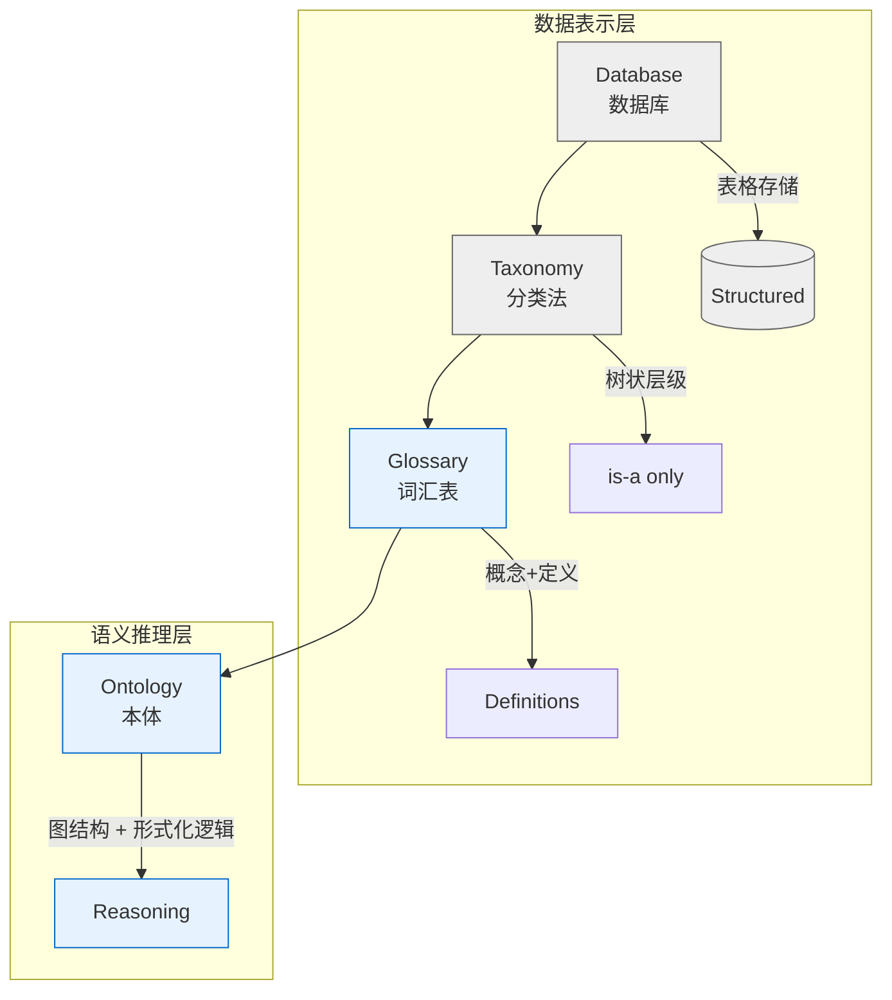

# 第1章 什么是本体

## 第1篇 概述：从知识库到本体

### 从知识库到本体：为什么我们需要本体

#### 知识表示的演进

在人工智能和语义网领域，计算机如何**理解**和**推理**知识是一个核心问题。传统数据库擅长存储结构化数据，但它无法表达知识之间的语义关系。

> **传统数据库的问题**：关系型数据库可以存储"张三的年龄是30岁"这一数据，但它无法理解"张三是一个人"、"所有人的寿命都是有限的"或"医生是人的一个子类别"这些语义关系。

知识表示经历了以下几个发展阶段：

这反映了知识表示系统的演进：



**本体（Ontology）**应运而生，它提供了比传统知识库更丰富的语义表达能力和形式化推理能力。

#### 本体的定义背景

"本体"这个概念在计算机科学的借用，源自哲学。让我们了解一下它的起源：

1. **哲学渊源**：本体论（Ontology）是哲学的一个分支，研究"存在"（being）的本质，可以追溯到亚里士多德的《范畴篇》。

2. **计算机科学的借用**：1993年，人工智能研究者 **Gruber** 首次将"本体"引入计算机科学领域。

3. **语义网的推动**：1990年代末，W3C（万维网联盟）开始发展语义网标准（RDF/OWL），使本体工程成为独立的研究领域。

#### 为什么我们需要本体？

**场景示例**：假设我们要构建一个医疗知识管理系统。

**没有本体时的问题**：

```
医院A的数据库：patient → disease_code
医院B的数据库：person → condition
医院C的文档：user → illness
```

这三种不同的表达方式可能描述的是同一个概念，但系统无法理解它们的关系。

**有本体时的问题解决**：

| 术语 | 本体中表示                        |
|------|----------------------------------|
| patient | <code>owl:Class</code> 类: 人类患者 |
| disease\_code | <code>owl:DatatypeProperty</code> 属性: 疾病代码 |
| condition / illness | 通过本体映射到同一概念 |

本体让我们能够说：
```
人类患者 是 患者 的一个子类
疾病代码 描述 患者
```

这使得跨系统的数据交换和推理成为可能。

#### 知识图谱与本体

在知识图谱的实际应用中，本体扮演着**骨架**的角色：

```
         ┌─────────────┐
         │   本体 Schema  │  ← 定义概念和关系 (人、疾病、症状)
         └──────┬──────┘
                │ 定义结构
                ▼
┌──────────────────────────────────────────┐
│            知识图谱 Data                  │
│                                          │
│  实体: "张三", "COVID-19"               │
│  关系: (张三) → 患 → (COVID-19)         │
└──────────────────────────────────────────┘
```

- **本体（Schema/Class Hierarchy）**：定义领域概念的结构化体系
- **数据（Facts）****：具体的实例及其关系

有了本体后，系统才能理解"张三"是一个"人"实例，"人"有一个"患者"的子概念，从而能够推理出"张三"也可以是一个"患者"。

### 本体的核心组成

> ⚠️ **本章预告**
> 
> 后续章节将深入讨论以下组成要素：
> - **第3章** 核心概念要素（类、属性、关系、公理）
> - **第6章** RDFS 如何提供词汇表
> - **第8章** OWL 2 如何扩展本体表达能力
> - **第15章** 推理如何在这些要素的基础上工作

一个本体的核心组件可以概括为：

```
本体 (Ontology) = { C, R, I, A }

其中：
├── C (Classes)：类的集合 —— 概念的分类体系
│   例：人类、动物、植物、细胞...
│
├── R (Properties/Relationships)：属性的集合 —— 连接实体间的语义关系
│   ├── 对象属性 Object Property（连接两个实例）
│   │   例："患病"、"治疗"、"是...的父亲"
│   └── 数据属性 Data Property（连接实例和数据值）
│       例："年龄"、"体重"、"血压"
│
├── I (Individuals/Instances)：实例的集合 —— 具体的对象
│   例：张三、RDR药物、T-细胞...
│
└── A (Axioms)：公理的集合 —— 关于本体断言的规则
    例："所有人都有父母"、"年龄必须是非负整数"
```

每个要素都可以通过 W3C 标准形式化描述，这将在后续 RDF 和 OWL 章节详细学习。

### 阅读指引

本系列文章将继续：

1. [`02-definition.md`](02-definition) — 深入学习本体的形式化定义
2. [`03-ontology-vs.md`](03-ontology-vs) — 理解本体与其他知识表示形式的区别
3. [`04-applications.md`](04-applications) — 探索本体的实际应用领域

> 📖 **参考资料**
> 
> - Gruber, T. R. (1993). "A translation approach to portable ontology specifications". *Knowledge Acquisition*, 5(2):199–220.
> - W3C Semantic Web Platform: https://www.w3.org/2001/sw/