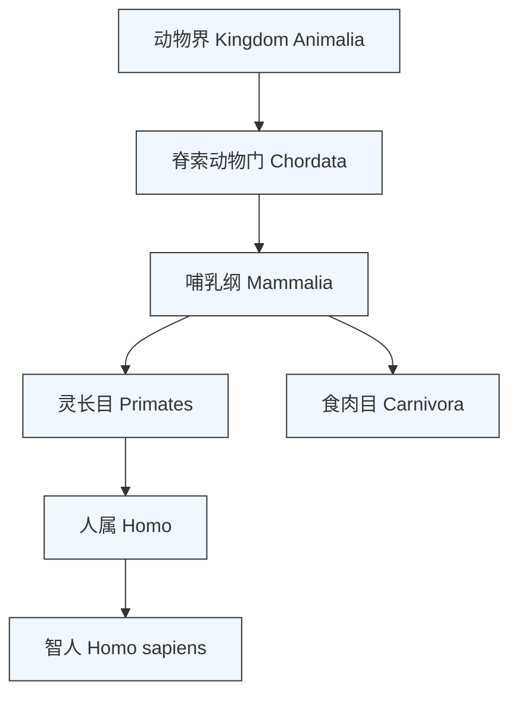
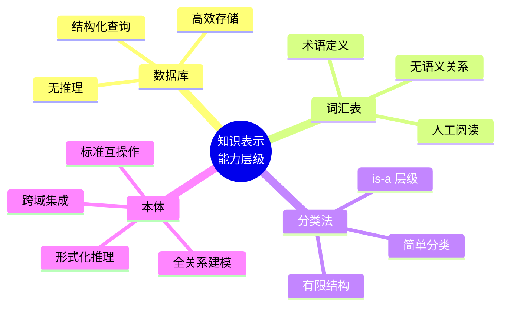
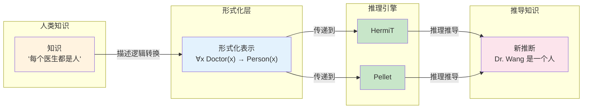

# 第1章 什么是本体

## 第3篇 本体 vs 数据库 vs 词汇表 vs 分类法

### 不同的知识表示形式

在实际的知识工程中，我们经常遇到"数据库"、"词汇表"、"分类法"和"本体"这些概念。它们都与知识管理有关，但**表达能力**和**适用范围**却截然不同。

理解本体的独特价值，最好的方式是将它与其他常见的知识表示形式进行对比。

---

### 1. 数据库 vs 本体

#### 数据库的核心局限

传统关系型数据库（如 MySQL、PostgreSQL）的核心功能是**数据存储与检索**。它们以高效的性能著称，但在语义表达能力上存在根本性局限。

**经典案例：员工数据存储**

假设我们要存储员工信息。在数据库和本体中的不同处理方式：

**数据库设计：**

```sql
-- 传统 SQL 表结构
CREATE TABLE employees (
    id INT PRIMARY KEY,
    name VARCHAR(100),
    department VARCHAR(50),
    manager_id INT REFERENCES employees(id),
    hire_date DATE,
    salary DECIMAL(10, 2)
);

INSERT INTO employees VALUES (1, '张三', '研发部', NULL, '2015-03-01', 20000);
INSERT INTO employees VALUES (2, '李四', '销售部', 1, '2018-07-15', 15000);
```

**数据库只能做到：**
- ✅ 高效存储和检索结构化数据
- ✅ 通过外键建立基本的表间关系
- ❌ 无法理解"研发部的经理是一个员工"
- ❌ 无法推断"如果一个人是经理，那么他必然是员工"
- ❌ 无法验证数据模型本身的一致性（例如不允许"部门属于部门自己"这样的循环关系）

#### 本体中的表示

```turtle
@prefix ex: <http://example.org/> .
@prefix rdf: <http://www.w3.org/1999/02/22-rdf-syntax-ns#> .
@prefix rdfs: <http://www.w3.org/2000/01/rdf-schema#> .
@prefix owl: <http://www.w3.org/2002/07/owl#> .

# 定义"员工"类
ex:Employee a owl:Class .

# 定义"经理"是"员工"的子类
ex:Manager rdfs:subClassOf ex:Employee .

# 定义"经理"的约束：每个经理必须管理至少1名员工
ex:Manager rdfs:subClassOf [
    a owl:Restriction ;
    owl:onProperty ex:manages ;
    owl:minQualifiedCardinality "1"^^xsd:nonNegativeInteger ;
    owl:onClass ex:Employee
] .

# ❗ 建模错误示例：部门不应是员工的子类

# 在本体中，"部门"（Department）和"员工"（Employee）是不相交的两个概念类。
# 如果误定义 "Department rdfs:subClassOf Employee"，当有实例 "ex:FinanceDepts rdfs:label 财务部" 被实例化为 Department 时，
# 推理机会错误地将其归为 Employee 的实例，导致语义错误。

# ✅ 正确做法：保持 Department 和 Employee 同为顶层子类的地位
ex:Department a owl:Class .
ex:Employee a owl:Class .
ex:Department rdfs:subClassOf ex:OrganizationEntity .
ex:Employee rdfs:subClassOf ex:Person .

# ❗ 推理引擎可通过不相交公理检测到上述冲突
# 若之后有人断言"财务部"是"Project"类型的实例，
# 而Project和Employee是不相交的，则推理引擎会报一致性错误
#    但如果有人断言"财务部"是"Project"类型的实例，
#    而Project和Employee是不相交的，则推理引擎会报一致性错误
```

| 对比维度 | 数据库 | 本体 |
|----------|--------|------|
| **主要目的** | 高效数据存储与检索 | 知识建模与推理 |
| **数据结构** | 表格（Table） | 图（Graph，即RDF三元组） |
| **schema 变更** | ALTER TABLE（通常需要停机或锁表） | 直接添加新类或属性（可增量式演进） |
| **查询方式** | SQL | SPARQL |
| **推理能力** | 仅约束完整性（CHECK 约束、外键） | 描述逻辑推理（子类推断、实例分类推导） |
| **一致性检查** | 仅限本地字段约束 | 全局本体级别的一致性验证 |
| **知识表示深度** | 只存储事实 | 存储事实 + 语义 + 规则 |

---

### 2. 词汇表 vs 本体

#### 词汇表（Glossary）

词汇表是最简单的知识表示形式。它由**术语（Term）及其定义（Definition）** 组成。

**示例：医学词汇表**

| 术语 | 定义 |
|------|------|
| **高血压** | 收缩压持续 ≥ 140 mmHg 的临床状态 |
| **糖尿病** | 以长期高血糖为特征的代谢性疾病 |
| **胰岛素** | 由胰腺β细胞产生的蛋白质激素，调节血糖水平 |

词汇表的局限性：

- ❌ 只有术语和定义，无法表达术语之间的语义关系
- ❌ 无法知道"高血压"和"糖尿病"之间存在**共病关系**
- ❌ 无法知道"胰岛素"是"糖尿病"的"治疗药物"
- ❌ 无法进行任何自动推理

#### 本体如何超越词汇表

```turtle
# 在本体中，我们不仅定义术语，还定义关系

# 定义类
ex:Hypertension a owl:Class ;
    rdfs:label "高血压" ;
    rdfs:comment "收缩压持续 ≥ 140 mmHg 的临床状态" .

ex:Diabetes a owl:Class ;
    rdfs:label "糖尿病" ;
    rdfs:comment "以长期高血糖为特征的代谢性疾病" .

# 定义语义关系
ex:Insulin a owl:Class ;
    rdfs:label "胰岛素" .

# 语义关系1："胰岛素"治疗"糖尿病"
ex:treats rdfs:domain ex:Therapy ;
    rdfs:range ex:Disease .

ex:Insulin ex:treats ex:Diabetes .

# 语义关系2："糖尿病"和"高血压"经常共病
ex:coexistsWith a owl:ObjectProperty , owl:SymmetricProperty .

ex:Diabetes ex:coexistsWith ex:Hypertension .
```

有了本体的语义关系，系统可以实现：

- ✅ **关联发现**：当查询"糖尿病的间接影响因素"时，可以推导出"高血压患者因共病关系也可能影响糖尿病进程"
- ✅ **知识整合**：词汇表无法关联，而本体可以将医学、药理学、遗传学等不同领域的知识连接起来
- ✅ **一致性验证**：如果某个数据断言"胰岛素治疗肺炎"，而本体中 `ex:treats` 的 range 是 `ex:Disease` 的子集——如果 `ex:Pneumonia` 不在 `ex:treatable` 列表中，推理引擎可以标记警告。

---

### 3. 分类法 vs 本体

#### 分类法（Taxonomy）

分类法是一种**单层树状结构**，只有"父子"关系（is-a / 子类关系），也称为层级分类。

**示例：动物分类法**



分类法只回答了 **"是什么"** 的问题（例如"狗是一个哺乳动物"），但它无法表达：

| 问题 | 分类法能否回答 | 原因 |
|------|---------------|------|
| "狗有四个腿吗？" | ❌ | 分类法只描述类别归属，不描述属性 |
| "狗的父亲是什么？" | ❌ | 分类法没有表达能力关系（property）|
| "猫和狗是否不相交？" | ❌ | 分类法不声明类别之间的互斥关系 |
| "所有的哺乳动物都能飞吗？" | ❌ | 分类法没有约束和推理能力 |

#### 本体如何实现更丰富的表达

```turtle
# 在本体中，类不仅有层次，还有：

# 1. 属性关系：每个哺乳动物都有呼吸方式
ex:Mammal rdfs:subClassOf [
    a owl:Restriction ;
    owl:onProperty ex:breatheWith ;
    owl:hasValue ex:lung
] .

# 2. 不相交声明：猫和狗是不相交的类——一个人不可能既是猫又是狗
ex:Cat owl:disjointWith ex:Dog .

# 3. 传递关系：如果 A 是 B 的父亲，B 是 C 的父亲 → A 是 C 的祖父
ex:fatherOf a owl:TransitiveProperty .

# 4. 值约束：哺乳动物的寿命在 0 到 200 年之间
ex:age a owl:DatatypeProperty ;
    rdfs:domain ex:Mammal ;
    rdfs:range ex:PositiveInteger ;
    ex:Mammal rdfs:subClassOf [
        a owl:Restriction ;
        owl:onProperty ex:age ;
        owl:maxCardinality 200
    ] .
```

| 特征 | 分类法（Taxonomy） | 本体（Ontology） |
|------|-------------------|-----------------|
| 关系类型 | 仅 is-a（子类/父类） | 多类型：object properties, datatype properties, 复杂公理 |
| 结构 | 单棵树（或森林） | 有向图（可以有循环、多继承） |
| 推理能力 | 无 | 基于描述逻辑的形式推理 |
| 表达能力 | "X是Y的子类" | 可以表达等价、不相交、传递性、对称性、约束... |

---

### 4. 四者比较总结

| 维度 | 数据库（Database） | 词汇表（Glossary） | 分类法（Taxonomy） | 本体（Ontology） |
|------|-------------------|-------------------|-------------------|-----------------|
| **核心功能** | 存储和检索 | 术语解释 | 层级分类 | 知识建模与推理 |
| **数据结构** | 表格 | 词列表 | 树状结构 | RDF 图 |
| **关系类型** | 主键 - 外键 | 无 | 仅 is-a | 所有二元和多元关系 |
| **形式化程度** | 结构化查询（SQL） | 自然语言 | 层级公理 | 描述逻辑（DL） |
| **推理能力** | 基本约束 | 无 | 子类传递 | 完整推理引擎（HermiT, Pellet） |
| **一致性检查** | 字段级验证 | 无 | 结构验证 | 全局本体验证 |
| **互操作性** | 厂商锁定 | 人工可读 | 部分可交换 | RDF/OWL 国际标准 |



> 📖 **参考说明**
> 
> 本表中分类法和数据库属于**弱表达能力表示系统**（Weak Expressivity Representation），而本体属于**强表达能力表示系统**（Strong Expressivity Representation）。这一区分是理解本体的关键，详见 *Gomez-Perez, A., et al. (Eds.). Overcoming the know-show gap*, 2004。

---

### 5. 为什么形式化是本体的本质特征

本体的核心价值在于其**形式化表达**能力，这使得机器不仅能够"存储"知识，而且能够**理解**和**推理**知识。

**什么是"形式化"？**

"形式化"意味着本体的概念和关系可以用**形式语言**精确表示——即没有任何歧义。这种表示可以被**数学上严格处理**，从而允许机器执行自动推理。

#### 形式化的三个层次

| 层次 | 说明 | 示例 |
|------|------|------|
| **形式化** | 使用形式逻辑语言描述，无歧义 | `∀x (Doctor(x) → Person(x))` |
| **显式** | 所有定义和假设都有文档 | 本体文档中明确定义每个类 |
| **共享** | 共识性知识，不依赖个人理解 | SNOMED CT 为全球医疗机构共识 |

在 OWL 2 中，形式化意味着本体可以被推理引擎处理。OWL 基于**描述逻辑（Description Logic）**，这是一种经过数学证明的一阶逻辑子集。OWL 2 的标准推理器包括：

- **HermiT**：OWL 2 DL 推理器
- **Pellet**：支持 OWL 2 Full 和 OWL 2 RL
- **ELK**：专注于 OWL 2 EL 概要的高性能推理器



---

### 阅读指引

- [`01-overview`](./01-overview) — 了解"什么是本体"的演进背景和动机
- [`02-definition`](./02-definition) — Gruber 定义详解：形式化、显式、共享与概念化
- [`04-applications`](./04-applications) — 本体的实际应用领域和案例分析