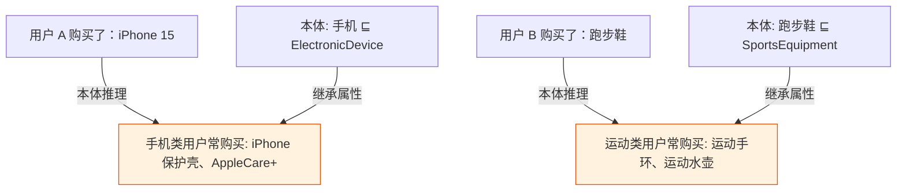

# 第1章 什么是本体

## 第4篇 应用场景与案例

### 从理论到实践：本体的实际价值

我们已经在本章前三篇中了解了**本体是什么**、**Gruber 的经典定义**以及**本体与数据库/词汇表/分类法的区别**。现在，让我们将视角转向现实世界：本体在实际应用中到底能做什么？

本体不是一个纯学术概念——它正在改变医疗、互联网、搜索引擎、金融等多个行业的运作方式。

---

### 1. 真实领域案例分析：SNOMED CT

#### 什么是 SNOMED CT？

**SNOMED CT**（Systematized Nomenclature of Medicine — Clinical Terms）是全球使用最广泛的**临床医学术语本体**。由美国 College of American Pathologists 开发和维护。

| 关键数据 | 数值 |
|----------|------|
| 概念数量 | **334,000+** 临床概念 |
| 关系类型 | **38 种**关系类型（包括 6 种核心属性） |
| 覆盖国家 | 超过 **70 个**国家和地区采用 |
| 翻译版本 | 超过 **30 种**语言版本 |

#### SNOMED CT 中的本体建模示例

让我们在 SNOMED CT 中看一个简单的建模案例：**"糖尿病"及其治疗**。

```mermaid
graph TD
    subgraph SNOMED_CTOntology
    C1["Concept: 糖尿病<br/>(Disorder / SNOWCODE: 44713001)"]
    C2["Concept: 胰岛素<br/>(Pharmaceutical / Product: 372687004)"]
    C3["Concept: 酮症酸中毒<br/>(Finding / Clinical Finding: 56721007)"]
    C4["Concept: 高血压<br/>(Disorder / SNOWCODE: 38341003)"]
    end

    C1 -.rdfs:subClassOf.-> C5["Superclass: 内分泌障碍<br/>(SNOWCODE: 73211001)"]
    C1 -."treated by<br/>assoc_with_causal_entit"-> C2
    C1 -."has_finding"-> C3
    C1 -."associated_with"-> C4
    
    classDef clinical fill:#e3f2fd,stroke:#1565c0,stroke-width:2px
    classDef finding fill:#fff3e0,stroke:#e65100
    classDef treatment fill:#c8e6c9,stroke:#2e7d32
    classDef superclass fill:#f3e5f5,stroke:#6a1b9a
    
    class C1,C4 clinical
    class C3 finding
    class C2 treatment
    class C5 superclass
```

#### SNOMED CT 的核心价值

1. **临床数据互操作性**：不同的电子健康记录系统使用相同术语，实现跨机构数据共享
2. **临床决策支持**：系统可以自动推导出"如果患者有'2 型糖尿病'且有'酮症酸中毒'，则需要紧急医疗干预"
3. **医保理赔分析**：标准化的术语便于进行大规模流行病学研究

**实际效果**：据英国 NHS 的数据，采用 SNOMED CT 后：
- 重复检验减少 **15%**
- 药物不良反应报告准确度提升 **30%**

---

### 2. 知识图谱中的本体角色

#### 知识图谱与本体：框架理解

知识图谱（Knowledge Graph）是近年来"大热"的技术方向。但很多知识图谱项目中，**本体（Schema 层）是容易被忽视的关键基础设施**。

```mermaid
graph LR
    subgraph 本体层 Schema
    S1["owl:Class"]
    S2["owl:ObjectProperty"]
    S3["rdfs:domain & range"]
    S4["owl:disjointWith"]
    end

    subgraph 数据层 Instance
    I1["实体: '张三'"]
    I2["实体: 'COVID-19']
    I3["三元组: (张三 → 患 → COVID-19)"]
    end

    S1 -.定义类型.-> I1
    S1 -.定义类型.-> I2
    S2 -.定义关系.-> I3
    
    S1 -.分类约束.-> I1
    
    classDef schema fill:#f3e5f5,stroke:#6a1b9a,stroke-width:2px
    classDef instance fill:#e8f5e9,stroke:#2e7d32,stroke-width:2px
    
    class S1,S2,S3,S4 schema
    class I1,I2,I3 instance
```

#### 本体的三个核心作用

| 本体作用 | 说明 | 示例 |
|----------|------|------|
| **定义类型（Type Definition）** | 定义实体有哪些类型 | 定义 `Person`、`Disease`、`Drug` 等类 |
| **定义关系（Relationship）** | 定义实体之间可以有哪些关系 | `Person.treats Drug`、`Drug.treats Disease` |
| **约束和推理（Constraint & Reasoning）** | 验证数据的一致性，发现隐含知识 | "任何人不能既是`Person`又是`Disease`"（不相交声明） |

**案例：Google Knowledge Graph**

Google 的知识图谱背后使用了**Schema.org 本体**作为共享词汇表，定义了几万个概念及其关系。当用户搜索"乔布斯"时，搜索引擎不仅找到匹配文本，还能理解：

```
乔布斯 → 是 → CEO → of → Apple
乔布斯 → 患有 → 胰腺癌 → 于 → 2011 年 → 逝世
```

这种理解能力完全依赖于底层的**本体定义**。

---

### 3. 本体应用的更多领域

#### 智能搜索

**问题**：传统搜索引擎只能做关键词匹配，无法理解用户查询的**语义**。

例如：用户搜索"治疗感冒的药物"

| 搜索引擎类型 | 返回结果 | 原因 |
|-------------|----------|------|
| **关键词搜索** | "感冒"的页面、"药物"的页面 | 没有语义理解 |
| **语义搜索引擎** | "对乙酰氨基酚"、"布洛芬"、"退热药" | 本体知道"感冒"有"药物"子概念 |

**本体如何让搜索变智能？**
- **同义词识别**：通过 SKOS 本体的 `skos:related` 属性，系统可以知道"退热药"与"退烧药"是同一概念
- **概念扩展**：本体知道"治疗"是"治愈"的上位词，搜索结果包括"治愈感冒的方法"

#### 推荐系统

本体可以帮助推荐系统理解物品之间的**深层语义关联**：



**经典案例：Amazon 的商品推荐**
- 本体定义 `Product.topsellFor Category`
- 基于本体推理："如果用户购买了 X，那么用户也可能感兴趣于 Y"，其中 X 和 Y 是同一 `ParentCategory` 的子类

#### 数据集成

企业常面临一个问题：**多个系统使用不同的术语描述同一事物。**

**案例：跨公司数据集成**

| 公司 | 数据库中的字段名 | 含义 |
|------|-----------------|------|
| 公司 A | `patient.name` | 患者姓名 |
| 公司 B | `person.name` | 人名字 |
| 公司 C | `user.firstName` + `user.lastName` | 用户的姓名 |

通过本体，我们可以建立映射：

```turtle
# 本体层面的映射
ex:patient a owl:Class .
ex:Person a owl:Class .
ex:user a owl:Class .

# 声明这些类在本体层级中都指向"一个人"
ex:patient rdfs:subClassOf ex:Person .
ex:Person rdfs:subClassOf ex:user .

# 属性映射: 在不同数据库中,同一字段
ex:patientName a owl:DatatypeProperty ;
    owl:equivalentProperty ex:personName , ex:userName .
```

有了这个映射后：
1. 系统可以自动识别不同数据库中的 `patient.name` 和 `person.name` 实际上是同一个概念
2. 可以进行**数据融合（Data Fusion）**——把来自 A、B、C 三家数据源的"患者/人员/用户"信息合并到一个统一视图

> 💡 **本体对齐（Ontology Alignment）** 是本体工程中的一个专门研究领域。我们将在**第 22 章**深入讨论。

#### 自然语言处理

NLP（自然语言处理）与本体有一个密切的合作关系：**本体为 NLP 提供世界知识**。

**经典用例 1：词义消歧**

句子：**"Apple 发布了一款新手机。"**

- 没有本体："Apple"可能是一家水果公司、或人名、或苹果（水果）
- 有本体：本体中定义 `Apple ⊑ Company`，`PhoneManufacturer ⊑ Company`，系统自动识别"Apple"在这里是指**科技公司**而非水果

**经典用例 2：实体链接**

句子："**爱因斯坦**是**物理学家**。"

本体可以：
- 链接"爱因斯坦" → **Entity: Albert Einstein (Q93732 in Wikidata)**
- 链接"物理学家" → **Class: physicist**
- 推断出: `Einstein rdfs:subClassOf Physicist`

**NLP + 本体的结合趋势：**

| 技术趋势 | 说明 |
|----------|------|
| **NER + 本体实体链接** | 从文本中识别命名实体，映射到本体知识 |
| **关系抽取 + 本体属性** | 抽取文本中的关系，对齐到本体的 property |
| **LLM + Knowledge Graph** | 将本体知识注入 LLM 的训练或推理过程（**第 23 章** 将讨论） |

---

### 4. 行业中的本体应用一览

| 行业 | 典型案例 | 使用的本体 | 主要应用 |
|------|----------|-----------|---------|
| **生物医学** | UniProt, Gene Ontology, SNOMED CT | OBO, SNOMED | 药物研发、临床决策、基因分析 |
| **搜索** | Schema.org, Dublin Core | RDF/OWL | 知识图谱、语义搜索 |
| **电商** | Amazon Product Taxonomy, eBay 本体 | OWL 2 | 商品推荐、产品对比 |
| **金融** | FIBO (Financial Industry Business Ontology) | OWL 2 | 合规监管、风险评估 |
| **制造业** | ISO 10303 (STEP), B2MML | OWL 2 | 供应链优化、智能制造 |
| **文化遗产** | CIDOC-CRM, FRBR | OWL 2 / RDFS | 文化遗产数字资源 |

#### FIBO 案例详解

**FIBO**（Financial Industry Business Ontology）是金融行业最重要的本体之一。

| 参数 | 数值 |
|------|------|
| 类数量 | 15,000+ |
| 属性数量 | 20,000+ |
| 关系数量 | 5,000+ |
| 参与公司 | JPMorgan Chase, 高盛，摩根士丹利 |

**FIBO 解决的实际问题**：
- 金融机构之间的监管报告格式统一
- "风险"、"衍生品"等术语在不同法律体系中的一致定义
- 跨系统的财务报告自动化分析

---

### 5. 小结：为什么要学习本体？

通过本章四个小节的学习，你现在应该已经有了以下认识：

| 学习成果 | 说明 |
|----------|------|
| ✅ 什么是本体 | 本体是共享概念的**形式化模型**，用于知识表达 |
| ✅ 本体与其他表示形式的区别 | 本体比数据库/词汇表/分类法有更强的表达能力和推理能力 |
| ✅ 本体在现实世界中做什么 | 从医疗、搜索到金融推荐，本体已经在多个行业产生价值 |
| ✅ 如何开始实践 | 学习第 4-5 章的 RDF 标准和第 9 章的 Protégé 工具 |

---

### 阅读指引

- [`01-overview`](./01-overview) — 从知识库到本体：知识表示的演进
- [`02-definition`](./02-definition) — Gruber 定义详解（形式化、显式、共享、概念化）
- [`03-ontology-vs`](./03-ontology-vs) — 本体 vs 数据库 vs 词汇表 vs 分类法

---

> 📖 **参考资料**
> 
> 1. *CornET: A SNOMED CT Editing Tool*, G. R. Sim et al. AMIA 2009.
> 2. *FIBO 规范*: https://rdflib.github.io/FIBO/
> 3. *Schema.org 词汇*: https://schema.org/
> 4. *Stanford CS224W: Machine Learning with Knowledge Graphs*, Trevor Ng et al. 2024