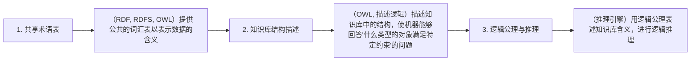

# 2.1 哲学根源：从亚里士多德分类到语义网

本体（Ontology）一词源自希腊语：

- **ontos**（ὄντος）："存在"、"Being"
- **logia**（λογία）："学问"、"study of"

在哲学中，本体论研究"存在是什么"、"存在的事物有哪些"。现代计算本体虽然借用这一术语，但关注点已从"存在的本质"转向"如何对某一领域的知识进行形式化的建模与表达"。

> **本节要点**：理解计算本体与传统哲学本体论的关系，是现代本体工程的基础。

---

## 1. 亚里士多德：第一个分类体系

亚里士多德（Aristotle，公元前 384–322 年）在其逻辑学与形而上学著作中提出了**十大范畴**（Categories），这是对"存在类型"最早的系统分类之一：

| 范畴（希腊语） | 英文翻译 | 中文 | 示例 |
|---|---|---|---|
| ousia | substance | 实体 | 人、马 |
| poion | quality | 质量 | 白皮肤、有学问 |
| poson | quantity | 数量 | 两米高、五尺长 |
| pros ti | relation | 关系 | 两倍大、比...小 |
| pou | place | 位置 | 广场、花园 |
| پōτε | time | 时间 | 昨天、去年 |
| keisthai | posture/posture | 姿态 | 躺、坐 |
| echein | have/condition | 状态/持有 | 穿鞋、握刀 |
| poiein | action | 行动 | 切、烧 |
| paschein | passion | 承受 | 被切、被烧 |

这套分类思想至今影响着我们的知识组织方式。虽然现代本体工程使用的是更为形式化的语言，但**类别层级**（class hierarchy）和**关系**（relation）作为本体的核心构件，仍然可以看到亚里士多德思想的影响。

---

## 2. 中世纪与近代：概念的进一步系统化

亚里士多德死后，中世纪经院哲学家如**托马斯·阿奎那**（Thomas Aquinas, 1225–1274）在其著作中进一步发展了他的分类体系，将普遍概念（universals）与个别实体（particulars）之间的关系进行了系统梳理。

至 17 世纪，**笛卡尔**（René Descartes, 1596–1650）和**莱布尼茨**（Gottfried W. Leibniz, 1646–1716）试图构建一种**普遍的文字艺术**（ars characteristica），可以用符号化的语言来表达一切知识。莱布尼茨特别预言：

> "Let us reason — without dispute!"
> （让我们推理——不再争辩！）

他设想的这种符号化知识表达方式，预示了几百年后语义网技术的发展方向。

---

## 3. 19 世纪：形式逻辑的诞生

19 世纪的**乔治·布尔**（George Boole, 1815–1864）发表了《思维的规律》（The Laws of Thought, 1854），奠定了现代数理逻辑的基础：

- 布尔代数定义了 AND（合取）、OR（析取）、NOT（否定）等操作
- 概念之间的逻辑关系可以代数化表示

随后，**戈特洛布·弗雷格**（Gottlob Frege, 1848–1925）出版了《概念文字》（Begriffsschrift, 1879），首次提出了一种形式化的谓词逻辑体系，这为后来的**描述逻辑**（Description Logic）奠定了数学基础。

---

## 4. 20 世纪：AI 时代的知识表示

第二次世界大战后，**人工智能**（AI）作为一个新兴学科出现。如何表示和组织人类知识成为核心问题。

### 4.1 早期 AI 知识表示

在 1950–60 年代，学者们尝试了多种知识表示方法：

| 方法 | 提出者 | 年代 | 核心思想 |
|------|--------|------|----------|
| **语义网络**（Semantic Nets） | Quillian | 1968 | 节点表示概念，边表示关系 |
| **frames 系统** | Minsky | 1975 | 知识存储在结构化的框架中 |
| **产生式系统**（Production Systems） | Newell & Simon | 1972 | 知识以 if-then 规则表示 |

其中，Quillian 的语义网络直接影响了后来的 Web 语义网技术。他的博士论文**目标**是建立一个计算机对人类记忆的模拟系统，这一理念与现代知识图谱的发展有着直接联系。

### 4.2 本体的"复兴"

1980 年代末，哲学和人工智能领域的学者共同推动了本体的"复兴"：

- **哲学界**：Adrian C. Kent 等人开始将本体论应用于知识组织系统分析
- **AI 界**：Tom Gruber 于 1993 年给出了经典的计算本体定义

> **注意**：1993 年，本体的研究突然出现在"知识表示与获取"、"信息工程中的分类系统"、"配置规范"等不同领域。由于这一术语在哲学文献中有悠久的使用历史，"本体"被借用并赋予新的计算意义，导致不同研究者使用该术语时其含义并不一致。

---

## 5. 1990 年代：从 AI 到语义网

1990 年，**Tim Berners-Lee** 在他发表于《Communications of the ACM》的论文中首次提出了"语义网"（Semantic Web）的愿景：

> "I have a dream for the Web [in which] computers become accurate interpreters of the information (meaning) on the Web..."

这一愿景依赖于对机器可理解的形式的知识表示，也就是本体。

### 5.1 Tim Berners-Lee 的语义网三阶段愿景

在 2001 年发表于《Scientific American》的文章中，Tim Berners-Lee 将语义网划分为三个阶段：

| 阶段 | 时间 | 核心技术 | 核心能力 |
|------|------|----------|----------|
| 1 | 2001 | RDF, RDFS | 机器可读的标记（机器可读的含义） |
| 2 | 约 5 年 | OWL, 描述逻辑 | 结构描述与类推理 |
| 3 | 约 10 年 | 推理引擎 | 自动逻辑推理 |

尽管这一时间表部分未能在当时及时实现，但语义网标准如今已是 W3C 正式推荐标准。

---

## 6. 从哲学本体到计算本体

以下是哲学本体与计算本体的主要差异与联系：

| 对比维度 | 哲学本体论 | 计算本体 |
|---|---|---|
| 核心问题 | "什么是存在？" | "如何对领域知识做形式化建模？" |
| 关注点 | 存在的一般原理 | 特定领域的概念与关系 |
| 表达形式 | 自然语言、哲学论述 | 形式化语言（OWL, RDF） |
| 推理方式 | 哲学论证、演绎 | 逻辑推理机（如 HermiT、Pellet） |
| 验证方式 | 哲学辩论 | 一致性检查、测试用例 |

虽然二者目标不同，但计算本体仍然**继承了传统本体论的核心概念框架**——尤其是亚里士多德关于实体（实体）、属性（特征）、关系（关联）的分类体系。

---

## 7. 小结

本节梳理了从亚里士多德到 21 世纪语义网的本体概念历史演进路线：

1. **亚里士多德**的范畴分类奠定了"类别与关系"的基本思想
2. **中世纪经院哲学家**与**近代理性主义者**（笛卡尔、莱布尼茨）进一步推动了系统化知识表示的思想
3. **布尔与弗雷格**奠定了形式逻辑与谓词逻辑的基础
4. **1960–80 年代**AI 研究开创了语义网络、帧系统等知识表示方法
5. **Tom Gruber** 于 1993 年给出了计算本体的经典定义
6. **Tim Berners-Lee** 于 1990 年提出语义网愿景，将本体技术推向主流

---

## 8. 延伸阅读

| 资源 | 作者 | 链接 |
|------|------|------|
| *Ontology: A Practical Guide* (2nd ed.) | João M. Silva, Enrico Cruz | [A Bradford Book](https://direct.mit.edu/books/edited-volume/5248/Ontology-A-Practical-Guide) |
| *The Semantic Web* | Tim Berners-Lee, James Hendler, Ora Lassila | [Scientific American, 2001](https://www.w3.org/design_group/semanticweb.htm) |
| *A Perspective on the Growing Web* | Tim Berners-Lee | [CACM, 1994](https://www.w3.org/TR/1994/) |
| Conceptual Structures: Information Processing in Medicine and Science | John S. Bradshaw, Bradley A. Miller | [Ovid Technologies, 2001](https://www.ovid.com/) |

---

## 9. 本节练习

1. 思考：你所在的专业领域中，有哪些基本的"类别"与"关系"概念？它们与亚里士多德的范畴体系有何相似之处？
2. 阅读 Tom Gruber 1993 年的经典论文 *[A Transaction Oriented Approach for Agents and Machine Databases](http://www.ai-zombie.com/knowledge/index.php/4537)*，理解其本体的"抽象的、形式化概念模型的表述"这一定义。
3. 参考 Tim Berners-Lee 提出的语义网三阶段愿景，你认为第三阶段"逻辑推理"在当今的 LLM（大语言模型）时代是否实现了？简要论述。

---

> **下一章**：[2.2 概念化理论](./02-conceptualization.md) — 探讨人类认知如何构建树状分类体系，以及概念化过程的四个基本步骤。
