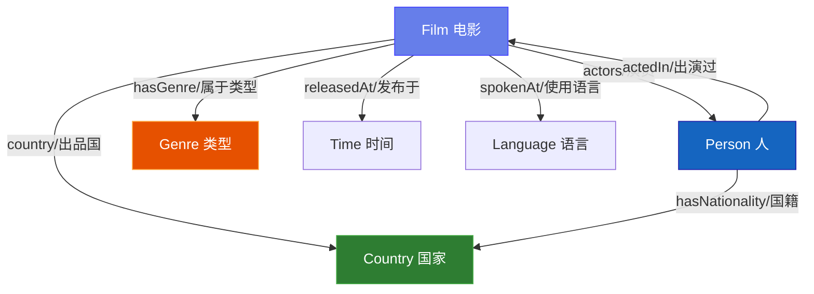
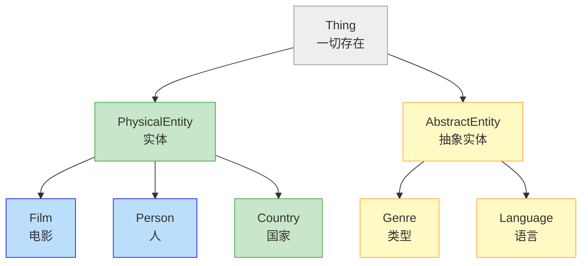
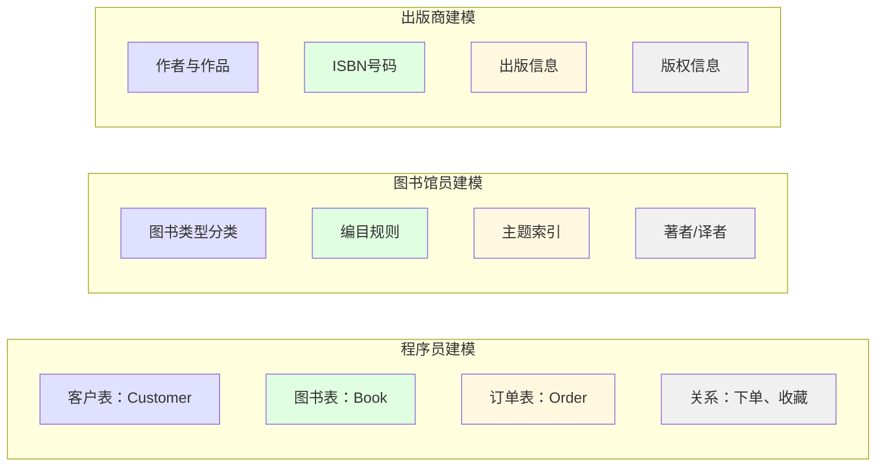

# 2.2 概念化理论与认知科学

**概念化**（Conceptualization）是本体工程中最核心的步骤之一。它指的是对某一现实世界领域的**抽象简化表示**，是对该领域中存在的对象、概念及其之间关系的系统化描述。

> **本节要点**：理解"概念化"这一核心术语的多层含义，掌握概念化过程的四个基本步骤，并能将其应用于具体的本体构建任务。

---

## 1. "概念化"一词的多层含义

在 Ontology Engineering（本体工程）的学术文献中，**Conceptualization** 有三种互相关联的含义。理解这些含义对于准确把握本体工作的范围至关重要。

| 含义 | 解释 | 应用场景 |
|------|------|----------|
| **抽象**（Abstraction） | 对特定领域中所有可能出现的对象做抽象简化 | 描述本体的覆盖范围 |
| **建模**（Model） | 在模型构建的过程中对领域的描述 | 描述一个具体本体的构建过程 |
| **概念体系**（Conceptual scheme） | 一个术语体系及其语义网络 | 描述本体语言中定义的概念集合 |

这意味着，当我们说"这个本体对图书领域做了一个概念化"时，其实是在说：

1. **我们选择了对"图书领域"的某个抽象**（不是图书馆管理系统，不是出版市场分析，而专注于图书知识本身）
2. **我们在这个抽象过程中构建了一个模型**（包含类、属性、约束）
3. **这个模型最终形成了概念体系**（OWL 文件中定义的概念结构）

---

## 2. 本体 = 概念化 + 形式化

计算本体的定义可以被分解为两个关键步骤：

```
本体 = 概念化（Conceptualization） + 形式化（Formalization）
```

这两个步骤的关系用下图表示：


| 步骤 | 说明 | 示例 |
|------|------|------|
| **概念化** | 识别领域中的核心概念和关系 | "动物"→"有颜色"、"能移动"、"被驯养" |
| **形式化** | 用形式语言将这些概念和关系表达出来 | `Animal` `hasColor` `tamedBy` |
| **实例化** | 为概念赋予具体的实例 | `Fido` 是 `Animal` 的实例 |
| **推理** | 从已有知识推导出新的知识 | 如果 `Fido是一只Dog` 且 `Dog是Animal的子类`，则 `Fido是一只Animal` |

### 2.1 为什么区分"概念化"和"形式化"很重要？

理解概念化与形式化的区分，有助于我们在建模过程中做出正确的抽象决策。**一个本体的质量取决于它是否正确地反映了问题域的模型（而非建模者自身的模型）。**

假设你正在建模一个"在线书店"领域，你需要决定什么是最本质的概念。如果你考虑的是"销售"这个业务流程，那么"订单"可能是核心概念。如果你考虑的是"图书分类"这个知识维度，那么"分类"才是核心概念。因此，**不同的建模目标会导致不同的概念化选择**。

> **关键原则**：本体的设计目标决定概念化的重点。同一个领域的不同应用需求可能导致多个合理的、但并不相同的本体。

---

## 3. 概念化的四个基本步骤

Borchers (2001) 提出了概念化过程的四个基本步骤：

### 步骤 1：识别概念与术语

找出在某个概念模型中出现的概念和关联概念（即术语）。

```
示例 —— 电影领域
```

在"电影"这个领域，我们需要识别出哪些是核心概念：

| 类别 | 概念 | 说明 |
|------|------|------|
| 实体 | `Film`（电影） | 最基本的单位 |
| 实体 | `Person`（人） | 参与电影制作的人 |
| 实体 | `Genre`（类型） | 电影的类别 |
| 实体 | `Language`（语言） | 电影使用的语言 |
| 属性 | `releasedIn` | 电影发布的时间/地点 |
| 属性 | `actedIn` | 某人出演的电影 |
| 属性 | `hasGenre` | 电影属于什么类型 |

**要点**：
- 概念应该用名词或名词短语表示
- 属性（关系/功能）应该用动词或动词短语表示
- 不要急于开始建立层级，先罗列概念

### 步骤 2：确定概念之间的关系

描述概念是如何相关联的：



在本体中，这些关系可以表示为**属性**（Properties）或**公理**（Axioms）：

- **对象属性**（Object Properties）：连接两个实例
  - `:hasActor`：连接 Film → Person
  - `:hasDirector`：连接 Film → Person
  - `:hasGenre`：连接 Film → Genre
- **数据属性**（Data Properties）：连接实例与字面量（literal value）
  - `:releaseYear`：连接 Film → xsd:integer
  - `:originalTitle`：连接 Film → xsd:string

### 步骤 3：定义概念的类别与层级

将概念组织到不同的概念类别中，构建**分类层次**（taxonomy）：



这组概念中可能包含的层级关系：

| 层级关系 | 表达 | 说明 |
|----------|------|------|
| `Genre ⊑ AbstractEntity` | 类型是抽象实体 |
| `Person ⊑ PhysicalEntity` | 人是物理实体 |
| `Director ⊑ Person` | 导演是人 |
| `ActionFilm ⊑ Genre` | 动作片是类型 |
| `ActionFilm ≡ Film ⊓ hasGenre.ActionFilm` | 动作电影是有"动作类型"属性的电影 |

### 步骤 4：为概念定义具体的属性约束

确定每个概念需要哪些具体属性和约束条件：

| 概念 | 对象属性 | 数据属性 | 基数约束 |
|------|----------|----------|----------|
| `Film` | `hasDirector`、`hasActor` | `title`、`releaseYear` | 至少需要一个导演 |
| `Person` | `actedIn`、`directed` | `birthDate`、`name` | 必须有名字 |
| `Genre` | 无 | `name` | — |

这些约束条件可以表示为 OWL 公理：

```
/* 电影必须有且仅有一个标题 */
Film SubClassOf (hasTitle exactly 1 xsd:string)

/* 电影至少有1个导演 */
Film SubClassOf (hasDirector min 1 Person)

/* 一部电影不能有太多演员（最多500人，避免过度关联） */
Film SubClassOf (hasActor max 500 Person)

/* 导演是人，且人不是电影的子集 */
Director SubClassOf Person
Person DisjointWith Film
```

---

## 4. 概念化与建模者的视角

不同建模者的背景会影响其对同一个概念化的方式。同一个"书店"领域，由不同角色建模，可能产生不同的本体结构：



从上图可以看出，同一个领域由**不同角色的建模者**进行概念化时，侧重点会明显不同：

- **程序员**倾向于数据表结构的思维建模
- **图书馆员**倾向于编目和分类体系
- **出版商**倾向于版权、ISBN等出版规范

这就是为什么 **Tom Gruber** 强调："一个本体应该是由**任何人**都可以接受的概念化表述"。一个好的本体模型不应该绑定特定建模者的个人偏见，而应反映领域内共识。

---

## 5. 一个完整的概念化示例：电影本体

以下是对"电影"领域完整概念化的结果，展示了前面四个步骤的整合：

### 5.1 类层次（Classes）

| 类名 | 父类 | 解释 |
|------|------|------|
| `Person` | `Thing` | 人物 |
| `Actor` | `Person` | 演员 |
| `Director` | `Person` | 导演 |
| `Producer` | `Person` | 制片人 |
| `Film` | `Thing` | 电影 |
| `Genre` | `Thing` | 类型 |
| `Country` | `Thing` | 国家 |

### 5.2 对象属性（Object Properties）

| 属性名 | 定义域（Domain） | 值域（Range） | 解释 |
|--------|------------------|---------------|------|
| `hasDirector` | `Film` | `Person` | 电影导演 |
| `hasActor` | `Film` | `Person` | 电影演员 |
| `hasProducer` | `Film` | `Person` | 电影制片人 |
| `hasGenre` | `Film` | `Genre` | 电影类型 |
| `actedIn` | `Person` | `Film` | 出演的电影 |
| `directed` | `Person` | `Film` | 导演的电影 |

### 5.3 数据属性（Data Properties）

| 属性名 | 定义域（Domain） | 值域（Range） | 解释 |
|--------|------------------|---------------|------|
| `originalTitle` | `Film` | `xsd:string` | 电影的原始标题 |
| `releaseYear` | `Film` | `xsd:integer` | 发行年份 |
| `birthDate` | `Person` | `xsd:date` | 出生日期 |
| `name` | `Person, Genre, Country` | `xsd:string` | 名称 |

### 5.4 公理（Axioms）

| 公理类型 | 约束描述 | OWL 表达 |
|----------|----------|----------|
| 等价类 | `Actor` ≡ `Person` ⊓ `actedIn some Film` | 演员就是演过电影的人 |
| 不相交性 | `Person` ∩ `Film` = ∅ | 人和电影不能是同一个 |
| 基数约束 | `Film` `hasDirector min 1 Person` | 每部电影至少一个导演 |
| 函数性 | `Film` `originalTitle` 是函数性的 | 一部电影只能有一个原始标题 |

---

## 6. 概念化的注意事项

在实际本体建模过程中，概念化阶段经常面临的问题包括：

### 6.1 颗粒度选择（Granularity）

概念模型的精细程度直接影响本体质量。比如：

- 在"电影"领域，是否将`Director`和`Actor`建模为独立的类？还是用属性`hasCast[role:]`来表达角色？
- 答案取决于你的**应用场景**。如果只需要展示电影名单，简单的列表即可；如果要分析导演的风格特征与类型的关联，则需要将`Director`独立为子类。

> **建议**：在概念化初期保持一定的抽象级别，避免过于具体。随着建模过程的深入再逐步细化。

### 6.2 概念的粒度差异

概念化过程中可能遇到的问题：

| 问题类型 | 示例 | 处理方法 |
|----------|------|----------|
| 名称不一致 | "导演" vs "Director" vs "导执导" | 建立统一标签体系 |
| 粒度不同 | "电影" vs "电影作品" vs "影视作品" | 合并或定义父子类 |
| 歧义词汇 | "角色"可能指"Actor"或"Role" | 明确区分概念和属性 |

这些问题在后续的本体维护过程中会导致不一致。因此**在概念化阶段，尽量建立统一的命名约定**。

### 6.3 覆盖范围

确定概念模型的**覆盖范围**（Coverage）：

- 一个本体不必包含领域内的所有知识。明确界定本体的覆盖范围可以防止概念模型过度膨胀。
- 例如"电影本体"不需要包含"电影院的建筑结构"或"电影票务系统"，因为这些属于其他领域本体。

---

## 7. 概念化总结

本节的核心要点：

| 概念 | 含义 |
|------|------|
| **Conceptualization（含义一）** | 对某个领域对象进行抽象简化的总体描述 |
| **Conceptualization（含义二）** | 模型构建过程中对该领域的具体描述 |
| **概念化四步骤** | 识别概念 → 确定关系 → 定义层级 → 定义约束 |
| **本体定义公式** | 本体 = 概念化 + 形式化 |

---

## 8. 延伸阅读

| 资源 | 作者 | 说明 |
|------|------|------|
| *Ontology: A Practical Guide* (2nd ed.) | João M. Silva, Enrico Cruz | 第 4–6 章详细介绍了概念化理论 |
| *Knowledge Representation and Reasoning* | Clark, R., & Pollack, M. | AI 视角下的知识表示 |
| *Designing Upper Ontologies* | Noy, N. F., & Musen, M. A. | MMIE 与 DOLCE 的上层本体设计 |

---

## 9. 本节练习

### 练习 1：概念化过程——"在线课程"领域

以"在线课程"（Online Course）为例，运用前面介绍的四个步骤完成概念化过程：

1. **识别概念与术语**：列出核心类（概念）和属性（关系）
2. **确定关系**：类之间的关系有哪些？
3. **定义层级**：哪些是主类？它们的层级关系是什么？
4. **定义约束**：有哪些必要的约束条件？

提示：参考本章前面介绍的"电影本体"示例。

### 练习 2：概念化视角对比

选择一个你感兴趣的领域（如"健身房""大学校园""电商平台"），从不同角色视角出发，尝试为同一领域编写三份不同的概念列表：

- 角色A：该领域的普通用户
- 角色B：系统开发程序员
- 角色C：行业领域专家

对比这三份列表的差异，分析造成差异的原因。

---

> **下一章**：[2.3 实践练习](./03-exercises.md) — 通过实际案例完成概念化过程练习。