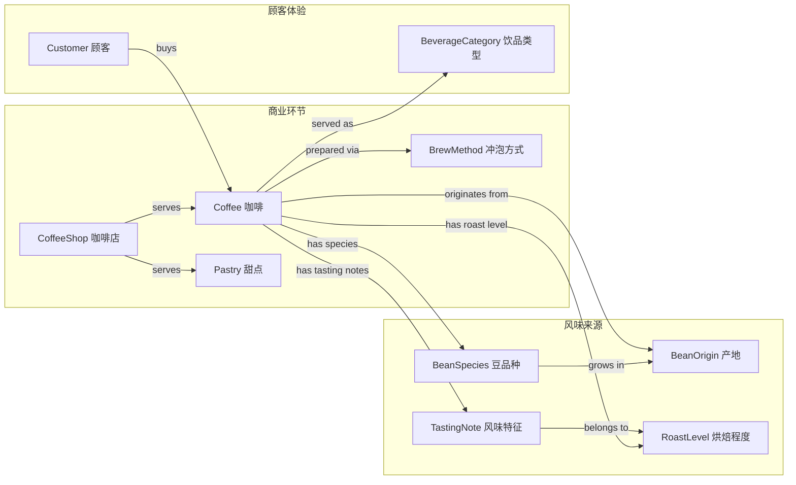
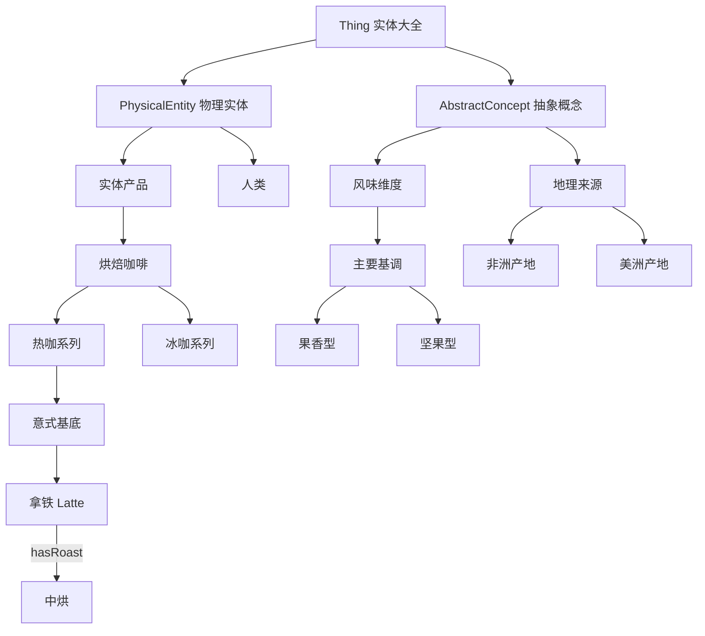
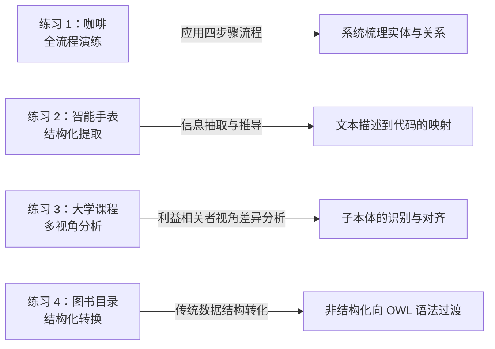

# 2.3 实践练习：概念化过程实战

在完成了前两节的理论探讨后，本节将通过 5 个具体的实践练习，帮助你运用**概念化理论**解决实际问题。每个练习都对应本体建模的不同技能点。

> **本节要点**：将抽象的“本体构建”步骤付诸实践，掌握领域概念识别、关系推导、粒度选择与多视角建模。

---

## 练习 1：完整的概念化流程——“咖啡”领域

以“咖啡（Coffee）”作为你的目标领域，请运用第 2.2 节讲解的**概念化四步流程**进行系统化的分析。

### 步骤 1：识别核心概念与术语

首先列出至少 10 个**类（Class，核心实体）**与 5 个**属性（Property，关系/特征）**。

| 要素类型 | 概念/属性名称 | 说明与解释 |
| --- | --- | --- |
| **类（Class）** | `BrewMethod` (冲泡方式) | 如手冲、意式浓缩等 |
| **类（Class）** | `BeanOrigin` (咖啡豆产地) | 如哥伦比亚、埃塞俄比亚等 |
| **类（Class）** | `RoastLevel` (烘焙程度) | 如浅烘、中烘、深烘 |
| **类（Class）** | `TastingNote` (风味特征) | 如花香、坚果香、巧克力味 |
| **类（Class）** | `BeverageCategory` (饮品类型) | 冰咖、热咖等 |
| **类（Class）** | `CoffeeShop` (咖啡店) | 售卖咖啡的商业场所 |
| **类（Class）** | `BeanSpecies` (咖啡豆品种) | 如罗布斯塔、阿拉比卡 |
| **类（Class）** | `WaterQuality` (水质要求) | pH 值、矿物质含量 |
| **类（Class）** | `Pastry` (烘焙甜点) | 咖啡的常见搭配食品 |
| **类（Class）** | `Customer` (顾客) | 消费主体 |
| **属性** | `hasBrewMethod` | 连接咖啡店与冲泡方式 |
| **属性** | `hasRoastLevel` | 描述咖啡的烘焙程度 |
| **属性** | `originatedFrom` | 描述咖啡的产地来源 |
| **属性** | `pairedWith` | 描述咖啡的甜点搭配 |
| **属性** | `hasTemperature` | 描述饮品的饮用品温 |

### 步骤 2：推导概念之间的关系

将上述列出的概念组织到关系网络中，理清类与类之间的联系：

### 步骤 3：构建类层级与树状分类

对领域中的概念进行逻辑归类，形成自上而下的概念层次体系：

### 步骤 4：添加属性约束与公理

在本体中，概念必须通过具体的公理来定义其边界：

| 属性公理 | 形式化表达（伪 OWL 代码） | 设计原因 |
| --- | --- | --- |
| 单根归属约束 | `Coffee SubClassOf originatedFrom only BeanOrigin` | 明确每种咖啡豆必须且只能源于一个主要地理产区 |
| 数量约束 (最小) | `Coffee SubClassOf hasRoastLevel min 1 RoastLevel` | 每一款出品咖啡必须有一个明确的烘焙等级标准 |
| 属性链公理 | `owl:propertyChainAxiom( preparedIn, locatedIn, yields Country )` | 如果在巴黎店的哥伦比亚豆，可以逻辑推理出其来源地为南美洲 |
| 互斥性 | `HotCoffee and IceCoffee are DisjointWith` | 保证分类严谨，同一流体饮品不会在分类体系中造成逻辑重叠冲突 |

---

## 练习 2：自然语言转化为结构化知识表示

**材料**：以下是一段来自电商网站的“智能手表”产品介绍。请阅读并尝试提取结构化本体描述。

> “XWatch Pro 是我们最新发布的智能可穿戴设备，采用高品质航空铝金属材质制成。该手表搭载了双核处理器并支持长达 7 天的续航。它具有 5ATM 级防水能力，可用于日常游泳。内置传感器可实时监测心率（HeartRate）、血氧（SpO2）和睡眠质量。它支持蓝牙 5.3 以及与 iOS 及 Android 系统的双向连接。”

| 概念提取任务 | 结构化表达结果 | 对应本体建模思路 |
| --- | --- | --- |
| **提取核心类** | `WearableDevice`, `SmartWatch`, `Processor`, `Sensor`, `HealthMetric` | 定义“智能手表”的顶级分类结构 |
| **提取数据属性** | 材质: 航空铝; 处理器核数: 双; 续航: 7 天; 蓝牙版本: 5.3 | 建立字面量与具体对象之间的数值或字符串映射关系 |
| **提取对象属性** | `hasComponent`(关联传感器/处理器)，`supportsOS`(关联 iOS/Android) | 将物理组件逻辑与软件环境建立对象级关联约束 |
| **推导出隐含属性** | `supportsSwimming`（具备 5ATM 防水即能推导出） | 利用公理系统（Axioms）在知识层面实现推理推导 |

> 💡 **思考**：如果我们在本体中添加一条“所有能防水的设备都是运动装备”的公理，那么通过推理器可以推导出 XWatch Pro 也是运动装备。这正是在概念化阶段添加逻辑表达的意义。

---

## 练习 3：多视角建模分析——以“大学课程”为例

在实际工程中，本体开发者需要经常与不同领域的专家沟通。请从以下三个**视角**分别列出该场景下的本体核心概念，并分析视角差异对本体建模的启发。

| 视角角色 | 视角核心概念列表 |
| :--- | :--- |
| **学生**视角 | 必修课、选修课、学分绩点（GPA）、考试时间表、上课地点、教授评分 |
| **教务员**视角 | 教学计划、学位要求、开课申请、排课冲突检测、学分累积统计、课程大纲 |
| **IT 工程师**视角 | Course 类、User 身份认证、Session 登录状态、Permission 数据库读写权限、API 数据接口 |

- **问题 1**：三个视角中的概念有哪些重叠？这些重叠概念（如课程 `Course`）是进行本体整合的基石。
- **问题 2**：从工程角度看，“排课冲突检测”这种概念应该归属于哪个模块的独立子本体（Sub-ontology）中？
- **参考答案**：
  - 重叠概念除了 Course，还包括 Time 时间段和 User（对应学生和教授）。这说明在做分布式本体设计时可以使用共享部分。
  - “排课”和“冲撞检测”是算法或计算功能层面的概念，在 IT 工程师的视角中应抽象为计算约束，在教务员视角下则为调度策略，体现不同领域专家在术语对齐（Ontology Alignment）中的必要性（参见第 22 章）。

---

## 练习 4：从分类表到本体构建

下面是一份传统的“书籍目录索引表”，请将其转换为一个具有语义关联的本体模型。

**原始信息表格**：
1. 文学类小说：通常分为奇幻、科幻、悬疑、武侠。小说的主角叫主人公。
2. 非小说类：包括传记、历史、科普。科普类的书通常会含有图片。
3. 每本书都有一个唯一的 ISBN 号码。

| 原始概念/描述 | 本体要素提取结果 |
| --- | --- |
| 文学类、非小说类 | `Literature` 和 `NonFiction` 是 `Book` 的两个子类 |
| 奇幻、科幻、悬疑等分类 | 是 `Genre` 类，并且与 `Book` 之间存在 `hasGenre` 属性联系 |
| 小说的主角 | 定义为对象属性 `hasProtagonist` 指向角色类 `Character` |
| 科普含有图片 | 定义为数据属性约束：if `hasGenre` Some `PopularScience` then `hasImages` min 1 xsd:boolean |
| 唯一 ISBN 号 | 数据属性 `isbnCode`，应用 `Cardinality` 约束：`only 1 xsd:string` |

---

## 小结

通过练习 1-4，我们实践了概念化的核心过程。

在本章的理论学习和练习之后，我们在第 3 章中将深入探究本体中最重要的组成元——核心要素：类、实例、属性和约束等本体元素体系。