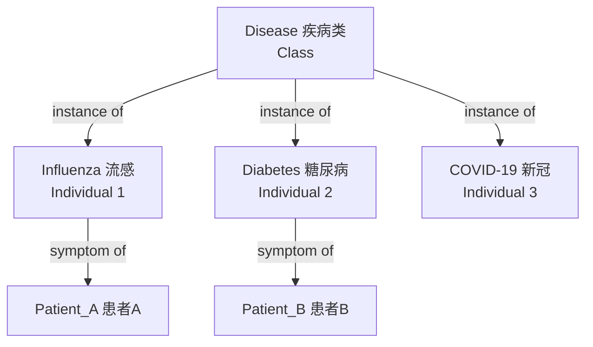
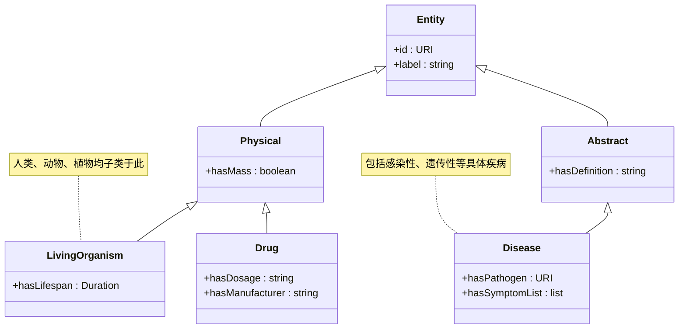
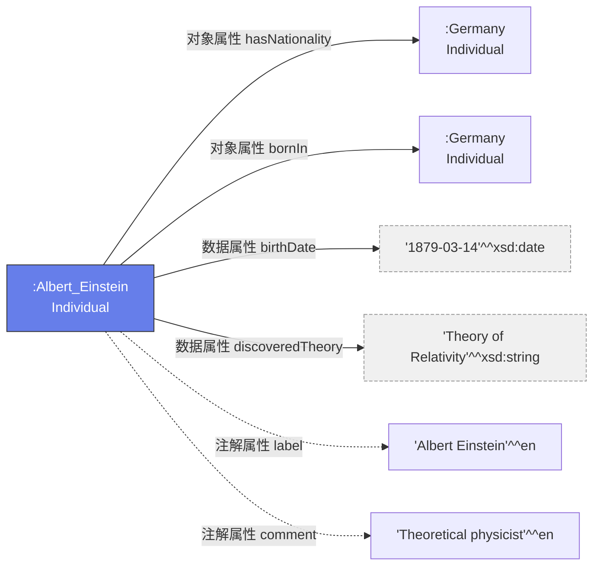
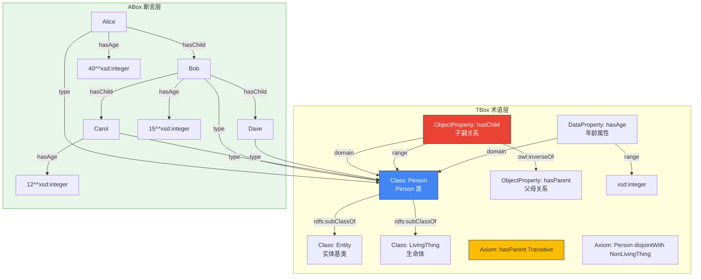

# 3.1 核心组成要素详解

本体（Ontology）作为对某一领域知识的**形式化、明确的规范说明**，其由一组核心要素组成。理解这些要素的含义和关系，是掌握本体建模的基础。

> **本节要点**：掌握本体中最基本的四个核心概念——类（Concept）、实例（Instance）、属性（Property）和关系（Relation），以及公理（Axiom）的本体学意义。

---

## 1. 四类核心要素

| 核心要素 | 英文名称 | 本体论地位 | 简要说明 |
| --- | --- | --- | --- |
| **类 / 概念** | Class / Concept | 抽象类型 | 代表某类事物的集合或类别 |
| **实例 / 个体** | Individual / Instance | 具体对象 | 某个类的具体成员或实例 |
| **属性 / 关系** | Property / Relation | 语义关联 | 连接两个或多个实例之间的关系 |
| **公理** | Axiom | 约束条件 | 表达类之间、属性之间或实例之间的逻辑约束 |

> **类比理解**：如果将本体看作一个数据库系统：
> - **类（Class）** 对应「数据表」（Table），定义了数据的结构模板
> - **实例（Individual）** 对应「数据行」（Row），是模板中的具体数据
> - **属性（Property）** 对应「字段/列」或「表间关联」，定义每个数据项的具体特征
> - **公理（Axiom）** 对应「数据库约束/外键/索引」，确保数据的逻辑一致性

---

## 2. 类（Class / Concept）

类（Class）是**具有共同属性的实体的抽象集合**。它是本体中表示类别概念的构件。

### 2.1 类的本质

类在哲学上被称为**共相（Universal）**，与具体的个别事物（ particulars，即实例）相对应：

| 对比项 | 类（Class） | 实例（Individual） |
| --- | --- | --- |
| 抽象层次 | 抽象（Abstract） | 具体（Concrete） |
| 实例化次数 | 可被多个实例实例化 | 只能存在一次，独一无二 |
| 是否独立存在 | 不独立存在，依赖于被实例化才能体现 | 可以独立存在 |
| 示例 | `Person`（人类）、`Disease`（疾病） | `Albert_Einstein`（爱因斯坦）、`Influenza`（流感病毒） |



**注意**：一个类本身也可以作为实例被另一更高阶的类所包含。例如 `Disease` 是类，但它本身也可以作为 `Concept` 类的实例。

### 2.2 类的层级结构

类通常通过子-父类关系组织成**树状层级结构**：

| 关系类型 | OWL 表达 | 语义含义 | 示例 |
| --- | --- | --- | --- |
| **子类** | `rdfs:subClassOf` | A 是 B 的子集，A 继承 B 的所有属性 | `Doctor ⊑ Person` |
| **等价类** | `owl:equivalentClass` | A 和 B 包含完全相同的成员 | `Mother ≡ Person ⊓ hasGender.Female` |
| **不相交类** | `owl:disjointWith` | A 和 B 没有共同的实例 | `Male disjointWith Female` |

以生物医学领域为例：



> **注意**：类的层级结构不同于文件系统的文件夹树。本体中允许**多重继承**，即一个类可以有多个父类。

---

## 3. 实例（Individual / Instance）

实例（Individual）是类的具体成员。在 W3C 的本体建模规范中通常称为 **Individual**，而非 "Instance"。这是因为在 OWL 的语义体系中：

- **Individual**（个体）指代的是一个不可分割的、具有唯一标识符（URI）的事物
- **Instance**（实例）一词在传统软件工程多用于指代「类的具体对象」，在面向对象语言语境中使用

两者在本体论语义上并无区别，但 **W3C 推荐使用 Individual**。

### 3.1 实例的属性赋值

| 实例 | 数据属性 | 值 | 数据类型 |
| ---- | -------- | ---- | ------- |
| `:Patient_Alice` | `:age` | `30` | `xsd:integer` |
| `:Patient_Alice` | `:name` | "Alice Smith" | `xsd:string` |
| `:Patient_Alice` | `:birthDate` | "1994-03-15" | `xsd:date` |

### 3.2 实例的关系链接

| 主语 | 对象属性 | 宾语 |
| ---- | -------- | --- |
| `:Patient_Alice` | `:hasDoctor` | `:Dr_Bob` |
| `:Patient_Alice` | `:hasDiagnosis` | `:Type2_Diabetes` |
| `:Dr_Bob` | `:hasSpecialty` | `:Endocrinology` |

---

## 4. 属性（Property）

属性是本体的关键连接件，它描述了个体之间的语义关联或个体的特征属性。

### 4.1 属性的三大分类

| 属性类型 | 英文全称 | 连接对象 | 示例 |
| --- | --- | --- | --- |
| **对象属性** | Object Property | 个体 → 个体 | `hasMother`, `locatedIn` |
| **数据属性** | Data Property | 个体 → 字面量（字符串/数字/日期等） | `hasName`, `hasAge`, `hasEmail` |
| **注解属性** | Annotation Property | 资源 → 注解文字（元数据用途） | `rdfs:label`, `dc:description`, `rdfs:comment` |



### 4.2 对象属性的核心特征

属性除了类型不同外，还可以通过**性质特征（Property Features）**来增加逻辑表达能力：

| 特征类型 | OWL 表达 | 含义 | 示例 |
| --- | --- | --- | --- |
| **传递性** | TransitiveProperty | 如果 A 与 B 相关、B 与 C 相关，则可推导 A 与 C 相关 | `partOf`：细胞器官人体 |
| **对称性** | SymmetricProperty | 如果 A 与 B 相关，则 B 与 A 也相关 | `siblingWith`, `colleagueOf` |
| **函数性** | FunctionalProperty | 一个主体最多有一个客体值 | `hasMother`、`hasBiologicalFather` |
| **逆函数性** | InverseFunctionalProperty | 一个客体最多关联一个主体 | `hasSSN`（社保号唯一对应一个人） |
| **互反性** | InverseProperty | A 与 B 互为逆关系 | `hasParent` ↔ `hasChild` |

**函数性属性的实例证明**：

考虑函数性属性 `hasMother`（生母）。一个人最多只能有一个生物学上的生母：

```
:Alice :hasMother :Mary .
:Mary :hasMother :Grace .
/* 推理推导 */
:Alice :hasGrandMother :Grace .
```

如果系统发现 `:Alice` 同时有两个 `:hasMother` 值（`:Mary` 和 `:Jane`），则会出现不一致性（Inconsistency），这表示本体的数据存在错误矛盾。

---

## 5. 公理（Axiom）

公理是**本体中无法被证伪的断言**。它是本体的逻辑核心，赋予了本体推理能力。

### 5.1 公理的基本分类

| 公理类型 | OWL 表示 | 示例表达 | 用途 |
| --- | --- | --- | --- |
| **类公理** | Class Axiom | `Person SubClassOf hasAge some xsd:integer` | 定义类的层级结构和成员资格 |
| **属性公理** | Property Axiom | `hasMother SubClassOf hasParent` | 建立属性的层次与继承 |
| **个体公理** | Individual Axiom | `Alice InstanceOf Person` | 实例分类与赋值 |
| **断言** | Fact / Assertion | `Alice hasAge 30` | 具体个体关系的断言 |

### 5.2 TBox 与 ABox

公理根据抽象程度可分为两大类：

| 分类 | 全称 | 含义 | 内容 |
| --- | --- | --- | --- |
| **TBox** | Terminological Box | **术语知识库**：表示通用概念及其关系 | 类的定义、属性特征、公理 |
| **ABox** | Assertion Box | **断言知识库**：表示具体实例及其关系 | 个体分类、个体属性赋值、个体间关系 |

| 维度 | TBox（术语层） | ABox（数据层） |
| --- | --- | --- |
| 对应类比 | 数据库的**数据表结构定义**（Schema） | 数据库表的**具体数据行** |
| 示例语句 | "所有人都是 Person 类的实例" | "Alice 是 Person 的实例" |
| 推理类型 | Classification（分类）、Consistency（一致性检查） | Instantiation（实例推导）、Realization（ realizing） |
| 是否随时间变更 | 低频变更（本体设计稳定后很少变化） | 高频变更（随着数据新增实时更新） |

在实际知识图谱项目中，TBox 相当于**模式模式（Schema）**，而 ABox 相当于业务系统不断涌入的**实例数据**。

---

## 6. 核心要素关系总结图

本节的四个核心要素在 OWL 本体内如何协作？如下关系网络图所示：



---

## 7. 小结

| 要素 | 核心作用 | W3C 标准术语 |
| --- | --- | --- |
| **类** | 定义事物类型的抽象边界 | Class / Concept |
| **实例/个体** | 类的具体存在者 | Individual / Instance |
| **属性** | 描述类间的语义关系和特征 | Object Property / Data Property / Annotation Property |
| **公理** | 施加在类、属性和实例上的逻辑约束 | Axiom |

---

## 8. 延伸阅读

| 资源 | 作者 | 链接 |
| --- | --- | --- |
| *Ontology: A Practical Guide* (2nd ed.) | Silva, Cruz | [MIT Press, 第 4 章: The Core Ontology Elements](https://direct.mit.edu/books/edited-volume/5248/Ontology-A-Practical-Guide) |
| W3C OWL 2 Web Ontology Language Document Overview | W3C | [WD-owl2-overview-20121217](https://www.w3.org/TR/owl2-overview/) |
| The OntoRef Model - Deriving an OWL 2 Profile from UML Class Diagrams | P. Flores et al. | [SpringerLink](https://link.springer.com/) |

---

## 9. 本节练习

1. **概念辨析**：`Individual` 与 `Instance` 有什么语义上的细微差别？为什么 W3C 推荐在 OWL 中使用 `Individual` 一词？
2. **关系映射**：在你的一个熟悉领域（如学校管理），分别找出一个类、实例、对象属性和数据属性的例子。
3. **公理推导**：若 `hasGrandParent` 定义为 `hasParent` 的属性链公理 `hasParent ∘ hasParent`（两个 hasParent 链接），请证明：若 Alice 是 Bob 的母亲、Mary 是 Alice 的母亲，则 Mary 是 Bob 的祖母。

---

> **下一章**：[3.2 本体类型层次](./02-ontology-types.md) — 讨论上层本体、领域本体与任务本体之间的区别与应用场景。