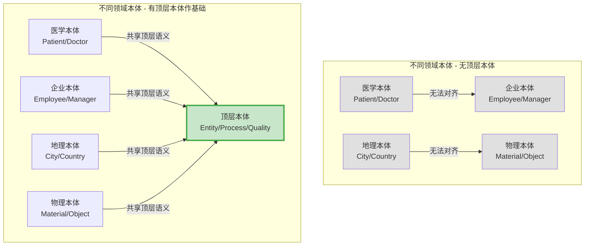
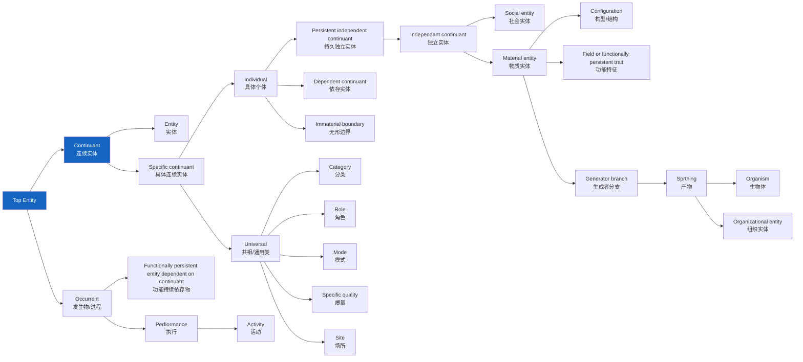
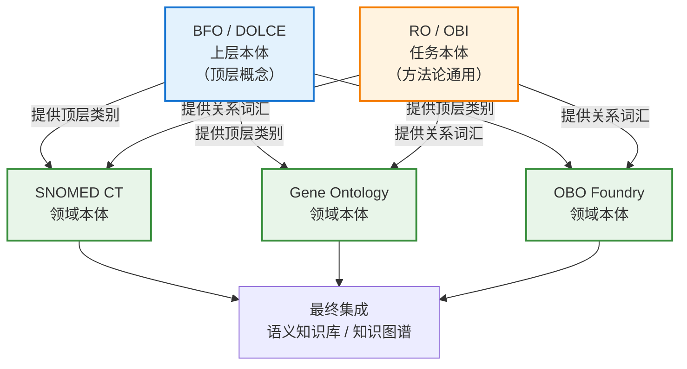

# 3.2 本体类型层次

本体可以按照其覆盖范围和应用领域分为不同的层次。理解这些本体类型及其用途，对于在本体工程中选择恰当的设计方案和重用策略至关重要。

> **本节要点**：掌握上层本体（Upper Ontology）、领域本体（Domain Ontology）与任务本体（Task Ontology）的分类体系，理解本体重用的层次结构和工程意义。

---

## 1. 本体的三大层次分类

| 层次 | 英文名称 | 覆盖范围 | 抽象程度 | 示例 |
| --- | --- | --- | --- | --- |
| **上层本体** | Upper Ontology / Foundational Ontology | 跨领域的通用概念 | 最抽象 | BFO、DOLCE、SUMO |
| **领域本体** | Domain Ontology | 特定专业领域 | 中等抽象 | Gene Ontology、SNOMED CT |
| **任务本体** | Task Ontology | 特定任务或方法论的共享概念 | 较低抽象 | OBO 动作术语、RDF Schemata |

这三种本体类型的关系不是层级包含，而是**横向复用和协作**。它们通过不同的知识组织体系解决不同层面的语义表达需求：

| 本体类型 | 核心关注 | 概念范围 | 是否领域专属 | 示例领域 |
| --- | --- | --- | --- | --- |
| **上层本体** | 描述"普遍存在"的基本类别 | 跨领域通用 | 否 | 无特定领域 |
| **领域本体** | 描述特定领域内的实体与关系 | 领域专属 | 是 | 医疗、金融、法律 |
| **任务本体** | 描述方法论流程或任务相关的概念 | 跨领域共享 | 否 | 数据处理、组织流程 |

---

## 2. 上层本体（Upper Ontology）

上层本体，也常被称为**顶层本体**（Top-level Ontology）或**基础本体**（Foundational Ontology），是描述**最广泛领域概念**的最一般、最抽象的本体系统。

### 2.1 为什么需要上层本体？

在知识工程和语义网领域，不同领域的本体经常需要相互协作或整合。如果没有一个统一的底层概念框架，本体的互操作性将面临严重障碍：



通过一个公共的上层本体层，来自不同领域的本体可以在逻辑层面上实现**语义对齐**：

- 统一不同本体对**基本类别**（如"实体"与"过程"）的理解
- 为**关系/属性**提供一致的拓扑定义
- 解决术语不一致带来的本体融合问题

### 2.2 主流上层本体对比

| 上层本体 | 全称 | 设计者 | 发布机构 | 核心分类思想 |
| --- | --- | --- | --- | --- |
| **BFO** | Basic Formal Ontology | Barry Smith, John Tuomela | University of Miami | 区分**连续体**（Continuants: 实体）与**非连续体**（Occurrents: 事件过程） |
| **DOLCE** | Description and Ontology for Common and Essential concepts | Nicola Guarino | Italian National Research Council | 强调**感知**（Perception）与**认知**（Cognition）的本体映射关系 |
| **SUMO** | Sufficiently Mathematical Ontology | Christopher Welty, William Arstine | NIST | 基于**形式数学逻辑**构建的本体分类体系 |
| **psi-ONTO** | - | CNR-IRPPS | Italian Institute | 关注**社会认知**维度的本体建模 |

#### BFO（Basic Formal Ontology）层级架构详解

BFO 是最广泛使用的顶层本体，其架构分为两个核心互斥分支：



上层本体的核心价值在于它提供了**跨领域的基础概念框架**，使得领域本体可以建立在上层概念之上。例如：

| BFO 概念 | 对应领域本体的应用 |
| -------- | ------------------ |
| `Independant continuant` (独立实体) | 在生物医学领域可以具体化为 `Material Entity` |
| `Organism` | 基因本体中可用于描述基因表达的主体 |
| `Process` | 医学本体中可以描述为 `disease_process`（疾病过程） |
| `Quality` | 描述化学物质的属性，如 `molecular_weight`（分子量） |

---

## 3. 领域本体（Domain Ontology）

领域本体聚焦于某一**特定专业领域**内的概念、属性及其相互关系。它在概念上涵盖了特定领域中的核心类别及关系，但不包含跨领域的通用抽象。

### 3.1 领域本体的核心特征

| 特征 | 说明 |
| --- | --- |
| **领域特定性** | 专门描述一个特定领域（如：生物学、金融）中的知识 |
| **术语体系** | 包含该领域独有的、特定术语与分类体系 |
| **应用导向** | 主要目标是提高知识的共享、理解与交流 |
| **与上层本体关系** | 可基于或借用上层本体概念作为其分类起点 |
| **可独立使用** | 即使在无上层本体支持的情况下也具有独立意义 |

### 3.2 著名领域本体示例

| 领域本体名称 | 领域 | 简介 | 关键内容 | 链接 |
| --- | --- | --- | --- | --- |
| **Gene Ontology (GO)** | 分子生物学 | 基因及其产物特征的标准化控制词汇 | `molecular_function`, `biological_process`, `cellular_component` | [geneontology.org](https://geneontology.org/) |
| **SNOMED CT** | 临床医学 | 全球使用最多的临床医学术语集 | `Disease`, `Procedure`, `Finding`, `Drug` | [snowstorm.snomedtools.com](https://snowstorm.snomedtools.com/) |
| **FIBO** | 金融 | 金融业务法规关系的公共词汇表 | `Security`, `Derivative`, `Equity` | [fibo.community](https://fibo.community/) |
| **FoodON** | 食品 | 食品领域的本体标准 | `FoodProduct`, `FoodCategory`, `Ingredient` | [foodontology.org](http://foodontology.org/) |
| **SO** | 系统发育学 | 描述系统发育和分类学概念的术语集 | `Taxon`, `Clade`, `Phylogenetic` | [software-curator.ncbs.res.in/sO/](https://software-curator.ncbs.res.in/sO/) |

#### Gene Ontology (GO) 示例

基因本体（Gene Ontology, GO）是最著名的领域本体之一。它定义了基因产物特征的三个方面：

| 分支 | 含义 | 示例 |
| --- | --- | --- |
| **生物学过程** | 有序生物学目标的实现 | `cellular_respiration`, `signal_transduction` |
| **分子功能** | 单个分子水平的活动 | `ATP_binding`, `protein kinase activity` |
| **细胞组分** | 细胞结构中基因产物的位置 | `nucleus`, `ribosome`, `mitochondrion` |

### 3.3 领域本体的设计考量

设计领域本体时需要考虑：

| 要素 | 说明 | 示例（生物医学领域） |
| --- | --- | --- |
| **覆盖范围界定** | 明确领域边界 | 本《本体论》教材涵盖本体基础理论与方法，但不深入具体领域的应用开发 |
| **术语标准化** | 选择标准术语，避免命名歧义 | 采用 "Myocardial Infarction" 而非 "heart attack" |
| **复用性** | 尽可能复用已有概念而非重新构建 | 使用 BFO 或 OBO Foundry 中的上层概念做分类起点 |
| **粒度** | 确定概念模型精细程度 | "Heart_Disease" 是否需要细化到 "Atrial_Fibrillation"？ |
| **可扩展性** | 设计可容纳未来新增概念的体系 | 设计 `Disease` 子类时预留给新发疾病分类空间 |

---

## 4. 任务本体（Task Ontology）

任务本体用于描述执行特定任务的**方法学、方法论流程中的共享概念**，它涵盖的是任务域而非特定知识领域：

| 核心特征 | 说明 |
| --- | --- |
| 包含执行某个**任务**所必需的通用概念 | 不涉及专业领域的概念体系 |
| 在特定本体开发流程中作为中间步骤复用 | 例如分类、搜索、配置任务的共享概念 |
| 通常作为领域本体或上层本体的辅助补充体系 | 与专业本体协作 |
| 概念通常不依赖于具体的领域概念 | 比如"分类法"或"评估"本身不依赖领域知识 |

### 4.1 任务本体的典型应用

在 OBO（Open Biomedical Ontologies）Foundry 中，除了各个领域的本体，还存在用于辅助特定方法论流程的**任务本体**，比如：

| 任务本体 | 应用领域 | 共享词汇/概念体系 |
| --- | --- | --- |
| **OBI** (Ontology for Biomedical Investigation) | 生命科学 | `assay`, `instrument`, `protocol` |
| **IDO** (Investigation Dependency Ontology) | 临床研究 | `injury`, `immunization` |
| **CHEBI** (Chemical Entities of Biological Interest) | 化学 | `molecular_entity`, `ion` |
| **RO** (Relation Ontology) | 跨本体通用 | `causally_upstream_of`, `has_part` |

其中，**RO（Relation Ontology）** 是一个经典的任务本体案例。RO 定义了跨领域的语义关系，可以在任何领域本中被复用：

```
:Patient123 :has_active_ingredient :Aspirin .
:Aspirin :causally_upstream_of :PainRelief .
/* 通过 RO 关系可以推导出 Aspirin 能缓解 Patient123 的疼痛 */
```

---

## 5. 三种本体的关系与协同

三种类型的本体在知识系统中如何协同工作？



- **上层本体**提供概念分类的"最高层级"
- **领域本体**在具体的专业领域内细化上层概念的抽象分类
- **任务本体**则作为"工具集"，为领域建模提供跨领域的关系/方法论支持

> **注意**：在实际工程实践中，并非每个项目都需要完整的三层体系。小型项目可能仅使用单一领域本体；大型跨领域系统（如生物医学知识图谱）则更需要上层本体来确保不同来源本体的对齐和互操作。

---

## 6. 本体类型对比总结

| 比较维度 | 上层本体 | 领域本体 | 任务本体 |
| --- | --- | --- | --- |
| **覆盖范围** | 全域通用 | 单个或多个相关领域 | 方法论 / 任务层面 |
| **概念抽象度** | 最抽象 | 具体领域知识 | 方法论抽象 |
| **是否依赖领域** | 不依赖 | 高度领域依赖 | 跨领域复用 |
| **复用频率** | 非常高 | 中等 | 高 |
| **设计难度** | 极高 | 中等 | 中等 |
| **主要目的** | 语义互操作 / 知识集成 | 领域知识管理与推理 | 标准化方法论 / 共享关系定义 |

---

## 7. 延伸阅读

| 资源 | 作者/机构 | 链接 |
| --- | --- | --- |
| *The OBO Foundry: A collaborative infrastructure for semantics FAIR data* | Smith et al. | [Nature Publishing Group, 2018](https://www.nature.com/articles/s41597-020-0700-6) |
| *Ontology: A Practical Guide* (2nd ed.) | Silva, Cruz | [MIT Press, 第 7-8 章](https://direct.mit.edu/books/edited-volume/5248/Ontology-A-Practical-Guide) |
| Basic Formal Ontology (BFO) | Barry Smith | [basic-formal-ontology.org](http://basic-formal-ontology.org/) |
| OBO Relations Tutorial | OBO Foundation | [oboacademy.github.io](https://oboacademy.github.io/obook/) |

---

## 8. 本节练习

1. **本体分类**：为以下常见系统/项目判断其所属的本体类型（上层/领域/任务）：
   - Schema.org
   - FOAF (Friend of a Friend)
   - CIDOC-CRM (文化遗产信息参考模型)
   - PROV-O (W3C 数据本体)
   - WordNet

2. **设计思考**：如果你被要求为"在线教育系统"开发一个本体，你会选择哪些类型？需要如何组织它们之间的关系？

3. **BFO 分析**：BFO 将"持续存在物"（Continuant）与"发生物"（Occurrent）做了严格的形而上学区分。请思考：以下概念分别应归属于哪个分支？
   - "一顿早餐"
   - "早餐的时间段"
   - "一颗苹果"
   - "苹果被吃掉"这一事件

---

> **下一章**：[3.3 分类法与本体的对比练习](./03-comparison-exercise.md) — 通过 RDFS 分别建模"学科分类表"与"学科关系本体"，对比分类法与本体表达能力的差异。