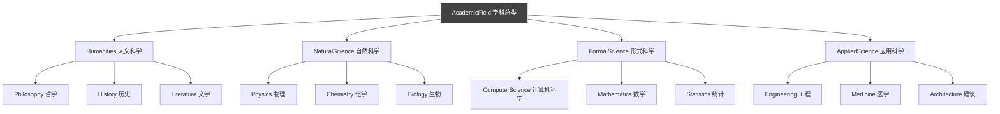
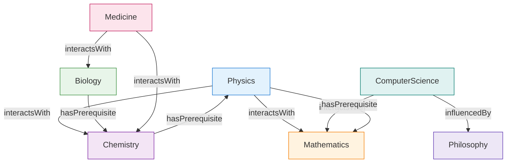

# 3.3 分类法与本体的对比练习

在本体工程实践中，一个常见的问题是"本体与词汇表 / 分类法有什么区别？"。通过实际建模练习，我们可以清晰地看到二者的表达能力差异。

> **本节要点**：通过 RDFS 分别对"学科分类表"（分类体系，Taxonomy）和"学科关系本体"（本体系统，Ontology）进行建模，对比 RDFS 分类表与 OWL 本体在表达能力上的本质区别。

---

## 1. 分类法与本体：核心区别

| 维度 | 分类法（Taxonomy / Thesaurus） | 本体（Ontology） |
| --- | --- | --- |
| **结构** | 单层分类树（仅 subClassOf 层级） | 多关系网络（多层类关系和属性关联） |
| **表达能力** | 只能表达层次从属 | 表达多种关系（等价、不相交、逆关系等） |
| **关系** | 只有"是...的子类"关系 | 多种对象属性关系（partOf, causes, locatedIn 等） |
| **约束** | 无法表达属性的域、范围等 | 可定义属性约束（如 Functional、Transitive 等特征） |
| **推理** | 有限（只能进行层级继承推理） | 丰富（分类、实例推导、一致性检查等） |

---

## 2. RDFS 表示学科分类法

**分类法**（Taxonomy）仅使用 RDFS 的 `rdfs:subClassOf` 关系来表达学科层次的从属关系：

```turtle
@prefix rdfs: <http://www.w3.org/2000/01/rdf-schema#> .
@prefix : <http://example.org/academic-fields#> .

# 定义学科根类
:AcademicField a rdfs:Class .

# 上层分类
:Humanities rdfs:subClassOf :AcademicField .
:NaturalScience rdfs:subClassOf :AcademicField .
:FormalScience rdfs:subClassOf :AcademicField .
:AppliedScience rdfs:subClassOf :AcademicField .

# 下位类
:Philosophy rdfs:subClassOf :Humanities .
:History rdfs:subClassOf :Humanities .
:Literature rdfs:subClassOf :Humanities .

:Physics rdfs:subClassOf :NaturalScience .
:Chemistry rdfs:subClassOf :NaturalScience .
:Biology rdfs:subClassOf :NaturalScience .

:ComputerScience rdfs:subClassOf :FormalScience .
:Mathematics rdfs:subClassOf :FormalScience .
:Statistics rdfs:subClassOf :FormalScience .

:Engineering rdfs:subClassOf :AppliedScience .
:Medicine rdfs:subClassOf :AppliedScience .
:Architecture rdfs:subClassOf :AppliedScience .
```

用思维导图呈现这个 RDFS 分类体系：



### RDFS 分类法能做什么？

RDFS 分类法仅支持**传递性的子类推理**：
- 因为 `Philosophy` `rdfs:subClassOf` `Humanities`，且 `Humanities` `rdfs:subClassOf` `AcademicField`
- 所以可以推出 `:Philosophy` 也是 `:AcademicField` 的子类
- 推理范围仅限于此，无法表达其他语义。

---

## 3. OWL 表示学科关系本体

现在，我们不只把学科看作树状层级，而是建立一个反映学科间**相互作用关系**的 OWL 本体：

### 3.1 定义类（Classes）

```turtle
@prefix owl: <http://www.w3.org/2002/07/owl#> .
@prefix rdf: <http://www.w3.org/1999/02/22-rdf-syntax-ns#> .
@prefix rdfs: <http://www.w3.org/2000/01/rdf-schema#> .
@prefix xsd: <http://www.w3.org/2001/XMLSchema#> .
@prefix : <http://example.org/academic-ontology#> .

# 学科顶级类定义
:AcademicField a owl:Class ;
    rdfs:label "Academic Field"@en .
```

### 3.2 定义对象属性（Object Properties）

本体不仅包含类层级，还定义类之间的语义关联：

```turtle
# ===== 对象属性定义 =====
:hasBranch a owl:ObjectProperty ;
    rdfs:label "has branch"@en ;
    rdfs:domain :AcademicField ;
    rdfs:range :AcademicField ;
    owl:propertyChainAxiom ( :relatedTo :interactsWith ) .  # 属性链推导

:relatedTo a owl:ObjectProperty ;
    rdfs:label "related to"@en ;
    rdfs:domain :AcademicField ;
    rdfs:range :AcademicField .

:interactsWith a owl:ObjectProperty ;
    rdfs:label "interacts with"@en ;
    rdfs:domain :AcademicField ;
    rdfs:range :AcademicField ;
    owl:inverseOf :influencedBy .  # 属性互反性定义

:influencedBy a owl:ObjectProperty ;
    rdfs:label "influenced by"@en .
```

| 属性名 | 语义含义 | 关键特征 |
| --- | --- | --- |
| `:interactsWith` | 表达学科间的跨学科交互 | 具有逆属性 `influencedBy` |
| `:hasPrerequisite` | 某一学科是另一学科的前提基础 | 传递性属性（TransitiveProperty） |
| `:isApplicableTo` | 表明基础学科可应用在某领域 | 与 `:hasApplication` 互反 |

### 3.3 定义不相交性与等价类

OWL 本体可以表达分类法做不到的**强约束**：

```turtle
# ===== 类层级 =====
:STEM rdfs:subClassOf :AcademicField ;
    rdfs:label "STEM"@en .

:SocialScience rdfs:subClassOf :AcademicField ;
    rreads:label "Social Science"@en .

:Philosophy rdfs:subClassOf :Humanities ;
    rdfs:label "Philosophy"@en .

# ===== 关键约束 =====

# 定义 STEM 等价类 — 本体比 RDFS 多出的表达能力
:STEM owl:equivalentClass [
    owl:intersectionOf (
        :AcademicField
        [ owl:oneOf ( :Physics :Chemistry :Biology :ComputerScience :Mathematics :Engineering ) ]
    )
] .

# 不相交公理 — 不同领域之间没有交集
:Humanities owl:disjointWith :NaturalScience .
:Humanities owl:disjointWith :FormalScience .
:Humanities owl:disjointWith :AppliedScience .
:NaturalScience owl:disjointWith :FormalScience .

# 传递性属性 — 前提关系的传递推导
:hasPrerequisite a owl:TransitiveProperty .

# 定义学科间关系
:Physics :interactsWith :Chemistry .
:ComputerScience :interactsWith :Mathematics .
:Physics :interactsWith :Mathematics .
:Medicine :interactsWith :Biology .

:ComputerScience :influencedBy :Philosophy .
```

学科关系的知识图谱：



### 3.4 OWL 本体能做 RDFS 做不到的事？

| 能力 | RDFS 分类法 | OWL 本体 | 说明 |
| --- | --- | --- | --- |
| 表达"Humanity 和 NaturalScience 无交集" | ❌ 不支持 | ✅ 支持 `disjointWith` | 可保证不会出现属于两个领域的重叠实例 |
| 推理："Philosophy 影响 ComputerScience"意味着"CS 受 Philosophy 影响" | ❌ 不支持 | ✅ 支持 `inverseOf` 推理 | 通过互反属性自动推导反向关系 |
| "Math is a prerequisite for Physics, Physics for Chemistry"可推导"Math 是 Chemistry 前提" | ❌ 不支持 | ✅ 支持 `TransitiveProperty` | 传递属性推理 |
| 属性 `hasPrerequisite` 应用于任何 AcademicField | ❌ 不支持 | ✅ 通过 `rdfs:domain` 约束 | 确保属性使用的规范性 |
| 等价类推理 | ❌ 不支持 | ✅ 通过 `owl:equivalentClass` | 定义 STEM 类的逻辑等价条件 |

---

## 4. 两种模型对比与结论

### 4.1 本体对比

| 对比项 | 学科分类法（RDFS） | 学科关系本体（OWL） |
| --- | --- | --- |
| **图类型** | 有向树状图（DAG） | 有向关系网络图 |
| **推理深度** | 一层继承 | 多关系链推理 |
| **关系种类** | `subClassOf`（仅一种） | `subClassOf`, `interactsWith`, `hasPrerequisite`, `inverseOf`, `disjointWith`… |
| **应用场景** | 学科导航、信息组织 | 科研合作推荐、跨学科领域发现 |
| **表达能力** | 有限 | 丰富 |

### 4.2 本体建模的核心优势展示


在上面的多关系图谱中：

1. **传递推理**：如果 `Math` 是 `Physics` 的前置，而 `Physics` 又是 `Chemistry` 的前置，通过 `:hasPrerequisite` 的传递性，推理器可以推导出：`Math` 是 `Chemistry` 的前置。
2. **逆向推理**：如果 `Philosophy` 影响 `Computer Science`，那么 `CS influencedBy Philosophy` 同样成立。
3. **一致性检查**：如果我们错误地将 `:Mathematics rdfs:subClassOf :Philosophy`，由于 `:Mathematics owl:disjointWith :Philosophy`，推理器将报出矛盾。

---

## 5. 练习

### 练习 1：分类法 vs 本体建模

选择"动物分类"场景，分别使用 RDFS 分类法与 OWL 本体建模。

| 模型类型 | 要求 |
| --- | --- |
| RDFS | 建模"动物"→"哺乳动物 → 犬科"层级分类 |
| OWL | 为 RDFS 加上属性（例如`livesIn`,`hasLegs`）、不相交公理（如`:Mammal disjointWith :Reptile`）、等价类定义 |

### 练习 2：关系分析

思考"植物学与化学之间的关系属于哪种类型的学科关系"？

- **选项 A**：仅仅是 RDFS `subClassOf` 的层级关系
- **选项 B**：OWL `interactsWith` 对象属性关系的交叉学科
- **选项 C**：OWL `hasPrerequisite` 前提关系的学科依存

请选择并说明理由。

### 练习 3：RDFS vs OWL 选型

如果你的系统需要支持以下能力：
- A. 只进行简单的"是某子类的实例"的推理
- B. 需要知道"A 影响了 B，所以 B 反过来被 A 影响"的推导
- C. 确保两个类不可能共享同一个实例
- D. 支持通过传递链推导间接关系（A 是 B 的前提、B 是 C 的前提，推导出 A 是 C 的前提）

哪些场景必须使用 OWL，RDFS 不够用？为什么？

---

> **本章小结**：本章系统阐述了本体的四大核心组成要素（类、实例、属性、公理）及其形式化含义，并梳理了上层本体、领域本体、任务本体之间的区别。下一章 [第 4 章：RDF 数据模型](../ch04-rdf-data-model/01-rdf-introduction.md) 将深入理解 RDF（Resource Description Framework）数据模型的三元组结构。
