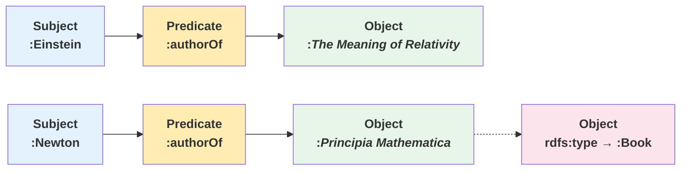
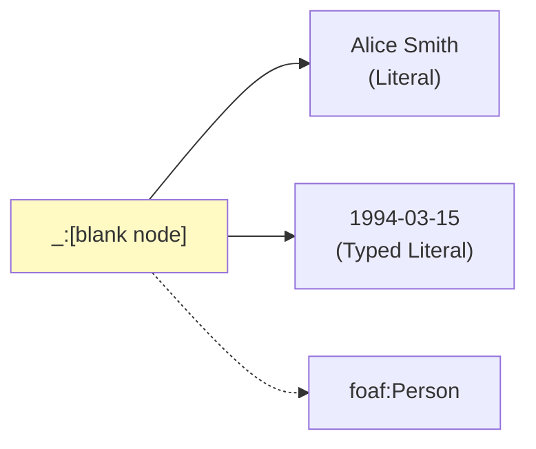
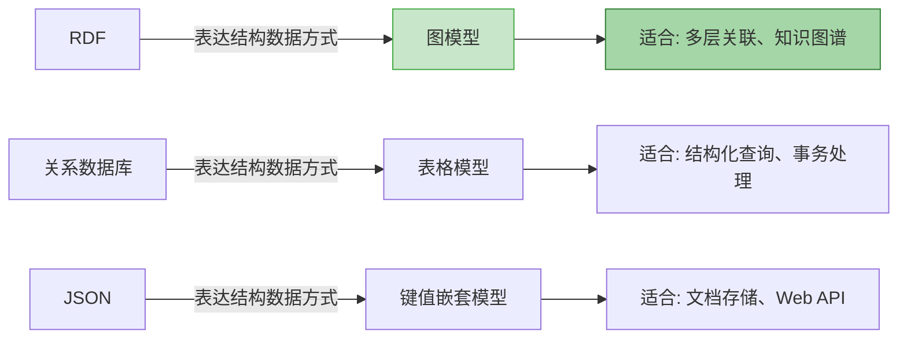

# 4.1 RDF 简介：什么是 RDF？

**RDF**（Resource Description Framework，资源描述框架）是语义网技术的核心数据模型。它由 W3C 于 1997 年推荐为标准，是实现"机器可读"（Machine-Readable）互联网的关键基础。

> **本节要点**：理解 RDF 的设计目标、发展历程与 W3C 标准化历程，掌握 RDF 的基本数据模型思想。

---

## 1. RDF 的设计目标

语义网愿景是蒂姆·伯纳斯·李（Tim Berners-Lee）在 1990 年提出的，他设想让计算机能够理解网页内容的**含义**，而不仅仅是展示内容。RDF 正是为实现这一目标而设计的数据框架。

| 设计目标 | 说明 | 实际应用 |
| --- | --- | --- |
| **资源描述** | 以一种中立格式描述资源间的关系 | 知识图谱数据交换 |
| **元数据交换** | 提供元数据描述的标准方式 | 数字图书馆、数字人文 |
| **语义整合** | 整合不同来源的数据 | 跨系统数据融合 |
| **机器可理解** | 结构化数据描述，让机器能进行推理 | 智能推荐、逻辑推理 |


---

## 2. 核心思想：三元组（Triple）

RDF 最基本的知识表示单元是**三元组**，又称**语句**（Statement）：

| 组件 | 英文 | 作用 | 示例 |
| --- | --- | --- | --- |
| **主体** | Subject | 描述的资源 | `:Albert_Einstein` |
| **谓词** | Predicate | 属性/关系 | `:bornIn` |
| **客体** | Object | 值（另一个资源或字面量） | `:Ulm` 或 `"1879-03-14"^^xsd:date` |

三元组表达了一个清晰的语义："某个主体的某个属性值为某个客体"：

```
Albert_Einstein → bornIn → Ulm
```

---

## 3. RDF 数据模型与图论

从图论（Graph Theory）角度看，RDF 本质上是一个**有向标号图**（Directed Labeled Graph）：

| 图元素 | RDF 对应 | 说明 |
| --- | --- | --- |
| **节点**（Node） | 资源或字面量 | IRI、空白节点（Blank Node）或 Literals |
| **边**（Edge/弧） | 谓词/属性 | RDF 关系的有向连接 |

### 3.1 RDF 三元组图表示例



---

## 4. 标识符：IRI 与 URI

RDF 使用 **IRI**（Internationalized Resource Identifier，国际化资源标识符）唯一标识每个资源。IRI 是 URI（Uniform Resource Identifier）的扩展，支持 Unicode 字符（如中文、日文等）。

```
http://example.org/person/Albert_Einstein
```

| 资源类型 | 标识方式 | 示例 |
| --- | --- | --- |
| **全局资源（Global URI/IRI）** | 完整的 HTTP IRI | `http://dbpedia.org/resource/Albert_Einstein` |
| **命名空间前缀（Namespace Prefix）** | 缩写格式 | `@prefix dbp: <http://dbpedia.org/resource/> .` |
| **空白节点（Blank Node）** | 匿名资源 | `_:node123abc` |
| **字面量（Literal）** | 带类型的字符串值 | `"Albert"^^(xsd:string)` 或 `"1879-03-14"^^xsd:date` |

### 4.1 常见命名空间

在实际 RDF 建模中，使用标准化的命名空间能确保语义一致性：

| 命名空间前缀 | IRI | 用途 |
| --- | --- | --- |
| `rdf:` | `http://www.w3.org/1999/02/22-rdf-syntax-ns#` | RDF 核心词汇（`type`, `subject`, `object` 等） |
| `rdfs:` | `http://www.w3.org/2000/01/rdf-schema#` | RDF 词汇表（`subClassOf`, `label` 等） |
| `owl:` | `http://www.w3.org/2002/07/owl#` | OWL 逻辑词汇（`SameAs`, `DisjointWith` 等） |
| `xsd:` | `http://www.w3.org/2001/XMLSchema#` | XML 数据结构（`string`, `integer`, `date` 等） |
| `skos:` | `http://www.w3.org/2004/02/skos/core#` | 简单知识组织体系 |

---

## 5. 空白节点（Blank Node）

在某些情况下，我们无法知道某资源的全球标识符，但仍然需要表示它的存在。这就是**空白节点**（Blank Node）的用武之地。

### 5.1 空白节点应用场景

```
描述一个人（未知 URI）的姓名和出生日期：
```

```turtle
@prefix foaf: <http://xmlns.com/foaf/0.1/> .

[
    a foaf:Person ;
    foaf:name "Alice Smith" ;
    foaf:birthDate "1994-03-15"^^xsd:date
] .
```

在上述示例中：

- `[ ]` 代表一个空白节点 — 我们有一个"人"，但不知道他的 URI
- 这个匿名个体通过 `foaf:name` 和 `foaf:birthDate` 被描述

### 5.2 空白节点图示



---

## 6. RDF 标准发展历程

RDF 由 W3C 开发和维护，历经多次修订：

| 版本 | 推荐日期 | 重要变更 |
| --- | --- | --- |
| **RDF 1.0** | 1998 年 2 月 | 首个 RDF 标准，定义了基本的图数据模型 |
| **RDF 1.1** | 2014 年 1 月 | 主要修订版，支持 JSON-LD 和 RDF 数据集（RDF Dataset） |

RDF 1.1 标准包含以下核心文档：

| 文档 | 链接 |
| --- | --- |
| RDF Concepts and Abstract Syntax | [W3C RDF 1.1 Concepts](https://www.w3.org/TR/rdf11-concepts/) |
| RDF XML Syntax | [W3C RDF 1.1 XML Syntax](https://www.w3.org/TR/rdf11-mt/) |
| RDF Primer | [W3C RDF 1.1 Primer](https://www.w3.org/TR/rdf11-primer/) |
| RDF Semantics | [W3C RDF 1.1 Semantics](https://www.w3.org/TR/rdf11-mt/) |

---

## 7. RDF 与其他数据模型对比

| 对比维度 | 关系型数据库 | RDF 图模型 | JSON 文档模型 |
| --- | --- | --- | --- |
| **核心结构** | 表格（行、列） | 有向图（三元组） | 键值嵌套结构 |
| **扩展性** | 需要 ALTER 操作修改表结构 | 随时添加新三元组无需修改 schema | 需要文档结构更新 |
| **关联能力** | 外键关联（ JOIN 操作复杂） | 原生支持图遍历（无需 JOIN） | 需要手动嵌入子文档 |
| **灵活度** | 严格 schema 约束 | schema-optional 或 schema-flexible | 结构可选，无强制约束 |
| **适合场景** | OLTP 事务处理 | 语义推理、知识集成 | 面向内容的快速读写 |
| **不适合场景** | 多层级复杂关联分析 | 高并发写入场景 | 深度关联推理 |



---

## 8. RDF 的实际价值

为什么 RDF 对知识工程和语义网如此重要？

1. **语义一致性**：IRI 标识符保证所有系统引用同一个概念
2. **可扩展性**：无需预先定义完整的数据库 schema 即可描述新数据
3. **互操作性**：标准化的三元组格式促进不同系统之间的数据交换
4. **推理能力**：RDF/RDFS 支持自动推理规则（如传递性、继承性）
5. **数据互联**：通过跨 IRI 引用的链接数据（Linked Data）形成全球知识图

---

## 9. 本章小结

本节我们学习了：

1. **RDF 的设计目标**：为语义网提供"机器可读"的数据描述标准
2. **RDF 的三元组结构**：Subject-Predicate-Object 是最基础的知识表示单元
3. **RDF 的图结构本质**：三元组图是 RDF 数据模型的有向图表达
4. **RDF 的资源标识**：IRI、Blank Node、Literal 三类表示方式
5. **RDF 的发展历程**：从 1998 年的 RDF 1.0 到 2014 年的 RDF 1.1 标准
6. **RDF 与其他数据模型**的区别与各自的适用场景

---

## 10. 延伸阅读

| 资源 | 作者/组织 | 说明 |
| --- | --- | --- |
| *RDF 1.1 Primer* | W3C | [入门指南](https://www.w3.org/TR/rdf11-primer/) |
| *RDF 1.1 Concepts* | W3C | [核心概念定义](https://www.w3.org/TR/rdf11-concepts/) |
| *Understanding the Semantic Web* | David Beckett | [RDF 原理介绍](https://www.w3.org/TR/swat4h/) |
| RDF: A Resource Description Framework | W3C Team | [W3C Recommendation 1999](https://www.w3.org/TR/rdf-syntax-grammar/) |

---

## 11. 本节练习

1. **三元组分析**：以下 RDFS 三元组中，哪些是主体、谓词和客体？

```
:Bob rdf:type :Person .
:Bob rdfs:label "Bob" .
```

2. **IRI 设计**：为一个描述"清华大学"知识图谱中"计算机科学系"的资源设计一个 IRI。

3. **思考**：为什么 RDF 被称为"schema-optional"？与关系型数据库的 schema 有何不同？

---

> **下一章**：[4.2 资源与语句](./02-resources-statements.md) — 深入了解资源的表示方式、谓词的语义和三元组的建模原则。