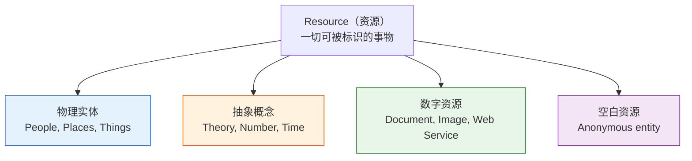
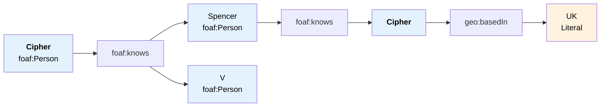

# 4.2 资源、谓词与三元组图

本节深入探讨 RDF 数据模型的核心构件：资源（Resource）、谓词（Predicate）和三元组（Triple），以及它们如何组合形成 RDF 图结构。

> **本节要点**：掌握 RDF 三元组的结构化表达方式，理解资源标识符在语义网中的角色，并能将现实世界的知识转化为 RDF 图。

---

## 1. RDF 资源（Resource）

在 RDF 数据模型中，**资源**（Resource）是指任何可以用 URI 标识的事物。这包括但不限于：

- **物理实体**：如人物（爱因斯坦）、地点（北京）、物体（一本书）
- **抽象概念**：如理论（相对论）、数字（圆周率）
- **虚拟实体**：如网页文档、数字图像、Web Service



### 1.1 资源标识的类型

在 RDF 中，资源可以通过三种不同的方式表示：

| 类型 | 语法 | 示例 | 说明 |
| --- | --- | --- | --- |
| **绝对 IRI** | 完整的统一资源标识符 | `<http://dbpedia.org/resource/Paris>` | 指向全球唯一资源 |
| **相对 IRI** | 相对于基础 URI 的路径 | `<person/Albert_Einstein>` | 需在命名空间上下文中解析 |
| **Blank Node** | 使用 `_:` 前缀 | `_:b0` | 匿名资源，无全局标识符 |

### 1.2 字面量（Literal）

并非所有的 RDF 客体都是资源。**字面量**表示简单的值，如字符串、数字、日期等，不能进一步分解为其他资源：

```turtle
# 字面量可以是普通的字符串
:Person1 rdfs:label "Albert Einstein" .

# 字面量可以关联语言标签（用于多语言支持）
:Person1 rdfs:label "Albert Einstein"@en .
:Person1 rdfs:label "阿尔伯特·爱因斯坦"@zh .

# 字面量可以有数据类型
:Person1 :birthDate "1879-03-14"^^xsd:date .
:Person1 :hasIQ 195^^xsd:integer .
```

---

## 2. 三元组：RDF 基本单位

**三元组**（Triple）是 RDF 数据的最小知识单位，由**主体—谓词—客体**三部分组成：

| 组件 | RDF 术语 | 可能的值类型 | 示例 |
| --- | --- | --- | --- |
| **主体**（Subject） | 主语 | 必须是绝对/相对 IRI 或 Blank Node | `:Alice` |
| **谓词**（Predicate） | 谓语/关系 | **必须**是绝对/相对 IRI | `:knows` |
| **客体**（Object） | 宾语 | IRI、Blank Node、或 Literal | `:Bob`, `"Alice"^^xsd:string` |

### 2.1 三元组语法表示

RDF 三元组可以用以下几种方式表示：

| 表示法 | 示例 | 说明 |
| --- | --- | --- |
| **自然语言句子** | Alice 认识 Bob | 人类可读格式 |
| **三元组列表** | (Alice, knows, Bob) | 理论抽象格式 |
| **Turtle 语法** | `:Alice :knows :Bob .` | 序列化格式 |
| **N-Triples** | `<alice> <knows> <bob> .` | 单条记录格式 |
| **图形表示** | Alice ── knows ──→ Bob | 可视化的图形格式 |

### 2.2 三元组示例库

| 语义描述 | IRI 三元组 | 解释 |
| --- | --- | --- |
| 爱因斯坦写了相对论 | `:Einstein :authoredTheory :TheoryOfRelativity` | 对象与对象的关系 |
| 爱丽丝出生于德国 | `:Alice :bornIn :Germany` | 实体与实体的地理关系 |
| 爱丽丝年龄35岁 | `:Alice :age 35^^xsd:integer` | 实体与字面量的关系 |
| 爱丽丝使用Python | `:Alice :languages "Python"@en` | 实体与多语言字符串 |

---

## 3. RDF 命名空间与缩写

### 3.1 为什么使用命名空间？

IRI 通常很长，如：

```
http://www.w3.org/1999/02/22-rdf-syntax-ns#type
```

通过定义**命名空间前缀**，可以将其缩写：

```turtle
@prefix rdf: <http://www.w3.org/1999/02/22-rdf-syntax-ns#> .
@prefix rdfs: <http://www.w3.org/2000/01/rdf-schema#> .
@prefix ex: <http://example.org/> .

# 使用缩写：
ex:Alice rdf:type ex:Person .
ex:Alice rdfs:label "Alice"@en .
```

### 3.2 Turtle 中的省略主体

Turtle 语法提供了两种重要的简写方式：

| 简化方式 | 示例 | 展开后的等价表达 |
| --- | --- | --- |
| **省略主体** | `:Bob rdf:type :Person ;` <br/>`    :knows :Carol .` | `:Bob rdf:type :Person` 和 `:Bob :knows :Carol` |
| **省略谓词** | `:Bob, :Carol rdf:type :Person .` | `:Bob rdf:type :Person` 和 `:Carol rdf:type :Person` |

这些简写极大地提高了 RDF 代码的可读性和书写效率：

```turtle
# 使用 ';' 和 ',' 简化
@prefix foaf: <http://xmlns.com/foaf/0.1/> .

:Jane
    a foaf:Person ;
    foaf:name "Jane Smith" ;
    foaf:mbox <mailto:jane@example.org> ;
    foaf:knows :John, :Alice .
    # 展开后为四个独立三元组：
    # 1. :Jane rdf:type foaf:Person
    # 2. :Jane foaf:name "Jane Smith"
    # 3. :Jane foaf:mbox <mailto:jane@example.org>
    # 4. :Jane foaf:knows :John
    # 5. :Jane foaf:knows :Alice
```

---

## 4. RDF 图：三元组的组合

RDF 的核心洞察是：**所有三元组组合在一起就是一个有向图**。

### 4.1 RDF 图的组成元素

| 图论概念 | RDF 对应 | 描述 |
| --- | --- | --- |
| **节点**（Node） | 主体、客体 | 资源或字面量 |
| **边**（Edge / 弧） | 谓词 | 连接主体到客体的关系 |
| **标签**（Label） | 谓词 IRI | 每条边上标有谓词的名称 |

### 4.2 图结构示例

以"人物关系"知识为例，多个三元组组合为一个 RDF 图：

```turtle
@prefix foaf: <http://xmlns.com/foaf/0.1/> .
@prefix geo: <http://www.georonners.net/geo#> .

:Cipher
    a foaf:Person ;
    foaf:name "Cipher" ;
    foaf:knows :Spencer ;
    foaf:knows :V ;
    geo:basedIn :UK .

:Spencer
    a foaf:Person ;
    foaf:name "Spencer" ;
    foaf:knows :Cipher .

:V
    a foaf:Person ;
    foaf:name "V" .
```

对应的 RDF 图可视化：



---

## 5. 现实世界知识到 RDF 图的转换

### 5.1 转换步骤

| 步骤 | 说明 | 示例 |
| --- | --- | --- |
| **① 识别资源** | 从领域描述中提取核心实体 | "上海"、"北京大学"、"AI" |
| **② 识别谓词** | 定义实体间关系和属性 | `位于`, `毕业于`, `研究领域` |
| **③ 确定客体** | 为每个谓词选择适当的客体（资源或字面量） | `上海 ──位于──→ China` |
| **④ 创建命名空间** | 选择合适的 vocabularies | DBpedia, Schema.org, 或自定义前缀 |
| **⑤ 编写三元组** | 用序列化语法写出 RDF 数据 | Turtle 或 N-Triples 格式 |

### 5.2 综合示例：大学教师信息

将一段自然语言信息转换为 RDF 数据：

**原始信息**：
> "王教授是北京大学的教授，研究人工智能方向。他有一个研究生叫小李，住在海淀区。王教授的兴趣标签是'语义网'。"

**RDF 转换**：

```turtle
@prefix schema: <http://schema.org/> .
@prefix ex: <http://example.org/> .
@prefix geo: <http://www.w3.org/2003/01/geo/wgs84_pos#> .

# 1. 王教授是一个教师
ex:ProfessorWang
    a schema:Professor ;
    schema:worksAt ex:PekingUniversity ;
    schema:researchField ex:AI .

# 2. 北京大学是一个机构
ex:PekingUniversity
    a schema:CollegeOrUniversity ;
    schema:name "北京大学"@zh ;
    geo:loc ex:Beijing .

# 3. 小李是研究生
ex:Li
    a schema:Student ;
    schema:academicAdvisor ex:ProfessorWang .

# 4. 小李住在海淀区
ex:Li
    schema:homeLocation ex:HaidianDistrict ;
    schema:subjectCodingMethod "语义网"@zh .

# 5. 海淀区在北京
ex:HaidianDistrict schema:containedPlace ex:Beijing .

# 6. AI 是研究领域的实例
ex:AI a schema:DefinedTerm ;
    schema:name "人工智能"@zh ;
    schema:alternateName "AI"@en .
```

这个示例生成的 RDF 图：

```mermaid
graph TD
    WP["ProfessorWang<br/>(Professor)"] --> wf["worksAt"]
    wf --> PKU["PekingUniversity<br/>(CollegeOrUniversity)"]
    
    WP --> rf["researchField"]
    rf --> AI["AI"]
    
    WP --> aa["academicAdvisor"]
    aa --> Li["Li<br/>(Student)"]
    
    Li --> hl["homeLocation"]
    hl --> HD["HaidianDistrict"]
    
    Li --> sn["subjectCodingMethod"]
    sn --> "语义网"@zh
    
    HD --> cp["containedPlace"]
    cp --> BJ["Beijing"]
    
    PKU --> nm["name"]
    nm --> "北京大学"@zh

    style WP fill:#42a5f5,color:#fff
    style Li fill:#66bb6a,color:#fff
    style PKU fill:#ffa726,color:#fff
    style HD fill:#ab47bc,color:#fff
    style AI fill:#26c6da,color:#fff
```

---

## 6. RDF 图的语义

RDF 图中的三元组共享一个**全局语义解释**——即图中的所有节点和边共同构成一个对某个世界状态（World State）的描述。

### 6.1 RDF 图的解释

给定一个 RDF 图 G，我们可以将其语义解释为：

| 元素 | 语义含义 |
| --- | --- |
| `<s> <p> o .` | "实体 s 具有属性 p，其值为 o" |
| 存在从 S 到 O 的 `p` 边 | S 和 O 之间存在某种语义关联 |

### 6.2 图的连通性

RDF 图可以分为两类：

| 类型 | 描述 | 示例 |
| --- | --- | --- |
| **连通图**（Connected） | 所有三元组的资源通过谓词边可相互可达 | 完整的知识图谱 |
| **非连通图**（Disconnected） | 存在孤立的子图组，无法相互访问 | 分散的数据集 |

---

## 7. 小结

本节的核心内容：

1. **资源**是 RDF 的基本描述对象，可以是物理实体、抽象概念或虚拟对象
2. **字面量**表示不可再分的简单值（字符串、数字、日期等）
3. **三元组**（主体、谓词、客体）是 RDF 的最小表达单位
4. **命名空间**是表示长 IRIs 的标准缩写机制
5. **RDF 图**是所有三元组组合而成的有向标号图
6. 现实世界的知识可以通过系统化的方式**映射**为 RDF 三元组集

---

## 8. 延伸阅读

| 资源 | 作者 | 链接 |
| --- | --- | --- |
| RDF 1.1 Concepts | W3C | [TR/rdf11-concepts](https://www.w3.org/TR/rdf11-concepts/) |
| RDF Semantics | W3C | [TR/rdf11-mt/](https://www.w3.org/TR/rdf11-mt/) |
| Turtle — TURTLE Target Turtle | Dave Becket | [TURTLE](https://www.w3.org/TeamSubmission/turtle/) |
| RDF View of the Web | W3C | [rdf-view](https://www.w3.org/TR/swah-rdf/) |

---

## 9. 本节练习

### 练习 1：提取三元组

从以下句子中提取所有 RDF 三元组：

> "图灵（Alan Turing）是计算机科学的奠基人之一，出生于英国伦敦。他的主要研究方向是密码学和人工智能。图灵的计算机寿命是 41 年。"

请列出所有三元组，注明主体、谓词和客体类型（IRI 或 Literal）。

### 练习 2：设计命名空间

如果你要描述一个"开源软件"领域的数据，你会为以下资源设计哪些命名空间前缀？

- 项目名称
- 编程语言
- 许可证类型
- 创建者
- 代码仓库地址

### 练习 3：转换练习

将一个学生的"成绩单信息"转换为 RDF 三元组。需要包含以下信息：学生姓名、学号、课程名、分数、学期、教授。

---

> **下一章**：[4.3 RDF 1.1 标准详解](./03-rdf11-standard.md) — 深入学习 RDF 1.1 的语义模型、数据集和重新命名特性。