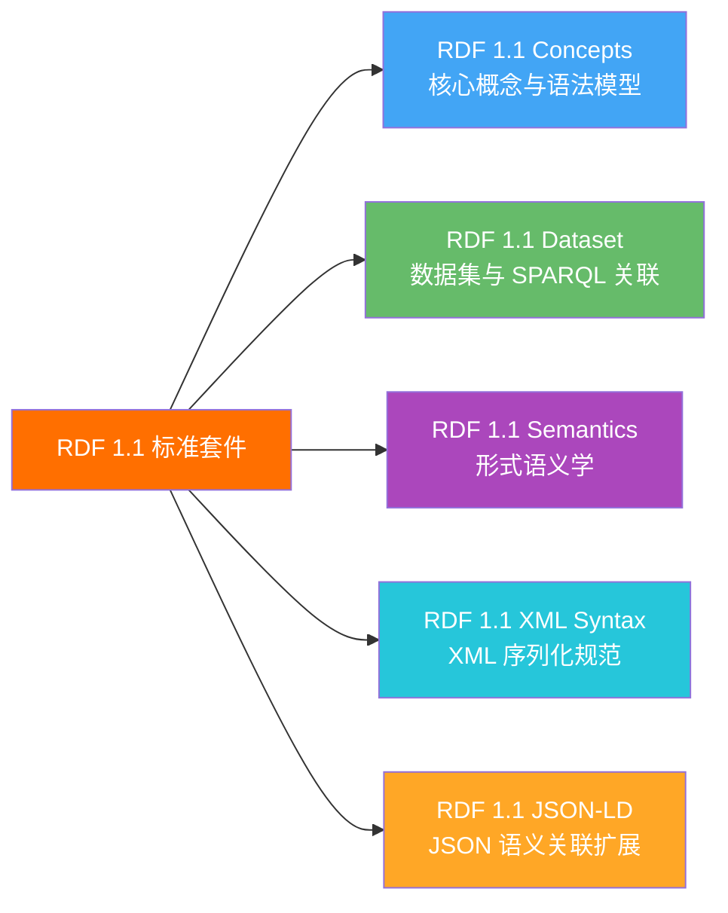
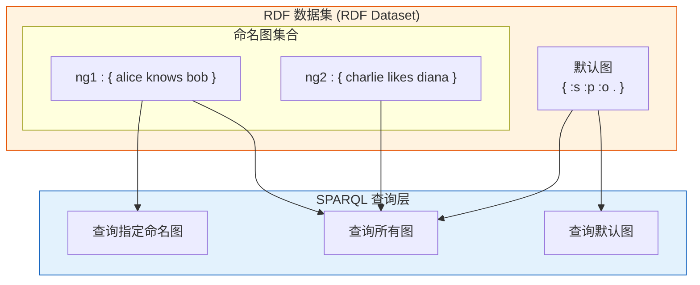
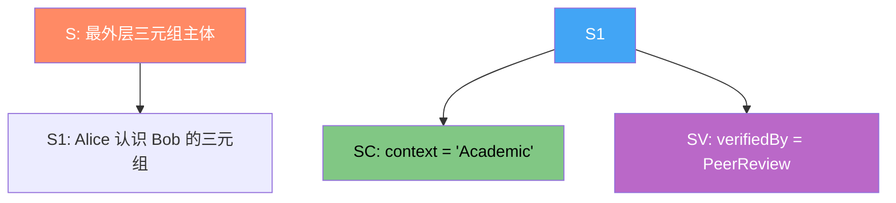
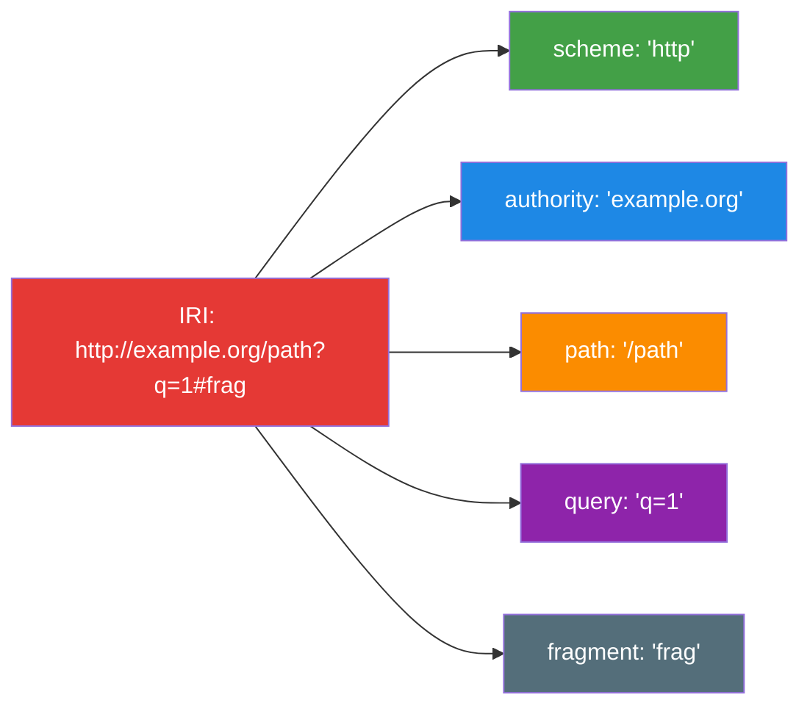

# 4.3 RDF 1.1 标准详解

本节深入探讨 W3C 发布的 RDF 1.1 标准的核心概念，包括 RDF 语义模型、RDF 数据集、重新命名（Reification）扩展，以及 RDF-Star 等新兴社区规范。

> **本节要点**：理解 RDF 1.1 的形式语义、RDF 数据集在 SPARQL 查询中的应用，以及重新命名（三元组属性的标准化表达）。

---

## 1. RDF 1.1 标准概览

| 版本 | 发布日期 | 状态 | 核心更新 |
| --- | --- | --- | --- |
| **RDF 1.0** | 2004 年 2 月 | W3C Recommendation | 确立了核心三元组图模型和 Turtle、RDF/XML 语法 |
| **RDF 1.1** | 2014 年 1 月 | W3C Recommendation | 新增了 JSON-LD 支持、重新命名扩展、IPE（IRI 的伪扩展属性） |
| **RDF-STAR** | 进行中 | W3C Community Group Report | 对三元组的三元组（Tripple about a Triple）——N-TRIPLES 的增强标准提案 |

### 1.1 RDF 1.1 核心规范集合

RDF 1.1 不是一个单一文档，而是由多个 W3C 建议书组成的套件：



---

## 2. RDF 语义模型（Semantics）

RDF 语义模型定义了一个 RDF 图的"意义"——它如何映射到一个世界状态（A Model）。

### 2.1 最小模型（Minimal Model）与解释（Interpretation）

RDF 语义的核心定义：

| 概念 | 含义 |
| --- | --- |
| **RDF 解释** | 一个将 RDF 图中的 IRI 映射到"谓词解释域"，并将字面量映射到字面量域的过程 |
| **RDF 模型** | 一个满足某个 RDF 图所有断言的最小解释 |
| **蕴含（Entailment）** | 若图 G1 的每个模型都是 G2 的模型，则 G1 蕴含 G2 |

### 2.2 标准蕴含（Straight Entailment）

两个 RDF 图 G1 和 G2 存在标准蕴含关系，如果：

```
G1 = { <a> <p> <b> . }
G2 = { <a> <p> <b> . , <c> <q> <d> . }
```

则 **G1 ⊧ G2**（G1 蕴含 G2），因为 G2 中的所有三元组在 G1 中都有对应。

### 2.3 重命名蕴含（Renaming Entailment）

RDF 解释允许 IRI 重命名，只要保持一致性。例如：

```turtle
# G1
@prefix ex: <http://example.org/> .
ex:Alice ex:knows ex:Bob .

# G2
@prefix foo: <http://foo.example.org/> .
foo:Alice foo:knows foo:Bob .
```

如果将 `ex:` 与 `foo:` 解释到相同的谓词域，则 G1 和 G2 是**重命名等价**的。这赋予了 RDF 数据极大的灵活性。

---

## 3. RDF 数据集（RDF Dataset）

RDF 数据集是 RDF 1.1 引入的关键扩展，主要服务于 SPARQL 查询处理。

### 3.1 RDF 数据集的组成

一个 RDF 数据集由**一个默认图**和**零个或多个命名图**组成：

| 组件 | 描述 | 用途 |
| --- | --- | --- |
| **默认图**（Default Graph） | 不含命名的 RDF 三元组图 | SPARQL `SELECT` 查询的主要操作对象 |
| **命名图**（Named Graphs） | 带有 IRI 标记的 RDF 三元组图 | SPARQL `FROM NAMED` / `GRAPH` 查询 |

### 3.2 RDF 数据集与 SPARQL 的映射关系

```turtle
# Dataset: DS
# Default Graph:
{ :s :p :o . }

# Named Graph NG1:
GRAPH <http://example.org/ng1> { :alice :knows :bob . }
```

SPARQL 查询如何操作 RDF 数据集：

```sparql
# 查询 1：仅查询默认图
SELECT ?s ?p ?o
WHERE { ?s ?p ?o }

# 查询 2：查询所有图（默认 + 所有命名图）
SELECT ?s ?p ?o
WHERE GRAPH ?g { ?s ?p ?o }

# 查询 3：仅查询特定命名图
SELECT ?s ?p ?o
WHERE {
  GRAPH <http://example.org/ng1> { ?s ?p ?o }
}
```

### 3.3 命名图的数据来源示意



---

## 4. 重新命名（Reification）与 RDF-STAR

重新命名是 RDF 中表示"关于语句的语句"（a statement about a statement）的能力。这是语义网中非常重要的概念。

### 4.1 传统的 Reification 方式

在 RDF 1.0 中，若要表达"Cipher 声称 Alice 是教授，置信度为 0.8"，需要：

```turtle
@prefix doap: <http://usefulinc.com/ns/doap#> .
@prefix reif: <http://example.org/reif/> .

# 创建唯一引用
_:statement1
    a doap:Creator ;
    doap:name "Cipher" .
```

这被称为 **n-ary 关系** 模式，但写法冗长：

```turtle
@prefix ex: <http://example.org/> .
@prefix foaf: <http://xmlns.com/foaf/0.1/> .

# "Cipher says Alice is a professor" — 传统 Reification
ex:claim1
    a ex:Claim ;
    ex:assertedBy :Cipher ;
    ex:assertsContent [
        a foaf:Person ;
        foaf:name "Alice" ;
        foaf:madeByEngine ex:ReasonerA .
    ] ;
    ex:confidence "0.8"^^xsd:double .
```

### 4.2 RDF-STAR：更优雅的解决方案

**RDF-STAR**（RDF Statements about Triples about a Triple）是一种社区提案，直接在图语法中表示三元组的属性。

语法示例：`(<s> <p> <o>) <p2> <o2>`

```turtle
@prefix foaf: <http://xmlns.com/foaf/0.1/> .
@prefix schema: <http://schema.org/> .

# RDF-STAR：三元组 <s> <p> <o> 可以带谓词
(<:Alice> <:isA> <:Professor>)
    schema:confidence 0.9 ;
    schema:confidenceSource :ReasonerA .
```

与传统的 Reification 对比：

| 特性 | 传统 RDF Reification | RDF-STAR |
| --- | --- | --- |
| **语法复杂度** | 高（需创建 URI + Property） | 低（使用 `()` 包裹三元组） |
| **可读性** | 较低 | 高 |
| **查询表达力** | 受限（需 SPARQL Extension） | 原生支持（SPARQL-STAR 提案中） |
| **W3C 标准状态** | 非标准但有广泛实践 | 正在向 W3C Community Group 推进 |
| **工具支持** | Nemo, Jena, Ontop 部分支持 | 实验性（Ontop、BaseX 支持） |

### 4.3 RDF-STAR 语法详细示例

RDF-STAR 支持嵌套的重新命名：

```turtle
@prefix foaf: <http://xmlns.com/foaf/0.1/> .
@prefix schema: <http://schema.org/> .
@prefix : <http://example.org/> .

# 嵌套：关于一个重新命名的重新命名
((<:Alice> <:knows> <:Bob>)
    schema:context "Academic" .)
    schema:verifiedBy :PeerReview .
    
# 嵌套展开：
# 1. <:Alice <:knows> <:Bob>
# 2. (1) schema:context "Academic"
# 3. (2) schema:verifiedBy :PeerReview
```

### 4.4 嵌套三元组的语义关系示意图



---

## 5. IRI 解析规则

IRI（Internationalized Resource Identifier）是 RDF 1.1 中的核心术语。IRI 的解析规则由 **RFC 3987** 定义。

### 5.1 IRI 组成部分



### 5.2 Base IRI 解析

在 RDF 中，相对 IRI 必须基于 **Base IRI** 进行解析。

| 相对 IRI | Base IRI | 解析后的绝对 IRI |
| --- | --- | --- |
| `person/Alice` | `http://example.org/data/` | `http://example.org/data/person/Alice` |
| `../resource/Bob` | `http://example.org/data/person/` | `http://example.org/resource/Bob` |
| `#section` | `http://example.org/doc#` | `http://example.org/doc#section` |

解析规则（RFC 3987）：
- **同目录**：追加路径段
- **`../`**：上升到上级目录
- **以 `#` 开头**：仅替换片段

---

## 6. RDF 图等价性与规范形式

### 6.1 RDF 图等价定义

两个 RDF 图 G1 和 G2 是**等价的**，当且仅当：
1. 它们具有相同数量的三元组
2. 每个三元组的主体、谓词、客体都一一对应

### 6.2 规范 RDF 图

在 RDF 处理中，常需要将等价图进行排序（Normalization），以获得"规范形式"（Canonical Form）：

| 排序规则 | 说明 |
| --- | --- |
| 按主体的 IRI 字典序排序 | 首先按主体分组 |
| 主体相同则按谓词排序 | 其次按谓词字典序 |
| 谓词相同则按客体排序 | 最后按客体排序 |

规范化后的图可用于：
- **数据去重**
- **图哈希比较**
- **版本控制对比**

---

## 7. 小结

本节的核心要点：

1. **RDF 1.1 核心规范**涵盖概念、数据集、语义、XML 序列化与 JSON-LD
2. **RDF 语义模型**基于最小模型与解释，定义了图间蕴含关系
3. **RDF 数据集**由默认图 + 命名图组成，与 SPARQL 查询紧密相关
4. **重新命名**是描述"关于语句的语句"，RDF-STAR 提供了比传统 n-ary 方式更优雅的语法
5. **IRI**遵循 RFC 3987，支持相对 IRI 的 Base 解析
6. **图的规范形式**可用于去重、哈希比对与版本控制

---

## 8. 延伸阅读

| 资源 | 作者 | 链接 |
| --- | --- | --- |
| RDF 1.1 Semantics | W3C | [TR/rdf11-mt](https://www.w3.org/TR/rdf11-mt/) |
| RDF Dataset | W3C | [TR/rdf11-datasets/](https://www.w3.org/TR/rdf11-datasets/) |
| RDF-STAR Community Group Report | W3C CG | [rdf-star-cg-report](https://www.w3.org/2023/02/rdf-star-cg-report/) |
| IRI Standard (RFC 3987) | IETF | [RFC 3987](https://www.rfc-editor.org/rfc/rfc3987) |

---

## 9. 本节练习

### 练习 1：识别蕴含关系

判断以下每对 RDF 图之间是否存在标准蕴含关系：

```turtle
# G1
@prefix ex: <http://example.org/> .
ex:Alice ex:knows ex:Bob .
```

```turtle
# G2
@prefix foo: <http://foo.example.org/> .
foo:Alice foo:knows foo:Bob .
foo:Alice foo:age 30 .
```

请说明 G1 是否蕴含 G2、G2 是否蕴含 G1，或是否相互等价，或无蕴含关系。

### 练习 2：RDF-STAR 转换

将以下传统 RDF Reification 转换为 RDF-STAR 语法：

```turtle
@prefix ex: <http://example.org/> .

ex:claim1
    a ex:Claim ;
    ex:assertedBy ex:Cipher ;
    ex:assertsContent [
        a ex:Person ;
        ex:name "Alice" ;
    ] ;
    ex:confidence "0.8"^^xsd:double .
```

### 练习 3：IRI 解析

将以下相对 IRI 基于 `http://knowledge.graph/dataset/2024/` 解析为绝对 IRI：
- `../2025/people.rdf`
- `../classes/math.ttl`
- `#author`