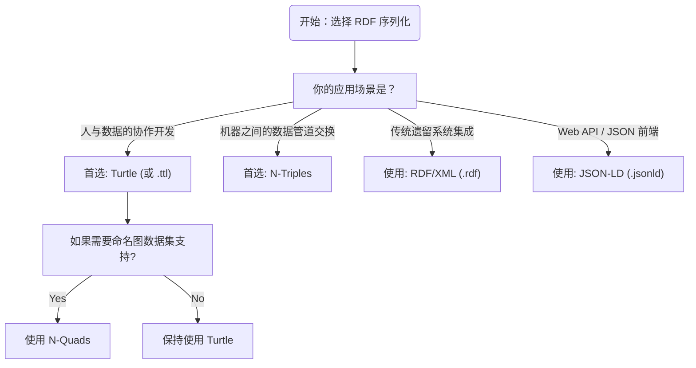

# 5.1 RDF 序列化格式概览

本章将系统介绍用于表达 RDF 数据的几种主要**序列化格式（Serialization Formats）**。虽然它们在底层的语义（即 RDF 图模型和三元组组成）上是完全等价的，但语法结构、可读性和性能侧重各有不同。

> **本节要点**：理解“RDF 数据模型”与“序列化格式”的区别；熟悉 Turtle、RDF/XML、N-Triples 及 JSON-LD 等格式的核心差异与应用场景。

---

## 1. 为什么要有多重序列化格式？

在 RDF 1.1 标准下，任何 RDF 数据都可以在不改变底层知识表示的前提下，通过多种文本语法或二进制格式进行流转。**不同的序列化语法**主要解决了以下几种需求：

1. **机器可读性**（机器可读、高性能）：适合在系统间快速传递或入库检索。
2. **人类可读性**（易编写、易调试）：支持开发人员和领域专家高效编写和审查知识图谱的数据。
3. **原生系统交互**（与 JSON/XML 生态交互）：无缝嵌入 RESTful Web 开发或现有数据管理系统。

---

## 2. 主流 RDF 序列化语法对比

### 2.1 格式分类图

| 格式简称 | 全称 | 类型 | 人类可读 | 基于的语言 |
| --- | --- | --- | --- | --- |
| **Turtle** | Turtle Terse Triple Compound Literals | 文本格式 | ★★★★ | 自创（衍生自 N-Triples） |
| **N-Triples** | N-Triples | 文本格式 | ★★ | 自创 |
| **N-Quads** | N-Quads | 文本格式 | ★★ | 自创（N-Triples 扩展） |
| **RDF/XML** | RDF XML Syntax | XML 格式 | ★ | XML（W3C 早期标准） |
| **JSON-LD** | JSON for Linking Data | JSON 格式 | ★★★ | JSON（W3C 推荐） |

### 2.2 核心特性对比表

| 特性 | Turtle | RDF/XML | N-Triples | JSON-LD |
| --- | --- | --- | --- | --- |
| **支持前缀缩写** | ✅ | ❌ (通常需全称 IRI) | ❌ | ✅ |
| **三元组紧凑性** | ⭐⭐⭐⭐ (极高) | ⭐⭐ (较低) | ⭐ (极低) | ⭐⭐ |
| **默认支持 Blank Node** | ✅ 使用 `_:b0` | ✅ (隐式 `<rdf:Description>`) | ✅ `_:b0` | ✅ `"@id": "_:b0"` |
| **命名图支持** | ✅ `GRAPH {}` | ❌ | ✅ (含第四个 IRI 字段) | 通过 `@graph` 实现 |
| **在 Web 应用的广泛性** | ⭐⭐⭐⭐ | ⭐⭐ | ⭐ | ⭐⭐⭐⭐ (语义网与 SPA 框架) |

---

## 3. 各序列化格式详解

### 3.1 Turtle 语法：当前事实上的行业主流

Turtle 是最广泛使用的 RDF 格式。它引入了类似 Python 的缩进逻辑，以及大量的省略语法（分号与逗号）。

```turtle
@prefix ex: <http://example.org/> .

ex:Alice
    a ex:Person ; 
    ex:name "Alice" .
    
ex:Bob
    a ex:Person ;
    ex:knows ex:Alice .
```

### 3.2 N-Triples 语法：简单与标准化的“通用语”

**N-Triples** 采用极其严格的逐行三元组表达，绝不使用缩写或复合语句。每个三元组占单独一行，且主体和客体必须使用绝对 IRI。这种“笨重”的特点是它成为最完美的系统交换格式（因为语法解析开销极小）。

```ntriples
<http://example.org/Alice> <http://www.w3.org/1999/02/22-rdf-syntax-ns#type> <http://example.org/Person> .
<http://example.org/Alice> <http://example.org/name> "Alice" .
<http://example.org/Bo> <http://example.org/knows> <http://example.org/Alice> .
```
注意：在 N-Triples 里，绝对 IRI 是强制的，而且不能混用前缀缩写 (`ex:`)。

### 3.3 N-Quads 语法：带有第四字段的数据集格式

N-Quads 继承了 N-Triples 的行式结构，但增加一个字段来支持**Named Graph（命名图）**：

```nquads
<http://example.org/Cipher> <http://xmlns.com/foaf/0.1/name> "Cipher" <http://data.moviegraph.org/film1> .
```

四元组解析为：
| Subject | Predicate | Object | Graph Name (Context) |
| --- | --- | --- | --- |
| `<.../Cipher>` | `<.../name>` | `"Cipher"` | `<.../film1>` |

### 3.4 RDF/XML：W3C 的历史遗产

RDF/XML 是最早诞生的 RDF 语法标准（基于 W3C 早期 XML 标准）。由于其极其复杂的嵌套结构与极差的人类可读性，在当前的实践开发中，RDF/XML 逐渐被废弃，但在许多老系统（如某些遗留数据库和大型知识图谱系统）中仍占据重要地位。

```xml
<rdf:RDF
    xmlns:rdf="http://www.w3.org/1999/02/22-rdf-syntax-ns#"
    xmlns:ex="http://example.org/">
  <rdf:Description rdf:about="http://example.org/Alice">
    <rdf:type rdf:resource="http://example.org/Person"/>
    <ex:name>Alice</ex:name>
  </rdf:Description>
</rdf:RDF>
```

### 3.5 JSON-LD 语法：语义网与 Web 开发的最佳桥梁

为了拉近 RDF 生态与现代 REST/JSON Web 技术的距离，W3C 推出了 **JSON for Linking Data (JSON-LD)**。它在保留 JSON 原生嵌套优势的基础上，引入了 `@context`（上下文定义）和 `@id`（节点标识符）。

```json
{
  "@context": {
    "ex": "http://example.org/",
    "vocab": "http://example.org/vocab#",
    "a": "vocab:type"
  },
  "@graph": [
    {
      "@id": "ex:Alice",
      "a": "ex:Person",
      "ex:name": "Alice"
    },
    {
      "@id": "ex:Bob",
      "a": "ex:Person",
      "ex:knows": { "@id": "ex:Alice" }
    }
  ]
}
```

---

## 4. 序列化的选择策略

在实际项目中（无论是构建企业级知识库还是开源语义网数据项目），应该如何选择格式？

### 4.1 决策树流程图



### 4.2 经验法则

1. **通用场景首选 Turtle**：它是唯一兼顾高可读性、高数据密度（通过前缀缩写 `ex:s p o .`）和强大扩展能力（内置 SPARQL/Grap 等）的格式。
2. **大型分布式数据的基准传输格式**：选择 **N-Triples**。虽然数据体量大，但它的 `parse` 速度极快，且无歧义，最适合作为自动化流水线中的数据格式。
3. **API 集成首选 JSON-LD**：当需要和 React/Vue 或者后端 RESTful 服务结合时，直接透传 JSON-LD 能省去大量前端 JSON-to-RDF 的解析转换层。
---

## 5. 小结

本节的内容归纳如下：

1. 多种序列化格式存在的原因是为**不同的生态系统和使用场景**提供兼容（如人类友好、机器高效处理及原生 Web 嵌入）。
2. **Turtle** 凭借其丰富的语法特性和出色的表现，已成为当代知识图谱领域编写 RDF 的“事实标准”（Default choice）。
3. **N-Triples / N-Quads** 因其“笨重”的特性反而赋予了它们成为标准中间语言的独特价值。
4. **JSON-LD** 是打通语义网（Semantic Web）与现代 JSON 技术的桥梁。

---

## 6. 延伸阅读

| 资源名称 | 作者 | 参考链接 |
| --- | --- | --- |
| turtle 缩写语法规范 (W3C Submission) | Dave Beckett | [https://www.w3.org/TeamSubmission/turtle/](https://www.w3.org/TeamSubmission/turtle/) |
| N-Triples and N-Quads (W3C REC) | W3C Team | [https://www.w3.org/TR/n-triples/](https://www.w3.org/TR/n-triples/) |
| RDF 1.1 JSON-LD 语法规范 | W3C REC 2014 | [https://www.w3.org/TR/json-ld/](https://www.w3.org/TR/json-ld/) |
| Semantic Web for the Working Ontologist: Data Modeling in RDF | Dean Allemong | [Amazon Link](https://www.amazon.com/Semantic-Web-Working-Ontologist-Modeling/dp/1498743535) |

---

## 7. 本节练习

### 练习 1：数据密度观察

将以下 JSON-LD 的数据，在脑海中转化为等价的 Turtle 代码（不必写出全部，仅尝试预估代码行数的巨大差异）。理解“数据密度”的差异：

```json
{
  "@context": { "ex": "http://example.org/" },
  "@graph": [
    {
      "@id": "ex:A", "ex:val": 1
    },
    {
      "@id": "ex:B", "ex:val": 2, "ex:relatedTo": { "@id": "ex:A" }
    }
  ]
}
```

### 练习 2：IRI 绝对化改写

将如下简写 Turtle，改写为严格的 N-Triples 格式：
```turtle
@prefix foaf: <http://xmlns.com/foaf/0.1/> .

:alice foaf:name "Alice"@en .
```
*(提示：确保 N-Triples 的主体节点也是展开为绝对 IRI 路径)*

---

> **下一章**：我们将学习具体语法规则——[5.2 Turtle 语法详解](./02-turtle-syntax.md)，深入掌握 Turtle 语法的语法规范、前缀机制与缩写规则。