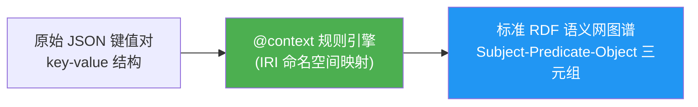

# 5.3 N-Quads 与 JSON-LD 语法

继上一章学习的 Turtle 语法之后，本节将探讨另外两种在语义网生态系统中占据核心地位的序列化格式：**N-Quads** 与 **JSON-LD**。它们分别代表了 RDF 数据在不同应用场景下的极端优化方向：N-Quads 侧重于数据集层面的无歧义结构化表达，而 JSON-LD 则旨在弥合传统 JSON Web API 与语义网 RDF 知识表示模型之间的鸿沟。

> **本节要点**：理解 N-Quads 中四元组的设计初衷、掌握 JSON-LD 上下文映射（Context Mapping）、理解两种语法在 RDF 图中的表达一致性。

---

## 1. N-Quads：数据集层面的三元组标准

如果说 N-Triples 是处理单张独立三元组图的标准语言，那么 N-Quads 则是为 **RDF 数据集 (RDF Dataset)** 设计的。正如我们曾在 `4.3 语义模型与数据集` 章节中讨论过的那样，RDF 不仅仅是单个图（Graph），更是一个包含**默认图**和多个**命名图**的组合体。

### 1.1 四元组的结构（Subject-Predicate-Object-GraphName）

N-Quads 继承了 N-Triples 的简洁基因，在每一行的末尾增加了一个可选的第四部分：**命名图（Named Graph）的名称**，或者 `<>` 代表默认图。

| 构成部分 | 规则 | 示例 |
| --- | --- | --- |
| **主体 (S)** | 必须为完整的绝对 IRI | `<http://example.org/alice>` |
| **谓词 (P)** | 必须为完整的绝对 IRI | `<http://xmlns.com/foaf/0.1/name>` |
| **客体 (O)** | 绝对 IRI, 空白节点 或 字面量 | `"Alice" , ` <http://example.org/bob> ` |
| **图名 (G)** (可选) | 空白节点 `_:b0` 或绝对 IRI；若为默认图则可省略 | `<http://example.org/default>`, `_:subgraph1` |

### 1.2 N-Quads 典型书写示例

以下是一个展示不同命名图隔离存储的 N-Quads 样本：

```nquads
# 在名为 <http://dbpedia.org> 的命名图中引入数据
<http://dbpedia.org/resource/Paris> <http://www.w3.org/2000/01/rdf-schema#label> "Paris"@fr <http://dbpedia.org> .
<http://dbpedia.org/resource/Lyon> <http://www.w3.org/1999/02/22-rdf-syntax-ns#type> <http://dbpedia.org/ontology/City> <http://dbpedia.org> .

# 匿名数据集内的空白节点图
<http://example.org/a> <http://example.org/knows> <http://example.org/b> _:subA .
<http://example.org/c> <http://example.org/says> _:randomNode _:subA .
```

**注意**：
1. N-Quads **不允许**使用任何前缀缩写（例如绝对 IRIs 不能写成 `dbpedia:resource/Paris`），必须完整展开。
2. 如果数据属于默认图，最后一项（Graph Name）完全可以不写，此时行为等价于 N-Triples。

### 1.3 为什么需要 N-Quads？

在现代知识图谱的 ETL (Extract-Transform-Load) 数据管道中，N-Quads 常被用作“中间通用语”：

* **解析高效且无歧义**：因为没有前缀缩写或复杂的 Turtle 嵌套规则，数据解析引擎处理 N-Quads 的速度极快，几乎等同于标准的 CSV 流式解析。
* **保留多视图结构**：在融合来自多个数据源（例如 DBpedia, Wikidata 等外部数据）的时候，N-Quads 天然保留了每一条数据源的原始出处信息（Statement/Named Graph Context），便于溯源和冲突处理。

---

## 2. JSON-LD：将语义网带入 JSON 生态

JSON-LD (JSON for Linking Data) 是 W3C 官方认可的 RDF 推荐序列化标准。它的核心目标是：**在不改变原有 JSON API 的基础上，赋予 JSON 数据明确的语义描述和网络链接能力。**

### 2.1 @context 核心机制

`@context` 是 JSON-LD 的“灵魂”。它定义了如何把一个普通的 JSON 对象映射（Transform）为 RDF 三元组。

**映射流程示意**：



### 2.2 实战示例：从 JSON 到 JSON-LD

假设有如下一段普通 JSON 表示人员：

```json
{
  "name": "Alice",
  "jobTitle": "Engineer",
  "location": "New York"
}
```

在 JSON-LD 中通过 `@context` 赋予其 RDF 意义：

```json
{
  "@context": {
    "name": "http://xmlns.com/foaf/0.1/name",
    "jobTitle": "http://schema.org/jobTitle",
    "location": {
      "@id": "http://schema.org/address",
      "@type": "@id"
    }
  },
  "name": "Alice",
  "jobTitle": "Ontology Engineer",
  "location": "http://dbpedia.org/resource/New_York_City"
}
```

在这个例子中：
1. 文本 `"Alice"` 会被映射到 RDF 谓词 `foaf:name` 的客体。
2. `location` 字段的值不仅表示指向 `schema:address`，更关键地通过 `"@type": "@id"` 告知解析引擎，该值是一个 URI 链接，应当被转为 RDF 图中的节点而非字符串文本。

---

## 3. JSON-LD 的三种核心概念解析

### 3.1 @id 与默认节点标识

与 N-Quads 不同，RDF 图中多个三元组可以通过同一主体相互连接。在 JSON 中，这意味着需要一个唯一的节点标识符。

```json
{
  "@id": "http://example.org/Alice",
  "@type": "foaf:Person",
  "foaf:name": "Alice"
}
```
这里，`@id` 明确告诉解析器：这个 JSON 对象代表全局资源 `<http://example.org/Alice>`。在同一个 JSON 文件中其他引用该 `@id` 的内容，将被作为同一条链条上的连续三元组拼接。

### 3.2 @type 与 RDF 类型

类似于 Turtle 中使用的 `a`（即 `rdf:type`），JSON-LD 使用 `@type`。在下面的代码块中，由于有 `@context` 预设了前缀缩写：

```json
{
  "@id": "_:b0",
  "@type": "schema:Book",
  "schema:name": "Pragmatic Teamware"
}
```
它将生成为：`_:b0 rdf:type schema:Book`。

另外，JSON-LD 中匿名节点可以使用 `"@id": "_:customName"` 进行隐式的 Blank Node 命名。

### 3.3 @graph：管理命名图与数据集

如同 N-Quads 一样，JSON-LD 原生支持**数据集结构**。通过在顶级键中加入 `@graph`，我们可以传递多个子图的混合数据：

```json
{
  "@context": { ... },
  "@graph": [
    {
      "@id": "ex:A", "ex:type": "Person", "ex:name": "Alice"
    },
    {
      "@id": "ex:B", "ex:type": "Person"
    }
  ]
}
```

---

## 4. Turtle vs JSON-LD 映射速查表

| RDF 概念 | Turtle 语法 | JSON-LD 语法 |
| --- | --- | --- |
| 声明主体身份 | `<http://ex/Alice>` 或者 `:Alice` | `"@id": "http://ex/Alice"` |
| 声明资源类型 | `rdf:type`, `a` | `"@type": "ex:Person"` |
| 描述属性及字面值 | `ex:label "Alice" .` | `"ex:label": "Alice"` |
| 指向外部资源链接 | `ex:knows <http://ex/Bob>` . | `"ex:knows": { "@id": "http://ex/Bob" }` |
| 嵌套的空白图集合 | （使用方括号语法表达空白节点） | 在对象数组 `[]` 或对象内包含 `@graph` |
| 数据类型声明 | `"2025-05-01"^^xsd:date` | `"@type": "xsd:date"` 或使用预定义 `@context` |
| 语言标签声明 | `"Bonjour"@fr` | `"@language": "fr"` 或在 JSON 键后通过值传递 |

---

## 5. 小结

| 序列格式 | 核心定位与特征 | 推荐应用场景 |
| --- | --- | --- |
| **N-Quads** | 无歧义的四元组数据流；保留命名图上下文关系 | 数据清洗 ETL, 大规模分布式数据分发，三元组的“机器通用语” |
| **JSON-LD** | 基于现代前端与互联网生态的 JSON 扩展语言。依赖 `@context` 上下文 | Web API 交互, 前后端无缝数据传输，前端渲染知识图谱组件 |

---

## 6. 延伸阅读

- [RDF 1.1 N-Quads 标准规范](https://www.w3.org/TR/n-quads/)
- [JSON-LD 1.1 语法规范 (W3C REC 2020)](https://www.w3.org/TR/json-ld11/)
- [JSON-LD Context 使用示例](https://json-ld.org/spec/context/)

---

## 7. 本节练习

### 练习 1：上下文映射改写
给定如下 JSON：
```json
{
    "title": "Hello",
    "link": "http://dbpedia.org/resource/Paris"
}
```
请尝试书写一个最小化的 JSON-LD `@context` 配置对象，使得它可以在转化为 RDF 时，属性名被重命名为 `foaf:title` 和 `foaf:homepage`，且保证 `link` 的值映射为一个 IRIs 节点而非字符串。

### 练习 2：N-Quads 解析
给定一行 N-Quads 数据：
```
<> <http://purl.org/dc/elements/1.1/title> "Semantic Web Basics"@en <http://example.org/default> .
```
请解析并说明：这行数据里的主体是什么类型的节点？客体包含哪些附加元信息？

---

> **下一章**：[5.4 数据校验：使用在线工具进行验证](./04-validation-exercise.md) — 我们将亲手验证 Turtle、JSON-LD 代码的正确性，并复习不同序列化格式的转换机制。