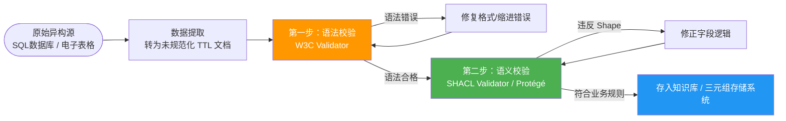

# 5.4 数据校验与工具实践：确保图谱质量

到目前为止，我们学习了 [`Turtle`](./02-turtle-syntax.md) 和 [`JSON-LD`](./03-n-quads-jsonld.md) 的优雅写法。然而，手动编写或收集大规模知识图谱数据时，极易出现语法错误、类型不一致或命名空间混淆等问题。因此，**数据校验（Data Validation）** 是构建可靠语义网络必不可少的技术环节。

> **本节要点**：了解 RDF 数据校验的重要性；掌握使用在线验证器和 SHACL 语法检查数据规范；理解验证在 ETL 管道中的应用。

---

## 1. 为什么语义网数据需要校验？

不同于常规的 JSON 或 XML 文档，RDF 强调跨域互联互通。当 `ex:ProjectA` 的数据与 `ex:ProjectB` 的数据需要进行三元组级别的合并时，以下数据质量危机将凸显：

| 问题类型 | 示例说明 |
| :--- | :--- |
| **语法错误 (Syntax Errors)** | 句末漏掉结束符号 `.` 导致无法被解析引擎处理 |
| **命名空间混乱 (Namespace Pollution)** | 混用不同的 IRI 命名风格（如 DBpedia 与 Wikidata 属性混用） |
| **类型不匹配 (Type Mismatch)** | 将 `date` 字段错误赋值为文本字符串，导致下游推理失败 |
| **非法链接 (Broken Links)** | Object 引用了根本不存在的全局 IRI，导致数据孤岛 |

---

## 2. 数据校验的工具链与实践方法

### 2.1 基础语法验证：W3C RDF 验证器

在开发初期的快速迭代阶段，我们最直观的工具是诸如 **Zazuko Query Editor** 或各类在线 RDF 验证站点。它们能实时高亮报错位置，帮助开发人员进行 `Turtle` 语法的排错调试。

使用在线工具的步骤如下：

1. 复制包含待测语法的文档（通常是 `docs/ch05-rdf-syntax/02-turtle-syntax.md` 中的代码段落）。
2. 打开验证工具并粘贴。
3. 工具会解析文档生成可视化的结构，或者明确报出红色语法提示行。

### 2.2 语义与业务规则验证：基于 SHACL

如果单纯是检查语法，验证器能确保数据“可读”；但如果需要确保数据“正确符合特定业务逻辑”，我们得引入 SHACL（Shape Constraint Language）规范。

关于如何构建验证 Shape，我们已经在前文中进行过介绍（参考 [`4.4 工具实践`](../ch04-rdf-data-model/04-practice-editor.md)）。简而言之，校验分为两步：

1. **提供 Data Store**：包含 `ex:Employee` 及其对应的 `ex:hasEmail` 和 `ex:jobTitle`。
2. **提供 Shape Store**：定义验证模板，例如要求所有的 `ex:Employee` 必须拥有 `ex:hasEmail`，并且 `ex:hasEmail` 必须是有效的 `xsd:string` 且满足格式要求。

---

## 3. 校验工作流示例：从原始数据到合格图谱数据

想象一个典型的 ETL（Extract, Transform, Load）场景：



---

## 4. JSON-LD 特有的验证维度：上下文完整性

对于通过 [`JSON-LD`](./03-n-quads-jsonld.md) 交互的系统，除了检查语法合规，另一个关键的验证指标是**上下文完整性**。如果 API 传输过程中意外丢失了 `@context`，原本的 JSON 文件将退化成一堆无法确定含义的键值对。因此，在生产环境的验证机制中，通常会内置“键名到 IRI 的映射逻辑校验”以进行二次兜底保障。

---

## 5. 小结

1. RDF 数据的价值高度依赖于**语法正确性**与**语义规范性**，因此不可或缺验证环节。
2. **在线工具**是发现并修复格式错误的最佳快速手段，适合高频修改时的日常排错。
3. 面对复杂数据融合体系，引入 **SHACL** 规范建立约束形状，能够确保跨系统数据在对接时的一致性。

---

## 6. 延伸阅读

- [W3C RDF Validation](https://validator.w3.org/trign-rdf/)：支持 N-Triples, Turtle 等格式的即时语法检验平台。
- [SHACL Playground](https://shacl-playground.martindbraun.de/)：支持在线编写 `SHACL` Shape 校验规则与数据集，实时查看符合率报告的优秀工具。
- [`4.4 工具实践：在线 RDF 编辑器`](../ch04-rdf-data-model/04-practice-editor.md)：了解如何使用编辑器生成符合 SHACL 规范的数据流结构。

---

## 7. 本节练习

### 练习 1：基础排错

阅读下面存在明显错误的 [`Turtle`](./02-turtle-syntax.md) 文档片段，列举出至少两个具体的语法违规点，并给出修正后的代码：

```turtle
@prefix ex: <http://example.org/> .
@prefix schema: <http://schema.org/> .
@prefix rdfs: <http://www.w3.org/2000/01/rdf-schema#> . 

ex:Alice rdfs:label "Alice"
    ex:knows ex:Bob, ex:Carol. 
```

### 练习 2：上下文设计

在设计一款电商应用的商品信息流转 API 时，我们需要传输如下关键属性：商品名 `name`、价格 `price`、以及所属品类的链接 `category`（指向外部知识库如 Wikidata 的链接 ID）。

请为该产品设计一套符合标准要求的 `@context` JSON-LD 规范，并解释：如果缺失了这份 `@context` 文件，下游接收方在语义理解上会失去哪些能力？

### 练习 3：多源融合思考

在知识融合（Knowledge Graph Merging）的实践中，我们经常会同时处理 N-Triples 和 N-Quads。
思考并回答：在利用不同命名图（Named Graphs）追踪多个源数据录入者的背景环境下，选择 N-Quads 还是纯 RDF/XML 进行中间格式传递？为什么 N-Quads 更契合校验机制中的溯源需求？

---

> **下一章**：开启第 6 章 [RDFS 核心机制](../ch06-rdfs-core/index.md)——学习如何利用基础词汇表建立严谨的分类系统和层次关系，为后续深入学习OWL本体奠定基石。
