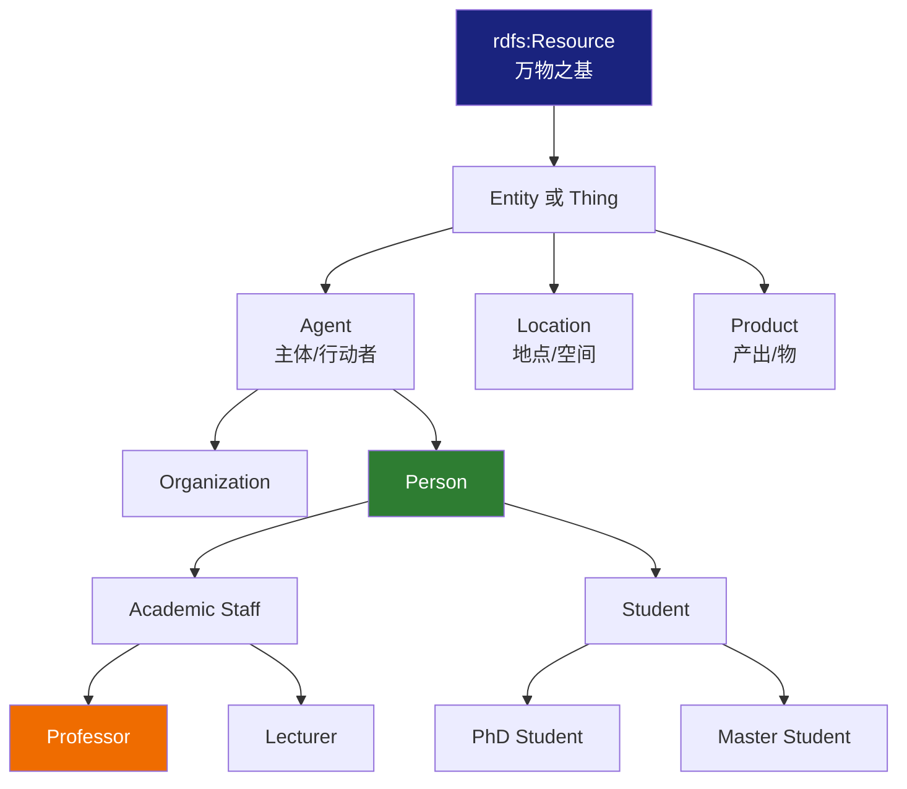
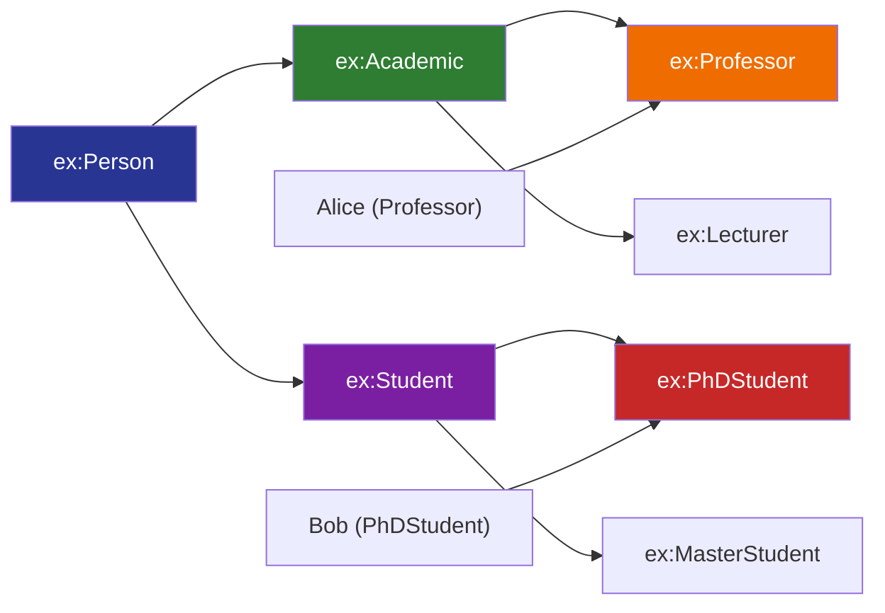

# 6.1 RDF 词汇表：RDFS 的核心构件

本节将深入解析 RDFS 词汇表中的**核心元素**。RDFS 是一个小型的词汇集，它定义了用于构建分类体系的基础构件。

> **本节要点**：理解 `rdfs:Class`、`rdfs:subClassOf`、`rdfs:domain`、`rdfs:range`、`rdfs:label`、`rdfs:comment` 的语义与应用场景。

---

## 1. 什么是 RDFS 词汇表？

RDFS（RDF Schema）并非一种数据语言，而是一种**元语言（Metalinguage）**——即用来描述**描述事物的语言**的语言。RDFS 的核心功能是为 RDF 图中的资源提供**类型声明**和**层次结构**。

```
通俗理解：
- RDF 语句描述的是事实（"Alice 认识 Bob"）
- RDFS 词汇表描述的是类型/类别的规则（"人类 认识 人类"）
```

### 1.1 RDFS 核心词汇概览

| 谓词/属性 | 所属命名空间 | 数据类型 | 用途 |
| --- | --- | --- | --- |
| `rdfs:Class` | http://www.w3.org/2000/01/rdf-schema# | 类 | 定义"概念的类别" |
| `rdfs:Resource` | http://www.w3.org/2000/01/rdf-schema# | 类 | RDF 图中**所有资源**的最高抽象父类 |
| `rdfs:subClassOf` | http://www.w3.org/2000/01/rdf-schema# | 属性 | 定义类的继承关系 |
| `rdfs:subPropertyOf` | http://www.w3.org/2000/01/rdf-schema# | 属性 | 定义属性的继承关系 |
| `rdfs:domain` | http://www.w3.org/2000/01/rdf-schema# | 属性 | 约束谓词的主体类型 |
| `rdfs:range` | http://www.w3.org/2000/01/rdf-schema# | 属性 | 约束谓词的客体类型 |
| `rdfs:label` | http://www.w3.org/2000/01/rdf-schema# | 属性 | 提供人类可读名称 |
| `rdfs:comment` | http://www.w3.org/2000/01/rdf-schema# | 属性 | 提供描述性注释 |

---

## 2. 类的定义：`rdfs:Class` 与 `rdf:type`

### 2.1 Class 的本质

在 RDFS 中，任何被称为"类"的事物，本身必须是 `rdfs:Class` 的一个实例。这意味着：

```turtle
# 定义 "Professor" 是一个类
:Professor rdfs:Class .
```

上述代码的含义是：**`:Professor` 是一个集合或概念的范畴（a kind of category）**。

### 2.2 类的层级结构示意



### 2.3 实例与类的关系

```turtle
@prefix ex: <http://example.org/> .
@prefix rdf: <http://www.w3.org/1999/02/22-rdf-syntax-ns#> .
@prefix rdfs: <http://www.w3.org/2000/01/rdf-schema#> .

# 1. 定义类
ex:Person rdfs:Class .        # "Person" 是一个概念范畴
ex:Professor rdfs:Class .      # "Professor" 是一个概念范畴
ex:University rdfs:Class .     # "University" 是一个概念范畴

# 2. 定义实例（个体）
ex:Alice rdf:type ex:Person .   # Alice 是 Person 类别的一个个体
ex:Bob rdf:type ex:Professor .  # Bob 是 Professor 类别的一个个体
```

---

## 3. 类的继承：`rdfs:subClassOf`

`rdfs:subClassOf` 是 RDFS 中最核心的**继承机制**。如果说 `rdf:type` 表示"个体属于某类"，那么 `rdfs:subClassOf` 就表示"某类属于另外某类"。

### 3.1 继承的逻辑规则

如果 A 是 B 的 `rdfs:subClassOf`，则有如下推理规则生效：

| 前提条件 | 推理结果 |
| --- | --- |
| `:PhDStudent rdfs:subClassOf :Student` | 所有 `:PhDStudent` 实例同时可被推断为 `:Student` |
| `:Professor rdfs:subClassOf :Academic` | 某 Professor 一定具备 `:Academic` 的属性或关系 |

### 3.2 学术人员体系的实例

```turtle
@prefix ex: <http://example.org/> .
@prefix rdf: <http://www.w3.org/1999/02/22-rdf-syntax-ns#> .
@prefix rdfs: <http://www.w3.org/2000/01/rdf-schema#> .

# 定义最高层抽象类
ex:Person rdfs:Class .
ex:OrganizationalEntity rdfs:Class .

# 类的层级结构
ex:Academic rdfs:subClassOf ex:Person .
ex:Student rdfs:subClassOf ex:Person .

ex:Professor rdfs:subClassOf ex:Academic .
ex:Lecturer rdfs:subClassOf ex:Academic .

ex:PhDStudent rdfs:subClassOf ex:Student .
ex:MasterStudent rdfs:subClassOf ex:Student .

# 个体实例的赋值
ex:Alice rdf:type ex:Professor .
ex:Bob rdf:type ex:PhDStudent .
```

#### 推理示例推演：

如果运行 RDFS 推理器：
1. 由于 `:Professor rdfs:subClassOf :Academic`，推理器推断 `:Alice` 也是 `:Academic` 的实例。
2. 又由于 `:Academic rdfs:subClassOf :Person`，推理器推断 `:Alice` 也是 `:Person` 的实例。
3. 同理，`:Bob` 是 `:PhDStudent`，而 `:PhDStudent` 是 `:Student`，`:Student` 是 `:Person` —— 所以 `:Bob` 也是 `:Person`。

### 3.3 继承的图形表示



---

## 4. 属性的继承：`rdfs:subPropertyOf`

与类类似，属性也能建立层次和继承关系。如果 `:hasTeacher` 是 `:knows` 的 `rdfs:subPropertyOf`：

```turtle
ex:hasTeacher rdfs:subPropertyOf ex:knows .

# 推理：
# 已知 :Alice ex:hasTeacher :Bob .
# RDFS 可推断：:Alice ex:knows :Bob .
```

这符合语义上的直觉：**"有导师"是"认识"的一种特例**。

---

## 5. 属性约束：`rdfs:domain` 与 `rdfs:range`

这是 RDFS 中两个极其重要的谓词约束机制，它们用于定义某条属性的主体（domain，领域/范围）和客体（range，取值范围）必须符合什么类。

### 5.1 Domain（域）与 Range（范围）语义表

| 术语 | 对应三元组中的角色 | 语义含义 |
| --- | --- | --- |
| **`rdfs:domain`** | **主体（Subject）** | 表示此谓词所作用的**个体类型**范围 |
| **`rdfs:range`** | **客体（Object）** | 表示此谓词连接出的**目标类型**范围 |

### 5.2 实践示例：为谓词设定类型约束

```turtle
@prefix ex: <http://example.org/> .
@prefix rdf: <http://www.w3.org/1999/02/22-rdf-syntax-ns#> .
@prefix rdfs: <http://www.w3.org/2000/01/rdf-schema#> .

# 定义谓词的域与范围
ex:advisor rdfs:domain ex:Professor ;
           rdfs:range ex:Student .
```

上述 RDFS 数据所蕴含的推理：

| 已知数据三元组 | 通过 domain 推出的新断言 | 通过 range 推出的新断言 |
| --- | --- | --- |
| `:ProfWang ex:advisor :Bob` | 推断 `:ProfWang rdf:type ex:Professor` | 推断 `:Bob rdf:type ex:Student` |

---

### 5.3 学术顾问关系的域范围约束

```turtle
ex:enrollsIn rdfs:domain ex:Student ;
             rdfs:range ex:Course .
             
ex:teaches rdfs:domain ex:Professor ;
           rdfs:range ex:Course .
           
ex:universityOf rdfs:domain ex:Person ;
                rdfs:range ex:University .
```

#### 推理场景演练：

给定以下实例数据：
```turtle
:Alice ex:enrollsIn :CS101 .
```

RDFS 推理引擎将自动推断出：
1. `:Alice rdf:type ex:Student`（因为 `ex:enrollsIn` 的 domain 是 `ex:Student`）
2. `:CS101 rdf:type ex:Course`（因为 `ex:enrollsIn` 的 range 是 `ex:Course`）

### 5.4 Domain/Range 约束逻辑图

```mermaid
flowchart LR
    P["Subject<br/>:Alice"] --enrollsIn--> O["Object<br/>:CS101"]
    
    enrollsIn <.."rdfs:domain"..> Student[":Student"]
    enrollsIn <.."rdfs:range"..> Course[":Course"]
    
    P ---|通过 domain 推断| Student
    O ---|通过 range 推断| Course
    
    style P fill:#1565c0,color:#fff
    style O fill:#2e7d32,color:#fff
    style enrollsIn fill:#ef6c00,color:#fff
    style Student fill:#c62828,color:#fff
    style Course fill:#7b1fa2,color:#fff
```

---

## 6. 人机桥梁：`rdfs:label` 与 `rdfs:comment`

### 6.1 RDFS 的"元数据"功能

RDFS 提供了一组轻量化的属性，用以给人来阅读和理解本体/图谱中的概念：

- **`rdfs:label`**：资源/类/属性的"标题"。通常用来存储人类可读的命名（可能多语言）。
- **`rdfs:comment`**：对资源/类/属性的语义解释或注释（通常是句子或段落形式）。

### 6.2 多语言标签实例

```turtle
@prefix ex: <http://example.org/> .
@prefix rdfs: <http://www.w3.org/2000/01/rdf-schema#> .

ex:University rdfs:label "University"@en ;
              rdfs:label "大学"@zh ;
              rdfs:label "Université"@fr .
              
ex:University rdfs:comment "An educational institution for higher learning."@en .
```

#### 注意事项：

| 特性 | `rdfs:label` | `rdfs:comment` |
| --- | --- | --- |
| **预期用户** | 面向人类用户的**界面**展示 | 供开发者理解的**背景**描述 |
| **重复性** | 通常每个资源一个（首选名称） | 可以多次定义（长句、多语言） |
| **多语言支持** | 高度支持（如 `"大学"@zh`） | 支持（如 `"注释内容"@en`） |

---

## 7. 小结

本节核心内容总结：

1. **`rdfs:Class`** 声明了某概念是一个范畴，所有 RDFS 类别均继承自 `rdfs:Resource`
2. **`rdfs:subClassOf`** 实现了类间的继承推理，是构建本体分层的基石
3. **`rdfs:domain` / `rdfs:range`** 实现了谓词级别的类型约束
4. **`rdfs:label` / `rdfs:comment`** 为机器可读的数据添加了人类可理解的标签
5. 继承推理使得"子类具有父类特性"变得**无需显式编码**

---

## 8. 延伸阅读

| 资源 | 作者 | 链接 |
| --- | --- | --- |
| RDF 1.1 Schema (RDFS) 规范 | W3C Recommendation | [https://www.w3.org/TR/rdf-schema/](https://www.w3.org/TR/rdf-schema/) |
| Domain and Range | W3C RDFS 规范原文 Section 5.2-5.3 | [https://www.w3.org/TR/rdf-schema/#ch_domain](https://www.w3.org/TR/rdf-schema/#ch_domain) |
| A Review of Semantic Web Vocabulary and Data Modeling | W3C Wiki | [https://www.w3.org/2001/sw/wiki/Property#rdfs_domain_and_rdfs_range](https://www.w3.org/2001/sw/wiki/Property.23) |

---

## 9. 本节练习

### 练习 1：推理测试

给定以下 RDFS 语句：
```turtle
ex:A rdfs:subClassOf ex:B .
ex:B rdfs:subClassOf ex:C .
ex:X rdf:type ex:A .
```

请说明推理器**必然**能推断出什么事实？

### 练习 2：域与范围建模

假设你正在为某大学设计 RDF 数据模型，规定：
- `"注册课程关系 (enrollsIn)"`：学生的主体、课程的客体
- `"授课关系 (teaches)"`：教授的主体、课程的客体
- `"隶属关系 (affiliation)"`：任意人的主体、机构的客体

请用 RDFS 的 `domain` 和 `range` 为这三种谓词编写约束定义。

### 练习 3：标签设计

假设你的本体中类 `Project` 分别有以下多语言名称与解释，请用 RDF 三元组编写 `rdfs:label` 和 `rdfs:comment`。