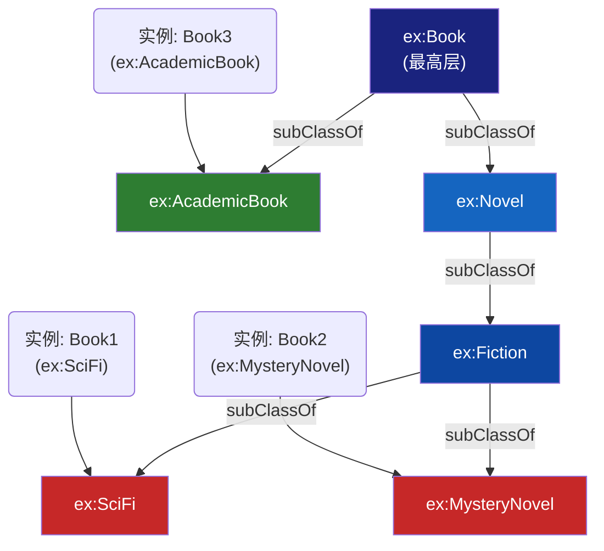
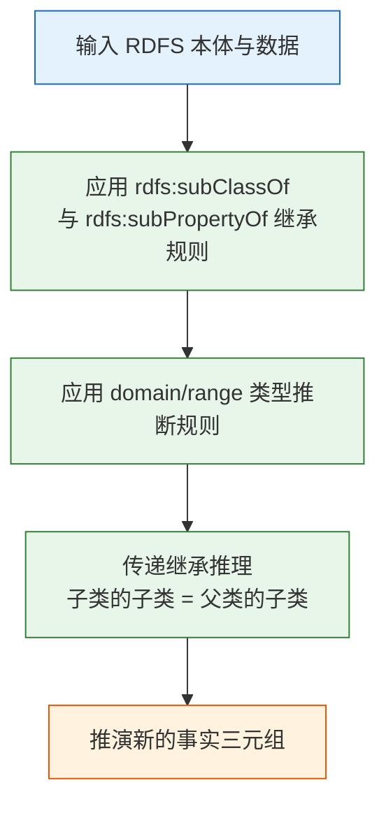

# 6.2 子类与子属性：继承机制的威力

本节聚焦于 RDFS 最核心的两个继承属性：`rdfs:subClassOf`（类的继承）和 `rdfs:subPropertyOf`（属性的继承）。通过具体示例说明这些继承规则如何使知识系统产生"涌现性"的推理能力。

> **本节要点**：掌握继承关系的设计范式，理解子属性继承如何实现谓词的语义细化，理解继承规则的推理能力与局限。

---

## 1. 子类继承：语义层次的构建基石

### 1.1 继承机制的语义学基础

RDFS 中的 `rdfs:subClassOf` 遵循标准的集合包含语义：若 `A rdfs:subClassOf B` 成立，则表示 A 的外延（所有实例的集合）是 B 外延的一个子集：

| 数学定义 | RDFS 语义 |
| --- | --- |
| $A \subseteq B$ | "A 是 B 的子类" |
| $x \in A \implies x \in B$ | "A 的每个实例必然也是 B 的实例" |

### 1.2 子类关系示例：图书领域建模

构建一个图书分类系统：

```turtle
@prefix ex: <http://example.org/> .
@prefix rdf: <http://www.w3.org/1999/02/22-rdf-syntax-ns#> .
@prefix rdfs: <http://www.w3.org/2000/01/rdf-schema#> .

# === 顶层分类 ===
ex:Book rdfs:Class .
ex:Author rdfs:Class .

# === 子类别定义 ===
ex:AcademicBook rdfs:subClassOf ex:Book ;
    rdfs:label "学术类图书"@zh .

ex:Novel rdfs:subClassOf ex:Book ;
    rdfs:label "小说"@zh .

ex:Fiction rdfs:subClassOf ex:Novel ;
    rdfs:label "虚构类小说"@zh .

ex:SciFi rdfs:subClassOf ex:Fiction ;
    rdfs:label "科幻小说"@zh .

ex:MysteryNovel rdfs:subClassOf ex:Fiction ;
    rdfs:label "悬疑小说"@zh .

# === 个体实例 ===
ex:Book1 rdf:type ex:SciFi .
ex:Book2 rdf:type ex:MysteryNovel .
ex:Book3 rdf:type ex:AcademicBook .
```

### 1.3 推理场景推演

假设我们有推理引擎处理以下数据：

```turtle
ex:Book1 rdf:type ex:SciFi .
```

在 RDFS 推理下，推理器将生成**自动继承链**：

| 推导层级 | 推断语句 | 依据 |
| --- | --- | --- |
| 第一级（直接） | `Book1 rdf:type Fiction` | `SciFi rdfs:subClassOf Fiction` |
| 第二级 | `Book1 rdf:type Novel` | `Fiction rdfs:subClassOf Novel` |
| 第三级 | `Book1 rdf:type Book` | `Novel rdfs:subClassOf Book` |

这意味着：**如果我们定义一条规则适用于 `ex:Book`，它会自动传递给 `SciFi`、`MysteryNovel` 等子类型**。

### 1.4 继承关系的传递性图示



**注意**：`SubClassOf` 关系是**传递的（Transitive）**。即：
- `A subClassOf B` 且 `B subClassOf C` → `A subClassOf C`

---

## 2. 子属性继承：谓词关系的语义细化

### 2.1 `rdfs:subPropertyOf` 的语义定义

与类类似，RDFS 允许属性之间建立层次。如果谓词 P1 是 P2 的子属性（`P1 rdfs:subPropertyOf P2`），则：

| 前提条件 | 推理结果 |
| --- | --- |
| `X P1 Y` | 可推导出 `X P2 Y` |
| P1 具有 domain/domain 约束 | P2 同样自动继承这些约束（或更宽松） |

### 2.2 示例：学术顾问体系的子属性

```turtle
@prefix ex: <http://example.org/> .
@prefix rdf: <http://www.w3.org/1999/02/22-rdf-syntax-ns#> .
@prefix rdfs: <http://www.w3.org/2000/01/rdf-schema#> .

# === 定义属性层次 ===

# 最高级别的"认识"关系
ex:knows rdfs:Class .  

# 更精确的关系定义
ex:hasAdvisor rdfs:subPropertyOf ex:knows .
ex:hasSupervisor rdfs:subPropertyOf ex:knows .
ex:collaboratesWith rdfs:subPropertyOf ex:knows .

# 数据实例
ex:Alice ex:hasAdvisor ex:Bob .
ex:Alice ex:collaboratesWith ex:Carol .

# 通过推理可以推断出：
# 1. ex:Alice ex:knows ex:Bob (因为 ex:hasAdvisor subPropertyOf ex:knows)
# 2. ex:Alice ex:knows ex:Carol (因为 ex:collaboratesWith subPropertyOf ex:knows)
```

**语义直觉**：如果某人"有导师"（hasAdvisor），逻辑上他/她必然"认识"（knows）该人。子属性的存在使得我们可以**同时保留精确语义和宽松概括**。

### 2.3 子属性继承图

```mermaid
flowchart TD
    P1["Subject<br/>Alice"] -->|knows| P2["Object<br/>Carol"]
    P3["Subject<br/>Alice"] -->|hasAdvisor| P4["Object<br/>Bob"]
    
    hasAdvisor <.."子属性继承..."|> knows
    collaborates <.."子属性继承..."|> knows
    
    knows <... domain ...> Person
    hasAdvisor <... domain ...> Person
    
    style P1 fill:#37474f,color:#fff
    style P2 fill:#37474f,color:#fff
    style P4 fill:#37474f,color:#fff
    style knows fill:#ff6f00,color:#fff
    style hasAdvisor fill:#43a047,color:#fff
    style collaborates fill:#fb8c00,color:#fff
```

---

## 3. 属性的传递性（TransitiveProperty）

RDFS 原生支持定义"传递属性"——但需要使用 OWL 中的 `owl:TransitiveProperty`。虽然 OWL 属于第 8 章的范围，但此概念与 `rdfs:subPropertyOf` 密切相关，此处提前引入：

```turtle
@prefix ex: <http://example.org/> .
@prefix rdf: <http://www.w3.org/1999/02/22-rdf-syntax-ns#> .
@prefix owl: <http://www.w3.org/2002/07/owl#> .
@prefix rdfs: <http://www.w3.org/2000/01/rdf-schema#> .

# 定义属性具有传递性
ex:hasPart owl:TransitiveProperty .

# 数据实例
ex:Computer ex:hasPart ex:CPU .
ex:CPU ex:hasPart ex:Core .

# 推理结论：
# Computer hasPart Core（传递推导）
```

---

## 4. 继承链的约束继承规则

当一个子类从父类继承时，它自动继承了父类的 `domain` 和 `range` 约束。这意味着：

### 4.1 继承链与域/范围

```turtle
# 基类定义
ex:Person rdfs:Class .
ex:worksFor rdfs:domain ex:Person ;
            rdfs:range ex:Organization .

# 子类型
ex:Professor rdfs:subClassOf ex:Person .

# 数据实例
ex:Alice rdf:type ex:Professor .
ex:Alice ex:worksFor ex:UniversityX .

# 推理推演:
# 1. Professor subClassOf Person 
# 2. worksFor domain: Person
# 结论: Alice 满足 worksFor 的 domain 要求（自动推断 Alice 是 Person 类型）
```

### 4.2 继承约束汇总表

| 继承元素 | 来源 | 效果 |
| --- | --- | --- |
| `rdfs:subClassOf` | 父类的 `domain` 约束 | 子类自动满足相同 domain |
| `rdfs:subClassOf` | 父类的 `range` 约束 | 无直接影响（仅对谓词生效） |
| `rdfs:subPropertyOf` | 父属性的 domain 与 range | 子属性自动继承父属性的 domain 和 range |
| `rdfs:subPropertyOf` | 传递性 `owl:TransitiveProperty` | 推理产生多级路径结果 |

---

## 5. RDFS 继承推理机制总结



---

## 6. 小结

本节的核心发现：

1. `rdfs:subClassOf` 建立了类别的包含关系，是**分层层级设计的核心基石**。
2. 推理器可以沿着 `subClassOf` 链进行**深度类型传递**推导。
3. `rdfs:subPropertyOf` 使子属性获得父属性的语义泛化能力。
4. **域和范围的约束**会随继承链向下传递——子类自动符合父类的约束要求。

---

## 7. 延伸阅读

| 资源名称 | 作者 | 参考链接 |
| --- | --- | --- |
| RDFS subClassOf 定义 | W3C Recommendation Section 4.4 | [https://www.w3.org/TR/rdf-schema/#ch_subclass](https://www.w3.org/TR/rdf-schema/#ch_subclass) |
| RDFS subPropertyOf 定义 | W3C Recommendation Section 4.5 | [https://www.w3.org/TR/rdf-schema/#ch_subproperties](https://www.w3.org/TR/rdf-schema/#ch_subproperties) |
| RDF Semantics (RDFS 推理理论) | W3C | [https://www.w3.org/TR/rdf-mt/](https://www.w3.org/TR/rdf-mt/) |

---

## 8. 本节练习

### 练习 1：层级推理推演

假设存在以下本体层次：
```turtle
ex:Employee rdfs:subClassOf ex:Person .
ex:Developer rdfs:subClassOf ex:Employee .
ex:Manager rdfs:subClassOf ex:Employee .
ex:SeniorDeveloper rdfs:subClassOf ex:Developer .

ex:Tom rdf:type ex:SeniorDeveloper .
```
推导器会推断 `Tom` 具备哪些类型？

### 练习 2：子属性继承设计

为某公司设计一组描述关系的属性。基础关系是 `interactsWith`。具体类型包括：
- `meetsWith`（会见）
- `coordinatesWith`（协调）
- `reportsTo`（汇报给）

要求设计合理的继承层次，使得 `reportsTo` 是 `interactsWith` 的一种更具体的形式。