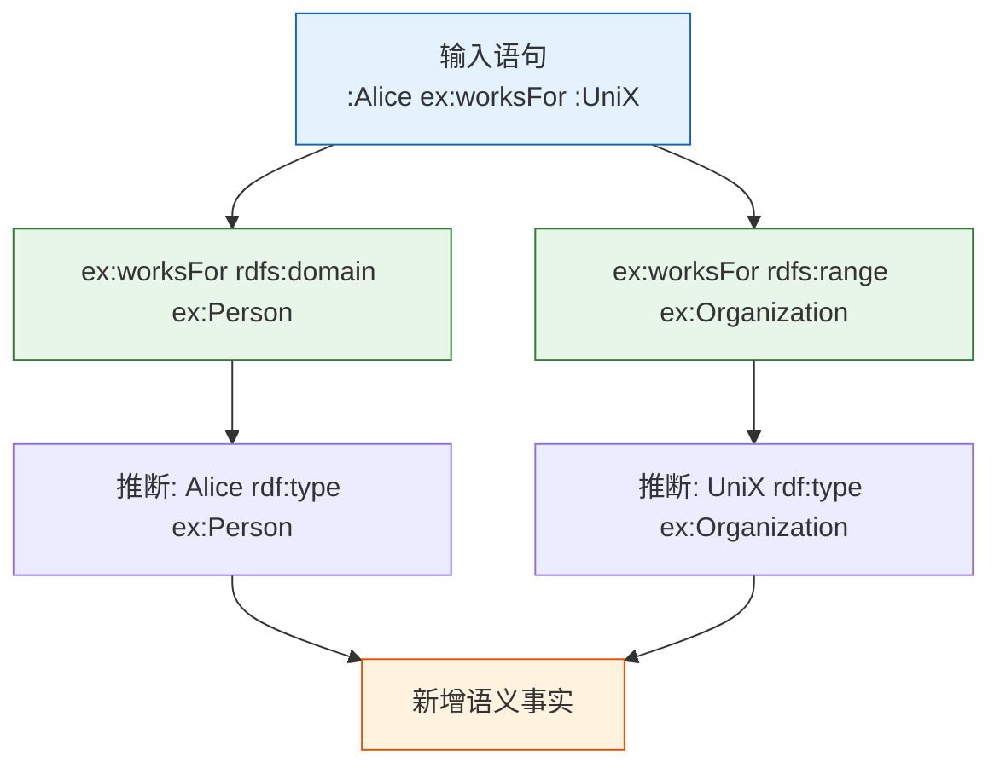
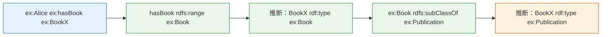

# 6.3 域与范围：属性的语义约束

本节探讨 RDFS 中最具推理力的两个构造：`rdfs:domain`（域）和 `rdfs:range`（范围）。它们定义了属性的适用对象和返回值类型，是 RDFS 实现类型推断的核心机制。

> **本节要点**：掌握域和范围的定义与推理规则，理解 domain/range 如何在推理中产生隐式类型关系，以及域/范围与子属性/子类的继承规则。

---

## 1. 域（Domain）与范围（Range）的基础概念

### 1.1 语义定义

`rdfs:domain` 和 `rdfs:range` 是对属性（`rdf:Property`）的约束：

| 构造 | 定义 | 语义解释 |
| --- | --- | --- |
| `rdfs:domain` | 限定属性的**主语**（Subject）必须属于哪个类 | "如果 X 使用 P，那么 X 必须是 D 类型的" |
| `rdfs:range` | 限定属性的**宾语**（Object）必须属于哪个类 | "如果 X P Y，那么 Y 必须是 R 类型的" |

形式化定义如下：

```
rdfs:domain:  ∀P, D: P rdfs:domain D ⇒ ∀S, O: <S P O> ⇒ ∃T <S rdf:type T> ∧ T = D
rdfs:range:  ∀P, R: P rdfs:range R ⇒ ∀S, O: <S P O> ⇒ ∃T <O rdf:type T> ∧ T = R
```

### 1.2 简单示例：人员与组织

```turtle
@prefix ex: <http://example.org/> .
@prefix rdf: <http://www.w3.org/1999/02/22-rdf-syntax-ns#> .
@prefix rdfs: <http://www.w3.org/2000/01/rdf-schema#> .

# === 定义类 ===
ex:Person rdfs:Class .
ex:Organization rdfs:Class .

# === 定义属性并约束域和范围 ===
ex:worksFor rdfs:domain ex:Person ;
            rdfs:range ex:Organization .

# === 数据实例 ===
ex:Alice rdf:type ex:Person .
ex:UniversityX rdf:type ex:Organization .
ex:Alice ex:worksFor ex:UniversityX .
```

在以上数据中，由于 `ex:worksFor rdfs:domain ex:Person`，推理器会推断：
- **任何出现在 `worksFor` 主语位置的资源都必须是 `ex:Person` 的实例**

同样，由于 `ex:worksFor rdfs:range ex:Organization`：
- **任何出现在 `worksFor` 宾语位置的资源都必须是 `ex:Organization` 的实例**

### 1.3 域/范围推断流程图



---

## 2. 域与范围的继承规则

### 2.1 子类继承域/范围

当一个子类从父类继承时，子类的实例同样满足父类的域和范围约束：

```turtle
@prefix ex: <http://example.org/> .
@prefix rdf: <http://www.w3.org/1999/02/22-rdf-syntax-ns#> .
@prefix rdfs: <http://www.w3.org/2000/01/rdf-schema#> .

ex:Person rdfs:Class .
ex:Employee rdfs:subClassOf ex:Person .

ex:worksFor rdfs:domain ex:Person .

ex:Alice rdf:type ex:Employee .
ex:Alice ex:worksFor ex:CompanyA .

# 推理：
# 1. Employee subClassOf Person
# 2. worksFor domain: Person
# 结论：Alice 满足 worksFor 的域要求（自动）
```

### 2.2 子属性继承域/范围

```turtle
@prefix ex: <http://example.org/> .
@prefix rdf: <http://www.w3.org/1999/02/22-rdf-syntax-ns#> .
@prefix rdfs: <http://www.w3.org/2000/01/rdf-schema#> .

# 父属性约束
ex:knows rdfs:domain ex:Person ;
         rdfs:range ex:Person .

# 子属性
ex:hasAdvisor rdfs:subPropertyOf ex:knows .

# 数据
ex:Alice ex:hasAdvisor ex:Bob .

# 推理结论：
# 1. hasAdvisor subPropertyOf knows
# 2. knows domain: Person, range: Person
# 结论：Alice 和 Bob 都必须是 Person 类型
```

---

## 3. 域的并集（Union）：多条约束

RDFS 允许为同一个属性定义多个 `rdfs:domain`。这在语义上表示域的**并集（Union）**：

### 3.1 多域定义示例

```turtle
@prefix ex: <http://example.org/> .
@prefix rdf: <http://www.w3.org/1999/02/22-rdf-syntax-ns#> .
@prefix rdfs: <http://www.w3.org/2000/01/rdf-schema#> .

ex:Project rdfs:Class .
ex:Person rdfs:Class .

# worksOn 的域可以是 Person 或 Organization
ex:worksOn rdfs:domain ex:Person .
ex:worksOn rdfs:domain ex:Organization .

# 范围限定为 Project
ex:worksOn rdfs:range ex:Project .

# 数据实例
ex:Alice ex:worksOn ex:ProjectAlpha .
ex:TeamBeta ex:worksOn ex:ProjectGamma .

# 推理：
# Alice rdf:type (Person ∪ Organization)
# TeamBeta rdf:type (Person ∪ Organization)
# ProjectAlpha 和 ProjectGamma 都是 Project 类型
```

### 3.2 并集域推理表

| 输入语句 | 域结果 | 范围结果 |
| --- | --- | --- |
| `Alice worksOn P1` | `Alice` 是 `Person` 或 `Organization` | `P1` 是 `Project` |
| `TeamX worksOn P2` | `TeamX` 是 `Person` 或 `Organization` | `P2` 是 `Project` |

> **注意**：RDFS 不支持析取类型（disjunctive typing）。虽然我们知道 `Alice` 必须是 `Person` 或 `Organization`，但**无法区分**到底是哪一个，只知道满足其中至少一种。

---

## 4. 域/范围与逻辑推断

### 4.1 反向推断：从类型到语句适用性

域和范围的强大之处不仅在于从语句推类型，更可以帮助确认哪些语句是"合法"的：

```turtle
@prefix ex: <http://example.org/> .
@prefix rdf: <http://www.w3.org/1999/02/22-rdf-syntax-ns#> .
@prefix rdfs: <http://www.w3.org/2000/01/rdf-schema#> .

ex:Author rdfs:Class .
ex:Book rdfs:Class .

ex:authored rdfs:domain ex:Author ;
            rdfs:range ex:Book .

# 有效语句
ex:Jane ex:authored ex:NovelX .
# → 推理：Jane: Author, NovelX: Book

# 潜在不一致场景（无 OWA/CWA 时不会报错，但在 OWL 中可能有更严格的检查）
ex:SomePerson ex:authored ex:SomeThing .
# → 推理：SomePerson: Author, SomeThing: Book
```

### 4.2 链式推断推理



**链式推理**展示了 domain/range 如何与 `subClassOf` 交互，产生多重推导层。

---

## 5. 域和范围的典型错误用法

### 5.1 过于宽泛的域

```turtle
# ❌ 不推荐：将所有属性域的默认值设为 rdfs:Resource
rdfs:subPropertyOf rdfs:domain rdfs:Resource .
rdfs:subPropertyOf rdfs:range rdfs:Resource .
```

`rdfs:Resource` 是所有 RDF 资源的超类，定义域或范围为 `Resource` 实际上不提供任何有效约束。

### 5.2 互相冲突的域/范围

```turtle
# ❌ 潜在矛盾
ex:isParentOf rdfs:domain ex:Human ;
              rdfs:range ex:Animal .

ex:Human rdfs:subClassOf ex:Animal .

# 推理结果：
# 如果 :Alice isParentOf :Bob
# → Alice: Human (人类)
# → Bob: Animal (动物) —— 但没有进一步限制
#
# 注意：这不矛盾，但可能导致语义不精确
```

### 5.3 忽略子属性继承

```turtle
# ❌ 忽略子属性无需重新声明 domain/range
ex:tells rdfs:domain ex:Person ;
         rdfs:range ex:Statement .

ex:lies rdfs:subPropertyOf ex:tells .
# 推理：ex:lies 自动具有 domain: Person, range: Statement
# 无需重复定义！
```

---

## 6. RDFS domain/range 推理规则汇总表

| 规则 | 前提 | 结论 |
| --- | --- | --- |
| Domain Inference | `S P O` 且 `P rdfs:domain D` | `S rdf:type D` |
| Range Inference | `S P O` 且 `P rdfs:range R` | `O rdf:type R` |
| SubClass Domain | `A rdfs:subClassOf B` 且 `P rdfs:domain B` | `P` 对 `A` 也合法 |
| SubProperty Domain | `P1 rdfs:subPropertyOf P2` 且 `P2 rdfs:domain D` | `P1 rdfs:domain D` (隐式) |
| SubProperty Range | `P1 rdfs:subPropertyOf P2` 且 `P2 rdfs:range R` | `P1 rdfs:range R` (隐式) |
| Transitive Domain | `P rdfs:domain A` 且 `P rdfs:domain B` | `domain(P) = A ∪ B` |

---

## 7. 域和范围的实践建议

### 7.1 建模指南

| 场景 | 建议 |
| --- | --- |
| 定义属性时 | **始终**指定 `rdfs:domain` 和 `rdfs:range` |
| 属性有多种可能的主语 | 使用多条 `rdfs:domain` 定义（并集） |
| 属性有多个可能的宾语 | 使用多条 `rdfs:range` 定义 |
| 需要精确的析取类型 | 使用 **OWL 2** 的 `owl:oneOf` 或类表达式 |

### 7.2 示例：完整属性声明

```turtle
@prefix ex: <http://example.org/> .
@prefix rdf: <http://www.w3.org/1999/02/22-rdf-syntax-ns#> .
@prefix rdfs: <http://www.w3.org/2000/01/rdf-schema#> .
@prefix xsd: <http://www.w3.org/2001/XMLSchema#> .

# 完整属性声明示例
ex:hasAuthor rdfs:label "has author"@en ;
    rdfs:comment "指明某人是一部著作的作者"@en ;
    rdfs:domain ex:Work ;
    rdfs:range ex:Person ;
    rdfs:subPropertyOf ex:creatorOf .

ex:hasPublicationYear rdfs:label "has publication year"@en ;
    rdfs:domain ex:Work ;
    rdfs:range xsd:integer .
```

---

## 8. 小结

本节重点：

1. `rdfs:domain` 约束属性**主语**的类型，`rdfs:range` 约束属性**宾语**的类型。
2. 域/范围触发**自动类型推断**：`S P O` + `P rdfs:domain D` → `S rdf:type D`。
3. 多个域/范围声明构成**并集**语义。
4. 子类/subProperty **自动继承**父类的域/范围约束。

---

## 9. 延伸阅读

| 资源 | 描述 | 链接 |
| --- | --- | --- |
| RDFS Domain 规范 | W3C RDFS 对 domain 的正式定义 | [https://www.w3.org/TR/rdf-schema/#ch_domain](https://www.w3.org/TR/rdf-schema/#ch_domain) |
| RDFS Range 规范 | W3C RDFS 对 range 的正式定义 | [https://www.w3.org/TR/rdf-schema/#ch_range](https://www.w3.org/TR/rdf-schema/#ch_range) |
| RDF Semantics | 推理理论的形式语义基础 | [https://www.w3.org/TR/rdf-mt/](https://www.w3.org/TR/rdf-mt/) |

---

## 10. 本节练习

### 练习 1：推断训练

给定以下数据：

```turtle
@prefix ex: <http://example.org/> .
@prefix rdf: <http://www.w3.org/1999/02/22-rdf-syntax-ns#> .
@prefix rdfs: <http://www.w3.org/2000/01/rdf-schema#> .
@prefix xsd: <http://www.w3.org/2001/XMLSchema#> .

ex:University rdfs:Class .
ex:Professor rdfs:Class .
ex:Department rdfs:Class .

ex:isHeadOf rdfs:domain ex:Professor ;
            rdfs:range ex:Department .

ex:Dean rdfs:subClassOf ex:Professor .

ex:Alice rdf:type ex:Dean .
ex:Alice ex:isHeadOf ex:MathDept .
```

推理器能得出哪些类型推断结果？列出所有从 RDFS 规则产生的推断语句。

### 练习 2：属性声明设计

设计一个图书馆系统中的属性声明：
- 属性 `writtenBy`：主语是 `Book`，宾语是 `Person`
- 属性 `publishedIn`：主语是 `Book`，宾语可以是 `Publisher` 或 `Journal`（用并集域/范围实现）
- 属性 `hasISBN`：数据类型属性，取值范围是 `xsd:string`（为后续 OWL 章节铺垫，此处仅做 RDFS 声明）