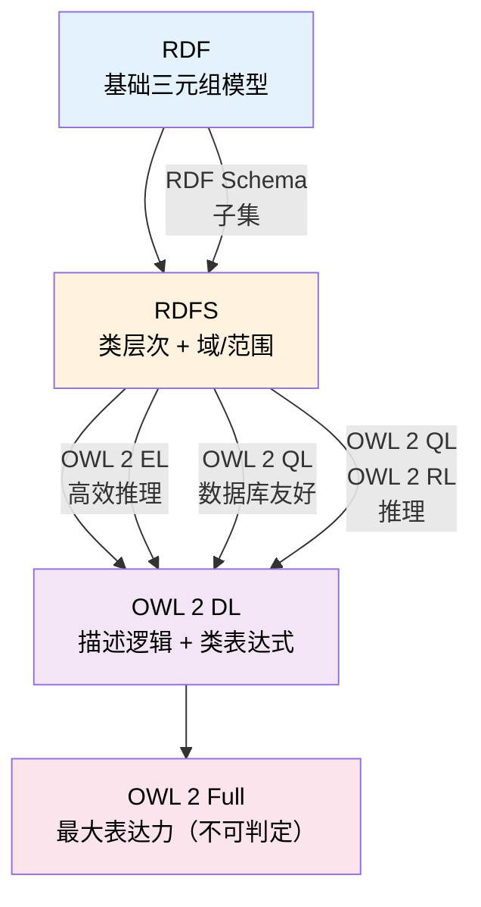
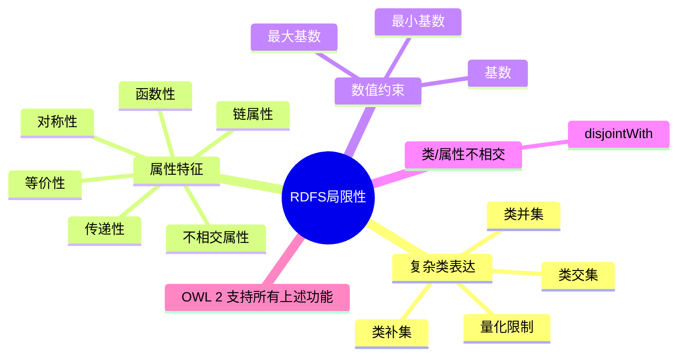

# 6.4 RDFS 局限性

本节探讨 RDFS 表达能力边界的核心问题。尽管 RDFS 为知识组织提供了重要的基础构件，但它**远不足以表达复杂本体的语义需求**。理解这些局限性是进入 OWL 2 世界的必要前提。

> **本节要点**：明确 RDFS 不能做什么，掌握 RDFS 推理与 OWL 推理的差异，为后续 OWL 2 章节（第 8~15 章）建立知识锚点。

---

## 1. RDFS 表达能力一览

### 1.1 RDFS 的能力与局限对比矩阵

| 能力领域 | RDFS 是否支持 | OWL 2 是否支持 | RDFS 近似方法 |
| --- | --- | --- | --- |
| 类层次继承 (`subClassOf`) | ✅ 完全支持 | ✅ 完全支持 | N/A |
| 属性层次 (`subPropertyOf`) | ✅ 完全支持 | ✅ 完全支持 | N/A |
| 域/范围约束 (`domain`/`range`) | ✅ 完全支持 | ✅ 支持（可扩展） | N/A |
| 类的交集 (`owl:intersectionOf`) | ❌ 不支持 | ✅ 完全支持 | 无法表达 |
| 类的并集 (`owl:unionOf`) | ❌ 仅支持域的并集 | ✅ 完全支持 | 域的多个声明（见下文） |
| 类的补集 (`owl:complementOf`) | ❌ 不支持 | ✅ 完全支持 | 无法表达 |
| 属性传递性 | ⚠️ 间接支持 | ✅ 完全支持 | 需要自定义规则 |
| 属性对称性 | ❌ 不支持 | ✅ 完全支持 | 无法表达 |
| 属性反对称性 | ❌ 不支持 | ✅ 完全支持 | 无法表达 |
| 属性互斥性 | ❌ 不支持 | ✅ 完全支持 | 无法表达 |
| 属性等价性 | ❌ 不支持 | ✅ 完全支持 | 无法表达 |
| 类/属性不相交 (`disjointWith`) | ❌ 不支持 | ✅ 完全支持 | 需要自定义规则 |
| 基数约束 (cardinality) | ❌ 不支持 | ✅ 完全支持 | 无法表达 |
| 最小/最大基数 (min/maxCardinality) | ❌ 不支持 | ✅ 完全支持 | 无法表达 |
| 值约束 (onedOf) | ❌ 不支持 | ✅ 完全支持 | 需要自定义规则 |
| 数据类型约束 (datatype restriction) | ❌ 不支持 | ✅ 完全支持 | 无法表达 |

### 1.2 关键发现

RDFS **只能表达三类事物**：
1. **类的层次结构**（`rdfs:subClassOf`）
2. **属性的层次结构**（`rdfs:subPropertyOf`）
3. **属性的域/范围约束**（`rdfs:domain`, `rdfs:range`）

---

## 2. RDFS 的四个主要表达力缺口

### 2.1 缺口一：无法表达复杂类表达式

#### 问题描述

RDFS 无法描述由多个类**组合而成**的类，例如"男性教授"或者"至少有两个孩子的个人"。

#### RDFS 局限性示例

```turtle
@prefix ex: <http://example.org/> .
@prefix rdf: <http://www.w3.org/1999/02/22-rdf-syntax-ns#> .
@prefix rdfs: <http://www.w3.org/2000/01/rdf-schema#> .

ex:Person rdfs:Class .
ex:Male rdfs:Class .
ex:Professor rdfs:Class .

# RDFS 允许做什么：
# - 定义 Male rdfs:subClassOf Person
# - 定义 Professor rdfs:subClassOf Person
#
# RDFS 不允许做什么：
# ❌ "男性教授" = Male ⊓ Professor（交集类）
# ❌ "非教授的个人" = Person ⊖ Professor（补集类）

# 尝试定义"男性教授" —— RDFS 无能为力
# ex:MaleProfessor ... （没有交集运算符可用！）
```

#### OWL 2 对照

```turtle
@prefix ex: <http://example.org/> .
@prefix rdf: <http://www.w3.org/1999/02/22-rdf-syntax-ns#> .
@prefix rdfs: <http://www.w3.org/2000/01/rdf-schema#> .
@prefix owl: <http://www.w3.org/2002/07/owl#> .

# OWL 2 可以表达"男性教授" = Male ⊓ Professor
ex:MaleProfessor owl:intersectionOf ( ex:Male ex:Professor ) .
```

---

### 2.2 缺口二：无法表达属性的复杂特征

#### 问题描述

RDFS 无法声明属性的**逻辑特征**，如传递性、对称性、函数性等。这意味着你无法用 RDFS 表达"父母关系是传递的"或"母亲关系与父亲关系不相交"这样的语义。

#### 常见属性特征及 RDFS 限制

| 属性特征 | 描述 | RDFS 支持 | OWL 2 支持 |
| --- | --- | --- | --- |
| 传递性 | 若 `A P B` 且 `B P C`，则 `A P C` | ❌ 不支持 | ✅ `owl:TransitiveProperty` |
| 对称性 | 若 `A P B`，则 `B P A` | ❌ 不支持 | ✅ `owl:SymmetricProperty` |
| 反对称性 | 若 `A P B` 且 `B P A`，则 `A = B` | ❌ 不支持 | ✅ `owl:AsymmetricProperty` |
| 函数性 | 每个主语至多有一个宾语 | ❌ 不支持 | ✅ `owl:FunctionalProperty` |
| 逆属性 | `P1` 是 `P2` 的逆 | ❌ 不支持 | ✅ `owl:inverseOf` |
| 属性链 | `P1 ∘ P2 ⊆ P3` | ❌ 不支持 | ✅ `owl:propertyChainAxiom` |
| 属性互斥 | `P1` 和 `P2` 不能用于同一对个体 | ❌ 不支持 | ✅ `owl:disjointProperties` |
| 属性等价 | `P1` 和 `P2` 表达相同关系 | ❌ 不支持 | ✅ `owl:equivalentProperty` |

#### RDFS 局限示例：传递性

```turtle
@prefix ex: <http://example.org/> .
@prefix rdf: <http://www.w3.org/1999/02/22-rdf-syntax-ns#> .
@prefix rdfs: <http://www.w3.org/2000/01/rdf-schema#> .

# RDFS 无法声明 hasAncestor 是传递属性
ex:hasAncestor rdfs:domain ex:Person .
ex:hasAncestor rdfs:range ex:Person .

ex:Alice ex:hasAncestor ex:Bob .
ex:Bob ex:hasAncestor ex:Charlie .

# RDFS 推理器无法推断出：Alice 也是 Charlie 的祖先！
# 这是 RDFS 的一个重大表达力缺口。

# OWL 2 如何解决：
# ex:hasAncestor owl:TransitiveProperty .
# → 推理器会推断 Alice ex:hasAncestor Charlie
```

#### 对称性无法表达的示例

```turtle
# 问题：如何在 RDFS 中表达 "knows 是对称的"？
# 如果 Alice knows Bob，那么 Bob 也应该 knows Alice？

@prefix ex: <http://example.org/> .
@prefix rdf: <http://www.w3.org/1999/02/22-rdf-syntax-ns#> .
@prefix rdfs: <http://www.w3.org/2000/01/rdf-schema#> .

ex:knows rdfs:domain ex:Person .
ex:knows rdfs:range ex:Person .

ex:Alice ex:knows ex:Bob .

# RDFS 无法推断：ex:Bob ex:knows ex:Alice
# 这是 RDFS 对称性缺失造成的。

# OWL 2 解决方式：
# ex:knows owl:SymmetricProperty .
```

---

### 2.3 缺口三：无法表达基数约束

#### 问题描述

RDFS 无法表达"每个 X 至多有一个 Y"或者"每个 X 至少有两个 Z"这样的约束。这对于建模现实世界的业务规则至关重要。

#### RDFS 无法表达基数约束的例子

```turtle
@prefix ex: <http://example.org/> .
@prefix rdf: <http://www.w3.org/1999/02/22-rdf-syntax-ns#> .
@prefix rdfs: <http://www.w3.org/2000/01/rdf-schema#> .
@prefix xsd: <http://www.w3.org/2001/XMLSchema#> .

# 假设我们想让"每个生物体恰好有一个母亲"
ex:BiologicalParent rdfs:Class .
ex:hasMother rdfs:domain ex:Organism .
ex:hasMother rdfs:range ex:BiologicalParent .

ex:Alice ex:hasMother ex:Carol .

# RDFS 无法约束：
# ❌ Alice 至多有一个母亲
# ❌ Alice 至少有一个母亲
# ❌ Carol 至多有一个子女通过 hasMother

# 在 RDFS 中，我们没有办法防止以下"不合规"数据：
ex:Alice ex:hasMother ex:Carol .
ex:Alice ex:hasMother ex:Carol2 .  # ❌ RDFS 不会报错！
ex:Alice ex:hasMother ex:Carol3 .  # ❌ RDFS 不会报错！

# OWL 2 如何解决：
# ex:Organism owl:equivalentClass [
#     owl:intersectionOf ( ex:Organism
#         [ owl:onePropertyValuesFrom ( ex:hasMother ex:BiologicalParent ) ]
#         [ owl:minPropertyValues ( 1 ex:hasMother ) ]
#         [ owl:maxPropertyValues ( 1 ex:hasMother ) ]
#     )
# ]
```

#### 基数约束汇总表

| OWL 2 公理 | RDFS 等价物 | 说明 |
| --- | --- | --- |
| `owl:cardinality n` | ❌ 无 | 恰好 n 个 |
| `owl:minCardinality n` | ❌ 无 | 至少 n 个 |
| `owl:maxCardinality n` | ❌ 无 | 至多 n 个 |

---

### 2.4 缺口四：无法表达类的不相交性

#### 问题描述

RDFS 无法声明"这两个类没有重叠"，即无法表达**类之间的不相交关系**。这导致无法捕捉本体中基本的分类学约束。

#### 不相交性缺失示例

```turtle
@prefix ex: <http://example.org/> .
@prefix rdf: <http://www.w3.org/1999/02/22-rdf-syntax-ns#> .
@prefix rdfs: <http://www.w3.org/2000/01/rdf-schema#> .

ex:Man rdfs:subClassOf ex:Person .
ex:Woman rdfs:subClassOf ex:Person .

# RDFS 允许：
ex:Bob rdf:type ex:Man, ex:Woman .
# 即 RDFS 不阻止一个人同时是 Man 和 Woman！

# 这显然是不符合现实世界常识的。

# OWL 2 如何解决：
# ex:Man owl:disjointWith ex:Woman .
# → 推理器会检测到以下数据的不一致性：
# ex:Bob rdf:type ex:Man, ex:Woman .  # 矛盾！
```

---

## 3. RDFS 与 OWL 2 的能力阶梯

### 3.1 能力对比可视化



### 3.2 关键分水岭

| 对比维度 | RDFS | OWL 2 |
| --- | --- | --- |
| 表达能力 | 轻量 | 丰富 |
| 推理复杂度 | PTIME | EXPTIME (DL)/ NEXPTIME (Full) |
| 表达能力力 | 仅限类/属性层次 | 含类表达式、属性特征、数值约束 |
| 推理器速度 | 快 | 可能较慢（取决于概要） |
| 典型用例 | 简单分类体系 | 形式化本体、知识图谱、语义推理 |

---

## 4. 为什么选择 OWL 2 而不是 RDFS？

### 4.1 核心原因总结

1. **精确的语义表达**：OWL 2 提供形式化的模型论（model-theoretic semantics），确保推理结果的一致性。

2. **丰富的公理体系**：OW 支持：
   - 类表达式（交集、并集、补集、量化）
   - 属性公理（传递、对称、等价、链、不相交）
   - 数值约束（基数、最小/最大基数）

3. **可预测的推理行为**：OWL 2 的三个概要（EL, QL, DL）针对特定推理场景进行了优化。

4. **标准化推理机制**：一致性检查、分类（classifying）、实例判定等标准推理任务。

### 4.2 RDFS 仍然适用的场景

RDFS 在以下场景中仍然有价值：

| 场景 | 原因 |
| --- | --- |
| 简单的分类体系（如分类目录、标签体系） | 无需复杂的推理 |
| 知识图谱的标注层（RDF + RDFS） | 轻量、快速解析 |
| 元数据描述（Dublin Core 等） | RDFS 词汇表足够表达 |
| 原型设计阶段 | 快速构建，后续升级至 OWL |

---

## 5. 从 RDFS 到 OWL 2 的迁移路径

### 5.1 常见映射参考

```
RDFS 构造            OWL 2 对应构造

rdfs:subClassOf    →  owl:ClassExpression (subClassOf 相同)
rdfs:subPropertyOf →  owl:ObjectProperty / owl:DataProperty  (subPropertyOf)
rdfs:domain        →  保留 + OWL 扩展
rdfs:range         →  保留 + OWL 扩展

[无等价物]         →  owl:intersectionOf
[无等价物]         →  owl:unionOf
[无等价物]         →  owl:complementOf
[无等价物]         →  owl:TransitiveProperty
[无等价物]         →  owl:SymmetricProperty
[无等价物]         →  owl:AsymmetricProperty
[无等价物]         →  owl:FunctionalProperty
[无等价物]         →  owl:InverseOf
[无等价物]         →  owl:disjointWith (类或属性)
[无等价物]         →  owl:equivalentProperty
[无等价物]         →  owl:cardinality / owl:minCardinality / owl:maxCardinality
```

---

## 6. RDFS 局限性总结



---

## 7. 小结

本节总结了 RDFS 的核心局限性：

1. **表达能力不足**：RDFS 仅支持 `subClassOf`、`subPropertyOf`、`domain`、`range` 四种核心构造。
2. **无法描述复杂类**：缺乏 `owl:intersectionOf`、`owl:unionOf` 等类表达式。
3. **无法约束属性特征**：缺失传递性、对称性、函数性等 OWL 构造。
4. **无数值约束**：无法表达基数约束（最小、最大、精确基数）。
5. **无法定义不相交类/属性**：无法表达"Male 和 Female 不相交"这类常识。

这些局限性为**第 8 章 OWL 2 概述**及之后的详细 OWL 2 建模章节（第 10~12 章）铺平了道路。

---

## 8. 延伸阅读

| 资源 | 描述 | 链接 |
| --- | --- | --- |
| RDFS 规范全文 | W3C RDF Schema 1.1 | [https://www.w3.org/TR/rdf-schema/](https://www.w3.org/TR/rdf-schema/) |
| OWL 2 vs RDFS 对比 | W3C OWL 2 引言 | [https://www.w3.org/TR/owl2-primer/#Compared_to_RDFS](https://www.w3.org/TR/owl2-primer/#Compared_to_RDFS) |
| Description Logic | 描述逻辑理论参考 | [https://en.wikipedia.org/wiki/Description_logic](https://en.wikipedia.org/wiki/Description_logic) |

---

## 9. 本章（第6章）综合回顾

通过本章节四节内容的学习，你应该具备以下能力：

- 理解 RDFS 作为 RDF 词汇表的核心构件及推理规则
- 掌握 `subClassOf` 继承机制与类层次建模
- 掌握 `domain` / `range` 属性约束及类型推断
- 认识 RDFS 表达力的边界及其与 OWL 2 的关系

---

## 10. 练习

### 练习 1：分析 RDFS 局限性

给定以下本体片段，分析 RDFS 可以/不可以做到的事情：

```turtle
@prefix ex: <http://example.org/> .
@prefix rdf: <http://www.w3.org/1999/02/22-rdf-syntax-ns#> .
@prefix rdfs: <http://www.w3.org/2000/01/rdf-schema#> .

ex:Person rdfs:Class .
ex:Department rdfs:Class .
ex:teaches rdfs:domain ex:Person ; rdfs:range ex:Department .

ex:Alice rdf:type ex:Person .
ex:Alice ex:teaches ex:MathDept .
```

问题：
1. RDFS 能推断出什么类型信息？
2. 如果我想确保 `teaches` 属性是传递的，RDFS 能做吗？
3. 如果我想声明 `Person` 和 `Department` 是不相交的类，RDFS 能做吗？

### 练习 2：RDFS → OWL 2 转换挑战

将以下 RDFS 片段中"做不到的"转换为 OWL 2 表述：

**RDFS 片段：**
```turtle
@prefix ex: <http://example.org/> .
@prefix rdf: <http://www.w3.org/1999/02/22-rdf-syntax-ns#> .
@prefix rdfs: <http://www.w3.org/2000/01/rdf-schema#> .

ex:Book rdfs:Class .
ex:Author rdfs:Class .
ex:wrote rdfs:domain ex:Author ; rdfs:range ex:Book .
```

**转换为 OWL 2 表述，加入：**
1. `wrote` 是传递属性
2. 每个作者至少写一本书
3. `Book` 和 `Article` 不相交（补充声明 `Article rdfs:Class`）