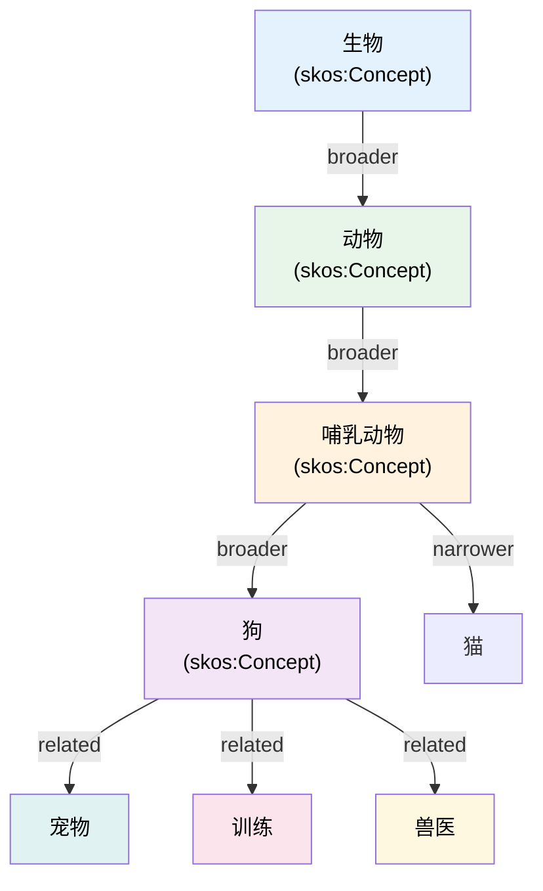

# 7.1 SKOS 简介：简单知识组织系统

本节介绍 SKOS（Simple Knowledge Organization System）的核心概念、设计目标、与 RDFS 的差异，以及适用场景。通过示例理解如何用 SKOS 构建主题词表和分类体系。

> **本节要点**：掌握 SKOS 的设计理念，理解其相较于 RDFS 的语义增强之处，理解其适用场景（如图书馆分类体系、政府词汇表等）。

---

## 1. SKOS 是什么？

### 1.1 SKOS 的设计理念与背景

SKOS 是 W3C 推荐标准（Recommendation），专门用于表示**知识组织系统（KOS, Knowledge Organization Systems）**，例如：

- **主题词表**（Thesauri）：如 Medical Subject Headings (MeSH)、Getty AAT
- **分类法**（Classification Schemes）：如 Dewey Decimal Classification（杜威十进制分类）、Library of Congress Classification
- **分类体系**（Taxonomies）：电商产品分类、学科分类
- **受控词汇表**（Controlled Vocabularies）：政府元数据、工业术语标准

SKOS 基于 **RDF** 构建，可以直接在现有的语义网栈（RDF/RDFS/OWL）上运行，不需要引入新的数据模型或查询语言。

```
传统 KOS 表示：
  概念（Concept） → 概念间关系（Relation） → 标签（Label）
                      ↓
              结构化展示（层级/同义词/相关项）

SKOS 表示：
  :Concept1 rdf:type skos:Concept .
  :Concept1 skos:prefLabel "人工智能"@zh .
  :Concept1 skos:narrower :机器学习 .
```

### 1.2 核心设计目标

| 目标 | 描述 |
| --- | --- |
| **简单性** | 只需理解 3 个核心关系（broader/narrower/related）和 3 个标签（prefLabel/altLabel/hiddenLabel）即可上手 |
| **互操作性** | 兼容 RDFS 和 OWL 2，可以与之混合使用 |
| **映射友好** | 通过 `skos:relatedMatch`、`skos:exactMatch` 等属性轻松映射不同词表 |
| **多语言支持** | 内建 `skos:prefLabel` 等支持多种语言的标签 |

---

## 2. SKOS 的核心构造

### 2.1 SKOS 命名空间与基本元素

SKOS 定义在命名空间 `http://www.w3.org/2004/02/skos/core#`（简写为 `skos:`）。

| 构造 | 类型/属性 | 描述 |
| --- | --- | --- |
| `skos:Concept` | 类 | 抽象概念，如"狗"、"机器学习" |
| `skos:ConceptScheme` | 类 | 组织概念的体系，如"中国 Library 分类法" |
| `skos:prefLabel` | 属性 | 首选标签（首选 human-readable 名称） |
| `skos:altLabel` | 属性 | 替代标签（同义词、缩写等） |
| `skos:hiddenLabel` | 属性 | 隐藏标签（通常用于拼写变体） |

### 2.2 SKOS 标签示例

```turtle
@prefix skos: <http://www.w3.org/2004/02/skos/core#> .
@prefix ex: <http://example.org/> .

# 一个概念实体
ex:ArtificialIntelligence rdf:type skos:Concept ;
    skos:inScheme ex:ComputerScienceThesaurus ;
    skos:prefLabel "人工智能"@zh , "Artificial Intelligence"@en ;
    skos:altLabel "AI"@en , "机器学习智能"@zh , "人工智慧"@zh-TW ;
    skos:hiddenLabel "AI智能"@zh .

# 解释：
# - prefLabel: 首选标签，每个 concept+language 只允许有一个
# - altLabel: 替代标签，允许有多个（如缩略词、不同地区用语）
# - hiddenLabel: 隐藏的（常用于拼写变体或敏感词）
```

**重要约束**：
- 每个 SKOS 概念对于每种语言**仅有一个** `skos:prefLabel`
- `skos:altLabel` 和 `skos:hiddenLabel` 可以有多个

---

## 3. SKOS 概念间关系

### 3.1 SKOS 的三大核心关系族

SKOS 定义了 **3 对（6 个）有序关系** 来构建概念之间的结构：

| 关系 | 逆关系 | 描述 | 示例 |
| --- | --- | --- | --- |
| `skos:broader` | `skos:narrower` | 广义关系（上级概念） | "动物" broader "狗" |
| `skos:narrower` | `skos:broader` | 狭义关系（下级概念） | "狗" narrower "动物" |
| `skos:related` | `skos:related`（对称） | 相关关系（同级关联） | "狗" related "训练" |

### 3.2 广度/狭义关系（Hierarchical）

`skos:broader` 和 `skos:narrower` 定义了概念之间的**层级（等级）结构**：

```turtle
@prefix skos: <http://www.w3.org/2004/02/skos/core#> .
@prefix ex: <http://example.org/> .

ex:动物 rdf:type skos:Concept ;
    skos:prefLabel "动物"@zh ;
    skos:broader ex:生物 .      # 动物 is narrower than 生物
    skos:narrower ex:哺乳动物 .  # 动物包含哺乳动物

ex:哺乳动物 rdf:type skos:Concept ;
    skos:prefLabel "哺乳动物"@zh ;
    skos:broader ex:动物 .
    skos:narrower ex:狗 , ex:猫 .

ex:狗 rdf:type skos:Concept ;
    skos:prefLabel "狗"@zh ;
    skos:broader ex:哺乳动物 .
```

**注意**：与 RDFS 的 `rdfs:subClassOf` 不同：
- SKOS 的层级关系表达的是**概念间的认知层级**，而非严格的类包含
- 层级可以存在**非传递性**（"动物" broader "狗" 不意味着"动物"是所有"狗"的超类）

### 3.3 相关关系（Assocative / Horizontal）

`skos:related` 表达了概念之间的**非层级关联**：

```turtle
@prefix skos: <http://www.w3.org/2004/02/skos/core#> .
@prefix ex: <http://example.org/> .

ex:狗 rdf:type skos:Concept ;
    skos:prefLabel "狗"@zh ;
    skos:related ex:宠物 , ex:训练 , ex:兽医 .

# skos:related 是对称的：
# 如果 :狗 skos:related :训练，
# 则 :训练 skos:related :狗 （推理自动）
```

| 关系特点 | 说明 |
| --- | --- |
| **对称性** | `related` 是对称关系（A related B → B related A） |
| **非层级** | 不是 hierarchical，属于横向关联 |
| **传递性** | `related` **不具有**传递性（即使 A related B 且 B related C，也不推断 A related C） |

### 3.4 概念关系图



---

## 4. SKOS 概念方案（Concept Scheme）

### 4.1 概念方案与概念的关系

`skos:ConceptScheme` 是组织概念的容器，用于表示一个**完整的词表或分类体系**：

```turtle
@prefix skos: <http://www.w3.org/2004/02/skos/core#> .
@prefix ex: <http://example.org/> .
@prefix dct: <http://purl.org/dc/terms/> .

ex:BiologyThesaurus rdf:type skos:ConceptScheme ;
    skos:prefLabel "生物学术语词表"@zh ;
    dct:title "Biology Subject Thesaurus"@en ;
    dct:description "涵盖生物学主要领域的概念集合"@zh ;
    dct:created "2024-01-01"^^xsd:date ;
    dct:creator "中国科学院"@zh .

ex:细胞 rdf:type skos:Concept ;
    skos:prefLabel "细胞"@zh , "Cell"@en ;
    skos:inScheme ex:BiologyThesaurus .
```

### 4.2 ConceptScheme 常见元数据字段

| Dublin Core 属性 | 用途 | 示例 |
| --- | --- | --- |
| `dct:title` | 词表正式名称 | "Getty AAT" |
| `dct:description` | 词表描述 | "描述词表覆盖范围和用途" |
| `dct:creator` | 创建者 | "中国国家标准化管理委员会" |
| `dct:issued` | 发布日期 | "2024-01-01" |
| `dct:modified` | 最后修改日期 | "2024-06-15" |
| `dct:language` | 语言 | "zh", "en" |

---

## 5. SKOS 与 RDFS/RDF 的对比

### 5.1 核心差异表

| 特征 | RDF / RDFS | SKOS |
| --- | --- | --- |
| 核心模型 | 类与属性（class + property） | 概念与标签（concept + label） |
| 层级关系 | `rdfs:subClassOf`（继承） | `skos:broader/narrower`（认知层次） |
| 标签支持 | `rdfs:label`（单个首选） | `skos:prefLabel/altLabel/hiddenLabel` |
| 关系类型 | 仅支持 hierarchy 和 domain/range | hierarchy + horizontal（related） |
| 多语言 | 需手动声明 | 内置支持（prefLabel 可带语言标签） |
| 映射能力 | 不支持 | 内建 `exactMatch`、`broadMatch` 等 |

### 5.2 实际示例对比

```turtle
# ===== RDFS 方式：图书分类 =====
ex:Book rdfs:Class .
ex:Fiction rdfs:subClassOf ex:Book .
ex:Novel rdfs:subClassOf ex:Fiction .

ex:Book1 rdf:type ex:Novel .
# → Book1 继承链: Novel → Fiction → Book

# ===== SKOS 方式：相同内容 =====
ex:Book skos:prefLabel "图书" ;
       skos:narrower ex:Fiction .

ex:Fiction skos:prefLabel "虚构类" ;
           skos:broader ex:Book ;
           skos:narrower ex:Novel .

ex:Novel skos:prefLabel "小说" ;
         skos:broader ex:Fiction .
```

---

## 6. SKOS 的映射属性（Match Properties）

SKOS 定义了 6 个**映射（Match）**属性用于跨词表对齐：

| 映射属性 | 对称性 | 描述 |
| --- | --- | --- |
| `skos:exactMatch` | ✅ | 相同概念（如英语 "Dog" ↔ 中文 "狗"） |
| `skos:closeMatch` | ✅ | 接近但不是完全相同 |
| `skos:broadMatch` | ❌ | 上义词映射（A 的上级概念对应 B） |
| `skos:narrowMatch` | ❌ | 下义词映射（A 的下级概念对应 B） |
| `skos:relatedMatch` | ✅ | 相关项映射 |
| `skos:related` | ✅ | 词表内部横向关联 |

```turtle
@prefix skos: <http://www.w3.org/2004/02/skos/core#> .
@prefix en: <http://en.example.org/> .
@prefix zh: <http://zh.example.org/> .

# 不同语言间精确匹配
en:Dog skos:exactMatch zh:狗 .

# 不同词表间的近亲匹配
en:MachineLearning skos:closeMatch zh:机器学习 .

# 跨词表层级映射
en:Software skos:broadMatch zh:软件技术 .
```

---

## 7. SKOS 应用示例：完整词表

```turtle
@prefix skos: <http://www.w3.org/2004/02/skos/core#> .
@prefix dct: <http://purl.org/dc/terms/> .
@prefix ex: <http://example.org/thesaurus/> .

# === 概念方案 ===
ex:TechThesaurus rdf:type skos:ConceptScheme ;
    skos:prefLabel "科技主题词表"@zh ;
    dct:title "Technology Subject Thesaurus"@en ;
    dct:description "覆盖信息技术核心领域"@zh ;
    dct:language "zh", "en" .

# === 顶层概念 ===
ex:计算机科学 skos:inScheme ex:TechThesaurus ;
    skos:prefLabel "计算机科学"@zh , "Computer Science"@en ;
    skos:notation "A01" .

# === 子概念 ===
ex:人工智能 skos:inScheme ex:TechThesaurus ;
    skos:prefLabel "人工智能"@zh , "Artificial Intelligence"@en ;
    skos:altLabel "AI"@en ;
    skos:narrower ex:机器学习 , ex:自然语言处理 ;
    skos:related ex:机器人学 .

ex:机器学习 skos:inScheme ex:TechThesaurus ;
    skos:prefLabel "机器学习"@zh , "Machine Learning"@en ;
    skos:broader ex:人工智能 .

ex:自然语言处理 skos:inScheme ex:TechThesaurus ;
    skos:prefLabel "自然语言处理"@zh , "Natural Language Processing"@en ;
    skos:broader ex:人工智能 ,
    skos:altLabel "NLP"@en .
```

**推理效果（RDFS+SKOS 混合）**：
- 通过 `rdfs:subPropertyOf`，SKOS 的层级关系可以与 RDFS 的层次兼容
- 如果 `ex:人工智能 rdfs:subClassOf ex:计算机科学`（用 RDFS）与 `ex:机器学习 skos:narrower ex:人工智能`（用 SKOS），推理器会将两者结合使用

---

## 8. 小结

本节重点：

1. SKOS 是为**知识组织系统**（词表、分类法）设计的 RDF 词汇表。
2. 核心概念：`skos:Concept` + `skos:ConceptScheme`。
3. 标签系统支持 `prefLabel`、`altLabel`、`hiddenLabel`，天然支持多语言。
4. 三大关系族：`broader/narrower`（层级）、`related`（关联）和映射属性。
5. 与 RDFS 相比，SKOS 强调**概念认知关系**而非类包含关系。

---

## 9. 延伸阅读

| 资源 | 描述 | 链接 |
| --- | --- | --- |
| SKOS 参考指南 | W3C SKOS 核心指南 | [https://www.w3.org/TR/skos-reference/](https://www.w3.org/TR/skos-reference/) |
| SKOS 概念模型 | SKOS 的形式语义定义 | [https://www.w3.org/TR/skos-primer/](https://www.w3.org/TR/skos-primer/) |
| SKOS 最佳实践 | W3C SKOS 扩展与最佳实践 | [https://www.w3.org/Submission/skos-usage/](https://www.w3.org/Submission/skos-usage/) |

---

## 10. 本节练习

### 练习 1：SKOS 标签声明

为以下三个概念创建 SKOS 声明：

| 概念 | 中/英文首选标签 | 替代标签 |
| --- | --- | --- |
| 深度学习 | "深度学习" / "Deep Learning" | DL, 深度神经网络 |
| 自然语言处理 | "自然语言处理" / "Natural Language Processing" | NLP |
| 数据科学 | "数据科学" / "Data Science" | 数据挖掘 |

### 练习 2：关系映射

为以下主题词表创建 SKOS 层级关系：
- 信息科技（顶层）
  - 计算机科学（子项）
    - 人工智能（子项）
      - 机器学习
      - 自然语言处理
    - 数据库系统
  - 信息技术
    - 云计算
    - 大数据

要求：使用 `skos:broader` 和 `skos:narrower` 正确表达层级关系。