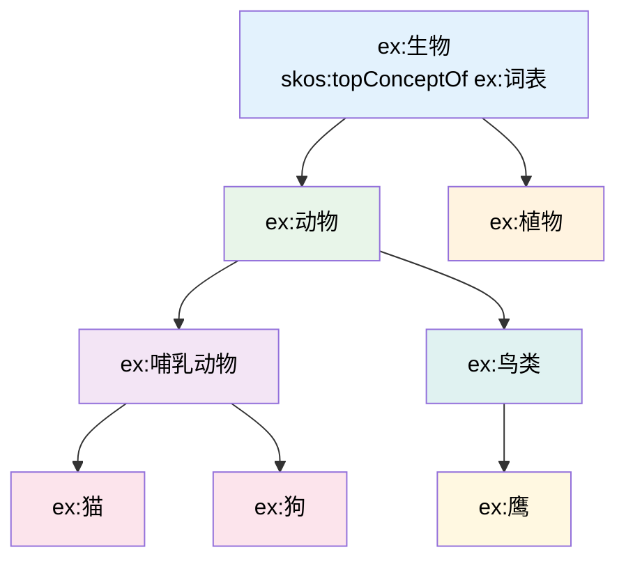

# 7.2 Concept Scheme 与 Concept：概念体系的结构

本节深入探讨 SKOS 的核心建模元素：概念（Concept）和概念方案（ConceptScheme），理解如何有效组织复杂的多语言术语系统，以及如何构建完整的知识体系结构。

> **本节要点**：掌握 SKOS 中 Concept 和 ConceptScheme 的关系，理解 skos:inScheme 的作用与推演，掌握概念集合（ConceptSet）的使用方法。

---

## 1. SKOS Concept 概念详解

### 1.1 概念的本质

SKOS 中的 `skos:Concept` 是**对现实中某个概念的抽象表达**。它不同于 RDFS 的 `rdfs:Class`——后者是具体个体的集合，而 SKOS 概念代表的是一个**认知层面的抽象单元**：

```
RDFS 的 class：  :Person 是一个类，:Alice 是一个个体实例
SKOS 的概念：  :Person（人） 本身就是一个概念，可以与其他概念建立关系

在 SKOS 模型中：
- 概念不直接包含个体
- 概念通过标签（label）来表达人类可理解的含义
- 概念通过关系（broader/narrower/related）形成结构
```

### 1.2 概念的基本属性

| SKOS 属性 | 类型 | 多重性 | 描述 |
| --- | --- | --- | --- |
| `skos:prefLabel` | 字面量（Literal） | 每种语言各 1 个 | 首选展示用名称 |
| `skos:altLabel` | 字面量（Literal） | 0 或多个 | 同义词、缩写等 |
| `skos:hiddenLabel` | 字面量（Literal） | 0 或多个 | 隐藏标签（拼写变体、敏感词） |
| `skos:scopeNote` | 字面量（Literal） | 0 或多个 | 概念使用范围的说明 |
| `skos:definition` | 字面量（Literal） | 0 或多个 | 概念的正式定义 |
| `skos:example` | 字面量（Literal） | 0 或多个 | 使用该概念的具体示例 |

### 1.3 完整概念建模示例

```turtle
@prefix skos: <http://www.w3.org/2004/02/skos/core#> .
@prefix dct: <http://purl.org/dc/terms/> .
@prefix ex: <http://example.org/thesaurus/> .

ex:机器视觉 rdf:type skos:Concept ;
    skos:inScheme ex:ComputerVisionThesaurus ;
    
    # 多语言标签
    skos:prefLabel "机器视觉"@zh , "Machine Vision"@en ;
    skos:altLabel "机视"@zh , "MV"@en ;
    skos:hiddenLabel "Machine-Vison"@en .  # 拼写错误
    
    # 语义注解（用于知识图谱增强）
    skos:scopeNote "指工业环境中的自动化图像识别技术"@zh ;
    skos:definition "The technology that enables computers to simulate human visual ability, used primarily in industrial applications for inspection, recognition and measurement."@en ;
    
    # 示例用法
    skos:example "产品外观缺陷检测"@zh , "Defect detection in manufacturing"@en .
```

### 1.4 skos:scopeNote、skos:definition、skos:example 区别表

| 属性 | 用途 | 是否用于展示 | 示例 |
| --- | --- | --- | --- |
| `skos:scopeNote` | 描述概念的使用范围和边界 | ❌ 通常不向最终用户展示 | "在本题上下文中仅指工业场景" |
| `skos:definition` | 给出概念的正式学术定义 | ✅ 可用于高级搜索展示 | "机器视觉是..." |
| `skos:example` | 提供具体的使用实例 | ✅ 用于帮助理解 | "用于缺陷检测" |

---

## 2. ConceptScheme（概念方案）深度解析

### 2.1 概念方案的本质

概念方案是一个**组织和组织单元**，将一系列相关概念按照特定的结构设计在一起：

```turtle
@prefix skos: <http://www.w3.org/2004/02/skos/core#> .
@prefix dct: <http://purl.org/dc/terms/> .
@prefix ex: <http://example.org/thesaurus/> .

ex:ComputerScienceThesaurus rdf:type skos:ConceptScheme ;
    skos:prefLabel "计算机科学主题词表"@zh ;
    skos:prefLabel "Computer Science Thesaurus"@en ;
    
    dct:title "Computer Science Subject Thesaurus"@en ;
    dct:description "计算机科学领域的受控词汇表"@zh ;
    
    dct:creator <http://isni.org/000000012109502X> ;  # 组织ID
    dct:publisher "中国计算机学会"@zh ;
    dct:issued "2024-01-01"^^xsd:date ;
    dct:modified "2024-06-15"^^xsd:date ;
    
    dct:language "zh", "en" , "ja" ;
    dct:subject <http://id.loc.gov/authorities/subjects/sh85029906> .  # 主题：计算机科学
```

### 2.2 skos:inScheme 与 skos:SchemeMembership

每个概念通过 `skos:inScheme` 表明自己属于哪个概念方案：

```turtle
# 一个概念可以属于多个词表（跨词表集成）
ex:人工智能 rdf:type skos:Concept ;
    skos:inScheme ex:ComputerScienceThesaurus .      # 属于词表A
    skos:inScheme ex:AIEngineeringThesaurus .         # 也属于词表B

# 反之，一个概念不属于任何词表的情况也是合法的（虽然不常见）
ex:自由概念 rdf:type skos:Concept ;
    skos:prefLabel "自由概念"@zh .
    # 无 skos:inScheme 声明 — 这是一个脱离词表的孤立概念
```

> **重要推理**：SKOS 的 RDFS 推理规则中，`skos:inScheme` 定义了概念与词表的从属关系，可以用于查询："词表 X 中包含哪些概念？"

---

## 3. skos:topConcept / skos:bottomConcept

### 3.1 顶层概念与底层概念

SKOS 定义了两种特殊概念标识：

| 标识 | 描述 | 关系 |
| --- | --- | --- |
| `skos:topConceptOf` | 某概念方案中的最高层概念 | 没有 `skos:broader` |
| `skos:bottomConceptOf` | 某概念方案中的最低层概念 | 没有 `skos:narrower` |

```turtle
@prefix skos: <http://www.w3.org/2004/02/skos/core#> .
@prefix dct: <http://purl.org/dc/terms/> .
@prefix ex: <http://example.org/thesaurus/> .

ex:科技词表 rdf:type skos:ConceptScheme ;
    skos:prefLabel "科技领域主题词表"@zh .

# 顶层概念：直接属于词表的根节点
ex:自然科学 skos:topConceptOf ex:科技词表 ;
    skos:prefLabel "自然科学"@zh .

ex:工程技术 skos:topConceptOf ex:科技词表 ;
    skos:prefLabel "工程技术"@zh .

# 中间概念
ex:物理学 skos:broader ex:自然科学 ;
    skos:prefLabel "物理学"@zh .

# 底层概念：没有更细分的子概念
ex:量子力学 skos:broader ex:物理学 ;
    skos:bottomConceptOf ex:科技词表 ;
    skos:prefLabel "量子力学"@zh .
```

### 3.2 顶层/底层关系的约束

| 约束规则 | 描述 |
| --- | --- |
| **无 broader 约束** | 顶层概念在所属词表中没有 `skos:broader` |
| **无 narrower 约束** | 底层概念在所属词表中没有 `skos:narrower` |
| **可以有多个顶层** | 一个词表可以有多个顶层概念 |
| **可以有多个底层** | 一个词表可以有多个底层概念 |
| **不能同时** | 单个概念可同时是顶层和底层（如仅有一个概念时） |

---

## 4. ConceptSet（概念集合）：灵活的概念分组

### 4.1 ConceptSet 的定义与用途

`skos:Collection` 是 SKOS 提供的机制，用于将一组概念**逻辑分组**，而不要求它们是直接的层次关系：

```turtle
@prefix skos: <http://www.w3.org/2004/02/skos/core#> .
@prefix ex: <http://example.org/thesaurus/> .

ex:前沿技术领域 rdf:type skos:Collection ;
    skos:prefLabel "前沿技术领域"@zh .

ex:前沿技术领域 skos:member ex:人工智能 ;
                skos:member ex:量子计算 ;
                skos:member ex:区块链 ;
                skos:member ex:基因编辑 .

# 说明：这四个概念可能来自词表的不同分支
# - 人工智能 和 量子计算 可能属于 计算机科学 下
# - 区块链 可能属于 信息技术 下
# - 基因编辑 可能属于 生物学 下
# 但是 skos:Collection 将它们逻辑地归为一组
```

### 4.2 Collection vs ConceptScheme

| 特性 | ConceptScheme | Collection |
| --- | --- | --- |
| 语义 | 一个完整的、有结构的词表 | 概念的选择性分组 |
| 层次 | 要求有层次结构（broader/narrower） | 不要求层次 |
| 封闭性 | 包含概念及其全部关系 | 仅包含指定成员 |
| 适用场景 | 完整的主题词表、分类体系 | 临时分组、专题聚合、跨词表集合 |

### 4.3 嵌套集合与成员关系

```turtle
# 集合可以是嵌套的
ex:智能系统 rdf:type skos:Collection ;
    skos:prefLabel "智能系统"@zh ;
    skos:member ex:人工智能 ;
    skos:member ex:机器学习 .

ex:人工智能系统 rdf:type skos:Collection ;
    skos:prefLabel "人工智能系统"@zh ;
    skos:member ex:专家系统 ;
    skos:member ex:神经网络 ;
    skos:member ex:智能机器人 .

# 集合可以作为展示用途的分组
ex:智能系统 skos:member ex:专家系统 .
```

---

## 5. 概念组织实践指南

### 5.1 概念建模的步骤

| 步骤 | 操作 | 产出 |
| --- | --- | --- |
| 1 | **确定词表范围** | ConceptScheme 声明 |
| 2 | **列出所有概念** | skos:Concept 实体 |
| 3 | **为每个概念添加标签** | prefLabel（多语言）、altLabel |
| 4 | **建立层级关系** | broader / narrower |
| 5 | **建立关联关系** | related、exactMatch 等 |
| 6 | **组织展示分组** | skos:Collection |
| 7 | **添加元数据** | dct:title、dct:description、dct:creator 等 |

### 5.2 命名指南

| 命名约定 | 建议 |
| --- | --- |
| 概念标识符（IRI） | 使用有意义的命名，如 `ex:MachineLearning` |
| 词表标识符 | 以 `Scheme` 或 `Thesaurus` 结尾，如 `ex:BiologyThesaurus` |
| 集合标识符 | 以 `Collection` 或 `Group` 结尾 |

### 5.3 命名空间声明标准

```turtle
# 推荐使用标准的 SKOS 命名空间
@prefix skos: <http://www.w3.org/2004/02/skos/core#> .

# 可选：创建 skos:extension 命名空间（SKOS 扩展）
@prefix skosex: <http://www.w3.org/2004/02/skos/extension#> .

# 推荐：结合 Dublin Core 使用
@prefix dct: <http://purl.org/dc/terms/> .
```

---

## 6. 层级结构深度分析

### 6.1 skos:broader 的性质对比

| 性质 | 描述 |
| --- | --- |
| **非自反** | 概念不能 broader 自身（`A skos:broader A` 无效） |
| **非对称** | 如果 A broader B，B 不能 broader A |
| **传递性** | 如果 A broader B 且 B broader C → A broader C（推理可推导） |
| **单向** | broader 是 narrower 的逆，但不自动对称 |

### 6.2 与 rdfs:subClassOf 的关系分析

虽然 SKOS 的层级不等同于 RDFS 的类继承，但它们可以**混合使用**：

```turtle
@prefix skos: <http://www.w3.org/2004/02/skos/core#> .
@prefix rdfs: <http://www.w3.org/2000/01/rdf-schema#> .
@prefix ex: <http://example.org/> .

# RDFS：严格类层次
ex:动物 rdfs:subClassOf ex:生物 .
ex:猫 rdfs:subClassOf ex:动物 .
ex:加菲猫 rdf:type ex:猫 .
# 推理：加菲猫 自动是 动物 和 生物 的子类

# SKOS：概念认知层级
ex:动物 skos:broader ex:生物 .
ex:猫 skos:broader ex:动物 .
# 注意：这不是类包含关系，是认知上的"更具体"

# 混合使用示例
ex:猫 skos:broader ex:动物 .
ex:猫 rdfs:subClassOf ex:动物 .
# 两者并存 — RDFS 用于推理，SKOS 用于展示
```

### 6.3 层级结构推导示意



---

## 7. 小结

本节要点总结：

1. `skos:Concept` 是知识的抽象单元，通过标签（prefLabel/altLabel/hiddenLabel）展示给人，通过关系（broader/narrower/related）形成结构。
2. `skos:ConceptScheme` 是概念的集合，包含完整的主题词表信息。
3. `skos:inScheme` 声明了概念与词表的归属关系。
4. `skos:topConceptOf` / `skos:bottomConceptOf` 定义词表中的最高层和最底层概念。
5. `skos:Collection` 提供灵活的概念分组机制，与概念方案不同，不要求层次关系。

---

## 8. 延伸阅读

| 资源 | 描述 | 链接 |
| --- | --- | --- |
| SKOS 参考指南 | W3C SKOS Core Specification 4.4 节 | [https://www.w3.org/TR/skos-reference/#concepts](https://www.w3.org/TR/skos-reference/#concepts) |
| SKOS Concept 概念模型 | 概念与概念方案详细说明 | [https://www.w3.org/TR/skos-reference/#concepts](https://www.w3.org/TR/skos-reference/#concepts) |
| SKOS Collection 使用 | SKOS 概念集合指南 | [https://www.w3.org/TR/skos-reference/#collections](https://www.w3.org/TR/skos-reference/#collections) |

---

## 9. 练习

### 练习 1：概念建模

请为以下医学主题词表的部分内容创建 SKOS 声明：

- 词表名：医学主题词表（Medical Subject Thesaurus）
- 顶层概念：生物学、医学、药学
- 生物学（下层）：
  - 细胞生物学
    - 分子生物学（底層概念）
  - 遗传学（底層概念）
- 要求包含中文和英文标签，并添加 skos:scopeNote 说明使用范围。

### 练习 2：顶层/底层分析

给定以下 SKOS 概念关系图：

```
教育（顶层概念）
├── 高等教育
│   ├── 本科教育
│   └── 研究生教育（底层）
├── 职业教育（底层）
└── 基础教育
    ├── 学前教育
    ├── 小学教育（底层）
    └── 中学教育（底层）
```

请回答：
1. 哪些概念是 `skos:topConceptOf`？
2. 哪些概念是 `skos:bottomConceptOf`？
3. "高等教育" 有哪些层级关系（broader/narrower）？