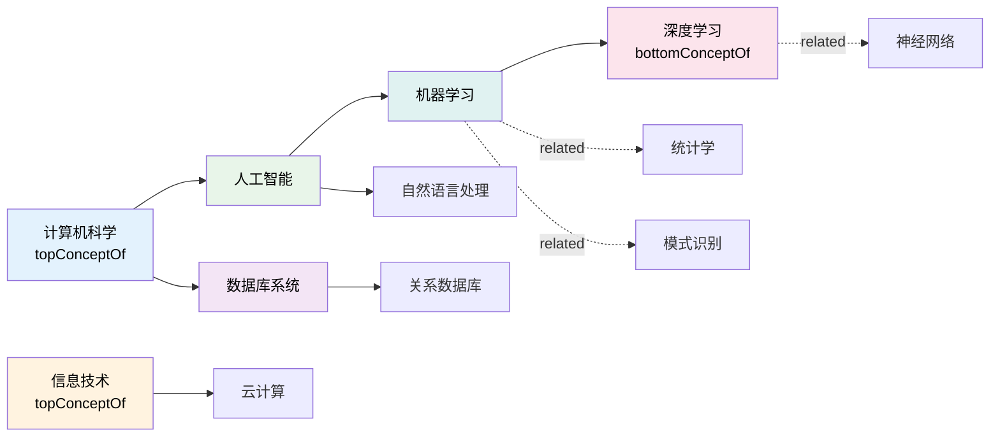

# 7.3 标签体系与关系：深入 SKOS 标签与关联

本节详细讲解 SKOS 的标签体系（prefLabel/altLabel/hiddenLabel）和概念间关系（broader/narrower/related）及映射属性。通过大量示例理解如何高效构建和维护知识体系。

> **本节要点**：深入理解三种标签的语义区别和渲染策略，全面掌握 SKOS 层级/相关/映射三类关系，以及如何组合使用它们构建复杂词表。

---

## 1. 标签体系深度解析

### 1.1 三种标签的语义区别

| 标签类型 | 英文名称 | 用途 | 展示优先级 | 可重复性 |
| --- | --- | --- | --- | --- |
| `skos:prefLabel` | Preferred Label | 首选展示名称 | **最高** — 搜索结果中首显 | 每种语言 **仅 1 个** |
| `skos:altLabel` | Alternate Label | 同义词、变体、缩写 | **中等** — 显示在结果详情 | 每种语言 **可多个** |
| `skos:hiddenLabel` | Hidden Label | 拼写错误、非正式用语、索引关键字 | **最低** — 仅用于搜索索引 | 每种语言 **可多个** |

```turtle
@prefix skos: <http://www.w3.org/2004/02/skos/core#> .
@prefix ex: <http://example.org/label/> .

ex:量子计算 rdf:type skos:Concept ;
    skos:inScheme ex:计算机科技词表 ;
    
    # 首选标签（每个语言一个）
    skos:prefLabel "量子计算"@zh , "Quantum Computing"@en ;
    
    # 替代标签（同义词、缩写、变体）
    skos:altLabel "量子算法"@zh , "QC"@en , "量子科技"@zh ;
    
    # 隐藏标签（拼写错误变体等）
    skos:hiddenLabel "量子計术"@zh  # 繁体错字
       skos:hiddenLabel "Quantome Computing"@en  # 拼写错误
       skos:hiddenLabel "Quantem Computng"@en .  # 多个拼写错误
```

### 1.2 标签渲染指南（用户界面最佳实践）

当展示 SKOS 概念时，推荐的分层渲染逻辑如下：

```
前端显示逻辑伪代码：
function renderConcept(concept, lang) {
    // 1. 优先显示 prefLabel（如果存在该语言）
    if (concept.prefLabel(lang)) {
        return concept.prefLabel(lang);
    }
    
    // 2. 回退到任意语言的 prefLabel
    if (concept.anyPrefLabel()) {
        return concept.anyPrefLabel();
    }
    
    // 3. 最后才显示 altLabel
    if (concept.altLabel(lang)) {
        return concept.altLabel(lang);
    }
    
    // 4. 完全不显示 hiddenLabel
    // hiddenLabel 仅用于搜索索引匹配
}
```

### 1.3 skos:notation — 数值或代码标签

除了文字标签，SKOS 还定义了 `skos:notation` 用于表示概念的**代码或数值标识**：

```turtle
@prefix skos: <http://www.w3.org/2004/02/skos/core#> .
@prefix ex: <http://example.org/> .
@prefix xsd: <http://www.w3.org/2001/XMLSchema#> .

ex:杜威分类号830 rdf:type skos:Concept ;
    skos:prefLabel "中国文学"@zh ;
    skos:notation "830" ;
    skos:notation "895.74"^^xsd:decimal .  # 更精确的分类号

ex:ISBN978 rdf:type skos:Concept ;
    skos:prefLabel "ISBN-13 以 978 开头"@zh ;
    skos:notation "978" .
```

`skos:notation` 与标签的区别：
| 特性 | skos:prefLabel | skos:notation |
| --- | --- | --- |
| 数据类型 | 带语言标签的字面量 | 字面量（无语言） |
| 用途 | 人类可读名称 | 数值代码、编号 |
| 搜索用途 | 关键词搜索 | 精确匹配搜索 |

---

## 2. 概念间关系体系

### 2.1 关系总览

SKOS 提供了 **3 类关系**用于组织概念：

```
┌─────────────────────────────────────────────────────────┐
│                  SKOS 概念关系类型                        │
├─────────────┬───────────────────────────────────────────┤
│ 层级关系     │  broader (上级) ← → narrower (下级)       │
│ (Hierarchical)│                                        │
├─────────────┼───────────────────────────────────────────┤
│ 关联关系     │  related（横向关联，对称）                  │
│ (Horizontal) │                                        │
├─────────────┼───────────────────────────────────────────┤
│ 映射关系     │  exactMatch / closeMatch / broadMatch /    │
│ (Mapping)   │  narrowMatch / relatedMatch              │
└─────────────┴───────────────────────────────────────────┘
```

### 2.2 层级关系：broader / narrower

| 规则 | 说明 |
| --- | --- |
| 有序关系（Ordered） | `broader` 和 `narrower` 互为逆关系 |
| 传递性 | A narrower B 且 B narrower C → A narrower C |
| 非自反性 | 不能 A narrower A |
| 语义 | 表示概念间的认知"更具体/更一般"关系 |

**层级关系与 RDFS subClassOf 对比**：

| 对比维度 | `skos:broader/narrower` | `rdfs:subClassOf` |
| --- | --- | --- |
| 语义本质 | 概念间的"更具体"认知 | 集合包含（子类 ⊆ 父类） |
| 个体实例 | 概念不直接包含个体 | 类直接包含个体 |
| 推理 | 弱（认知层级，非严格包含） | 强（严格的类型传递） |
| 映射现实 | 更接近人类心智分类 | 更接近形式逻辑分类 |

```turtle
# SKOS 认知层级
ex:智能手机 skos:broader ex:移动设备 .
ex:移动设备 skos:broader ex:电子设备 .
# → 表示：智能手机在认知层级上比移动设备更具体

# 这不是严格的类包含 — 
# 例如："智能手机" 不是 "移动设备" 的子类，
# 而是人类知识体系中的"更具体的类别"
```

### 2.3 关联关系：skos:related

`skos:related` 描述了概念间的**横向关联关系**：

| 规则 | 说明 |
| --- | --- |
| 对称性 | A related B → B related A （自动推导） |
| 非传递性 | A related B 且 B related C **不** → A related C |
| 自反性 | 通常不用 |

```turtle
@prefix skos: <http://www.w3.org/2004/02/skos/core#> .
@prefix ex: <http://example.org/rel/> .

ex:机器学习 skos:related ex:统计学 ;      # 关联统计学习方法论
    skos:related ex:计算机科学 ;        # 关联学科归属
    skos:related ex:数据挖掘 ;         # 关联应用领域

ex:深度学习 skos:broader ex:机器学习 .
ex:神经网络 skos:broader ex:深度学习 .

# 推理：神经网络 related 统计学 ？？
# 不能推导出！因为 related 不传递。
# 但是可以通过 SPARQL 等工具进行遍历查询。
```

### 2.4 映射属性：Match Properties

SKOS 定义了 5 种映射属性用于**跨词表/跨语言概念对齐**：

| 映射属性 | 对称性 | 用途 |
| --- | --- | --- |
| `skos:exactMatch` | ✅ | 精确匹配 — 两个词表中的相同概念 |
| `skos:closeMatch` | ✅ | 近亲匹配 — 概念接近但不完全相同 |
| `skos:broadMatch` | ❌ | 上词映射 — A 的概念对应 B 的更一般概念 |
| `skos:narrowMatch` | ❌ | 下词映射 — A 的概念对应 B 的更具体概念 |
| `skos:relatedMatch` | ✅ | 相关项映射 — 关联概念的跨词表映射 |

```turtle
@prefix skos: <http://www.w3.org/2004/02/skos/core#> .
@prefix en: <http://wordnet.princeton.edu/wn30/> .
@prefix zh: <http://examples.org/zh-thesaurus/> .

# 精确匹配（跨语言）
en:Dog skos:exactMatch zh:狗 .
en:MachineLearning skos:exactMatch zh:机器学习 .

# 近亲匹配
en:ArtificialIntelligence skos:closeMatch zh:人工智能 .

# 上词映射
en:Device skos:broadMatch zh:电子设备 .   # en 的 Device 比 zh:电子设备更一般

# 下词映射
zh:基因编辑 skos:narrowMatch en:GeneticEngineering .  # zh 的更具体

# 相关映射
zh:知识图谱 skos:relatedMatch en:KnowledgeGraph .
```

---

## 3. 复杂层级建模实例

### 3.1 完整的科技主题词表

```turtle
@prefix skos: <http://www.w3.org/2004/02/skos/core#> .
@prefix dct: <http://purl.org/dc/terms/> .
@prefix ex: <http://example.org/thesaurus/CS/> .

# === 概念方案 ===
ex:thesaurus rdf:type skos:ConceptScheme ;
    skos:prefLabel "计算机科学主题词表"@zh ;
    dct:issued "2024-01-01"^^xsd:date .

# === 顶层概念 ===
ex:计算机科学 skos:topConceptOf ex:thesaurus ;
    skos:prefLabel "计算机科学"@zh , "Computer Science"@en .

ex:信息技术 skos:topConceptOf ex:thesaurus ;
    skos:prefLabel "信息技术"@zh , "Information Technology"@en .

# === 一级子概念 ===
ex:人工智能 skos:broader ex:计算机科学 ;
    skos:prefLabel "人工智能"@zh , "Artificial Intelligence"@en ;
    skos:related ex:数据挖掘 , ex:机器人学 .

ex:数据库系统 skos:broader ex:计算机科学 ;
    skos:prefLabel "数据库系统"@zh , "Database Systems"@en .

ex:云计算 skos:broader ex:信息技术 ;
    skos:prefLabel "云计算"@zh , "Cloud Computing"@en .

# === 二级子概念 ===
ex:机器学习 skos:broader ex:人工智能 ;
    skos:altLabel "ML"@en ;
    skos:prefLabel "机器学习"@zh , "Machine Learning"@en .

ex:深度学习 skos:broader ex:机器学习 ;
    skos:bottomConceptOf ex:thesaurus ;
    skos:prefLabel "深度学习"@zh , "Deep Learning"@en .

ex:关系数据库 skos:broader ex:数据库系统 ;
    skos:prefLabel "关系数据库"@zh , "Relational Database"@en .

# === 横向关联 ===
ex:机器学习 skos:related ex:统计学 , ex:模式识别 ;
ex:深度学习 skos:related ex:神经网络 ;
ex:关系数据库 skos:related ex:NoSQL .
```

### 3.2 概念关系图



---

## 4. 实践注意事项

### 4.1 标签使用建议

| 场景 | 建议使用 | 原因 |
| --- | --- | --- |
| 用户界面主标题 | `skos:prefLabel` | 符合用户预期，展示首选名称 |
| 搜索词扩展 | `skos:altLabel` + `skos:hiddenLabel` | 提升召回率 |
| 内部系统标识 | `skos:notation` | 便于程序处理和精确匹配 |
| 同义词导航 | `skos:altLabel` | "您是否在找：..." 展示 |

### 4.2 关系建模最佳实践

| 建议 | 理由 |
| --- | --- |
| **一致性** | 始终使用 `broader` 或 `narrower` 其中之一定义层级（不要混用同一个概念对） |
| **避免循环** | 不要创建 A broader B 且 B broader A 的循环 |
| **标记顶层/底层** | 使用 `skos:topConceptOf` / `skos:bottomConceptOf` 明确边界 |
| **使用映射属性** | 跨词表对接时，优先使用 `exactMatch` 而非手工复制概念 |
| **使用 Collection** | 临时分组（如"热门概念"）使用 Collection 而非新建概念方案 |

### 4.3 多语言标签管理

```turtle
# ✅ 正确：为不同语言添加独立的 prefLabel
ex:深度学习 skos:prefLabel "深度学习"@zh , "Deep Learning"@en , "深層学習"@ja .

# ❌ 错误：用 prefLabel 承载同义词信息
ex:错误标签 skos:prefLabel "机器学习"@zh , "AI"@zh .
# → "AI" 不是"机器学习"的首选标签，应该用 altLabel
ex:正确标签 skos:prefLabel "机器学习"@zh ;
              skos:altLabel "AI"@zh .
```

---

## 5. 小结算

1. **标签体系**：`prefLabel`（首选展示）> `altLabel`（同义词）> `hiddenLabel`（搜索索引）三层递进。
2. **层级关系**：`broader`/`narrower` 互为逆关系，支持传递但不自反。
3. **关联关系**：`related` 是横向关联关系，对称但不传递。
4. **映射属性**：`exactMatch`、`closeMatch`、`broadMatch` 等支持跨词表对齐。
5. **实践要点**：标签区分展示/搜索用途，关系避免循环，多语言管理规范化。

---

## 6. 延伸阅读

| 资源 | 描述 | 链接 |
| --- | --- | --- |
| SKOS Labels | 标签体系官方指南 | [https://www.w3.org/TR/skos-reference/#labels](https://www.w3.org/TR/skos-reference/#labels) |
| SKOS Concepts | 概念间关系详细说明 | [https://www.w3.org/TR/skos-reference/#semantic-relationships](https://www.w3.org/TR/skos-reference/#semantic-relationships) |
| SKOS Match Properties | 映射属性使用指南 | [https://www.w3.org/TR/skos-reference/#mapping](https://www.w3.org/TR/skos-reference/#mapping) |

---

## 7. 练习

### 练习 1：标签类型分配

为概念"万维网（WWW）"分配合适的标签类型：

| 标签 | 推荐类型 | 理由 |
| --- | --- | --- |
| "万维网" | | |
| "WWW" | | |
| "Web"@en | | |
| "WorldWideWeb" (typo) | | |
| "互联网络" (同义词) | | |

### 练习 2：层级与关联建模

构建一个"生物学研究技术"词表片段，包含：
- 顶层概念：分子生物学技术、细胞生物学技术
- 分子生物学下：PCR、基因测序、Western Blot
- 细胞生物学下：流式细胞术、免疫组化
- PCR related 基因测序

请写出 SKOS Turtle 声明。