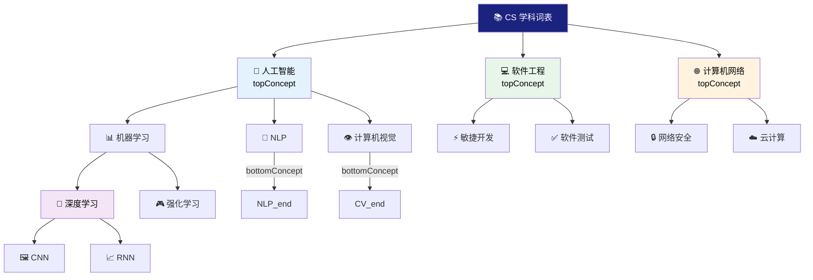

# 7.4 综合练习：学科主题词表

本节通过一个综合性实践项目，将第 7 章所学内容整合应用。任务是构建一个完整的"计算机科学学科主题词表"，要求使用 SKOS 词汇完整建模并包含多语言标签、层级关系和相关映射。

> **本节要点**：通过实践掌握完整词表构建流程，理解多语言、层级、关联、映射在实际词表建模中的综合运用。

---

## 1. 任务说明

### 1.1 需求概述

构建一个 **"Computer Science Subject Thesaurus（计算机科学学科主题词表）"**，具体要求：

1. 创建完整的 SKOS ConceptScheme
2. 至少包含 3 个顶层概念、10 个一级子概念
3. 包含多语言标签（中文 + 英文）
4. 建立完整层级关系（broader/narrower）
5. 添加相关关系（related）
6. 添加概念备注（scopeNote/definition）
7. 包含至少 2 组跨语言精确映射（exactMatch）

### 1.2 目标输出

| 交付物 | 格式 | 说明 |
| --- | --- | --- |
| 词表本体 | Turtle 语法 (`.ttl`) | 完整 SKOS 数据 |
| 词表架构图 | Mermaid 图 | 层级与关系可视化 |

---

## 2. 词表结构设计

### 2.1 词表元数据

| 属性 | 值 |
| --- | --- |
| ConceptScheme IRI | `http://example.org/thesaurus/CS` |
| 中文名称 | 计算机科学学科主题词表 |
| 英文名称 | Computer Science Subject Thesaurus |
| 发布版本 | 1.0.0 |
| 创建日期 | 2024-01-01 |
| 涵盖语言 | zh, en |

### 2.2 概念结构规划

```
计算机科学主题词表
├── A 顶层概念：人工智能、软件工程、计算机网络
├── B 人工智能下
│   ├── 机器学习 → 深度学习（底层）
│   ├── 自然语言处理（底层）
│   └── 计算机视觉（底层）
├── C 软件工程下
│   ├── 敏捷开发（底层）
│   └── 软件测试（底层）
└── D 计算机网络下
    ├── 网络安全（底层）
    └── 云计算
```

---

## 3. 完整实现示例

### 3.1 Turtle 代码

```turtle
@prefix skos: <http://www.w3.org/2004/02/skos/core#> .
@prefix dct: <http://purl.org/dc/terms/> .
@prefix xsd: <http://www.w3.org/2001/XMLSchema#> .
@prefix cs: <http://example.org/thesaurus/CS/> .

# ============================================================
# 概念方案（ConceptScheme）
# ============================================================
cs:thesaurus rdf:type skos:ConceptScheme ;
    skos:prefLabel "计算机科学学科主题词表"@zh ,
                   "Computer Science Subject Thesaurus"@en ;
    dct:title "Computer Science Subject Thesaurus"@en ;
    dct:description "计算机科学领域的受控词表"@zh ;
    dct:created "2024-01-01"^^xsd:date ;
    dct:modified "2024-12-15"^^xsd:date ;
    dct:language "zh", "en" .

# ============================================================
# 顶层概念 A：人工智能
# ============================================================
cs:AI rdf:type skos:Concept ;
    skos:inScheme cs:thesaurus ;
    skos:topConceptOf cs:thesaurus ;
    skos:prefLabel "人工智能"@zh , "Artificial Intelligence"@en ;
    skos:altLabel "AI"@en ;
    skos:scopeNote "在本词表中专指使计算机模拟人类智能行为的技术领域"@zh ;
    skos:definition "The simulation of human intelligence processes by computer systems."@en ;
    skos:broader cs:thesaurus .  # 实际上顶层概念不需要声明broader给scheme本身

# ============================================================
# 人工智能的子概念
# ============================================================

# — 一级子概念：机器学习 —
cs:MachineLearning rdf:type skos:Concept ;
    skos:inScheme cs:thesaurus ;
    skos:prefLabel "机器学习"@zh , "Machine Learning"@en ;
    skos:altLabel "ML"@en ;
    skos:scopeNote "研究如何通过计算手段利用经验改进系统性能的理论与方法"@zh ;
    skos:broader cs:AI ;
    skos:narrower cs:DeepLearning , cs:ReinforcementLearning .

# — 一级子概念：自然语言处理 —
cs:NLP rdf:type skos:Concept ;
    skos:inScheme cs:thesaurus ;
    skos:prefLabel "自然语言处理"@zh , "Natural Language Processing"@en ;
    skos:altLabel "NLP"@en ;
    skos:scopeNote "涵盖文本分类、信息抽取、机器翻译等应用任务"@zh ;
    skos:broader cs:AI ;
    skos:bottomConceptOf cs:thesaurus .

# — 一级子概念：计算机视觉 —
cs:ComputerVision rdf:type skos:Concept ;
    skos:inScheme cs:thesaurus ;
    skos:prefLabel "计算机视觉"@zh , "Computer Vision"@en ;
    skos:altLabel "CV"@en ;
    skos:scopeNote "使计算机从图像或视频中理解和提取信息的技术"@zh ;
    skos:broader cs:AI ;
    skos:bottomConceptOf cs:thesaurus .

# — 二级子概念：深度学习 —
cs:DeepLearning rdf:type skos:Concept ;
    skos:inScheme cs:thesaurus ;
    skos:prefLabel "深度学习"@zh , "Deep Learning"@en ;
    skos:altLabel "深度神经网络"@zh , "DL"@en ;
    skos:definition "基于多层神经元的机器学习方法"@zh ;
    skos:broader cs:MachineLearning ;
    skos:narrower cs:ConvolutionalNeuralNetwork , cs:RecurrentNeuralNetwork ;
    skos:bottomConceptOf cs:thesaurus .

# — 二级子概念：强化学习 —
cs:ReinforcementLearning rdf:type skos:Concept ;
    skos:inScheme cs:thesaurus ;
    skos:prefLabel "强化学习"@zh , "Reinforcement Learning"@en ;
    skos:altLabel "RL"@en ;
    skos:definition "通过与环境交互获得奖励信号来学习最优策略的方法"@zh ;
    skos:broader cs:MachineLearning ;
    skos:bottomConceptOf cs:thesaurus .

# — 二级子概念：卷积神经网络（CNN）—
cs:CNN rdf:type skos:Concept ;
    skos:inScheme cs:thesaurus ;
    skos:prefLabel "卷积神经网络"@zh , "Convolutional Neural Network"@en ;
    skos:altLabel "CNN"@en ;
    skos:scopeNote "常用于图像识别与目标检测的神经网络架构"@zh ;
    skos:broader cs:DeepLearning ;
    skos:related cs:计算机视觉 .

# — 二级子概念：循环神经网络（RNN）—
cs:RNN rdf:type skos:Concept ;
    skos:inScheme cs:thesaurus ;
    skos:prefLabel "循环神经网络"@zh , "Recurrent Neural Network"@en ;
    skos:altLabel "RNN"@en ;
    skos:scopeNote "常用于序列数据处理的神经网络架构"@zh ;
    skos:broader cs:DeepLearning ;
    skos:related cs:NLP .

# ============================================================
# 相关关系（Horizontal Relationships）
# ============================================================
cs:MachineLearning skos:related cs:NLP , cs:ComputerVision , cs:Statistics .

cs:DeepLearning skos:related cs:神经网络 , cs:大数据 .

# ============================================================
# 顶层概念 B：软件工程
# ============================================================
cs:SoftwareEngineering rdf:type skos:Concept ;
    skos:inScheme cs:thesaurus ;
    skos:topConceptOf cs:thesaurus ;
    skos:prefLabel "软件工程"@zh , "Software Engineering"@en ;
    skos:definition "将工程化方法应用于软件开发、运维和管理的学科"@zh ;
    skos:narrower cs:AgileDevelopment , cs:SoftwareTesting .

# — 子概念：敏捷开发 —
cs:AgileDevelopment rdf:type skos:Concept ;
    skos:inScheme cs:thesaurus ;
    skos:prefLabel "敏捷开发"@zh , "Agile Development"@en ;
    skos:definition "迭代式增量开发的软件项目管理方法论"@zh ;
    skos:broader cs:SoftwareEngineering ;
    skos:bottomConceptOf cs:thesaurus ;
    skos:related cs:DevOps .

# — 子概念：软件测试 —
cs:SoftwareTesting rdf:type skos:Concept ;
    skos:inScheme cs:thesaurus ;
    skos:prefLabel "软件测试"@zh , "Software Testing"@en ;
    skos:definition "评估软件产品是否满足规格要求的过程"@zh ;
    skos:broader cs:SoftwareEngineering ;
    skos:bottomConceptOf cs:thesaurus ;
    skos:related cs:质量保证 .

# ============================================================
# 顶层概念 C：计算机网络
# ============================================================
cs:ComputerNetwork rdf:type skos:Concept ;
    skos:inScheme cs:thesaurus ;
    skos:topConceptOf cs:thesaurus ;
    skos:prefLabel "计算机网络"@zh , "Computer Network"@en ;
    skos:definition "将地理位置不同的计算机连接以实现资源共享的系统"@zh ;
    skos:narrower cs:NetworkSecurity , cs:CloudComputing .

# — 子概念：网络安全 —
cs:NetworkSecurity rdf:type skos:Concept ;
    skos:inScheme cs:thesaurus ;
    skos:prefLabel "网络安全"@zh , "Network Security"@en ;
    skos:definition "保护网络设备及数据安全的技术和实践"@zh ;
    skos:broader cs:ComputerNetwork ;
    skos:bottomConceptOf cs:thesaurus ;
    skos:related cs:密码学 .

# — 子概念：云计算 —
cs:CloudComputing rdf:type skos:Concept ;
    skos:inScheme cs:thesaurus ;
    skos:prefLabel "云计算"@zh , "Cloud Computing"@en ;
    skos:altLabel "云"@zh , "Cloud"@en ;
    skos:definition "基于互联网按需提供计算资源的服务模式"@zh ;
    skos:broader cs:ComputerNetwork ;
    skos:bottomConceptOf cs:thesaurus .
    skos:related cs:虚拟化 , cs:边缘计算 .

# ============================================================
# 跨语言映射（Cross-language Mapping）
# ============================================================
# 假设存在一个英文词表
@prefix en: <http://example.org/thesaurus/EN/> .

cs:AI skos:exactMatch en:AI .
cs:MachineLearning skos:exactMatch en:MachineLearning .
cs:AgileDevelopment skos:closeMatch en:AgileSoftwareDevelopment .

# ============================================================
# 概念集合（Collection）
# ============================================================
cs:热门技术 rdf:type skos:Collection ;
    skos:prefLabel "计算机科学热门技术"@zh ;
    skos:member cs:DeepLearning ;
    skos:member cs:云计算 .
```

### 3.2 Mermaid 结构可视化



---

## 4. SPARQL 查询实践

使用上述词表数据，以下 SPARQL 查询可用于验证词表完整性：

### 4.1 查询所有顶层概念

```sparql
PREFIX skos: <http://www.w3.org/2004/02/skos/core#>

SELECT ?concept ?label
WHERE {
    ?concept skos:topConceptOf cs:thesaurus .
    ?concept skos:prefLabel ?label .
    FILTER(LANG(?label) = "zh")
}
ORDER BY ?label
```

### 4.2 查询概念及其所有直接子概念

```sparql
PREFIX skos: <http://www.w3.org/2004/02/skos/core#>

SELECT ?parent ?parentLabel ?child ?childLabel
WHERE {
    ?child skos:broader ?parent .
    ?child skos:inScheme cs:thesaurus .
    ?parent skos:prefLabel ?parentLabel .
    ?child skos:prefLabel ?childLabel .
    FILTER(LANG(?parentLabel) = "zh")
    FILTER(LANG(?childLabel) = "zh")
}
```

### 4.3 查询词表中概念总数和标签统计

```sparql
PREFIX skos: <http://www.w3.org/2004/02/skos/core#>

SELECT 
    COUNT(?concept) AS ?totalConcepts
    (COUNT(?prefLabel) AS ?totalPrefLabels)
    (COUNT(?altLabel) AS ?totalAltLabels)
WHERE {
    ?concept a skos:Concept .
    OPTIONAL { ?concept skos:prefLabel ?prefLabel . }
    OPTIONAL { ?concept skos:altLabel ?altLabel . }
}
```

---

## 5. 评估标准

以下表格作为自评标准：

| 评估项 | 满分 | 要求 |
| --- | --- | --- |
| 词表元数据 | 10 | 包含完整的 ConceptScheme 定义（title、description、version、date） |
| 顶层概念数量 | 10 | ≥ 3 个并标记 `topConceptOf` |
| 总概念数量 | 20 | ≥ 12 个概念，层次清晰 |
| 标签完整性 | 15 | 每个概念含 `prefLabel`，部分含 `altLabel` 和 `scopeNote` |
| 层级关系 | 20 | 使用 `broader/narrower` 构建层级 |
| 相关关系 | 10 | 添加至少 3 条 `related` 关系 |
| 映射/集合 | 10 | 至少 2 组 exactMatch 或包含 Collection |

---

## 6. 扩展练习（进阶）

### 6.1 多语言扩展

尝试为以下概念添加日语（ja）和韩语（ko）标签：
- 人工智能 → AI/知能情報処理（ja）/ 인공지능（ko）
- 机器学习 → Machine Learning/機械学習（ja）/ 머신러닝（ko）

### 6.2 跨词表映射

假设有以下英文词表（EN Thesaurus）概念：
```turtle
@prefix en: <http://example.org/thesaurus/EN/> .

en:MachineLearning skos:prefLabel "Machine Learning"@en .
en:SoftwareTesting skos:prefLabel "Software Testing"@en .
```

请将中文词表中对应概念与英文词表建立映射关系。

### 6.3 构建集合分类

创建一个名为"研究方向"的 Collection，包含：
- 深度学习
- 自然语言处理
- 计算机视觉
- 网络安全