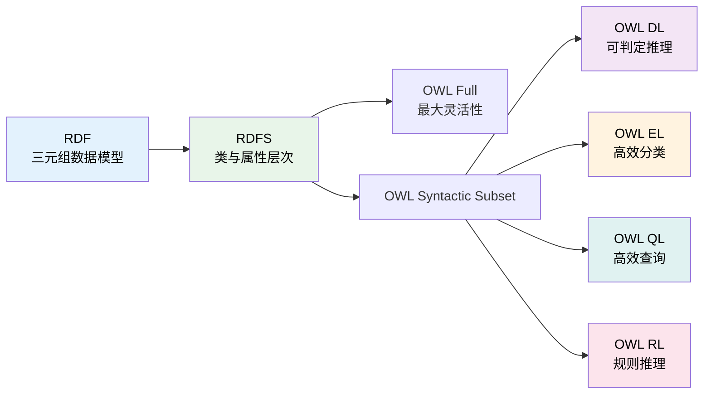

# 8.1 为什么需要 OWL：RDFS 的不足

> **本节要点**：理解 RDF/RDFS 的表达能力局限，掌握 OWL 带来的核心改进。

---

## 1. RDF/RDFS 的表达能力局限

RDF/RDFS 作为语义网的基础层，虽然简洁高效，但在实际本体建模中暴露出以下不足：

### 1.1 不支持不相交性（Disjointness）

**问题**：RDFS 无法声明两个类是不相交的。

```turtle
# RDFS 无法表达：人和动物是不相交的
:Person a rdfs:Class .
:Animal a rdfs:Class .
# 缺少不相交声明 → 推理器无法判断一个人不能同时是动物
```

**OWL 解决方案**：
```turtle
:Person owl:disjointWith :Animal .
```

### 1.2 不支持属性特征（Property Features）

**问题**：RDFS 无法声明属性的语义特征。

| 属性特征 | 说明 | RDFS | OWL |
|----------|------|------|-----|
| 传递性 | A→B 且 B→C 则 A→C | ❌ | ✅ `owl:TransitiveProperty` |
| 对称性 | A→B 则 B→A | ❌ | ✅ `owl:SymmetricProperty` |
| 函数性 | 一个主体只能有一个对象值 | ❌ | ✅ `owl:FunctionalProperty` |
| 逆属性 | A 的逆是 B | ❌ | ✅ `owl:inverseOf` |

### 1.3 不支持基数约束（Cardinality Constraints）

**问题**：RDFS 无法限制属性的最小/最大使用次数。

```turtle
# RDFS 无法表达：一个人必须有且只有一个出生日期
# OWL 可以：
:Person owl:cardinality 1 ^^ xsd:date .
```

### 1.4 不支持复杂类表达式

**问题**：RDFS 无法定义由其他类组合而成的新类。

```turtle
# RDFS 无法表达：单身人士 = 人 AND 非已婚
# OWL 可以：
:SinglePerson owl:intersectionOf (
    :Person
    owl:complementOf :MarriedPerson
) .
```

---

## 2. OWL 带来的表达能力提升

OWL（Web Ontology Language）提供了丰富的表达机制：

### 2.1 完整的类表达式

```turtle
# 交集（Intersection）
:Teacher owl:intersectionOf ( :Person, [ onProperty :teaches ; someValuesFrom :Course ] ) .

# 联集（Union）
: AcademicStaff owl:unionOf ( :Professor, :Lecturer ) .

# 补集（Complement）
:NonStudent owl:complementOf :Student .
```

### 2.2 属性公理和特征

```turtle
# 传递性：祖先关系
:hasAncestor a owl:TransitiveProperty .
# 推理：A 是 B 的祖先，B 是 C 的祖先 → A 是 C 的祖先

# 对称性：夫妻关系
:isMarriedTo a owl:SymmetricProperty .
# 推理：A 嫁给 B → B 嫁给 A

# 函数性：生物母亲
:hasBiologicalMother a owl:FunctionalProperty .
# 推理：每个人有且仅有一个生物母亲
```

### 2.3 不变式（Invariant）约束

```turtle
# 互逆属性
:leftSibling owl:inverseOf :rightSibling .
# 推理：A 是 B 的右兄弟 → B 是 A 的左兄弟
```

---

## 3. OWL 与 RDFS 的关系



### 3.1 层次关系

| 层次 | 说明 | 推理支持 |
|------|------|----------|
| **RDF** | 基础数据模型，三元组结构 | 无推理 |
| **RDFS** | 类层次、属性域/范围 | 简单层级推理 |
| **OWL Lite** | 受限的子集（已废弃） | 分类推理 |
| **OWL DL** | 描述逻辑子集 | 完整可判定推理 |
| **OWL Full** | 最大表达力 | 不可判定 |
| **OWL 2 EL/QL/RL** | 优化的 Profile | 高效专门推理 |

### 3.2 OWL 2 的进步

OWL 2（2009 年发布为 W3C 推荐标准）相较 OWL 1：

1. **更好的性能**：通过 Profiles 针对不同场景优化
2. **新的语法格式**：Turtle 成为首选序列化格式
3. ** richer 数据类型约束**：minLength、maxLength、pattern 等
4. **改进的可扩展性**：支持百万级本体的高效处理

---

## 4. 实战对比：RDFS vs OWL

### 4.1 案例：定义"成年人"

**RDFS 方式（不完整）**：
```turtle
:Adult a rdfs:Class .
:Adult rdfs:subClassOf :Person .
# 无法表达"成年人 = 年龄 ≥ 18 的人"
```

**OWL 方式（完整）**：
```turtle
:Adult owl:equivalentClass (
    :Person 
    owl:restrictions
        [ onProperty :hasAge ; 
          someValuesFrom xsd:integer ;
          minQualifiedCardinality 18 ]
) .
```

### 4.2 案例：定义"配偶"

**RDFS 方式（不完整）**：
```turtle
:hasSpouse a rdf:Property .
# 无法表达：配偶关系是对称的
```

**OWL 方式（完整）**：
```turtle
:hasSpouse a owl:SymmetricProperty, owl:TransitiveProperty .
# 推理：A hasSpouse B → B hasSpouse A
```

---

## 5. 练习

### 5.1 思考题

1. 为什么在生物医学本体中，OWL 比 RDFS 更适用？
2. 列举三个 RDFS 无法表达但 OWL 可以表达的约束。
3. 什么场景下会选择使用 RDFS 而非 OWL？

### 5.2 实践练习

使用 Protégé 创建以下本体片段：

1. 声明 `:Car` 和 `:Animal` 是不相交的
2. 声明 `:hasParent` 属性是对称的
3. 定义 `:LegalDriver` 类为"年满 18 岁的 Person"

---

## 6. 本节小结

| 概念 | 说明 |
|------|------|
| RDFS 局限 | 不支持不相交、属性特征、基数约束、复杂类 |
| OWL 核心 | 完整的类表达式、属性公理、不变式约束 |
| OWL 与 RDFS | OWL 建立在 RDF/RDFS 之上，提供更形式化语义 |
| OWL 2 | 2009 年 W3C 推荐标准，支持四种 Profile |