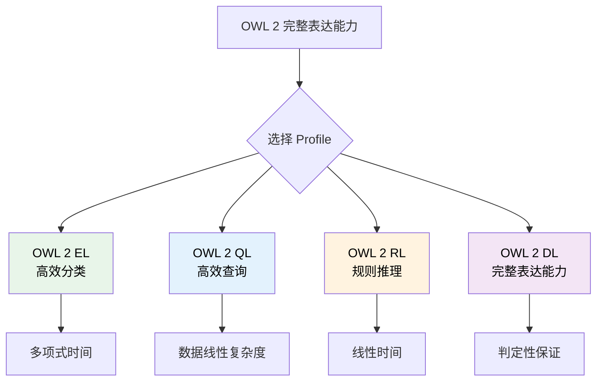
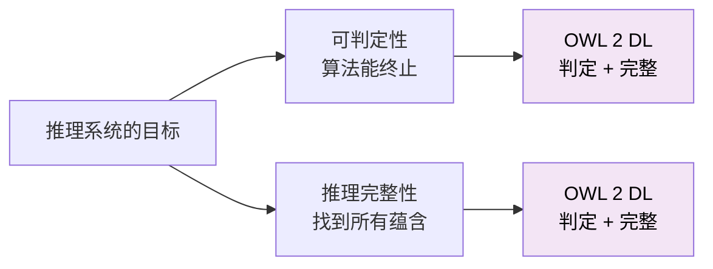
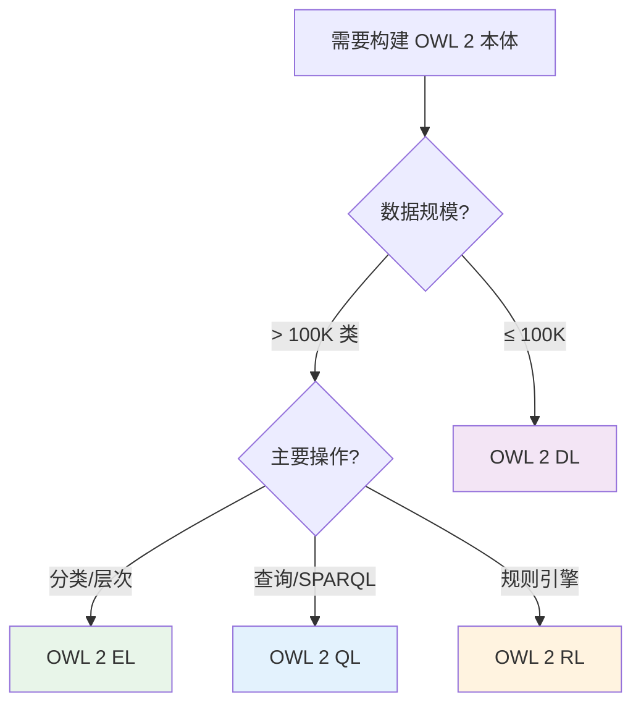

# 8.2 OWL 2 Profiles：EL、QL、RL、DL

> **本节要点**：理解 OWL 2 四种 Profile 的设计理念、适用场景和推理效率差异。

---

## 1. 为什么需要 Profiles？

OWL 2 DL 提供了最大的表达能力，但这也带来了一个重要问题：**推理的复杂性**。

表达力越强的语言，推理算法越可能成为不可判定的（即无法保证终止），或者即使可判定也非常耗时。

**Profile 的解决方案**：通过限制本体可以使用的构造器，实现特定场景下的高效推理。



---

## 2. OWL 2 EL：高效分类

### 2.1 设计理念

OWL 2 EL 专注于**分类推理**（Classification），即计算类的层次结构。

**核心特征**：
- 支持类交集（`owl:intersectionOf`）
- 支持存在量化（`owl:someValuesFrom`）
- 支持数据属性限制
- **不支持**：类联集、补集、不变属性、传递闭包

### 2.2 应用场景

OWL 2 EL 特别适合**大型术语本体**：

| 本体 | 类数量 | 推理时间 |
|------|--------|----------|
| SNOMED CT | 300,000+ | < 10 秒 |
| UMLS | 100,000+ | 数秒 |
| 医疗术语表 | 10,000+ | 毫秒级 |

### 2.3 EL 示例

```turtle
# ✅ EL 允许：交集 + 存在量化
:HeartDisease owl:intersectionOf (
    :Disease
    [ onProperty :hasLocation ; someValuesFrom :Heart ]
) .

# ❌ EL 不允许：联集
:CardioDisease owl:unionOf ( :HeartDisease, :VesselDisease ) .
```

### 2.4 推理保证

> OWL 2 EL 的分类推理在最坏情况下也是**多项式时间复杂度**。

这意味着即使处理数十万级的类，EL 推理器也能在可接受的时间内完成计算。

---

## 3. OWL 2 QL：高效查询

### 3.1 设计理念

OWL 2 QL 专注于**基于数据库的数据查询**，通过减少（Reduction）技术将推理转化为 SQL 查询。

**核心特征**：
- 支持哥白尼表达式（GCI）
- 支持单向属性链
- **不支持**：属性对称性、交集表达式作为父类

### 3.2 应用场景

| 场景 | 说明 |
|------|------|
| 大规模知识图谱 | 百万级实例的推理增强查询 |
| 数据集成 | 基于本体的 Schema 映射查询 |
| 联邦查询 | 结合多个数据源 |

### 3.3 数据线性复杂度

OWL 2 QL 的核心优势是**数据线性复杂度**：

```
推理复杂度 = f(本体大小) × g(数据大小)
          = 多项式(本体) × 线性(数据)
```

这意味着：
- 本体越大，查询越慢（但仍是多项式）
- 数据越大，查询线性增长（非常可预测）

---

## 4. OWL 2 RL：规则推理

### 4.1 设计理念

OWL 2 RL 将推理规则化为**生产规则集**，可由规则引擎（如 Drools）执行。

**核心特征**：
- 完全基于产生式规则（Production Rules）
- 不支持：存在量化作为目标类
- 支持：链规则、属性特征

### 4.2 规则示例

```python
# 属性传递性规则（RL 模式）
IF (x hasAncestor y) AND (y hasAncestor z)
THEN (x hasAncestor z)

# 对称性规则（RL 模式）
IF (x isMarriedTo y)
THEN (y isMarriedTo x)

# 函数性规则（RL 模式）
IF (x hasMother y1) AND (x hasMother y2)
THEN (y1 == y2)
```

### 4.3 应用场景

| 场景 | 工具 |
|------|------|
| 大型知识图谱推理 | Apache Jena Rules |
| 生产系统规则引擎 | Drools, OpenRules |
| 分布式推理 | SPARQL 端点 |

---

## 5. OWL 2 DL：完整表达能力

### 5.1 设计理念

OWL 2 DL（Description Logic）旨在提供**最大表达能力**同时保证**推理的可判定性**。

**语法限制**：
- 类不能作为实例出现（除非使用 `owl:oneOf`）
- 属性不能作为类出现
- 不能嵌套 `owl:complementOf`

### 5.2 逻辑基础

OWL 2 DL 基于 **SROIQ(D)** 描述逻辑，支持：

| 构造器 | 符号 | OWL 标签 |
|---------|------|----------|
| 顶概念 | ⊤ | `owl:Thing` |
| 底概念 | ⊥ | `owl:Nothing` |
| 补集 | ¬C | `owl:complementOf` |
| 交集 | C ⊓ D | `owl:intersectionOf` |
| 联集 | C ⊔ D | `owl:unionOf` |
| 存在量化 | ∃R.C | `owl:someValuesFrom` |
| 全部量化 | ∀R.C | `owl:allValuesFrom` |
| 基数约束 | (≥ n R.C) | `owl:qualifiedCardinality` |

### 5.3 可判定性与完整性的权衡



> **关键事实**：OWL 2 DL 同时保证了可判定性和推理完整性。

---

## 6. Profiles 对比总表

| 特性 | EL | QL | RL | DL |
|------|-----|-----|-----|-----|
| **核心目标** | 分类 | 查询 | 规则推理 | 完整表达 |
| **交集** | ✅ 受限 | ✅ | ✅ | ✅ |
| **联集** | ❌ | ❌ | ❌ | ✅ |
| **补集** | ❌ | ❌ | ❌ | ✅ |
| **存在量化** | ✅ | ✅ | ❌ | ✅ |
| **全部量化** | ✅ | ❌ | ✅ | ✅ |
| **传递性** | ❌ | ❌ | ✅ | ✅ |
| **对称性** | ❌ | ❌ | ✅ | ✅ |
| **基数约束** | ✅ | ✅ | ✅ | ✅ |
| **推理复杂度** | 多项式 | 数据线性 | 线性 | 判定 |
| **适合规模** | 100K+ | 10M+ | 10M+ | 10K-100K |

---

## 7. Profile 选择指南

### 7.1 决策流程图



### 7.2 实际选择案例

| 领域 | 推荐 Profile | 原因 |
|------|-------------|------|
| 生物医学本体 | EL | 大规模术语分类（SNOMED CT） |
| 知识图谱 | QL | 大规模数据查询增强 |
| 工业规则系统 | RL | 兼容 Drools 等规则引擎 |
| 学术研究/通用建模 | DL | 最大表达能力 |

---

## 8. 练习

### 8.1 案例分析

为一个以下场景选择合适的 Profile，并说明理由：

1. **图书馆管理系统**：需要表示借阅关系、会员类型限制、书籍分类
2. **生物医学知识图谱**：包含 200 万条事实，主要操作是 SPARQL 查询
3. **医学术语系统**：15 万个医学术语，主要操作是分类推理

### 8.2 实践练习

使用以下本体片段，判断它属于哪个 Profile，并说明为什么：

```turtle
:Vehicle owl:equivalentClass (
    :Automobile owl:unionOf ( :Car, :Truck )
) .

:hasPart owl:TransitiveProperty .
```

**提示**：观察是否使用了 `owl:unionOf` 和 `owl:TransitiveProperty`。

---

## 9. 本节小结

| 概念 | 说明 |
|------|------|
| Profile 目的 | 平衡表达能力与推理效率 |
| OWL 2 EL | 适合大规模分类，多项式时间复杂度 |
| OWL 2 QL | 适合数据库场景，数据线性复杂度 |
| OWL 2 RL | 适合规则引擎，线性时间推理 |
| OWL 2 DL | 完整表达能力，保证可判定性 |