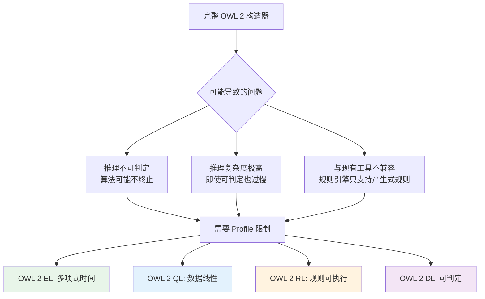

# 8.3 描述逻辑：OWL 2 的逻辑基础

> **本节要点**：理解描述逻辑（DL）与 OWL 的对应关系，掌握常用 DL 构造器及其 OWL 标签。

---

## 1. 什么是描述逻辑？

描述逻辑（Description Logic，简称 DL）是一族形式化知识表示语言，是 OWL 的逻辑基础。

### 1.1 DL 的核心特点

| 特点 | 说明 |
|------|------|
| **语义清晰** | 基于模型理论定义精确含义 |
| **可判定推理** | 算法能终止并给出正确答案 |
| **模块化** | 不同 DL 用字母缩写表示能力 |
| **人机可读** | 数学符号 ↔ 自然语言 ↔ 逻辑公式 |

### 1.2 DL 与 OWL 的关系

```
描述逻辑 (DL)
    │
    ├── 理论逻辑基础
    │
    ▼
OWL 2
    │
    ├── 实现语言（语法）
    │
    ▼
RDF/XML、Turtle、JSON-LD
    │
    └── 序列化格式
```

> **关键理解**：OWL 2 的语法可以视为描述逻辑的「翻译」，将数学符号转换为可计算的标签。

---

## 2. 核心概念与构造器

### 2.1 基本概念

描述逻辑有三种基本构件：

| 构件 | DL 符号 | OWL 概念 | 说明 |
|------|---------|----------|------|
| **概念（Concept）** | C, D | `owl:Class` | 类的定义 |
| **角色（Role）** | R, S | `owl:ObjectProperty` | 对象属性 |
| **个体（Individual）** | a, b | `owl:NamedIndividual` | 具体实例 |

### 2.2 概念构造器

```mermaid
graph TD
    A[概念构造器] --> B[基本构造器]
    A --> C[量词]
    A --> D[基数约束]
    
    B --> B1[⊤ 顶概念<br/>owl:Thing]
    B --> B2[⊥ 底概念<br/>owl:Nothing]
    B --> B3[¬C 补集<br/>owl:complementOf]
    B --> B4[C ⊓ D 交集<br/>owl:intersectionOf]
    B --> B5[C ⊔ D 联集<br/>owl:unionOf]
    
    C --> C1[∃R.C 存在量化<br/>someValuesFrom]
    C --> C2[∀R.C 全部量化<br/>allValuesFrom]
    
    D --> D1[(≥ n R) 至少 n 个<br/>minCardinality]
    D --> D2[(≤ n R) 至多 n 个<br/>maxCardinality]
    
    style B1 fill:#e3f2fd
    style C1 fill:#f3e5f5
    style D1 fill:#e8f5e9
```

### 2.3 构造器对应关系表

| 描述逻辑符号 | 自然语言 | OWL 属性 | Turtle 示例 |
|--------------|----------|----------|-------------|
| ⊤ | 一切事物 | `owl:Thing` | `a owl:Thing` |
| ⊥ | 空集 | `owl:Nothing` | `a owl:Nothing` |
| ¬C | 非 C | `owl:complementOf` | `owl:complementOf :C` |
| C ⊓ D | C 且 D | `owl:intersectionOf` | `owl:intersectionOf (:C :D)` |
| C ⊔ D | C 或 D | `owl:unionOf` | `owl:unionOf (:C :D)` |
| ∃R.C | 有 R 关系的某个 C | `owl:someValuesFrom` | `[ onProperty R ; someValuesFrom C ]` |
| ∀R.C | 所有 R 关系都是 C | `owl:allValuesFrom` | `[ onProperty R ; allValuesFrom C ]` |
| (≥ n R.C) | 至少有 n 个 R 关系是 C | `owl:minQualifiedCardinality` | `[ onProperty R ; minQualifiedCardinality n ]` |
| (≤ n R.C) | 至多有 n 个 R 关系是 C | `owl:maxQualifiedCardinality` | `[ onProperty R ; maxQualifiedCardinality n ]` |
| (≥ n R) | 至少有 n 个 R 关系 | `owl:minCardinality` | `[ onProperty R ; minCardinality n ]` |

---

## 3. 常用描述逻辑命名法

描述逻辑使用字母缩写表示一组能力。

### 3.1 基础能力缩写

| 符号 | 含义 | 说明 |
|------|------|------|
| **A** | Atomically role inclusion | 基础原子关系 |
| **∀, ∃** | 全称/存在量化 | 全部/存在值约束 |
| **⊓, ⊔, ¬** | 交/并/补 | 集合运算 |
| **#** | Number restriction | 基数约束 |
| **≥, ≤** | 至少/至多 | 数量下界/上界 |
| **U** | Nominal（外延） | 具体个体集合 |
| **I** | Inverse（逆） | 逆属性 |
| **S** | Successor role chain | 属性链 |
| **P** | Transitive property | 传递性 |
| **Q** | Qualified cardinality | 限定基数 |
| **D** | Datatypes | 数据类型 |

### 3.2 常见 DL 能力表

| DL 名称 | 支持能力 | 说明 |
|----------|----------|------|
| **ALC** | A, ∀, ∃, ⊓, ⊔, ¬ | 基本概念构造器 |
| **ALCH** | ALC + H（概念包含） | 概念间子关系 |
| **ALCI** | ALC + I（逆） | 逆属性支持 |
| **SHIF(D)** | ALC + #, ≥, ≤, I, S, P + D | OWL 1 DL 的基础 |
| **SROIQ(D)** | ALC + Q, #, I, S, P, U + D | OWL 2 DL 的基础 |

### 3.3 逻辑能力递进图

```mermaid
graph LR
    A[EL<br/>交集 + 存在量化] --> B[ACC<br/>EL + 补集 + 联集]
    B --> C[ALC<br/>EL + ¬, ⊔, ∀]
    C --> D[ALCH<br/>ALC + 概念包含]
    D --> E[SHIF(D)<br/>ALCH + 基数 + 传递 + 数据类型]
    E --> F[SROIQ(D)<br/>SHIF + 链 + 外延 + 限定基数]
    
    style A fill:#e8f5e9
    style C fill:#e3f2fd
    style E fill:#f3e5f5
    style F fill:#fff3e0
    
    click F "https://www.w3.org/TR/owl2-news-features/#DL-SROIQ" "OWL 2 DL 基于 SROIQ(D)"
```

---

## 4. OWL 2 Profile 与描述逻辑

### 4.1 Profile 对应的 DL 能力

| Profile | 对应 DL 能力 | 关键限制 |
|---------|-------------|----------|
| **EL** | 类似 `ACC` 的子集 | 仅 ⊓, ∃，无 ¬, ⊔ |
| **QL** | 类似 Datalog | 受限的 GCI，无复杂交集 |
| **RL** | 规则片段 | 无存在量化作为类定义 |
| **DL** | SROIQ(D) 的语法子集 | 语法限制保证可判定性 |

### 4.2 为什么 Profile 限制构造器？



---

## 5. 从数学符号到 OWL 代码

### 5.1 基本表达式转换

| DL 表达式 | OWL 含义 | Turtle 实现 |
|-----------|----------|-------------|
| `C ⊓ ∃R.D` | C 且有 R 关系连接到一个 D | 见下方代码 |

**Turtle 实现**：
```turtle
:NewClass owl:intersectionOf (
    :C
    [ onProperty :R ; someValuesFrom :D ]
) .
```

### 5.2 复杂表达式转换

| DL 表达式 | OWL 含义 |
|-----------|----------|
| `∀hasParent.(Doctor ⊔ Lawyer)` | 所有父母都是医生或律师 |
| `(≥ 2 hasChild .Person)` ∧ `(≤ 1 hasSpouse .Person)` | 至少有 2 个孩子，至多有 1 个配偶 |

**Turtle 实现**：
```turtle
:RestrictedClass owl:intersectionOf (
    # ∀hasParent.(Doctor ⊔ Lawyer)
    [ onProperty :hasParent ; allValuesFrom (
        owl:unionOf ( :Doctor :Lawyer )
    )]
    # ≥ 2 hasChild .Person
    [ onProperty :hasChild ;
      minQualifiedCardinality 2 ;
      owl:onClass :Person ]
    # ≤ 1 hasSpouse .Person
    [ onProperty :hasSpouse ;
      maxQualifiedCardinality 1 ;
      owl:onClass :Person ]
) .
```

---

## 6. 推理任务与描述逻辑

### 6.1 基本推理任务

| 推理任务 | DL 定义 | OWL 应用 |
|----------|---------|----------|
| **可满足性** | 概念是否有实例 | 检查类定义是否矛盾 |
| **子类关系** | C ⊑ D 是否成立 | 自动构建类层次 |
| **实例检查** | a ∈ C 是否成立 | 判断个体是否属于某类 |
| **实例获取** | 找出所有 a ∈ C | 查询符合某类的所有实例 |

### 6.2 推理实例

```turtle
:Tutorial owl:equivalentClass (
    :Event owl:intersectionOf (
        [ onProperty :hasSpeaker ; someValuesFrom :Professor ]
    )
) .
```

**已知事实**：
```turtle
:SemEvent a :Tutorial, :Event .
:Bob a :Professor .
:SemEvent :hasSpeaker :Bob .
```

**推理结果**：
- `:SemEvent` 是可满足的 ✅（有实例）
- `:SemEvent` 是 `:Event` 的子类 ✅（通过 DL 推理）

---

## 7. 练习

### 7.1 符号转换练习

将以下 DL 表达式转换为 Turtle 代码：

1. `Doctor ⊓ (∃hasPatient.Patient)` — 有患者的医生
2. `¬(Professor ⊔ Assistant)` — 既不是教授也不是助理
3. `∃hasChild.(Student ⊓ (≥ 2 hasClass .Course))` — 有至少修两门课的学生子女

### 7.2 描述逻辑分析

判断以下本体片段使用了哪些 DL 构造器：

```turtle
:MedicalSpecialist owl:intersectionOf (
    :Doctor
    [ onProperty :treats ; someValuesFrom :Disease ]
) .

:MonogamousPerson owl:equivalentClass (
    owl:restriction
        [ onProperty :hasSpouse ; 
          maxCardinality 1 ]
) .
```

---

## 8. 本节小结

| 概念 | 说明 |
|------|------|
| 描述逻辑 | OWL 的数学逻辑基础，基于模型理论 |
| 基本概念 | 概念（Class）、角色（Property）、个体（Individual） |
| 核心构造器 | 交集、联集、补集、存在量化、全部量化、基数约束 |
| DL 命名法 | ALC、SHIF(D)、SROIQ(D) 表示不同能力级别 |
| Profile 与 DL | 不同 Profile 对应不同 DL 能力的子集 |
| 推理任务 | 可满足性、子类判断、实例检查、实例获取 |