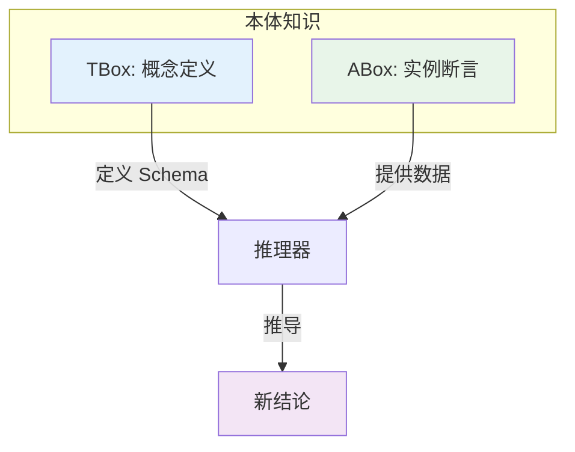
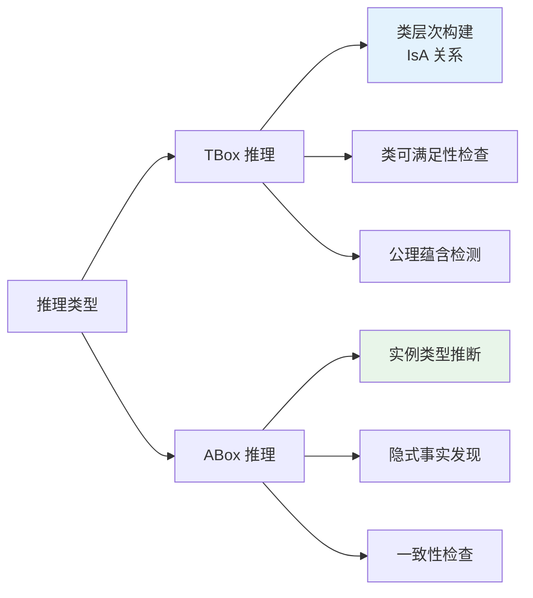
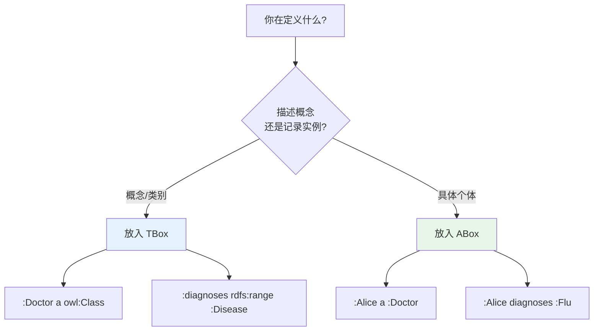

# 8.4 OWA vs CWA 与 TBox 和 ABox

> **本节要点**：理解开世界假设（OWA）与闭世界假设（CWA）的语义差异，掌握 TBox 与 ABox 的知识分层。

---

## 1. 知识表示的两种世界观

知识表示系统对「未知事实」的处理有两种基本假设。

### 1.1 闭世界假设（Closed World Assumption, CWA）

**核心思想**：未声明的事实被认为是假的。

| 特征 | 说明 |
|------|------|
| 原理 | 如果一个事实未记录，则认为它不存在 |
| 典型应用 | 关系数据库、SQL |
| 推理模式 |  Negation as Failure（失败即否定） |
| 优点 | 简单高效，易于实现 |

**SQL 示例**：
```sql
-- 查询名为 Alice 的 Person
SELECT * FROM Person WHERE name = 'Alice';

-- 如果没有结果行，系统认为「Alice 不是 Person」
-- 这就是 CWA：记录里没有 = 不存在
```

### 1.2 开世界假设（Open World Assumption, OWA）

**核心思想**：未声明的事实可能是真的，只是尚未知晓。

| 特征 | 说明 |
|------|------|
| 原理 | 如果一个事实未记录，则认为它可能是真的也可能是假的 |
| 典型应用 | OWL、语义网、本体推理 |
| 推理模式 | 逻辑推导 + 已有知识 |
| 优点 | 表达力强，支持复杂推理 |

**OWL 示例**：
```turtle
:alice a :Person .

# OWA 推理：无法因为没看到 :alice :hasBrother :Bob，就断言 Alice 没有兄弟
# 可能数据不完整，也可能真的没有 — 无法确定
```

### 1.3 OWA 与 CWA 对比

| 维度 | OWA | CWA |
|------|-----|-----|
| 未知事实 | 可能为真或假 | 认为是假 |
| 数据完整性 | 接受部分知识 | 要求完整数据 |
| 推理能力 | 丰富 | 有限 |
| 工具 | Protégé, OWL 推理器 | 关系数据库 |
| 语义 | `notKnown(X)` 返回三种结果：true, false, unknown | `notKnown(X)` 只返回 true 或 false |

### 1.4 实际影响

**OWA 的经典推理**：
```turtle
# 本体声明
:Person owl:disjointWith :Animal .
:alice a :Person .

# CWA 场景下
# 如果没有记录 :alice 的 Age，则认为年龄未定义 → 不可用于需要年龄的操作

# OWA 场景下
# :alice 不是 :Animal → 这是 100% 确定（由 disjointWith 保证）
# :alice 的年龄 → 未知（可能是整数，也可能数据未录入）
```

**关键洞察**：OWL 推理器不会因为你没有声明某事就认为它是假的。

---

## 2. TBox（术语盒）与 ABox（断言盒）

### 2.1 知识分层的概念

本体论中的知识分为两个层次：



### 2.2 TBox（Terminological Box）

TBox 是关于**概念定义**的知识。

| 特征 | 说明 |
|------|------|
| 内容 | 类的定义、类的层次关系、属性的定义 |
| 类比 | 数据库 Schema、表结构 |
| 变化频率 | 相对稳定，随领域演化而更新 |

**TBox 示例**：
```turtle
# 概念定义
:Person a owl:Class .
:Student a owl:Class ;
    rdfs:subClassOf :Person .

# 属性定义
:hasEnrolledIn a owl:ObjectProperty .
:hasEnrolledIn rdfs:domain :Student .
:hasEnrolledIn rdfs:range :Course .

# 复杂定义
:GraduateStudent owl:equivalentClass (
    :Student
    owl:intersectionOf (
        [ onProperty :hasThesis ; someValuesFrom :Thesis ]
    )
) .
```

### 2.3 ABox（Assertional ABox）

ABox 是关于**具体实例和断言**的知识。

| 特征 | 说明 |
|------|------|
| 内容 | 实例的类型、实例间的关系、实例的属性值 |
| 类比 | 数据库表数据 |
| 变化频率 | 频繁，随应用数据更新 |

**ABox 示例**：
```turtle
# 实例的类型断言
:alice a :Student .
:bob a :Course .

# 实例间的关系断言
:alice :hasEnrolledIn :bob .

# 数据属性断言
:alice :hasAge "20"^^xsd:integer .
:alice :hasName "Alice Zhang" .
```

### 2.4 TBox 与 ABox 的关系

| 维度 | TBox | ABox |
|------|------|------|
| 本质 | Schema / 模板 | 实例数据 / 记录 |
| 问题 | "什么是学生？" | "谁是学生？" |
| 回答 | "学生 = 人 AND 有课程注册" | "Alice 是学生" |
| 推理关注 | 类的层次 | 实例属性 |

---

## 3. TBox 推理与 ABox 推理

### 3.1 不同的推理任务



### 3.2 TBox 推理示例

**已知 TBox**：
```turtle
:Professor rdfs:subClassOf :AcademicStaff .
:AcademicStaff rdfs:subClassOf :Employee .
:Employee rdfs:subClassOf :Person .
```

**TBox 推理结果**：
- `:Professor` ⊑ `:Employee`（通过传递性推导）
- `:Professor` ⊑ `:Person`（多层传递）
- 如果 `:Professor ⊑ :Student` 存在 → 矛盾（需要时报告）

### 3.3 ABox 推理示例

**已知 ABox**：
```turtle
:alice a :Person .
:alice :hasMother :carol .
:Person owl:disjointWith :Animal .
```

**ABox 推理结果**：
- `:carol` 必须是 `:Person` 类型（因为 `:hasMother` 的限制）
- `:alice` 不是 `:Animal`（由 disjointWith 推导）
- `:carol` 有子实例（alice），所以 `:Person` 可满足

---

## 4. 实际建模：何时使用 TBox vs ABox

### 4.1 建模决策树



### 4.2 混合本体的常见模式

```turtle
# =========================================
# TBox 部分：定义结构
# =========================================

:Organization a owl:Class .
:OrganizationMember a owl:Class .
:memberOf a owl:ObjectProperty .

:Member owl:equivalentClass (
    owl:someValuesFrom [ onProperty :memberOf ; owl:Thing ]
) .

# =========================================
# ABox 部分：填充数据
# =========================================

:MIT a :Organization .
:Bob a :OrganizationMember .
:Bob :memberOf :MIT .
```

---

## 5. OWA 对 TBox/ABox 推理的影响

### 5.1 OWA + TBox 的典型影响

在 OWA 下，TBox 推理仅基于显式声明的公理：

```turtle
# 已知
:Professor rdfs:subClassOf :Person .
:alice a :Person .

# 在 CWA 下：因为没声明 Alice 是 Professor，所以她不是
# 在 OWA 下：Alice 是 Person，她可能是 Professor，也可能不是 — unknown
```

### 5.2 OWA + ABox 的典型影响

| 场景 | CWA 结果 | OWA 结果 |
|------|----------|----------|
| Alice 没有在数据中声明有兄弟 | 没有兄弟 | 未知 |
| Student 类型未声明在 TBox | 不需要定义 | 类层次可能不完整 |
| 实例类型与 disjoint 类匹配 | 直接排除 | 需要推理确定 |

---

## 6. 实践练习

### 6.1 练习 1：分类知识类型

判断以下知识是 TBox 还是 ABox：

| 陈述 | 类型 |
|------|------|
| "医生是一种人" | ? |
| "Alice 是一名医生" | ? |
| "医生诊断为病人" | ? |
| "Alice 诊断了 Bob" | ? |
| "医生必须有医学执照" | ? |

### 6.2 练习 2：OWA 推理测试

**给定 TBox**：
```turtle
:Cat owl:equivalentClass ( :Pet ⊓ (≥ 2 :hasLives) ) .
:whiskers :hasLives "4"^^xsd:integer .
```

**给定 ABox**：
```turtle
:whiskers a :Pet .
```

**在 OWA 下，以下哪项推理是正确的？**

A) :whiskers 至少有 2 条命，所以它是 :Cat
B) :whiskers 是 :Cat（因为满足等价定义）
C) 无法确定 :whiskers 是否是 :Cat（数据类型断言需要验证）
D) :whiskers 不是 :Cat

### 6.3 练习 3：构建 TBox/ABox

为一个简单的图书馆系统创建 TBox 和 ABox 示例，要求：

1. TBox：定义 Book、Author、Genre 类及其关系
2. ABox：为三本书、两个作者填充数据
3. 使用 `owl:equivalentClass` 定义 "已出版的书籍"

---

## 7. 本节小结

| 概念 | 说明 |
|------|------|
| OWA | 未声明≠假，可能需要进一步确认 |
| CWA | 未声明=假，用于数据库等系统 |
| OWL 假设 | 默认使用 OWA，不能直接假设未知为假 |
| TBox | 描述概念、属性定义（Schema） |
| ABox | 描述实例和它们的事实（Data） |
| 推理差异 | TBox 推理类层次，ABox 推理实例属性 |