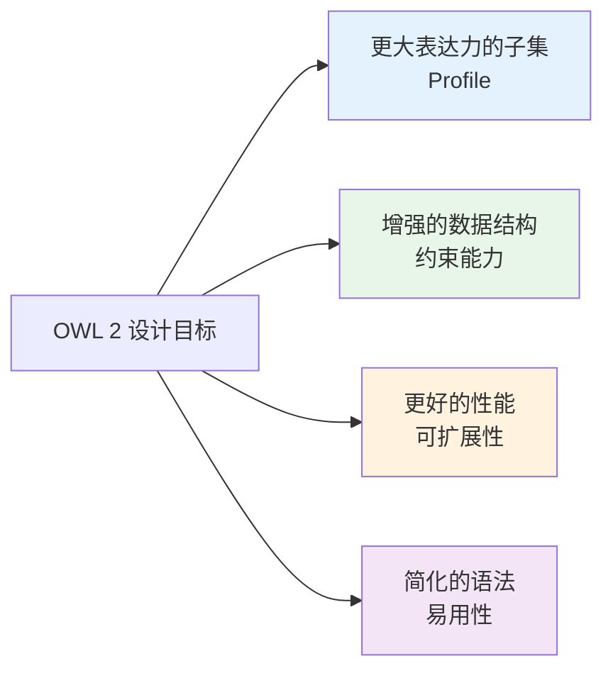
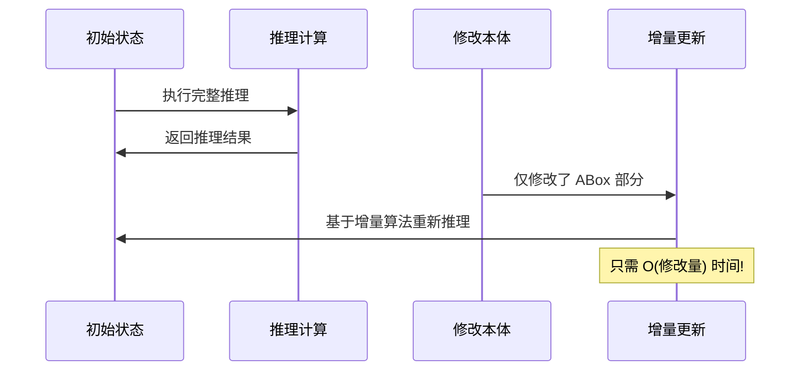

# 8.5 OWL 2 的新特性

> **本节要点**：了解 OWL 2 相较于 OWL 1 的核心改进，包括新语法格式、丰富约束和 Profile 优化。

---

## 1. OWL 2 的发布背景

2009 年，W3C 将 OWL 2 发布为正式推荐标准（REC）。这是语义网本体语言的一次重大更新。

### 1.1 OWL 1 的局限

| 问题 | 说明 |
|------|------|
| 语法限制 | 仅支持 RDF/XML，格式冗长难以阅读 |
| 表达力过重 | 缺少对大规模本体的专门优化 |
| 约束能力不足 | 数据类型约束有限 |
| 性能瓶颈 | 缺乏 Profile 支持，推理效率低 |

### 1.2 OWL 2 的目标



---

## 2. 新语法格式

### 2.1 Turtle 成为首选

OWL 2 最直观的改进是支持 **Turtle (.ttl)** 作为序列化格式。

**RDF/XML（OWL 1 风格）**：
```turtle
<http://example.org/Person>
    a <http://www.w3.org/2002/07/owl#Class> ;
    <http://www.w3.org/2000/01/rdf-schema#label> "Person" .
```

**Turtle（OWL 2 风格）**：
```turtle
@prefix ex: <http://example.org/> .
@prefix owl: <http://www.w3.org/2002/07/owl#> .

ex:Person a owl:Class .
```

### 2.2 其他支持格式

| 格式 | 说明 | 适用场景 |
|------|------|----------|
| **Turtle** | 人类可读的三元组语法 | 日常开发和编辑 |
| **XML** | RDF/XML，保持向后兼容 | 已有 OWL 1 系统集成 |
| **JSON-LD** | 链接数据格式 | 与 Web API 集成 |

---

## 3. 新的数据类型约束

OWL 2 大幅增强了字符串和数值的约束能力。

### 3.1 字符串约束

```turtle
# 定义合法的 email 格式
:EmailAddress owl:equivalentClass (
    xsd:string
    owl:oneOf (
        [ a owl:Restriction ;
          onProperty xsd:string ;
          owl:regexPredicate "^[\\w.-]+@[\\w.-]+\\.[a-z]{2,}$"^^xsd:regex ]
    )
) .
```

### 3.2 数值范围约束

```turtle
# 定义年龄必须是非负整数
:Age owl:equivalentClass (
    xsd:integer
    [ onProperty :value ; minInclusive 0 ]
) .
```

### 3.3 约束总览

| 约束 | 说明 | 示例值 |
|------|------|--------|
| `owl:allValuesFrom` | 值必须在指定数据类型内 | `minInclusive: 0` |
| `owl:maxInclusive` | 小于等于指定值 | `maxInclusive: 150` |
| `owl:minInclusive` | 大于等于指定值 | `minInclusive: 0` |
| `owl:maxExclusive` | 严格小于指定值 | `maxExclusive: 1` |
| `owl:pattern` | 正则表达式匹配 | `^[0-9]{3}-[0-9]{4}$` |
| `owl:minLength` | 最小字符数 | 3 |
| `owl:maxLength` | 最大字符数 | 100 |

---

## 4. 丰富的属性特征

### 4.1 新的属性声明

OWL 2 扩展了 `owl:propertyDisjointWith`：

```turtle
# 声明三个属性互不相交
:hasFather owl:propertyDisjointWith :hasMother .
:hasFather owl:propertyDisjointWith :hasSibling .
:hasMother owl:propertyDisjointWith :hasSibling .
```

在 OWL 1 中需要为每对属性分别声明不相交。

### 4.2 逆属性扩展

OWL 2 支持属性集合之间的逆向关系：

```turtle
# 如果 R1 是 S1 的逆，且 R2 是 S2 的逆...
:isMarriedTo owl:inverseOf :spouseOf .
:isFatherOf owl:inverseOf :childOf .
:isParentOf owl:inverseOf :childOf .
```

---

## 5. 性能改进与 Profile

### 5.1 Profile 支持

OWL 2 引入四种 Profile，针对不同类型的推理进行优化：

| Profile | 推理类型 | 适用场景 |
|---------|----------|----------|
| **EL** | 分类推理 | 大规模术语系统（百万级概念） |
| **QL** | 数据查询 | 基于数据库的语义增强 |
| **RL** | 规则推理 | 与规则引擎集成（Drools 等） |
| **DL** | 完整推理 | 通用本体建模 |

### 5.2 增量推理

> OWL 2 推理器支持在修改本体后**增量更新**结论，无需从头重新计算。



### 5.3 可扩展性

OWL 2 的设计支持：

| 规模 | OWL 1 | OWL 2 |
|------|-------|-------|
| 类数量 | ~10,000 | 1,000,000+ |
| 实例数量 | ~100,000 | 10,000,000+ |
| 推理速度 | 分钟级 | 秒级/分钟级 |

---

## 6. 可读性和可维护性改进

### 6.1 直接 IRI 使用

OWL 2 允许直接在代码中使用 IRI，而无需嵌套 `owl:NamedIndividual`：

```turtle
# OWL 2 更简洁
:alice a :Person ;
    :hasAge 30 .

# OWL 1 需要更多元信息
<http://example.org/alice>
    a <http://www.w3.org/2002/07/owl#NamedIndividual> ;
    <http://www.w3.org/1999/02/22-rdf-syntax-ns#type>
        <http://example.org/Person> .
```

### 6.2 注释属性扩展

```turtle
:Person rdfs:comment "表示人类的类"@en ;
        rdfs:comment "表示人类实体的类"@zh .

# 支持多语言注释版本
```

---

## 7. OWL 1 vs OWL 2 特性对照

| 特性 | OWL 1 | OWL 2 |
|------|-------|-------|
| 语法格式 | 仅 RDF/XML | Turtle + RDF/XML + JSON-LD |
| Profile | 无 | EL, QL, RL, DL |
| 数据类型约束 | 有限 | 丰富的 min/max/regex 约束 |
| 属性不相交 | 需成对声明 | 可成组声明 |
| 性能优化 | 一般 | 增量推理 + Profile 优化 |
| 推理规模 | 小规模 | 支持百万级 |
| IRI 语法 | 冗余嵌套 | 简洁直接 |

---

## 8. 实践练习

### 8.1 格式转换

将以下 OWL 1 (RDF/XML) 风格代码转换为 OWL 2 Turtle 风格：

```turtle
<Person>
    a owl:Class .
<hasSpouse>
    a owl:ObjectProperty ;
    owl:inverseOf <spouseOf> .
```

**期望输出**（Turtle 格式）：
```turtle
# 你的代码...
```

### 8.2 Profile 选择案例分析

分析以下场景，选择合适的 OWL 2 Profile 并说明理由：

1. **医院病历系统**：需要表达 50 万条疾病记录和 100 个疾病分类，主要操作是分类推理
2. **企业知识图谱**：500 万个业务数据记录，需要从关系数据库提取并推理关联
3. **法律法规查询系统**：3000 条法律条款之间的关系推理

### 8.3 数据类型约束实践

使用 Turtle 定义一个 "Password" 数据类型约束，要求：

1. 长度在 8-128 字符之间
2. 只能包含字母和数字 (`[a-zA-Z0-9]`)
3. 至少包含一个大写字母

```turtle
# 定义约束
:StrongPassword owl:equivalentClass (
    xsd:string
    # 在此补充约束
) .
```

---

## 9. 本节小结

| 概念 | 说明 |
|------|------|
| OWL 2 发布 | 2009 年 W3C 推荐标准 |
| 新语法 | Turtle 成为主流，JSON-LD 和 RDF/XML 保持兼容 |
| 数据类型约束 | min/max, regex, minLength/maxLength |
| 属性特征 | 更丰富的不相交声明、逆属性、传递性 |
| Profile | EL/QL/RL/DL，针对不同场景优化 |
| 性能 | 增量推理、支持百万级实体规模 |