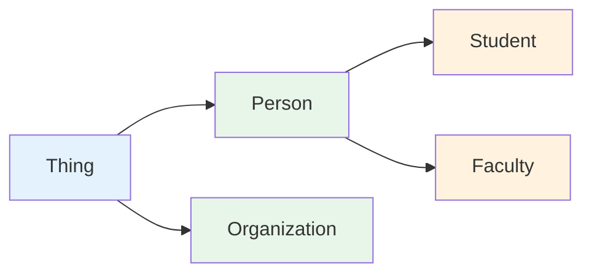

# 第 9 章 Protégé 入门

## 第 1 篇 Protégé 简介与界面概览

### Protégé 概述

Protégé 是由斯坦福大学医学院和 SLIPCYRE 项目开发的开源本体编辑工具，是目前最广泛使用的本体构建工具之一。它提供了丰富的可视化界面和底层 Turtle 代码编辑功能。

**核心特性**：

| 特性 | 说明 |
|------|------|
| 多语言支持 | 支持 OWL、RDF、RDFS、SKOS 等语义网标准语言 |
| 可视化编辑 | 提供类和对象层次结构、属性特征、事实的可视化表示 |
| 插件生态 | 丰富的插件系统支持推理、验证、格式转换等扩展功能 |
| 多视图模式 | Classes、Properties、Individuals、Axioms、Fact 五大视图 |
| API 支持 | 提供 OWL API 支持自动化本体操作 |

**应用领域**：

| 领域 | 典型应用 | 著名本体案例 |
|------|----------|-------------|
| 生物医学 | 疾病建模、基因注释 | Gene Ontology, SNOMED CT |
| 知识图谱 | 数据建模、语义搜索 | DBpedia, Wikidata |
| 语义网 | 数据发布、互操作 | Schema.org |

---

### 界面组件详解

#### 五大编辑视图

Protégé 的主界面包含五大核心视图，每个视图负责本体建模的不同方面：

**1. Classes（类视图）**

管理本体的类层次结构和公理定义。

| 组件 | 说明 |
|------|------|
| 类层次树 | 以树形结构展示类的父子关系 |
| Class Table | 表格形式展示类的等价类、子类、不相交类 |
| Annotations | 类的元数据和注释信息 |



**2. Object Properties（对象属性视图）**

定义类之间的关系属性。

| 属性特征 | Turtle 代码 |
|----------|-------------|
| 传递性 | `:hasAncestor a owl:TransitiveProperty .` |
| 对称性 | `:spouseOf a owl:SymmetricProperty .` |
| 函数性 | `:hasBirthMother a owl:FunctionalProperty .` |
| 逆属性 | `:marriedWith owl:inverseOf :hasHusband .` |

```turtle
# 定义对象属性的域和范围
:hasFilm a owl:ObjectProperty ;
    rdfs:domain :Actor ;
    rdfs:range :Movie ;
    rdfs:label "has film"@en .
```

**3. Data Properties（数据属性视图）**

定义实体与数据值之间的关系。

| 数据类型 | XSD 类型 | 示例 |
|----------|----------|------|
| 字符串 | `xsd:string` | `"John"` |
| 整数 | `xsd:integer` | `30` |
| 日期 | `xsd:date` | `2024-01-01` |
| 浮点数 | `xsd:decimal` | `3.14` |

```turtle
# 定义数据属性
:birthYear a owl:DataProperty ;
    rdfs:domain :Person ;
    rdfs:range xsd:integer ;
    rdfs:label "birth year"@en .
```

**4. Individuals（个体视图）**

管理类的实例和实例之间的关系。

| 内容 | 说明 |
|------|------|
| 实例列表 | 显示所有个体实例 |
| 值编辑 | 设置对象的属性值 |
| 类型断言 | 指定个体所属的类 |

```turtle
# 定义个体及其类型
:ChristopherNolan a :Director ;
    :name "Christopher Nolan" ;
    :birthYear 1970 .
```

**5. Axioms（公理视图）**

展示和操作本体的所有一阶逻辑公理，用于审查和理解本体的逻辑内容。

---

### 工作流程概览

```mermaid
flowchart TD
    A[创建新本体] --> B[添加命名空间与元数据]
    B --> C[定义顶层类]
    C --> D[构建类层次结构]
    D --> E[定义对象属性]
    E --> F[定义数据属性]
    F --> G[创建个体实例]
    G --> H[添加约束与公理]
    H --> I[运行推理检查]
    I --> J[导出本体文件]
    
    style A fill:#fff3e0
    style J fill:#e8f5e9
    style I fill:#c8e6c9