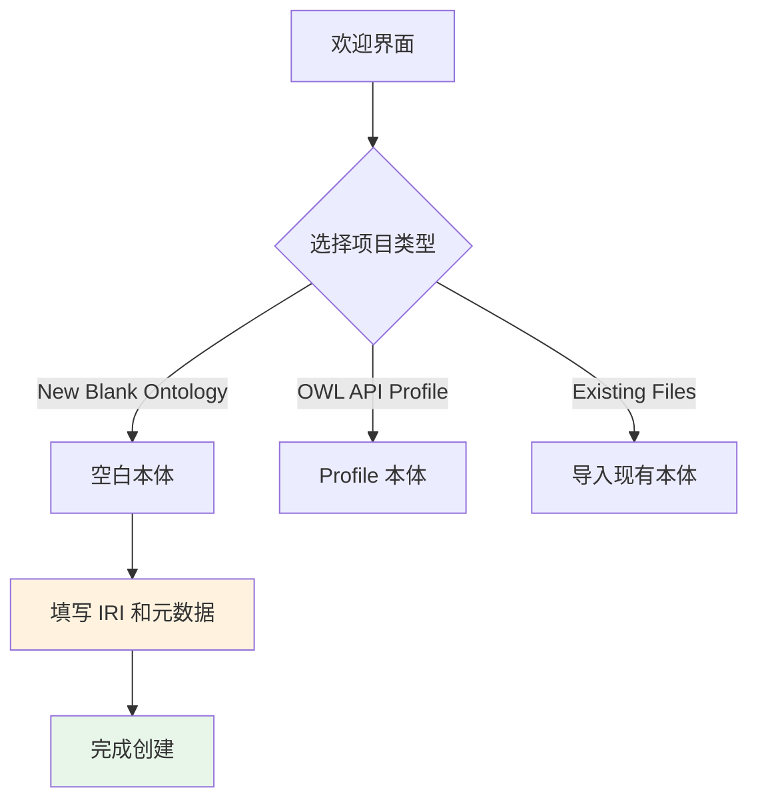

# 第 9 章 Protégé 入门

## 第 2 篇 安装与创建新本体

### 下载与安装

#### 系统要求

| 组件 | 要求 |
|------|------|
| Java | JRE 8 或更高版本（JDK 11 推荐） |
| 操作系统 | Windows 10+/macOS 10.14+/Linux (Ubuntu/CentOS) |
| 内存 | 最少 4GB，推荐 8GB 以上 |
| 硬盘 | 至少 500MB 可用空间 |

#### 下载链接

官方网站：[protege.stanford.edu](https://protege.stanford.edu/)

**Protégé 版本历史**：

| 版本 | 发布年份 | 重要变化 |
|------|----------|----------|
| Protégé 4 | 2010 | 早期基于 Eclipse 的版本 |
| Protégé 5.0 | 2017 | 重写 UI 框架，原生支持 OWL 2 |
| Protégé 5.x | 持续更新 | 引入 OWL API 集成和插件体系 |

**安装步骤（Windows）**：

1. 访问官网下载页
2. 选择 Windows 安装包 (`.exe`)
3. 运行安装程序，按照向导步骤完成安装
4. 安装完成后验证 Java 运行时
5. 启动 Protégé 并检查欢迎界面

---

### 创建新本体

#### 步骤详解

**第一步：启动新项目**

通过以下任一方式创建本体：
- 点击欢迎界面的 **New Project** 按钮
- 菜单操作：**File → New Project**
- 快捷键：`Ctrl + N`

**第二步：配置本体元数据**

在 **Ontology IRI** 输入框中设置本体的全局唯一标识：

| 命名规范 | 示例格式 | 说明 |
|----------|----------|------|
| HTTP URL | `http://example.org/ontology/myOntology#` | 推荐用于网络可访问本体 |
| UUID | `urn:uuid:f81d4fae-7dec-11d0-a765-00a0c91e6bf6` | 不重复的随机标识 |
| 本地路径 | `file:///C:/ontologies/myOntology.owl` | 本地文件系统路径 |

**本体元数据编辑**：

在 **Ontology Meta Information** 面板中填写：

| 元数据字段 | 说明 | 示例 |
|------------|------|------|
| Title | 本体的显示名称 | `Movie Ontology` |
| Description | 本体描述 | `A simple ontology for movies and actors` |
| Version | 当前版本号 | `1.0.0` |
| Creator | 创建者信息 | `Name: John Doe, Email: john@example.com` |
| Citation | 引用建议 | `Doe, J. (2024). Movie Ontology.` |

#### 可视化操作指引



---

### 注释属性（Annotation Properties）

注释属性为本体元素添加人类可读的说明。

**常用 W3C 标准注释属性**：

| 属性 | 名称空间 | 用途 |
|------|----------|------|
| `rdfs:label` | RDF Schema | 元素的显示名称 |
| `rdfs:comment` | RDF Schema | 元素的人类可读描述 |
| `owl:versionInfo` | OWL 2 | 版本信息和变更日志 |
| `dc:creator` | Dublin Core | 元素创建者 |
| `dc:title` | Dublin Core | 文档标题 |

```turtle
@prefix : <http://example.org/movie#> .
@prefix dc: <http://purl.org/dc/elements/1.1/> .

:Actor a owl:Class ;
    rdfs:label "Actor"@en ;
    rdfs:comment "A person who performs in movies"@en ;
    dc:creator "John Doe" .
```

**Protégé 注释编辑器**：

在 Protégé 界面中，选中任意本体元素后，**Annotations** 标签页可直接编辑元数据。支持多语言标签添加，格式为 `语言代码@文本内容`：

| 语言代码 | 语言 | 示例 |
|----------|------|------|
| `en` | 英语 | `"Movie"@en` |
| `zh` | 中文 | `"电影"@zh` |
| `ja` | 日语 | `"映画"@ja` |