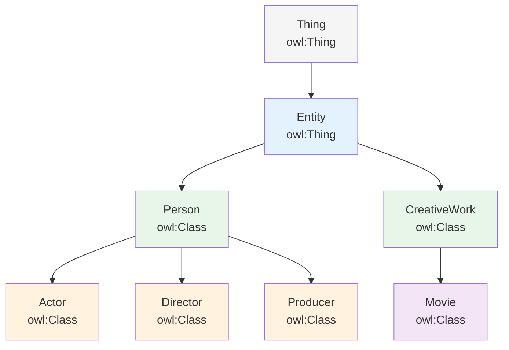

# 第 9 章 Protégé 入门

## 第 3 篇 添加类与属性

### 类的定义与层次结构

#### 添加类的基本步骤

在 Protégé 中，类是本体建模的核心元素，用于对现实世界的实体进行分类。

**操作步骤**：

1. 点击左侧面板的 **Classes** 标签页
2. 点击工具栏的 **Create New Class** 按钮（或使用快捷键 `Ctrl + Shift + C`）
3. 输入类名（推荐使用 CamelCase，如 `Person`、`Movie`）
4. 按回车确认，新类将添加到类层次中

**类的命名规范**：

| 规范 | 推荐 | 不推荐 | 说明 |
|------|------|--------|------|
| 大小写 | `Movie`, `Actor` | `movie`, `actor` | 类名使用大驼峰命名法 |
| 单复数 | `Person` | `People` | 推荐使用单数形式 |
| 缩写 | `MovieReview` | `MVW` | 避免使用缩写以提高可读性 |

#### 构建类层次结构

类层次结构通过定义子类关系来表达本体的知识体系。

**设置子类关系的方法**：

| 方法 | 操作路径 | 适用场景 |
|------|----------|----------|
| Super Class 表 | 选中类 → Super Classes 标签 → 添加父类 | 常规子类定义 |
| Quick Add | 输入时选择已有类 | 快速添加已存在的父类 |
| 等价类定义 | Equivalent To 标签 | 定义类的逻辑等价关系 |

```turtle
# 在 Turtle 语法中的表示
:Actor rdfs:subClassOf :Person .
:Director rdfs:subClassOf :Person .

# 定义类的等价关系（组合定义）
:FilmDirector owl:equivalentClass (
    :Person
    owl:someValuesFrom [:directed :Movie]
) .
```

**常用类关系类型**：

| 关系 | OWL 属性 | 说明 |
|------|----------|------|
| 子类 | `rdfs:subClassOf` | A 是 B 的子类，A ⊆ B |
| 等价类 | `owl:equivalentClass` | A 和 B 表示相同的类 |
| 不相交类 | `owl:disjointWith` | A 和 B 没有共同实例 |



---

### 对象属性的定义

#### 添加对象属性的步骤

对象属性用于描述类之间的关联关系，其值通常是其他个体。

**操作流程**：

1. 切换到 **Object Properties** 标签页
2. 点击 **Create New Object Property** 按钮
3. 输入属性名称（建议使用动词过去分词或介词短语，如 `hasParent`、`directedBy`）
4. 设置属性的域（domain）和范围（range）

| 概念 | 说明 | 示例 |
|------|------|------|
| 域（Domain） | 属性的作用类 | `actsIn` 的域是 `Actor` |
| 范围（Range） | 属性值的类 | `actsIn` 的范围是 `Movie` |

```turtle
# 定义对象属性的完整示例
:directed a owl:ObjectProperty ;
    rdfs:domain :Director ;
    rdfs:range :Movie ;
    rdfs:label "directed"@en ;
    rdfs:comment "A movie that was directed by the subject"@en .
```

#### 对象属性特征

对象属性可以设置多种语义特征，增强本体的推理能力。

**属性特征对比表**：

| 特征 | OWL 类 | 说明 | 示例 |
|------|--------|------|------|
| 传递性 | `owl:TransitiveProperty` | A→B 且 B→C 则 A→C | `hasAncestor` |
| 对称性 | `owl:SymmetricProperty` | A→B 则 B→A | `isMarriedTo` |
| 函数性 | `owl:FunctionalProperty` | 一个主体只有一个值 | `hasBirthMother` |
| 逆函数性 | `owl:InverseFunctionalProperty` | 一个值只对应一个主体 | `hasSSN` |
| 反传递性 | `owl:AntisymmetricProperty` | A→B 和 B→A 不同时成立 | `olderThan` |

**设置属性特征的操作**：

在 Protégé 中，选中对象属性后在 **Characteristics** 标签页勾选相应特征即可。

```turtle
# 传递性属性的示例
:hasAncestor a owl:TransitiveProperty .

# 推理过程：
# 已知: :Alice :hasAncestor :Bob
# 已知: :Bob :hasAncestor :Carol
# 推理: :Alice :hasAncestor :Carol

# 函数性属性的示例
:hasSocialSecurityNumber a owl:FunctionalProperty ;
    rdfs:domain :Person ;
    rdfs:range xsd:string .

# 推理过程：
# 已知: :Alice :hasSocialSecurityNumber "123-45-6789"
# 推理: 不存在: :Alice :hasSocialSecurityNumber "999-99-9999"
```

---

### 数据属性的定义

数据属性将个体与数据值（字符串、数字等）关联起来。

#### 添加数据属性的步骤

1. 切换到 **Data Properties** 标签页
2. 点击 **Create New Data Property** 按钮
3. 输入属性名称（如 `birthDate`、`weight`）
4. 设置域和值的数据类型

**常用数据类型对照**：

| 数据类型 | XSD 类型 | 示例值 | 适用场景 |
|----------|----------|--------|----------|
| 字符串 | `xsd:string` | `"Hello"` | 名称、描述 |
| 整数 | `xsd:integer` | `42` | 年龄、数量 |
| 小数 | `xsd:decimal` | `3.14` | 评分、比例 |
| 布尔值 | `xsd:boolean` | `true` | 是否标记 |
| 日期 | `xsd:date` | `2024-01-01` | 生日、事件日期 |
| 日期时间 | `xsd:dateTime` | `2024-01-01T12:00:00` | 精确时间戳 |
| 整数范围 | `xsd:positiveInteger` | `1` | 正向计数 |

```turtle
# 定义数据属性的完整示例
:releaseYear a owl:DataProperty ;
    rdfs:domain :Movie ;
    rdfs:range xsd:integer ;
    rdfs:label "release year"@en ;
    rdfs:comment "The year the movie was released"@en .

:imdbRating a owl:DataProperty ;
    rdfs:domain :Movie ;
    rdfs:range xsd:decimal ;
    rdfs:label "IMDb rating"@en .
```

**在 Protégé 中设置数据类型**：

| 步骤 | 操作 | 说明 |
|------|------|------|
| 1 | 选中数据属性 | 在属性列表中点击目标属性 |
| 2 | 切换至 Domain 标签 | 设置属性适用的类 |
| 3 | 切换至 Range 标签 | 选择数据类型（XSD 类型） |
| 4 | 可选设置特性 | 如功能性等约束 |

---

### 属性的约束设置

为属性和类添加约束，确保本体数据的逻辑一致性。

**常用约束类型**：

| 约束类型 | Turtle 语法 | 说明 |
|----------|-------------|------|
| 最小基数 | `owl:minQualifiedCardinality` | 至少需要 N 个值 |
| 最大基数 | `owl:maxQualifiedCardinality` | 最多允许 N 个值 |
| 精确基数 | `owl:qualifiedCardinality` | 恰好 N 个值 |
| 值限制 | `owl:allValuesFrom` | 所有值必须属于指定类 |
| 存在约束 | `owl:someValuesFrom` | 至少有一个值属于指定类 |

```turtle
# 例子：每个电影必须有至少一个导演
:Movie rdfs:subClassOf [
    a owl:Restriction ;
    owl:onProperty :directedBy ;
    owl:minQualifiedCardinality 1 ;
    owl:onClass :Director
] .

# 例子：导演最多可以有一个生物母亲
:Director rdfs:subClassOf [
    a owl:Restriction ;
    owl:onProperty :hasBiologicalMother ;
    owl:maxQualifiedCardinality 1 ;
    owl:onClass :Person
] .

# 例子：演员必须至少出演过一部电影
:Actor rdfs:subClassOf [
    a owl:Restriction ;
    owl:onProperty :actedIn ;
    owl:someValuesFrom :Movie
] .
```

**在 Protégé 中编辑约束**：

1. 选中类（如 `Movie`）
2. 在 **Equivalent Class** 表格中添加新条目
3. 点击 **Create Restriction** 按钮
4. 选择约束类型（Complement Of、Intersection Of、Union Of、Restriction）
5. 配置约束参数（属性、基数值、限制类）