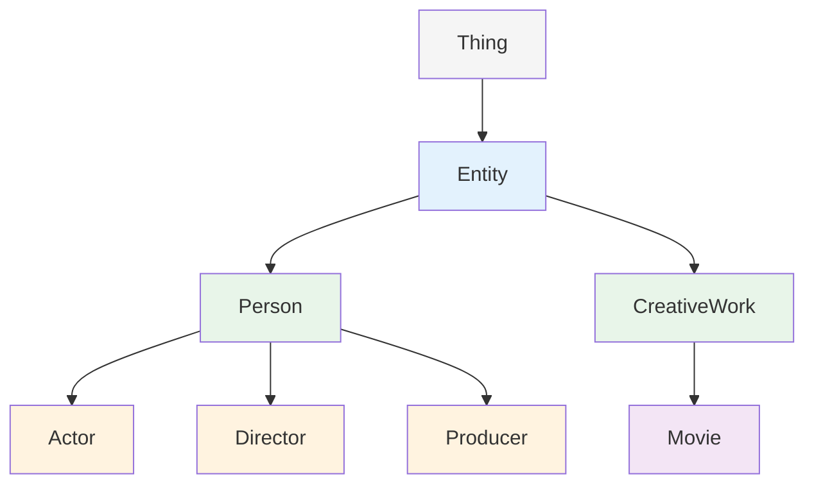

# 第 9 章 Protégé 入门

## 第 4 篇 练习：电影本体

### 练习目标

通过构建一个完整的电影本体，掌握 Protégé 的基本操作和本体建模的核心技能。

**学习成果**：
- 创建新的本体项目并设置元数据
- 定义类层次结构和类层次
- 添加对象属性和数据属性
- 创建个体实例并设置约束

---

### 步骤一：创建本体项目

**操作指引**：

1. 启动 Protégé
2. 点击 **New Project** 或使用 `Ctrl + N`
3. 输入本体 IRI：`http://example.org/movie-ontology#`
4. 设置元数据：
   - **Title**：Movie Ontology
   - **Description**：A simple ontology for movies, actors, and directors
   - **Version**：1.0.0
   - **Creator**：[您的姓名]

---

### 步骤二：定义核心类

在 **Classes** 标签页中创建以下类：

| 类名 | 父类 | 说明 |
|------|------|------|
| `Entity` | `owl:Thing` | 本体顶层类（可选） |
| `Person` | `Entity`（可选） | 人物类别 |
| `CreativeWork` | `Entity`（可选） | 创意作品类别 |
| `Movie` | `CreativeWork` | 电影类别 |

**类层次结构图**：



**在 Protégé 中创建类的操作**：

1. 选中 Classes 标签页
2. 点击 "+" 按钮创建新类
3. 输入类名，如 `Person`
4. 在 Super Classes 表中添加父类
5. 可选：添加注释标签（如 `rdfs:label "人物"@zh`）

---

### 步骤三：定义子类

将以下类定义为 `Person` 的子类：

| 子类名 | 父类 | 说明 |
|--------|------|------|
| `Actor` | `Person` | 演员 |
| `Director` | `Person` | 导演 |
| `Producer` | `Person` | 制片人 |

**Turtle 表示**：

```turtle
:Actor rdfs:subClassOf :Person .
:Director rdfs:subClassOf :Person .
:Producer rdfs:subClassOf :Person .
```

**添加不相交性约束**：

```turtle
# 设置 Actor 和 Director 为不相交类
:Actor owl:disjointWith :Director .
:Actor owl:disjointWith :Producer .
:Director owl:disjointWith :Producer .
```

**操作指引**：

1. 选中 `Actor` 类
2. 在 **Disjoint With** 标签中点击 "+"
3. 选择 `Director` 和 `Producer`
4. 对 `Director` 类重复，选择 `Producer` 作为不相交类

---

### 步骤四：定义对象属性

对象属性用于描述实体之间的关联。

**需要定义的属性**：

| 属性名 | 域 (Domain) | 范围 (Range) | 说明 |
|--------|-------------|--------------|------|
| `actsIn` | `Actor` | `Movie` | 出演的电影 |
| `directedBy` | `Movie` | `Director` | 导演 |
| `producedBy` | `Movie` | `Producer` | 制片人 |
| `collaboratedWith` | `Person` | `Person` | 合作者 |

**Turtle 代码示例**：

```turtle
### 定义对象属性

:actsIn a owl:ObjectProperty ;
    rdfs:domain :Actor ;
    rdfs:range :Movie ;
    rdfs:label "acts in"@en ;
    rdfs:comment "A movie the actor acted in"@en .

:directedBy a owl:ObjectProperty ;
    rdfs:domain :Movie ;
    rdfs:range :Director ;
    rdfs:label "directed by"@en ;
    rdfs:comment "The director of the movie"@en .

:producedBy a owl:ObjectProperty ;
    rdfs:domain :Movie ;
    rdfs:range :Producer ;
    rdfs:label "produced by"@en .

:collaboratedWith a owl:ObjectProperty ;
    rdfs:domain :Person ;
    rdfs:range :Person ;
    rdfs:label "collaborated with"@en ;
    rdfs:comment "Another person the individual has collaborated with"@en .
```

**设置属性特征**：

在 Protégé 中，选中属性后可以在 **Characteristics** 标签页设置特征：

| 属性 | 特征 | 说明 |
|------|------|------|
| `actsIn` | 无 | 演员可以出演多部电影 |
| `directedBy` | 逆函数性 | 一部电影可以只有一个导演 |
| `collaboratedWith` | 对称性 | A 与 B 合作意味着 B 与 A 合作 |

```turtle
# 为 collaboratedWith 添加对称性特征
:collaboratedWith a owl:SymmetricProperty .

# 推理: 已知 :ChristopherNolan :collaboratedWith :HansZimmer
# 推理: :HansZimmer :collaboratedWith :ChristopherNolan 也成立
```

---

### 步骤五：定义数据属性

数据属性用于连接个体和数据值。

**需要定义的数据属性**：

| 属性名 | 域 (Domain) | 范围 (Range) | 说明 |
|--------|-------------|--------------|------|
| `hasTitle` | `Movie` | `xsd:string` | 电影标题 |
| `releaseYear` | `Movie` | `xsd:integer` | 发行年份 |
| `hasName` | `Person` | `xsd:string` | 人物名称 |
| `hasBiography` | `Person` | `xsd:string` | 个人简介 |
| `imdbRating` | `Movie` | `xsd:decimal` | IMDb 评分 |

**Turtle 代码**：

```turtle
### 定义数据属性

:hasTitle a owl:DataProperty ;
    rdfs:domain :Movie ;
    rdfs:range xsd:string ;
    rdfs:label "title"@en .

:releaseYear a owl:DataProperty ;
    rdfs:domain :Movie ;
    rdfs:range xsd:integer ;
    rdfs:label "release year"@en .

:hasName a owl:DataProperty ;
    rdfs:domain :Person ;
    rdfs:range xsd:string ;
    rdfs:label "name"@en .

:hasBiography a owl:DataProperty ;
    rdfs:domain :Person ;
    rdfs:range xsd:string ;
    rdfs:label "biography"@en .

:imdbRating a owl:DataProperty ;
    rdfs:domain :Movie ;
    rdfs:range xsd:decimal ;
    rdfs:label "IMDb rating"@en .
```

---

### 步骤六：添加约束

为类添加基数约束，确保数据的完整性。

**需要设置的约束**：

| 类/属性 | 约束类型 | 说明 |
|---------|----------|------|
| `Movie` + `directedBy` | 最小基数 1 | 每部电影至少有一个导演 |
| `Movie` + `hasTitle` | 函数性 | 每部电影只有一个标题 |
| `Person` + `hasName` | 最小基数 1 | 每人至少有一个名称 |
| `Movie` + `releaseYear` | 最大基数 1 | 每年只发行一次 |
| `Movie` + `imdbRating` | 最大基数 1 | 只允许一个评分 |

**Turtle 代码表示**：

```turtle
# 约束 1: 每部电影必须有至少一个导演
:Movie owl:equivalentClass [
    a owl:Restriction ;
    owl:onProperty :directedBy ;
    owl:minQualifiedCardinality 1 ;
    owl:onClass :Director
] .

# 约束 2: 每个人至少有一个名称
:Person owl:equivalentClass [
    a owl:Restriction ;
    owl:onProperty :hasName ;
    owl:minQualifiedCardinality 1 ;
    owl:onDatatype xsd:string
] .

# 约束 3: 电影评分最多只能有一个值
:imdbRating a owl:FunctionalProperty ;
    rdfs:domain :Movie ;
    rdfs:range xsd:decimal .
```

---

### 步骤七：创建个体实例

在 **Individuals** 标签页中创建具体的实体实例。

**创建 `Person` 实例**：

| 个体名称 | 类型 (Instance Of) | 属性值 |
|----------|-------------------|--------|
| `ChristopherNolan` | `Director` | `hasName`: "Christopher Nolan" |
| `HansZimmer` | `Composer` | `hasName`: "Hans Zimmer" |
| `TomHanks` | `Actor` | `hasName`: "Tom Hanks" |

**操作指引**：

1. 点击 **Individuals** 标签页
2. 点击 "+" 创建新个体
3. 在 **Types** 表中添加类型（如 `Actor`）
4. 在值表格中设置属性值（如 `hasName` = "Tom Hanks"）

---

**创建 `Movie` 实例**：

| 个体名称 | 类型 | 属性值 |
|----------|------|--------|
| `Inception` | `Movie` | `hasTitle`: "Inception", `releaseYear`: 2010, `directedBy`: `ChristopherNolan` |
| `Interstellar` | `Movie` | `hasTitle`: "Interstellar", `releaseYear`: 2014, `directedBy`: `ChristopherNolan` |

**操作指引**：

1. 点击 **Individuals** 标签页
2. 创建新个体 `Inception`
3. 类型设为 `Movie`
4. 在 **Object Values** 表中设置：`directedBy` = `ChristopherNolan`
5. 在 **Data Values** 表中设置：`hasTitle` = "Inception", `releaseYear` = 2010

**完整的 Turtle 输出**：

```turtle
### 个体实例

:ChristopherNolan a :Director ;
    :hasName "Christopher Nolan" .

:Inception a :Movie ;
    :hasTitle "Inception" ;
    :releaseYear 2010 ;
    :directedBy :ChristopherNolan .
```

---

### 步骤八：保存与导出本体

#### 保存本体文件

Protégé 支持多种文件格式的导出：

| 格式 | 扩展名 | 特点 | 适用场景 |
|------|--------|------|----------|
| RDF/XML | `.owl` | W3C 标准格式 | 语义网应用 |
| Turtle | `.ttl` | 紧凑易读 | 人类阅读 |
| OWL/XML | `.owl` | XML 格式 | 工具交换 |
| OWL Functional | `.owl` | 函数式语法 | 调试分析 |

**导出步骤**：

1. **File → Save As** 保存为 `.owl` 文件
2. **File → Export** 选择目标格式
3. 选择保存路径并确认

#### 验证本体

导出后可以使用以下方式验证本体：

| 工具 | 验证内容 | 网址 |
|------|----------|------|
| W3C Validator | RDF 语法检查 | validator.w3.org |
| RDF Graph Editor | 图形化审查 | ide.zazuko.com |
| Protégé Axioms 标签 | 本体逻辑审查 | 内置功能 |

**使用 SPARQL 验证数据**：

```sparql
# 查询所有电影及其导演
SELECT ?movie ?title ?directorName
WHERE {
    ?movie a :Movie ;
           :hasTitle ?title ;
           :directedBy ?director .
    ?director :hasName ?directorName .
}
```

---

### 扩展练习

1. **添加更多关系**：
   - `writtenBy`：编剧与电影的关系
   - `scoreBy`：作曲家与电影配乐的关系

2. **添加属性特征**：
   - 为 `hasSSN` 添加函数性特征（每人只有一个社会保障号）
   - 为 `spouseOf` 添加对称性特征

3. **定义类表达式**：
   - 创建 `FilmDirector` 类：既是 `Person` 又至少执导过一部电影
   - 创建 `OscarWinner` 类：与人相关的获奖关系

4. **运行推理**：
   - 打开 **Plugins → Run Reasoner**（需安装 HermiT 插件）
   - 检查一致性和分类结果
   - 验证自动推理结果是否符合预期

---

### 本体完整模型示例

```turtle
@prefix : <http://example.org/movie-ontology#> .
@prefix rdf: <http://www.w3.org/1999/02/22-rdf-syntax-ns#> .
@prefix rdfs: <http://www.w3.org/2000/01/rdf-schema#> .
@prefix owl: <http://www.w3.org/2002/07/owl#> .
@prefix xsd: <http://www.w3.org/2001/XMLSchema#> .

## === 声明本体 ===
: movie-ontology a owl:Ontology ;
    rdfs:label "Movie Ontology"@en ;
    rdfs:comment "A sample ontology for demonstrating Protégé"@en .

## === 类定义 ===
:Person a owl:Class .
:Movie a owl:Class .
:Actor a owl:Class ;
    rdfs:subClassOf :Person .
:Director a owl:Class ;
    rdfs:subClassOf :Person .

## === 属性定义 ===
:hasName a owl:DataProperty ;
    rdfs:domain :Person ;
    rdfs:range xsd:string .
:directedBy a owl:ObjectProperty ;
    rdfs:domain :Movie ;
    rdfs:range :Director .
:actsIn a owl:ObjectProperty ;
    rdfs:domain :Actor ;
    rdfs:range :Movie .
:hasTitle a owl:DataProperty ;
    rdfs:domain :Movie ;
    rdfs:range xsd:string .
:releaseYear a owl:DataProperty ;
    rdfs:domain :Movie ;
    rdfs:range xsd:integer .

## === 约束 ===
:Movie owl:equivalentClass [
    a owl:Restriction ;
    owl:onProperty :directedBy ;
    owl:minQualifiedCardinality 1 ;
    owl:onClass :Director
] .

## === 个体 ===
:ChristopherNolan a :Director ;
    :hasName "Christopher Nolan" .
:Inception a :Movie ;
    :hasTitle "Inception" ;
    :releaseYear 2010 ;
    :directedBy :ChristopherNolan .

---

## Turtle 最终对照源码

以下是本练习完整电影本体的 Turtle 源码，整合了类定义、属性声明、约束与个体实例。

```turtle
# 电影本体 (Movie Ontology)
# 描述: 一个用于电影、演员和导演的简单本体示例

@prefix :        <http://example.org/movie-ontology#> .
@prefix rdf:     <http://www.w3.org/1999/02/22-rdf-syntax-ns#> .
@prefix rdfs:    <http://www.w3.org/2000/01/rdf-schema#> .
@prefix owl:     <http://www.w3.org/2002/07/owl#> .
@prefix xsd:     <http://www.w3.org/2001/XMLSchema#> .

# === 本体声明 ===
:movie-ontology
    a owl:Ontology ;
    owl:versionInfo "1.0.0" ;
    rdfs:label "Movie Ontology"@en .

# === 类 (Classes) 定义 ===

# 人物类
:Person
    a owl:Class ;
    rdfs:label "人物"@zh .

# 电影类
:Movie
    a owl:Class ;
    rdfs:label "电影"@zh .

# 演员类 - 人物的子类
:Actor
    a owl:Class ;
    rdfs:subClassOf :Person ;
    rdfs:label "演员"@zh .

# 导演类 - 人物的子类
:Director
    a owl:Class ;
    rdfs:subClassOf :Person ;
    rdfs:label "导演"@zh .

# 制片人类 - 人物的子类
:Producer
    a owl:Class ;
    rdfs:subClassOf :Person ;
    rdfs:label "制片人"@zh .

# 作曲家类 - 人物的子类
:Composer
    a owl:Class ;
    rdfs:subClassOf :Person ;
    rdfs:label "作曲家"@zh .

# 不相交类约束：演员、导演、制片人是互斥的
:Actor owl:disjointWith :Director, :Producer, :Composer .
:Director owl:disjointWith :Producer, :Composer .
:Producer owl:disjointWith :Composer .

# === 对象属性 (Object Properties) 定义 ===

# 参演属性：演员 → 电影
:actsIn
    a owl:ObjectProperty ;
    rdfs:label "参演"@zh ;
    rdfs:comment "演员出演的电影"@en ;
    rdfs:domain :Actor ;
    rdfs:range :Movie .

# 导演属性：电影 → 导演
:directedBy
    a owl:ObjectProperty ;
    rdfs:label "导演"@zh ;
    rdfs:comment "电影的导演"@en ;
    rdfs:domain :Movie ;
    rdfs:range :Director .

# 制片人属性：电影 → 制片人
:producedBy
    a owl:ObjectProperty ;
    rdfs:label "制片人"@zh ;
    rdfs:domain :Movie ;
    rdfs:range :Producer .

# 配乐属性：电影 → 作曲家
:scoreBy
    a owl:ObjectProperty ;
    rdfs:label "配乐"@zh ;
    rdfs:domain :Movie ;
    rdfs:range :Composer .

# 合作属性：人与人（对称属性）
:collaboratedWith
    a owl:ObjectProperty ;
    rdfs:label "合作过"@zh ;
    rdfs:domain :Person ;
    rdfs:range :Person .

# 合作属性为对称属性
:collaboratedWith a owl:SymmetricProperty .

# === 数据属性 (Data Properties) 定义 ===

# 姓名：人物
:hasName
    a owl:DatatypeProperty ;
    rdfs:label "姓名"@zh ;
    rdfs:domain :Person ;
    rdfs:range xsd:string .

# 电影标题
:hasTitle
    a owl:DatatypeProperty ;
    rdfs:label "标题"@zh ;
    rdfs:domain :Movie ;
    rdfs:range xsd:string .

# 发行年份
:releaseYear
    a owl:DatatypeProperty ;
    rdfs:label "发行年份"@zh ;
    rdfs:domain :Movie ;
    rdfs:range xsd:integer .

# 个人简介
:hasBiography
    a owl:DatatypeProperty ;
    rdfs:label "个人简介"@zh ;
    rdfs:domain :Person ;
    rdfs:range xsd:string .

# IMDb 评分
:imdbRating
    a owl:DatatypeProperty ;
    rdfs:label "IMDb 评分"@zh ;
    rdfs:domain :Movie ;
    rdfs:range xsd:decimal .

# 出生日期
:hasBirthDate
    a owl:DatatypeProperty ;
    rdfs:label "出生日期"@zh ;
    rdfs:domain :Person ;
    rdfs:range xsd:date .

# === 属性约束 (Property Constraints) ===

# 约束 1: 每部电影必须有至少一位导演
:Movie
    owl:equivalentClass [
        a owl:Restriction ;
        owl:onProperty :directedBy ;
        owl:minQualifiedCardinality 1 ^^ :Director
    ] .

# 约束 2: 每个人必须至少有一个名称
:Person
    owl:equivalentClass [
        a owl:Restriction ;
        owl:onProperty :hasName ;
        owl:minQualifiedCardinality 1 ^^ xsd:string
    ] .

# 约束 3: 电影标题是函数性属性
:hasTitle a owl:FunctionalProperty .

# 约束 4: IMDb 评分是函数性属性
:imdbRating a owl:FunctionalProperty .

# === 个体实例 (Individuals) ===

# ---- 人物实例 ----

:ChristopherNolan
    a :Director ;
    :hasName "Christopher Nolan" ;
    :hasBirthDate "1970-07-19"^^xsd:date ;
    :hasBiography "英国裔美国电影导演"@zh .

:HansZimmer
    a :Composer ;
    :hasName "Hans Zimmer" ;
    :hasBirthDate "1957-09-12"^^xsd:date ;
    :hasBiography "德国电影配乐作曲家"@zh .

:TomHanks
    a :Actor ;
    :hasName "Tom Hanks" ;
    :hasBirthDate "1956-07-09"^^xsd:date .

:LeonardoDiCaprio
    a :Actor ;
    :hasName "Leonardo DiCaprio" ;
    :hasBirthDate "1974-11-11"^^xsd:date .

# ---- 电影实例 ----

:Inception
    a :Movie ;
    :hasTitle "Inception" ;
    :hasTitle "盗梦空间"@zh ;
    :releaseYear 2010 ;
    :imdbRating 8.8 ;
    :directedBy :ChristopherNolan ;
    :scoreBy :HansZimmer .

:Interstellar
    a :Movie ;
    :hasTitle "Interstellar" ;
    :hasTitle "星际穿越"@zh ;
    :releaseYear 2014 ;
    :imdbRating 8.6 ;
    :directedBy :ChristopherNolan ;
    :scoreBy :HansZimmer .

:TheGreenMile
    a :Movie ;
    :hasTitle "The Green Mile" ;
    :hasTitle "绿里奇迹"@zh ;
    :releaseYear 1999 ;
    :imdbRating 8.6 .

# ---- 关系断言 ----

:TomHanks :actsIn :TheGreenMile .
:ChristopherNolan :collaboratedWith :HansZimmer .

# === 推理预期结果 ===
# 1. 类层次推理：:TomHanks 被分类为 :Person
# 2. 对称性推理：已知 :A :collaboratedWith :B ⇒ :B :collaboratedWith :A
# 3. 约束验证：每部电影至少有导演 — 违反时标记不一致
```

---

### 使用指南

1. **导入到 Protégé**：
   - 点击 **File → Import → RDF/Turtle Graph**
   - 选择保存的 `.ttl` 文件

2. **运行推理**：
   - 点击 **Tools → HermiT Reasoner → Run Reasoner**
   - 确认输出为 `consistent`

3. **扩展建议**：
   - 添加 `Genre`（类型）类和 `hasGenre` 属性
   - 定义更复杂的属性链：`actsIn o actedInInverse → collaboratedWith`