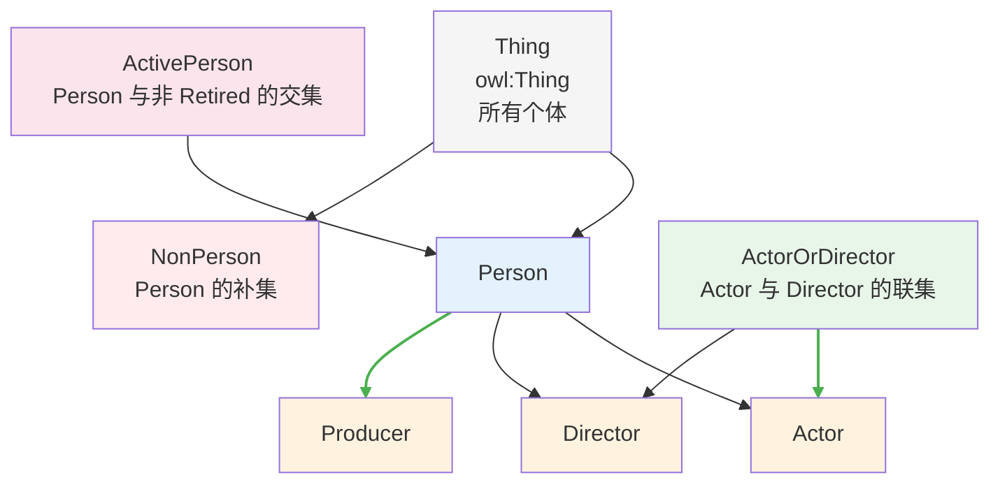

# 10.1 类表达式基础

> **本节要点**：理解类表达式的概念，掌握使用交集、联集、补集构建复杂类的方法。

---

## 1. 类表达式的概念

类表达式（Class Expression）是 OWL 2 的核心特性之一，允许开发者通过组合基本类来定义新的复杂类。与简单类声明不同，类表达式使用描述逻辑（Description Logic）的语法来构造类的定义。

**类表达式的表达能力**：

| 表达式类型 | OWL 语法 | 描述逻辑记法 | 说明 |
|------------|----------|--------------|------|
| 基本类 | `:Person` | `Person` | 简单类名 |
| 顶部类 | `owl:Thing` | `⊤` | 包含所有个体 |
| 底部类 | `owl:Nothing` | `⊥` | 空类，无实例 |
| 补集 | `owl:complementOf` | `¬C` | 不属于 C 的所有个体 |
| 交集 | `owl:intersectionOf` | `C ⊓ D` | 同时属于 C 和 D 的个体 |
| 联集 | `owl:unionOf` | `C ⊔ D` | 属于 C 或 D 的个体 |

```turtle
# 基本类声明
:Person a owl:Class .
:Movie a owl:Class .

# 顶部类与底部类（无需显式声明，OWL 2 内建）
# owl:Thing 是所有类的顶级父类
# owl:Nothing 是所有类的下级，没有任何实例
```

---

## 2. 交集表达式（Intersection）

交集表达式定义同时满足多个类条件的个体集合。

**基本语法**：

```turtle
# 定义同时是 Actor 和 Director 的人
:ActorOrDirector owl:intersectionOf ( :Actor :Director ) .

# 定义执导过电影的女性导演
:FemaleFilmDirector owl:intersectionOf (
    :Director
    :Woman
    [ owl:onProperty :directed ; owl:someValuesFrom :Movie ]
) .
```

**描述逻辑映射**：

| OWL 语法 | 描述逻辑 | 说明 |
|----------|----------|------|
| `:Actor owl:intersectionOf ( :Person :Artist )` | `Actor ⊑ Person ⊓ Artist` | Actor 是人且是艺术家 |

**实际应用示例**：

```turtle
# 定义"单身人士"：是人但非已婚人士
:SinglePerson owl:equivalentClass (
    :Person
    owl:complementOf :MarriedPerson
) .

# 定义"成年工作者"：是成年人且有工作
:AdultWorker owl:equivalentClass (
    :Person
    [ owl:onProperty :hasAge ; owl:someValuesFrom xsd:integer ; owl:minQualifiedCardinality 18 ]
    [ owl:onProperty :hasJob ; owl:someValuesFrom :Job ]
) .

# 定义"获得奥斯卡奖的女性导演"
:OscarWinningFemaleDirector owl:equivalentClass (
    :Director
    :Woman
    [ owl:onProperty :hasAward ; owl:someValuesFrom :OscarAward ]
) .
```

---

## 3. 联集表达式（Union）

联集表达式定义属于任意一个类的所有个体集合。

**基本语法**：

```turtle
# 定义所有影视从业人员
:FilmWorker owl:unionOf ( :Director :Actor :Producer ) .
```

**常见应用场景**：

| 联集类 | 组成类 | 说明 |
|--------|--------|------|
| `FilmWorker` | `Director` + `Actor` + `Producer` | 所有影视从业者 |
| `MediaContent` | `Movie` + `Series` + `Documentary` | 所有媒体内容 |
| `ContactPerson` | `Director` + `Actor` + `Producer` + `Writer` | 所有可联系的人员 |

**与交集的区别**：

| 操作 | 符号 | 含义 | 实例条件 |
|------|------|------|----------|
| 交集 `⊓` | `owl:intersectionOf` | 同时属于所有类 | 必须满足所有条件 |
| 联集 `⊔` | `owl:unionOf` | 属于任一类即可 | 满足至少一个条件 |

```turtle
# 交集：必须同时满足
:BothActorAndDirector a :Actor ;
    a :Director .

# 联集：只需满足一个
:AActor a :Actor .  # 属于联集 :FilmWorker
```

---

## 4. 补集表达式（Complement）

补集表达式定义不属于指定类的所有个体。

**基本语法**：

```turtle
# 定义"非人类"的所有实体
:NonHuman owl:complementOf :Human .

# 定义"未评分"的电影（通过补集实现概念）
:UnratedMovie owl:complementOf :RatedMovie .
```

**补集的使用限制**：

由于 Open World Assumption (OWA)，补集的表达在语义上与 SQL 的 NOT 运算符有本质区别。在 OWL 中，"非 A" 不意味着"不存在"。

| 场景 | SQL 语义 (CWA) | OWL 语义 (OWA) |
|------|----------------|----------------|
| "不是经理的人" | 已知员工中非经理的 | 宇宙中所有不属于 Manager 类的个体 |
| "没有评级的电影" | 数据库中 rating 字段为 null 的记录 | 所有不属于 RatedFilm 类的资源 |

---

## 5. 类表达式可视化



---

## 6. 表达式嵌套与组合

类表达式可以嵌套使用，创建极其复杂的类定义。

**嵌套表达式示例**：

```turtle
# 定义：执导过至少一部电影的演员（同时是演员和导演）
:ActorWhoDirects owl:intersectionOf (
    :Actor
    [ owl:onProperty :directed ; owl:someValuesFrom :Movie ]
) .

# 定义：不是导演也不是编剧的电影制作人
:NonCreativeProducer owl:intersectionOf (
    :Producer
    owl:complementOf :Director
    owl:complementOf :Screenwriter
) .

# 定义：所有获奖者（奥斯卡奖或金球奖获得者）
:AwardWinner owl:unionOf ( :OscarWinner :GoldenGlobeWinner ) .
```

**嵌套深度与推理复杂度**：

| 嵌套层级 | 示例 | 推理复杂度 |
|----------|------|------------|
| 0 层（基本类） | `:Actor` | 常量 O(1) |
| 1 层 | `:Actor ⊓ :Director` | 多项式 |
| 2 层 | `(:Actor ⊓ :Person) ⊔ :Writer` | 多项式 |
| 3+ 层 | 多层嵌套组合 | 可能达到 ExpTime |


---

## 7. 总结与对比表

| 操作 | 符号 | 实例条件 | 示例 |
|------|------|----------|------|
| 交集 | `⊓` | A ⊓ B | 同时是 Actor 和 Writer |
| 联集 | `⊔` | A ⊔ B | Actor 或 Writer |
| 补集 | `¬` | ¬A | 非员工 |
| 组合 | - | 混合使用 | (A ⊓ B) ⊔ C |

**类表达式优势**：

1. **增强表达能力**：无需预定义所有类即可创建语义
2. **推理支持**：推理器可基于表达式进行类分类和一致性检查
3. **模块化设计**：允许将复杂概念拆解为可组合的模块