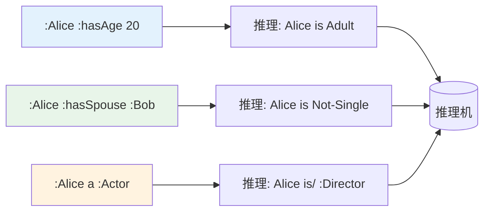

# 10.2 等价类与不相交性

> **本节要点**：掌握等价类断言的用途，理解不相交性约束如何确保本体的逻辑一致性。

---

## 1. 等价类（Equivalent Class）

等价类断言声明两个类具有完全相同的实例。这是 OWL 2 中表达类定义的核心方式之一。

### 基本概念

**等价类的语义**：

| 断言 | 语义 | 数学记法 |
|------|------|----------|
| `A owl:equivalentClass B` | A 和 B 的实例完全相同 | A = B |
| `A owl:equivalentClass 表达式` | A 等价于某个类表达式 | A = 表达式 |

**核心特性**：

| 特性 | 说明 |
|------|------|
| 传递性 | A ≡ B 且 B ≡ C 则 A ≡ C |
| 对称性 | A ≡ B 则 B ≡ A |
| 自反性 | A ≡ A |

### 等价类的使用场景

**场景一：定义别名**

```turtle
# 为复杂表达式创建简化别名
:Staff owl:equivalentClass ( :Employee ⊔ :Contractor ) .

# 在代码中简化表述
:Manager a :Staff .  # 等价于: Manager a Employee ∪ Contractor
```

**场景二：定义性等价（Definitional Equivalence）**

```turtle
# 定义"单身人士"的概念
:SinglePerson owl:equivalentClass [
    a owl:Restriction ;
    owl:onProperty :hasSpouse ;
    owl:none
] .

# 或者使用补集定义
:MarriedPerson a owl:Class .
:SinglePerson owl:equivalentClass owl:complementOf :MarriedPerson .
```

**场景三：基于属性限制的等价定义**

```turtle
# 定义"导演"为执导过至少一部电影的人
:Director owl:equivalentClass [
    a owl:Restriction ;
    owl:onProperty :directed ;
    owl:someValuesFrom :Movie
] .

# 推理过程：
# 如果个体 :X 存在 :directed → :Movie_1 的关系
# 则推理机将 :X 分类为 :Director
```

### 等价类 vs 子类

| 比较维度 | 等价类 (≡) | 子类 (⊑) |
|----------|------------|----------|
| 关系 | A ⊆ B 且 B ⊆ A | A ⊆ B |
| 实例集合 | 完全相同 | 前者为后者子集 |
| 推理强度 | 高：可互相替换 | 中：仅单向包含 |
| 适用场景 | 定义性断言 | 层次化分类 |

```turtle
# 等价类：两个类完全相同
:UniversityStudent owl:equivalentClass :Student .

# 子类：单向包含
:Professor rdfs:subClassOf :Staff .
# 但 :Staff 不一定都是 :Professor

# 组合使用：定义精确关系
:FullProfessor owl:equivalentClass (
    :Professor
    [ owl:onProperty :employmentType ; owl:someValuesFrom :FullTime ]
) .
```

---

## 2. 不相交类（Disjoint Classes）

不相交性约束声明两个类不能有任何共同的实例，这是维护本体逻辑一致性的关键机制。

### 基本概念

**不相交性断言语义**：

| 断言 | 说明 | 集合关系 |
|------|------|----------|
| `A owl:disjointWith B` | A 和 B 没有共同实例 | A ∩ B = ∅ |
| 传递不相交 | A ⊓ B, B ⊓ C, A ⊓ C | 多重两两不相交 |

**推理能力**：

当声明不相交性后，推理机可以执行以下推断：

| 前提 | 不相交声明 | 推理结果 |
|------|------------|----------|
| `:Alice a :Person` | `:Person disjointWith :Animal` | `:Alice a/ :Animal` (矛盾) |
| `:X a :Actor` | `:Actor disjointWith :Director` | `:X a/ :Director` (不可能) |

### 不相交性的应用

**场景一：基础分类**

```turtle
# 声明性别分类的不相交性
:Male owl:disjointWith :Female .

# 声明人种分类的不相交性
:Asian owl:disjointWith :European .
:Asian owl:disjointWith :African .
:European owl:disjointWith :African .
```

**场景二：业务领域分类**

```turtle
# 影视作品中各类角色不相交
:Actor owl:disjointWith :Director .
:Actor owl:disjointWith :Producer .
:Director owl:disjointWith :Producer .

# 电影类型不相交
:Drama owl:disjointWith :Comedy .
:Action owl:disjointWith :Romance .
```

**场景三：约束验证**

```turtle
# 定义"未成年人与成年人"的不相交性
:Minor owl:equivalentClass [
    a owl:Restriction ;
    owl:onProperty :hasAge ;
    owl:maxQualifiedCardinality 17 ^^ xsd:integer
] .

:Adult owl:equivalentClass [
    a owl:Restriction ;
    owl:onProperty :hasAge ;
    owl:minQualifiedCardinality 18 ^^ xsd:integer
] .

# 不相交性确保一个人不能同时是未成年和成年
:Minor owl:disjointWith :Adult .
```

### 多重不相交声明

```turtle
# 方式一：链式声明
:Actor owl:disjointWith :Director , :Producer , :Writer .

# 上述代码等价于：
:Actor owl:disjointWith :Director .
:Actor owl:disjointWith :Producer .
:Actor owl:disjointWith :Writer .
:Director owl:disjointWith :Producer .  # 需要额外声明
:Director owl:disjointWith :Writer .   # 需要额外声明
:Producer owl:disjointWith :Writer .   # 需要额外声明
```

**注意**：OWL 2 的 `disjointWith` 不具有传递性，两两不相交需要显式声明。

```mermaid
graph TD
    A[声明 A 与 B,C,D 不相交] --> B[A disjointWith B]
    A --> C[A disjointWith C]
    A --> D[A disjointWith D]
    B -. NOT --> E[B 与 C/D 自动不相交]
    C -. NOT --> E
    D -. NOT --> E
    
    style E fill:#ffebee,color:#c62828
```

---

## 3. 结合等价与不相交的实例

### 人物分类完整模型

```turtle
@prefix : <http://example.org/ontology#> .
@prefix rdfs: <http://www.w3.org/2000/01/rdf-schema#> .
@prefix owl: <http://www.w3.org/2002/07/owl#> .
@prefix xsd: <http://www.w3.org/2001/XMLSchema#> .

## === 基础分类声明 ===
:Person a owl:Class .
:Employee a owl:Class ;
    rdfs:subClassOf :Person .

## === 性别分类（等价 + 不相交） ===
:Female owl:equivalentClass ( :Person [ owl:onProperty :hasGender ; owl:someValuesFrom :GenderFemale ] ) .
:Male owl:equivalentClass ( :Person [ owl:onProperty :hasGender ; owl:someValuesFrom :GenderMale ] ) .
:Female owl:disjointWith :Male .

## === 职业分类（等价定义 + 不相交） ===
:Director owl:equivalentClass ( :Person [ owl:onProperty :directed ; owl:someValuesFrom :Movie ] ) .
:Actor owl:equivalentClass ( :Person [ owl:onProperty :actedIn ; owl:someValuesFrom :Movie ] ) .
:Director owl:disjointWith :Actor .

## === 使用示例 ===
:ChristopherNolan a :Director .  # 自动分类：因为 directed → Movie
:EmmaStone a :Actor .  # 自动分类：因为 actedIn → Movie
```

### 推理场景演示



---

## 4. 一致性与冲突检测

### 等价类的推理影响

当添加等价类断言后，推理机会自动检查：

| 情况 | 结果 |
|------|------|
| 类的定义包含矛盾（如 `A ⊓ ¬A`） | 本体变为不一致 |
| 两个不等价类被声明等价 | 实例需要满足两者的并集 |
| 实例违反不相交声明 | 推理机报告矛盾个体 |

### 冲突检测示例

```turtle
# 定义 A 和 B 不相交
:A owl:disjointWith :B .

# 如果 :X 被断言为同时属于 A 和 B
:Person owl:equivalentClass [
    owl:onProperty :hasGender ;
    owl:someValuesFrom :GenderFemale
] .  # Woman ≡ Person ∩ Female
:Woman owl:disjointWith :Man .

# 以下数据将产生矛盾
:Bob a :Woman , :Man .  # ❌ 矛盾：不相交类的重复实例
```

---

## 5. 最佳实践

### 不相交声明建议

| 实践 | 说明 | 原因 |
|------|------|------|
| 穷尽分类时不声明互斥 | 如有需要，补充声明 | 防止过度约束 |
| 分类体系明确时添加不相交 | 如性别、元素类型 | 帮助推理和验证 |
| 分类存在交叉时不要声明 | 如"学生"和"员工"可同时成立 | 避免错误推理 |

### 等价类断言建议

| 实践 | 说明 |
|------|------|
| 仅对"完全等价"的类使用 | 确保实例集合精确一致 |
| 避免过深嵌套 | 复杂的等价表达式可能导致推理性能下降 |
| 考虑使用 `subClassOf` | 如仅是单向包含关系 |

### 常用组合模式

```turtle
# 模式 1：穷尽分类
:A owl:disjointWith :B .
:A owl:disjointWith :C .
:B owl:disjointWith :C .
:C owl:disjointWith :A .  # 确保每对都不相交

# 模式 2：等价+子类定义
:OscarWinner owl:equivalentClass (
    :Person
    [ owl:onProperty :hasAward ; owl:someValuesFrom :Oscar ]
) .