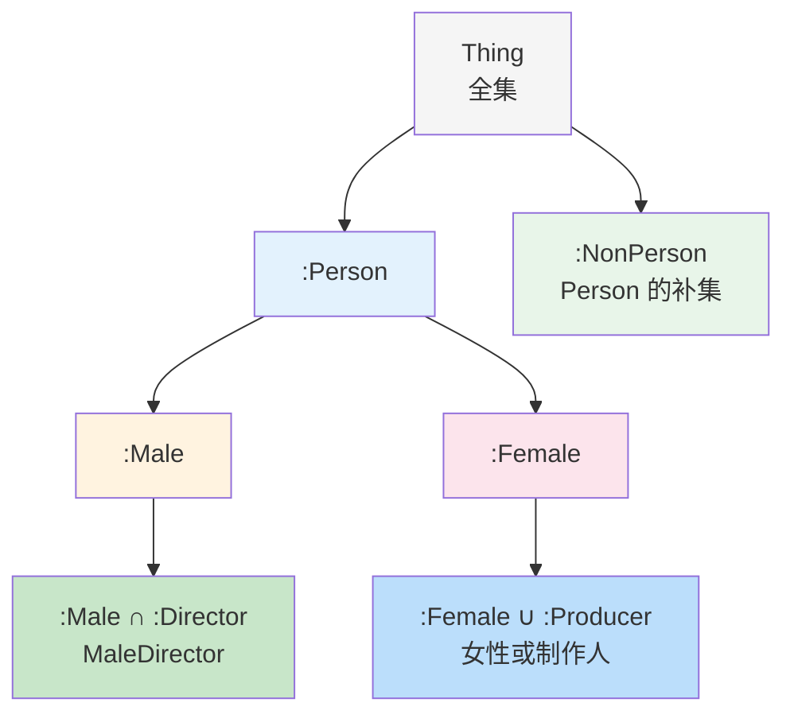

# 10.3 集合运算

> **本节要点**：掌握使用交集、联集、补集等集合运算构建复杂类的方法，以及运算在实际建模中的应用。

---

## 1. 类运算与集合论

OWL 2 类建模操作直接对应于数学集合论中的基本运算。掌握这些运算是构建复杂类定义的基础。

**集合论与 OWL 运算对照表**：

| 集合运算 | 集合论符号 | OWL 2 属性 | 描述逻辑记法 |
|----------|------------|------------|--------------|
| 交集 | ∩ | `owl:intersectionOf` | ⊓ |
| 联集 | ∪ | `owl:unionOf` | ⊔ |
| 补集 | ̅ | `owl:complementOf` | ¬ |
| 包含 | ⊆ | `rdfs:subClassOf` | ⊆ |
| 等价 | = | `owl:equivalentClass` | = |

```turtle
# 集合论在 OWL 中的表达方式
# C ∩ D 对应于：
:C ∩ :D owl:intersectionOf ( :C :D ) .

# C ∪ D 对应于：
:C ∪ :D owl:unionOf ( :C :D ) .

# ̅C 对应于：
:NOT_C owl:complementOf :C .
```

---

## 2. 交集运算（Intersection）

交集运算创建同时属于所有操作类的个体集合。

### 基本交集运算

**语法示例**：

```turtle
# 定义"演员导演"：既是 Actor 又是 Director
:ActorDirector owl:intersectionOf ( :Actor :Director ) .

# 定义"获奖电影制作人"：是制作人且有获奖记录
:AwardWinningProducer owl:intersectionOf (
    :Producer
    [ owl:onProperty :hasAward ; owl:someValuesFrom :Award ]
) .
```

**实例条件**：

| 个体 | 是 Actor? | 是 Director? | 属于 ActorDirector? |
|------|-----------|--------------|---------------------|
| :MerylStreep | ✅ | ❌ | ❌ |
| :ChristopherNolan | ✅ (间接) | ✅ | ✅ |
| :LeoDiCaprio | ✅ | ❌ | ❌ |

### 多类交集

OWL 2 支持多于两个类的交集运算：

```turtle
# 三个类的交集：是 Person 且已婚且是学生
:MarriedStudent owl:intersectionOf (
    :Person
    [ owl:onProperty :hasSpouse ; owl:someValuesFrom :Person ]
    :Student
) .

# 四个类的交集
:FilmAwardDirector owl:intersectionOf (
    :Director
    [ owl:onProperty :hasAward ; owl:someValuesFrom :Award ]
    [ owl:onProperty :directed ; owl:someValuesFrom :Movie ]
    :Person
) .
```

### 交集的代数性质

| 性质 | 说明 | 示例 |
|------|------|------|
| 交换律 | A ⊓ B = B ⊓ A | :ActorDirector ≡ :DirectorActor |
| 结合律 | (A ⊓ B) ⊓ C = A ⊓ (B ⊓ C) | 顺序无关 |
| 幂等律 | A ⊓ A = A | 重复无意义 |
| 零元律 | A ⊓ ⊥ = ⊥ | 与空类交集为空的 |

```turtle
# 交换律实例
:ActorDirector owl:intersectionOf ( :Actor :Director ) .
:DirectorActor owl:intersectionOf ( :Director :Actor ) .
# 推理结果：ActorDirector ≡ DirectorActor
```

---

## 3. 联集运算（Union）

联集运算创建属于任意操作类的个体集合。

### 基本联集运算

```turtle
# 定义"创意人员"：所有创意从业者的联集
:CreativePerson owl:unionOf (
    :Director
    :Writer
    :Editor
    :Composer
) .

# 等价于数学表示：CreativePerson = Director ∪ Writer ∪ Editor ∪ Composer
```

**实例检查**：

| 个体 | Director | Writer | 属于 CreativePerson? |
|------|----------|--------|----------------------|
| :QuentinTarantino | ✅ | ✅ | ✅ |
| :AaronSorkin | ❌ | ✅ | ✅ |
| :HansZimmer | ✅ | ❌ | ✅ |
| :TomHanks (仅 Actor) | ❌ | ❌ | ❌ |

### 联集的性质

| 性质 | 说明 | 示例 |
|------|------|------|
| 交换律 | A ∪ B = B ∪ A | 顺序无关 |
| 结合律 | (A ∪ B) ∪ C = A ∪ (B ∪ C) | 分组无关 |
| 幂等律 | A ∪ A = A | 重复无意义 |
| 零元元 | A ∪ ⊤ = ⊤ | 与全集联集为全集 |

### 联集在分类中的应用

```turtle
# 为所有可联系的职业创建一个联集类
:ContactablePerson owl:unionOf (
    :Director
    :Producer
    :CastingDirector
) .

# 用于筛选和分组操作
:TeamMember owl:equivalentClass [
    owl:onProperty :worksOn ;
    owl:someValuesFrom :ContactablePerson
] .
```

---

## 4. 补集运算（Complement）

补集运算创建不属于指定类的所有个体的集合。

### 补集的基本概念

| 概念 | 说明 | OWL 语法 |
|------|------|----------|
| 类 C 的补集 | 所有不属于 C 的个体 | `owl:complementOf :C` |
| 相对补集 | A 中不属于 B 的部分 | `A ⊓ complementOf B` |

```turtle
# 定义"非人类实体"的所有本体元素
:NonPerson owl:complementOf :Person .

# 实际效果：Thing 中除了 Person 的所有个体都属于 NonPerson
```

**补集的约束**：

需要注意，由于 Open World Assumption，补集的语义与传统编程语言的 NOT 运算符完全不同：

| 语义 | SQL (CWA) | OWL (OWA) |
|------|-----------|-----------|
| "不是男性的人" | 在已知数据中性别不是 male 的记录 | 宇宙中所有不属于 Male 类的资源 |
| "没有评级的电影" | rating 为 NULL 的记录 | 所有不属于 RatedMovie 类的电影 |

### 补集的德·摩根律

```
¬(A ∪ B) = ¬A ∩ ¬B  （A∪B 的补集 = A 的补集 ∩ B 的补集）
¬(A ∩ B) = ¬A ∪ ¬B  （A∩B 的补集 = A 的补集 ∪ B 的补集）
```

**OWL 中的实现**：

```turtle
# 两种方式等价
:NOT_A_OR_B owl:complementOf [: owl:unionOf ( :A :B ) ] .
:NOT_A_INTER_NOT_B owl:intersectionOf (
    [: owl:complementOf :A ]
    [: owl:complementOf :B ]
) .
# 推理：NOT_A_OR_B ≡ NOT_A_INTER_NOT_B
```

---

## 5. 集合运算综合应用

### 电影分类模型

```turtle
@prefix : <http://example.org/movie-ontology#> .
@prefix owl: <http://www.w3.org/2002/07/owl#> .

## === 基础类定义 ===
:Person a owl:Class .
:CreativePerson a owl:Class ;
    rdfs:subClassOf :Person .
:Male a owl:Class ;
    rdfs:subClassOf :Person .
:Female a owl:Class ;
    rdfs:subClassOf :Person .

## === 用交集创建细分类 ===
:MaleDirector owl:intersectionOf ( :Male :Director ) .
:FemaleProducer owl:intersectionOf ( :Female :Producer ) .

## === 用联集创建聚合类 ===
:AllCreative owl:unionOf ( :Director :Producer :Actor :Writer ) .
```

### 运算嵌套与组合

```turtle
# 复杂表达式：(A ∪ B) ∩ C
# "导演或制作人，且是女性"
:FemaleFilmMaker owl:intersectionOf (
    [: owl:unionOf ( :Director :Producer ) ]
    :Female
) .

# 复杂表达式：(A ∩ B) ∪ C
# "男性导演 或 女性制作人"
:CreativeDuo owl:unionOf (
    [: owl:intersectionOf ( :Male :Director ) ]
    [: owl:intersectionOf ( :Female :Producer ) ]
) .
```

### 集合运算可视化



---

## 6. 运算性质总结

| 运算 | 实例条件 | 交换律 | 结合律 | 幂等律 |
|------|----------|--------|--------|--------|
| 交集 (⊓) | 必须全部满足 | ✅ | ✅ | ✅ |
| 联集 (⊔) | 至少满足一个 | ✅ | ✅ | ✅ |
| 补集 (¬) | 不满足条件 | ❌ | ❌ | - |

### 注意事项

1. **补集的使用需谨慎**：在 OWA 下可能导致意外的推理行为
2. **避免过度嵌套**：复杂的集合运算可能导致推理性能下降
3. **确保类的可判性**：使用有界的 OWL Profile 时注意表达能力限制