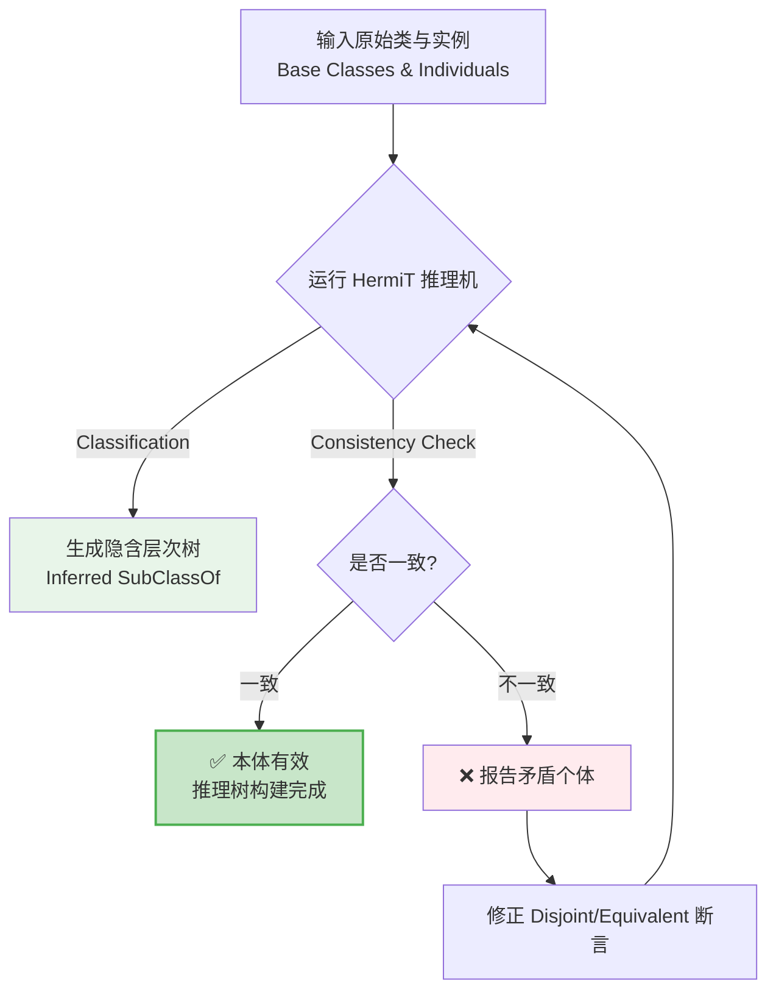

# 10.4 练习：Protégé 类表达式与集合运算实操

> **本节要点**：在 Protégé 图形界面中实际操作类表达式构造，掌握交集、联集、补集、等价与不相交属性的使用。

---

## 练习场景与目标

**背景**：基于第 9 章建立的“电影本体（Movie Ontology）”，进一步使用类表达式和集合运算优化分类体系。

**学习目标**：
1. 使用 `owl:intersectionOf` 和 `owl:unionOf` 创建复合类
2. 利用 `owl:disjointWith` 添加互斥约束防止数据冲突
3. 使用 `owl:equivalentClass` 将复杂表达式映射为新类别名
4. 通过 HermiT 推理机检查本体的一致性并自动分类

---

## 步骤一：准备基础本体

1. **打开上一节导出的电影本体文件**：
   - 启动 Protégé
   - 点击 **File → Open**，选择之前保存的 `movie-ontology.owl` 文件

2. **确认已创建的类与属性**：
   - 检查 **Classes** 视图中已存在 `Person`, `Actor`, `Director`, `Producer`, `Movie` 类
   - 检查 **Object Properties** 视图中已存在 `directed`, `actsIn`, `producedBy` 属性

**预期检查项**：

| 检查点 | 预期结果 |
|--------|----------|
| Classes 视图类树 | 包含 `Person` 及其子类 `Actor`, `Director`, `Producer` |
| Object Properties 属性列表 | 包含 `directed` (Movie→Director), `actsIn` (Actor→Movie) 等 |
| 注释完整性 | 属性已添加 `rdfs:label` 等说明信息 |

---

## 步骤二：使用集合运算创建复合类

本步骤练习交集与联集运算的实操。

### 创建"导演编剧"（交集运算）

**需求说明**：创建一个新的类 `DirectorAndWriter`，代表既是导演又是编剧的人员。

**Protégé 操作指引**：

1. 在左侧导航栏点击 **Classes**
2. 点击工具栏的 **Create New Class** (快捷键 `Ctrl + N`)
3. 输入类名：`DirectorAndWriter`
4. 在中间编辑区域切换到 **Equivalent To** 标签页
5. 点击 **Create Restriction** 或直接在右侧搜索框查找已有类
6. 选择 `owl:intersectionOf`
7. 在列表中添加两个类：
   - 第一个：点击 **+** 按钮搜索并选择 `Director`
   - 第二个：点击 **+** 按钮搜索并选择 `Writer`

```turtle
# 完成后的 Turtle 源码片段
:DirectorAndWriter owl:equivalentClass [
    a owl:Class ;
    owl:intersectionOf ( :Director :Writer )
] .
```

---

### 创建"台前艺人"（联集运算）

**需求说明**：所有直接出现在镜头前的影视工作者统称为"台前艺人"（OnScreenArtist）。

**Protégé 操作指引**：

1. 再次点击 **Create New Class**，命名：`OnScreenArtist`
2. 切换到 **Equivalent To** 标签
3. 在类构造器（Class Editor）中选择 `owl:unionOf`
4. 逐次将以下类添加到列表中：
   - `Actor`
   - `Host` (如有，若无可跳过，仅用 Actor 和 Actress)
   - `StuntDouble`

**注意事项**：Protégé 的联集选择器要求点击 **Add member** 按钮逐个添加成员。

```turtle
:OnScreenArtist owl:equivalentClass [
    a owl:Class ;
    owl:unionOf ( :Actor :StuntDouble )
] .
```

**交集 vs 联集对照表**：

| 运算类型 | Protégé 界面位置 | Turtle 属性 | 判断条件 |
|----------|------------------|-------------|----------|
| 交集 (`⊓`) | Equivalent To → Restriction → Intersection Of | `owl:intersectionOf` | 需同时属于所有列出的类 |
| 联集 (`⊔`) | Equivalent To → Restriction → Union Of | `owl:unionOf` | 只要属于任一列出的类即可 |

---

## 步骤三：使用等价类与不相交性断言

### 添加"制片主管"的等价定义

**需求**：在大型剧组中，"制片主管"定义为"制作人"且具有"雇佣全职员工作"属性约束的人。

**Protégé 操作指引**：

1. 创建新类 `ChiefProducer`
2. 在 **Equivalent To** 面板中，选择 **Restriction** 类型
3. 属性选择：`employmentRelation` (假设的雇佣属性)
4. 限制类型选择：**Some Values From**
5. 值类选择：`FullTimeStaff`

```turtle
:ChiefProducer owl:equivalentClass [
    a owl:Restriction ;
    owl:onProperty :managed ;
    owl:someValuesFrom :FilmProduction
] .
```

**推理验证**：
当本体中有 `:John a :ChiefProducer` 时，推理机将自动推断出 `:John a :Producer`。

### 添加类的互不相交声明

**需求**：声明 `Actor`、`Director`、`Producer` 彼此互斥，确保数据录入时不会将同一个人错误分类为同一组互斥角色。

**Protégé 操作指引**：

1. 选中 **Classes** 视图表中的 `Actor`
2. 点击底部 **Disjoint With** 标签
3. 点击 **+** 号，选择 `Director` 和 `Producer`
4. 选中 `Director`，对 `Producer` 重复上述操作

**检查是否成功**：

| 步骤 | 操作方法 | 验证表现 |
|------|----------|----------|
| 方法一：Protégé 检查 | 选中类，查看 **Disjoint With** 表格 | 应列出所有限制的类 |
| 方法二：Axioms 视图 | 浏览 **Axioms** 面板 | 包含三行 `DisjointWith(...)` 断言 |
| 方法三：文本导出 | 将本体保存为 `.ttl` 并用文本编辑器打开 | 应含 `owl:disjointWith` 语法 |

```turtle
:Actor owl:disjointWith :Director , :Producer .
:Director owl:disjointWith :Producer .
```

**推理冲突检测**：
如果错误地将一个个体分类为互斥类：

| 动作 | 结果 | 说明 |
|------|------|------|
| `:TestPerson a :Actor :Director` | **本体不一致** | HermiT 推理机会报告 "Unsatisfiable Class" 或异常错误 |
| 正确数据 | 正常分类并自动推断子类 | 系统自动执行分类 |

---

## 步骤四：运行推理机进行验证

### 运行 HermiT 推理机

Protégé 默认集成 HermiT 推理引擎，可执行自动分类（Classification）。

**操作步骤**：

1. 点击顶部菜单 **Plugins → Reasoner → HermiT Reasoner**
2. 选择 **Run Reasoner** 按钮
3. 观察底部控制台日志，等待分类完成
4. 点击菜单栏 **Reasoner → Infer → Inferred Class Axioms**
5. 观察推理生成的隐含类关系

### 推理结果验证表

假设本体数据如下，观察 HermiT 推理产生的自动推断结果：

| 输入本体数据 | 预期自动推断 (Inferred) | 验证说明 |
|--------------|----------------------|----------|
| `:MerylStreep a :Actor` | 继承 `:OnScreenArtist` | 因为 Actor 属于 OnScreenArtist 的联集定义 |
| `:Jonathan a :Director` | 属于 `:DirectorAndWriter` ❌ (不成立) | 因 Jonathan 无 Writer 实例 |
| `:Zoe a :DirectorAndWriter` | 自动归类为 `:Director` 和 `:Writer` | Intersection 的逆推断 |
| `:Bob a :Actor :Producer` | **不一致 (Inconsistent)** | 违反了 Actor 与 Producer 的不相交声明 |

**自动分类流程图**：



### 查看推理结果

在 Protégé 中区分两种视图：

| 视图类型 | 说明 | 切换方式 |
|----------|------|----------|
| **Declared (声明视图)** | 仅显示人工定义的关系 | 右键 → Inferred → Hide Inferred |
| **Inferred (推断视图)** | 显示定义 + 推理生成的关系 | 右键 → Inferred → Show Inferred |

**示例：显示隐藏的关系**：

| 操作 | 路径/动作 |
|------|-----------|
| 开启推断视图 | 在类树中右键 -> `Show Inferred` |
| 查看类的子类 | 展开推理树，查看自动生成的 `SubClassOf` |
| 验证冲突个体 | 点击 `Reasoner → Check Consistency` 面板的红色报错 |

---

## 完整的 Turtle 代码对照

**最终实现的集合运算与断言源码**：

```turtle
@prefix : <http://example.org/movie-ontology#> .
@prefix rdfs: <http://www.w3.org/2000/01/rdf-schema#> .
@prefix owl: <http://www.w3.org/2002/07/owl#> .

## === 集合运算创建的复合类 ===
:DirectorAndWriter owl:equivalentClass [
    owl:intersectionOf ( :Director :Writer )
] .

:OnScreenArtist owl:equivalentClass [
    owl:unionOf ( :Actor :StuntDouble )
] .

## === 不相交断言 ===
:Actor owl:disjointWith :Director , :Producer .
:Director owl:disjointWith :Producer .

## === 验证案例个体（含冲突） ===
:TestConsistent a :DirectorAndWriter .  # 推理: a :Director, a :Writer
:TestConflict a :Actor , :Producer .    # ❌ 推理报告: Inconsistent
```

---

## 总结

| 操作步骤 | 使用核心特性 | Protégé 界面入口 | 推理效果 |
|----------|--------------|------------------|----------|
| 创建交集类 | `owl:intersectionOf` | Equivalent To -> Restriction -> Intersection | 自动推断为子类 |
| 创建联集类 | `owl:unionOf` | Equivalent To -> Restriction -> Union | 自动推断为其成员 |
| 设置互斥 | `owl:disjointWith` | Disjoint With 标签 | 冲突检测 (Consistency Check) |
| 等价别名 | `owl:equivalentClass` | Equivalent To 列 | 双向分类 (等价替换) |
| 推理查看 | HermiT Reasoner | Plugins -> Reasoner | 自动生成 Inferred Class 层级 |

**关键注意事项**：

1. **互斥断言需穷尽两两声明**：`A disjointWith B, C` 不能替代 `A-B, A-C, B-C`
2. **推理顺序**：务必在完成所有 `subClassOf`、`equivalentClass` 和 `disjointWith` 定义后才运行 HermiT
3. **不一致处理**：当推理机标记矛盾时，优先检查不相交声明与个体类型声明
4. **备份习惯**：运行推理生成推断关系后，导出 `.rdf` 或 `.ttl` 备份最终成果