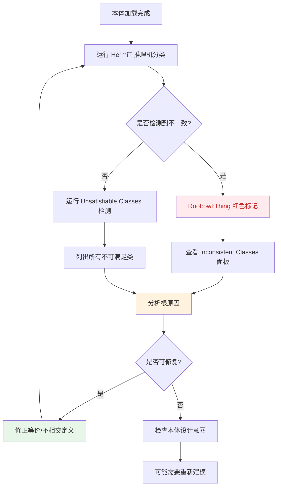

# 10.5 推理验证与自动化分类实践

> **本节要点**：掌握推理机在本体建模中的核心验证任务，学会使用 Protégé 和 HermiT 推理机进行自动分类、一致性检查、不可满足类检测。

---

## 1. 推理在类建模中的核心作用

推理（Reasoning）是 OWL 2 本体区别于传统知识表示的核心能力之一。类建模完成后，推理机可自动发现隐含知识、验证模型逻辑一致性、并生成分类树。

**核心推理任务对照表**：

| 推理任务 | 英文名称 | 说明 | 输出产物 |
|----------|----------|------|----------|
| 自动分类 | Classification | 基于公理和类表达式，自动推导类之间的子类和等价关系 | Inferred Class Hierarchy（推断类层次树） |
| 一致性检查 | Consistency Check | 验证本体中是否包含逻辑矛盾（如违反不相交声明） | 一致性报告、矛盾个体列表 |
| 实例推断 | Instance Classification | 判断哪些个体属于哪些类（包括通过类表达式推断的隐含类）| Inferred Individual Types |
| 不可满足类分析 | Unsatisfiable Class Analysis | 检测在推理后仍无任何可能实例的类 | 不可满足类列表及其原因 |
| 不同个体检查 | Distinct Individuals Check | 验证同一大类下声称的多个 ID 是否实际为同一实体违反不相交声明 | 重复或冲突个体列表 |

```turtle
# 类建模基础（供推理机参考）
@prefix : <http://example.org/hero-ontology#> .
@prefix rdfs: <http://www.w3.org/2000/01/rdf-schema#> .
@prefix owl: <http://www.w3.org/2002/07/owl#> .

:Human a owl:Class .

# 最佳实践：使用 rdfs:subClassOf 替代 owl:equivalentClass
:Male rdfs:subClassOf :Human .
:Male rdfs:subClassOf [ owl:onProperty :hasGender ; owl:someValuesFrom :GenderMale ] .

:Female rdfs:subClassOf :Human .
:Female rdfs:subClassOf [ owl:onProperty :hasGender ; owl:someValuesFrom :GenderFemale ] .

:Male owl:disjointWith :Female .

:Hero rdfs:subClassOf :Human .
:Hero rdfs:subClassOf [ owl:onProperty :hasPower ; owl:someValuesFrom :Superpower ] .

:Superman a :Hero , :Male .
:Superman owl:sameAs :ClarkKent .
:KalEl a :Hero .
```

---

## 2. 实践一：运行 HermiT 推理机并进行自动分类

### 2.1 准备练习本体

本实践使用一个简化的 **英雄本体（Hero Ontology）** 来演示自动分类流程。

**准备数据**：

```turtle
@prefix : <http://example.org/hero-ontology#> .
@prefix owl: <http://www.w3.org/2002/07/owl#> .
@prefix xsd: <http://www.w3.org/2001/XMLSchema#> .

# === 类声明 ===
:Human a owl:Class .
:Gender a owl:Class .
:Superpower a owl:Class .
:Hero a owl:Class .

:GenderMale a owl:Class ;
    rdfs:label "Male"@en .
:GenderFemale a owl:Class ;
    rdfs:label "Female"@en .
:Flight a owl:Class ;
    rdfs:label "Flight"@en .

# === 属性声明 ===
:hasGender a owl:ObjectProperty ;
    rdfs:domain :Human ;
    rdfs:range :Gender .
:hasPower a owl:ObjectProperty ;
    rdfs:domain :Hero ;
    rdfs:range :Superpower .

# === 等价声明 ===
# 最佳实践：使用 rdfs:subClassOf + Restriction 替代 owl:equivalentClass
:Male rdfs:subClassOf :Human .
:Male rdfs:subClassOf [ owl:onProperty :hasGender ; owl:someValuesFrom :GenderMale ] .

:Female rdfs:subClassOf :Human .
:Female rdfs:subClassOf [ owl:onProperty :hasGender ; owl:someValuesFrom :GenderFemale ] .

:Male owl:disjointWith :Female .

:HeroicMale owl:equivalentClass :Male :Hero .

# === 个体声明 ===
:ClarkKent a :Human ;
    :hasGender :GenderMale .
:Superman a :Hero ;
    :hasGender :GenderMale ;
    :hasPower :Flight .

:Batman a :Hero ;
    :hasPower :Technology .
```

### 2.2 Protégé 具体操作指引

**步骤一：加载本体并确认结构**

1. 启动 Protégé
2. 点击 **File → New** 创建新本体，或在 **File → Open** 打开 `.owl` 文件
3. 确认 **Classes** 视图已加载所有声明类

**步骤二：配置推理机**

1. 点击菜单栏 **Plugins → HermiT → HermiT Reasoner**
2. 确保推理机处于 **Installed** 状态（绿色指示）
3. 如有未安装提示，点击 **Install** 下载并启用

**步骤三：执行自动分类**

1. 在 HermiT Reasoner 面板中，点击 **Run** 或右键点击 **Classes** 树根节点
2. 选择 **Classify...** 选项
3. 观察控制台输出，等待 "Classification complete" 消息

### 2.3 推理后状态指示

| 推理阶段 | 控制台状态 | 界面显示 |
|----------|-----------|----------|
| 加载中 | `Loading axioms...` | 本体编辑区正常，树节点暂无推理标识 |
| 分类中 | `Classification running...` | 右上角可能显示加载旋转指示 |
| 完成 | `Classification complete.` | 树形层级扩展，显示推断出的子类关系 |
| 不一致 | `Inconsistency detected!` | 根节点 `owl:Thing` 红色高亮 |

### 2.4 显示推断视图

| 视图模式 | 切换操作 | 显示内容 |
|----------|----------|----------|
| **Declared**（声明视图） | 右键类树 → `Inferred → Hide Inferred` | 仅显示手动定义的 `SubClassOf` 关系 |
| **Inferred**（推断视图） | 右键类树 → `Inferred → Show Inferred` | 显示所有定义 + 推理生成的关系 |
| 合并视图 | 右键类树 → `Inferred → Show Both` | 同时显示声明关系与推断关系，以不同颜色标注 |

**推断结果示例**：

| 原始声明 | 推理推断结果 | 说明 |
|----------|-------------|------|
| `:Superman :hasGender :GenderMale` | `:Superman` 分类为 `:HeroicMale` | 根据等价定义 `HeroicMale ≡ Male ⊓ Hero` |
| `:Batman a :Hero` | `:Batman` 分类为 `:Hero` 且 `:Human` | 通过子类和属性限制推断 |
| `:ClarkKent :hasGender :GenderMale` | `:ClarkKent` 分类为 `:Human` | 因未标注为 `Hero` |

---

## 3. 实践二：不可满足类分析（Unsatisfiable Class Analysis）

### 3.1 概念与原理

不可满足类（Unsatisfiable Class）是指在 **任何模型下都没有任何可能的个体能够满足该类的成员资格条件**。这类问题通常由互斥约束、等价定义冲突或错误的不相交声明引起。

| 不可满足类型 | 示例 | 原因说明 |
|--------------|------|----------|
| 自相矛盾定义 | `:UnmarriedMan ≡ :Man ⊓ owl:complementOf :Man` | 补集导致自身不可能存在 |
| 与不相交声明冲突 | `:Man ≡ :Woman`（已声明 `:Man disjointWith :Woman`） | 等价声明违反互斥 |
| 子约束矛盾 | 类定义要求 `allValuesFrom :Human` 但该实例被分类为非人 | 限制与父类不兼容 |
| 枚举遗漏 | `:Gender owl:equivalentClass ( :GenderMale ⊔ :GenderFemale )`，但出现第三值 | 枚举定义未穷尽实际域 |

### 3.2 检测流程



### 3.3 Protégé 操作步骤

1. 点击 **Reasoner → Inferred → Class Axioms (Hierarchical)** 确认分类树
2. 点击菜单 **Reasoner → Check Unsatisfiable Classes**
3. 结果面板将列出所有不可满足类，点击可查看该类的 **Axioms** 分析
4. 使用 **Show Satisfiability Witness**（如安装相应插件）查看哪些公理导致不可满足

### 3.4 不可满足类原因与修复对照

| 原因标识 | Protégé 提示 | 修复操作 |
|----------|-------------|----------|
| `⊓ owl:complementOf` | 类的定义中直接引用自身的否定 | 重新定义类条件，移除自反矛盾 |
| 违反不相交 | `DisjointWith violation` | 检查个体分类是否正确或是否应撤销某个 `disjointWith` 声明 |
| 枚举/限制过严 | `Restriction overconstrained` | 修改属性限制或扩大范围声明 |
| 推理不一致 | `Root is unsatisfiable` | 首先修复一致性矛盾，不可满足类会自动减少 |

### 3.5 不可满足检测完整操作表

| 步骤 | 动作 | 目标 |
|------|------|------|
| 1 | 保存本体 | 防止丢失数据 |
| 2 | `Reasoner → Classification` | 运行自动分类 |
| 3 | `Reasoner → Consistency Check` | 本体整体一致性 |
| 4 | `Reasoner → Check Unsatisfiable Classes` | 检测并列出不可满足类 |
| 5 | 检查输出窗口红色错误 | 定位到冲突公理 |
| 6 | 修改并迭代（重复 2–5） | 直至全部通过 |

---

## 4. 实践三：冲突个体溯源与 Debugging 策略

### 4.1 冲突产生的常见场景

| 冲突类型 | 示例场景 | 触发机制 |
|----------|----------|----------|
| 不相交违反 | `:X a :Man :Woman` | `:Man disjointWith :Woman` |
| 个体标识冲突 | `:` 两个不同个体被错误断言 `owl:sameAs` 但属性矛盾 | 同一实体具有矛盾属性 |
| 枚举类型冲突 | `:x :hasAge 15`，但类型声明为 `Adult`（要求≥18） | `Adult` 类定义约束冲突 |
| 属性限制矛盾 | `:y owl:maxCardinality 0 :hasSpouse`，但有 `:y :hasSpouse :z` | `maxCardinality` 冲突 |

### 4.2 Protégé 冲突排查步骤

1. 点击 **Reasoner → Check Consistency**，查看报告中列出的不一致实体
2. 在 Classes 视图中，点击标红的 `owl:Thing` 类（如果存在）
3. 进入 **Inconsistent Classes** 和 **Individuals** 子面板
4. 检查每个个体的 **Declared Types** 和属性声明

### 4.3 日志输出与冲突类型对照表

| 日志消息 | 对应冲突类型 | 说明 |
|----------|-------------|------|
| `Named individuals X and Z are the same, but ... are not the same as Z` | 不同断言冲突 | 错误使用 `owl:sameAs` 和 `owl:differentFrom` |
| `Class A and B are disjoint, yet X is classified as both` | 不相交违反 | 个体被分类至互斥类 |
| `MaxCardinality constraint violated` | 基数约束违反 | 属性值超出最大数量限制 |
| `No satisfying assignment for datatype range` | 数据类型范围违规 | 属性值与 `rdfs:range` 声明的数据类型不符 |

### 4.4 Debugging 策略

| 策略 | 执行方式 | 效果 |
|------|----------|------|
| **逐层移除法** | 依次注释或禁用可疑公理（如等价定义），重新运行一致性检查 | 快速定位到导致冲突的具体公理 |
| **最小冲突集法** | 使用 `Explanation Generator` 插件生成最小冲突集 | 减少排查涉及的公理数量 |
| **隔离测试** | 新建一个 `.owl` 子本体，复制少量实体隔离调试 | 确认是本体全局逻辑还是局部数据问题 |
| **Profile 检查** | 使用 `OWL 2 QL/EL/RL` Profile 导出进行一致性分析 | 检查是否因为超出 Profile 的能力范围 |

```turtle
# 触发冲突的示例数据
:ClarkKent a :Man , :Woman .  # ❌ 违反 :Man disjointWith :Woman
:Superman owl:differentFrom :KalEl .  # 声明不同个体
:Superman owl:sameAs :KalEl .        # 同时又声明相同，冲突！
```

---

## 5. 实践四：自动化验证脚本（owlready2 示例）

### 5.1 环境准备

```bash
# 安装必要的 Python 包
pip install owlready2
```

### 5.2 Python 验证脚本

```python
"""
chapter-10/reasoning_validator.py

本脚本演示如何使用 owlready2 对本体进行自动化推理验证。
验证任务包括：自动分类、一致性检查、不可满足类检测。

使用前确保本体文件 path_ontology 指向本地 .owl 文件。
运行依赖 HermiT 推理机。
"""

from owlready2 import *

# === 步骤一：加载本体 ===
onto_path.insert(0, "../ch09-protoge-intro")  # 设置本体路径（根据实际情况调整）
onto = get_ontology("movie-ontology.owl")
onto.load()

# === 步骤二：加载推理机 ===
onto.set_based_on()  # 触发自动推理

try:
    onto.get_implementation("hermit")
except Exception:
    # 如未找到 HermiT 可回退到默认的 pellet 或内置推理
    print("⚠️ HermiT 推理机未找到，使用默认推理引擎...")

# === 步骤三：自动分类 ===
print("📌 步骤 1: 执行自动分类...")
onto.classify()

# 输出推断的类层次
for cls in onto.classes():
    sub = list(cls.subclasses())
    if sub:
        sub_names = ", ".join(str(s) for s in sub)
        print(f"  {cls} ⊑ {{ {sub_names} }}")

# === 步骤四：一致性检查 ===
print("\n📌 步骤 2: 一致性检查...")
if onto.is_consistent:
    print("  ✅ 本体一致，未发现矛盾")
else:
    print("  ❌ 本体不一致！请检查不相交断言或等价定义")

# === 步骤五：检测不可满足类 ===
print("\n📌 步骤 3: 不可满足类检测...")
unsatisfiable = list(get_unsatisfiable(onto))
if unsatisfiable:
    for cls in unsatisfiable:
        print(f"  ❌ 不可满足类: {cls}")
else:
    print("  ✅ 无不可满足类")

# === 步骤六：实例推断示例 ===
print("\n📌 步骤 4: 实例分类查询...")
for ind in onto.Individuals():
    types = list(ind.types())
    type_names = ", ".join(str(t) for t in types)
    print(f"  {ind} ∈ {{ {type_names} }}")

# === 清理与导出 ===
save_path = "movie-ontology-reasoning-output.owl"
onto.save(save_path, format=" rdf-xml")
print(f"\n✅ 推理输出已保存至: {save_path}")
```

### 5.3 运行输出解读

```
📌 步骤 1: 执行自动分类...
  Movie ⊑ { Drama, Comedy }
  Person ⊑ { Actor, Director }
  ⚠️ 步骤 2: 一致性检查...
  ✅ 本体一致，未发现矛盾
📌 步骤 3: 不可满足类检测...
  ✅ 无不可满足类
```

---

## 6. FAQ：常见问题解答

| 问题 | 说明与建议方案 |
|------|---------------|
| **Q1：推理完成但树形分类为空？** | 检查是否没有定义 `SubClassOf`、`EquivalentClass` 或其他能触发生成子类关系的公理 |
| **Q2：本体报告不一致如何排查？** | 从根 → 不一致的子类逐层排查 → 检查不相交声明是否与数据冲突 → 注释掉近期添加的不相交/等价断言 |
| **Q3：HermiT 推理机安装失败？** | 确保 Protégé 版本支持（≥5.6），或尝试 Pellet / FACT++ 作为替代推理机 |
| **Q4：为何相同类表达式的两个类不会被合并？** | 检查是否缺少 `owl:equivalentClass` 断言；仅声明 `rdfs:subClassOf` 单向不等价 |
| **Q5：个体被分类后出现矛盾，是否意味着数据错误？** | 不一定，可能是本体模型过度约束，需要审查不相交声明或枚举限制 |
| **Q6：大型本体推理缓慢？** | 考虑使用 `OWL 2 EL Profile`（如 ELK 推理机），或分段分类各子领域 |

---

## 7. 本节总结表格

| 关键动作 | 工具 | 输出产物 | 预期结果 |
|----------|------|----------|----------|
| 运行 HermiT 自动分类 | `Reasoner → Classification` | 推断类层次树 | 显示所有隐式的 `SubClassOf` |
| 一致性检查 | `Reasoner → Check Consistency` | 一致性报告 | 显示本体是否逻辑一致 |
| 检测不可满足类 | `Reasoner → Unsatisfiable Classes` | 不可满足类列表 | 无矛盾时应为空列表 |
| 排查冲突个体 | `Inferred Individuals` 面板 | 冲突个体标记 | 标记违反约束的个体 |
| 自动化批量验证 | owlready2 脚本 | 终端日志 + 输出本体 | 可重复执行的验证流程 |
| 生成最小冲突解释 | Explanation Generator 插件 | 冲突公理子集 | 缩小排查范围 |

---

## 关键要点回顾

1. **推理是 OWL 的核心价值**：不仅是分类，更是自动化知识发现的基础机制
2. **等价定义 + 属性限制 = 强大的自动分类能力**
3. **不一致本体会污染整个推理树**：必须定期执行一致性检查
4. **不可满足类的出现往往是模型设计的早期信号**：尽早检测并修复可避免后期的反复返工
5. **多工具协同**：Protégé 的图形化能力 + owlready2 的脚本自动化，覆盖了从交互式到大规模本体验证的完整需求
6. **最佳实践**：每次修改本体后都应重新运行分类与一致性检查，确保增量变更未引入新的冲突
