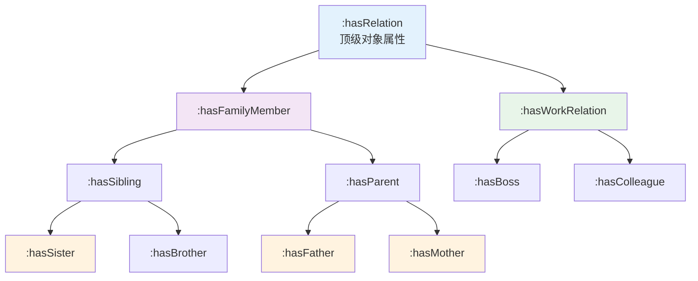

# 11.3 属性层次结构与属性链

> **本节要点**：掌握子属性关系的构建方法，理解属性链公理（Property Chain Axiom）的语义与推理机制，并能通过 Turtle 代码实现复杂链属性定义。

---

## 1. 子属性关系（SubPropertyOf）

### 1.1 基本概念

**子属性**声明一个属性在层次结构中是另一属性的特化版本，即属性之间的 "is-a" 关系。

| 语义表达 | 说明 |
|----------|------|
| 子属性 | `A rdfs:subPropertyOf B` |
| 直接子属性 | 在属性树中的子节点，无中间属性 |
| 间接子属性 | 通过中间属性继承的父属性 |

### 1.2 子属性语法与语义

```turtle
# 子属性声明
:hasMaternalGrandparent rdfs:subPropertyOf :hasGrandparent .
:hasSister rdfs:subPropertyOf :hasSibling .
```

**语义解释**：
- 如果 `x :hasMaternalGrandparent y` 为真
- 则 `x :hasGrandparent y` 也为真（继承自子属性关系）

### 1.3 属性层次图概念



### 1.4 完整示例

```turtle
@prefix : <http://example.org/ontology#> .
@prefix owl: <http://www.w3.org/2002/07/owl#> .
@prefix rdfs: <http://www.w3.org/2000/01/rdf-schema#> .

# 定义顶级属性
:hasRelation a owl:ObjectProperty .

# 第一层子类
:hasFamilyMember rdfs:subPropertyOf :hasRelation .
:hasWorkRelation rdfs:subPropertyOf :hasRelation .

# 第二层子类
:hasSibling rdfs:subPropertyOf :hasFamilyMember .
:hasParent rdfs:subPropertyOf :hasFamilyMember .

# 第三层子类
:hasSister rdfs:subPropertyOf :hasSibling .
:hasBrother rdfs:subPropertyOf :hasSibling .
:hasMother rdfs:subPropertyOf :hasParent .
:hasFather rdfs:subPropertyOf :hasParent .

# 推理效果：
# :Alice :hasSister :Bob .
# 推导: Alice :hasSibling Bob .
# 推导: Alice :hasFamilyMember Bob .
# 推导: Alice :hasRelation Bob .
```

---

## 2. 属性链公理（Property Chain Axiom）

### 2.1 基本概念

**属性链公理**声明一系列属性复合后是另一个属性的子属性。形式化表示为：

```
A o B o C SubPropertyOf D
```

含义：如果个体 `x` 通过 A 关系到 `y`，`y` 通过 B 关系到 `z`，`z` 通过 C 关系到 `w`，那么 `x` 具有 D 关系到 `w`。

### 2.2 语法格式

| 格式 | Turtle 语法 |
|------|-------------|
| 三元链 | `[ owl:propertyChainAxiom (:A :B :C) ] rdfs:subPropertyOf :D` |
| 等价链 | `[ owl:propertyChainAxiom (:A :B) ] owl:equivalentProperty :C` |

### 2.3 经典传递性推理示例

```turtle
# 定义传递链: parent o parent SubPropertyOf grandparent
:parent a owl:ObjectProperty .
:grandparent a owl:ObjectProperty .

# 属性链声明
[ owl:propertyChainAxiom ( :parent :parent ) ] rdfs:subPropertyOf :grandparent .

# 事实数据
:John :parent :Mary .
:Mary :parent :Emily .

# 推理结果
:John :grandparent :Emily .  (由链属性推导得出)
```

**推理过程可视化**：

```mermaid
graph LR
  John -->|parent| Mary
  Mary -->|parent| Emily
  John -->|grandparent[chain: parent∘parent]| Emily
  
  style John fill:#e1f5fe
  style Mary fill:#fff3e0
  style Emily fill:#e8f5e9
  style chain fill:#f3e5f5
```

### 2.4 复杂链属性示例

```turtle
@prefix : <http://example.org/ontology#> .
@prefix owl: <http://www.w3.org/2002/07/owl#> .
@prefix rdfs: <http://www.w3.org/2000/01/rdf-schema#> .
@prefix dbpedia: <http://dbpedia.org/property/> .

# ==================== 简单链 ====================
# authorOf o writtenIn SubPropertyOf authoredIn
:authorOf a owl:ObjectProperty .
:writtenIn a owl:ObjectProperty .
:authoredIn a owl:ObjectProperty .

[ owl:propertyChainAxiom ( :authorOf :writtenIn ) ] rdfs:subPropertyOf :authoredIn .

# ==================== 工作流链 ====================
# prepared_by o reviewed_by SubPropertyOf approvedBy
:preparedBy a owl:ObjectProperty .
:reviewedBy a owl:ObjectProperty .
:approvedBy a owl:ObjectProperty .

[ owl:propertyChainAxiom ( :preparedBy :reviewedBy ) ] rdfs:subPropertyOf :approvedBy .

# ==================== 跨本体链 ====================
# creator o isBasedOn SubPropertyOf inspiredBy
:creator owl:equivalentProperty dbpedia-owl:writer .
isBasedOn owl:equivalentProperty dbpedia-owl:work .
inspiredBy a owl:ObjectProperty .

[ owl:propertyChainAxiom ( :creator isBasedOn ) ] rdfs:subPropertyOf inspiredBy .
```

---

## 3. 属性链与传递性的关系

### 3.1 对比分析

| 特性 | 传递属性 | 属性链 |
|------|----------|--------|
| 声明方式 | `owl:TransitiveProperty` | `owl:propertyChainAxiom` |
| 链条长度 | 固定二元（自身） | 可任意长度 |
| 灵活性 | 仅适用于同一属性 | 可连接不同属性 |
| 表达力 | 低 | 高 |
| 推理复杂度 | 低（RL 可处理） | 中等（EL Profile 支持） |

### 3.2 用链属性模拟传递性

```turtle
# 使用链属性模拟传递性
:ancestor a owl:ObjectProperty .

# ancestor ∘ ancestor SubPropertyOf ancestor
# 效果等价于 :ancestor a owl:TransitiveProperty
[ owl:propertyChainAxiom ( :ancestor :ancestor ) ] rdfs:subPropertyOf :ancestor .

# 区别：链属性可以更灵活地表达不同属性之间的关系
```

---

## 4. 属性图（Property Graph）概念

### 4.1 属性层次图展示

属性图以树状或网状结构展示本体中所有属性及其关系。

```
ObjectProperties (顶级)
├── :directed (Object Property)
│   ├── :directedBy (Inverse of :directed)
│   └── :createdBy (SubProperty of :directed, Equivalent to :hasCreator)
├── :hasLocation (Object Property)
│   └── :isLocatedIn (SubProperty of :hasLocation)
├── :parent (Object Property)
│   └── Chain: parent ∘ parent → :grandparent
├── :hasPart (Object Property)
│   └── :partOf (Inverse of :hasPart, Transitive)
└── :hasValue (Object Property)
    ├── :hasPrice (SubProperty)
    └── :hasWeight (SubProperty)
```

### 4.2 在 Protégé 中查看属性层次

1. 点击左侧导航栏 **"Hierarchy"** 标签页
2. 在下拉框中选择 **"Object Properties"** 或 **"Data Properties"**
3. 以树状图形式查看所有属性及其子属性关系
4. 右键点击属性可选择 "Jump to Property" 或 "Expand/Collapse"

---

## 5. 链属性的高级应用场景

### 5.1 跨本体知识融合

```turtle
# DBpedia → 自定义本体映射
@prefix dbpedia: <http://dbpedia.org/ontology/> .
@prefix : <http://example.org/ontology#> .

# artist ∘ album SubPropertyOf contributedTo
# DBpedia: 艺术家 -> 专辑
# 自定义: 艺术家 贡献于
[ owl:propertyChainAxiom ( dbpedia:artist dbpedia:album ) ] rdfs:subPropertyOf :contributedTo .

# 假设 :Beatles dbpedia:album :AbbeyRoad .
# 推理: :Beatles :contributedTo :AbbeyRoad .
```

### 5.2 组织知识建模

```turtle
# 企业文档审批流程
:draftedBy o :reviewedBy o :approvedBy rdfs:subPropertyOf :formalApproval .

# 事实
:Alice :draftedBy :Document001 .
:Bob :reviewedBy :Document001 .
:Carol :approvedBy :Document001 .

# 推理结果
:Alice :formalApproval :Document001 .
```

### 5.3 空间层次推理

```turtle
# 地理空间属性链
:partOfWorld o :partOfContinent o :partOfGlobe rdfs:subPropertyOf :locatedInWorld .

# 事实
:Paris :partOfFrance .
:France :partOfEurope .
:Europe :partOfWorld .

# 推理
:Paris :locatedInWorld .
```

---

## 6. Turtle 综合源码

```turtle
@prefix : <http://example.org/ontology#> .
@prefix owl: <http://www.w3.org/2002/07/owl#> .
@prefix rdfs: <http://www.w3.org/2000/01/rdf-schema#> .

# ==================== 属性定义 ====================
:parent a owl:ObjectProperty .
:grandparent a owl:ObjectProperty .
:ancestor a owl:ObjectProperty .

:hasLocation a owl:ObjectProperty .
:city a owl:ObjectProperty .
:country a owl:ObjectProperty .

:locatedInHierarchy a owl:ObjectProperty .

# ==================== 子属性声明 ====================
:hasMother rdfs:subPropertyOf :parent .
:hasFather rdfs:subPropertyOf :parent .
:hasSister rdfs:subPropertyOf :hasSibling .
:hasBrother rdfs:subPropertyOf :hasSibling .

# ==================== 属性链声明 ====================
# parent o parent SubPropertyOf grandparent
[ owl:propertyChainAxiom ( :parent :parent ) ] rdfs:subPropertyOf :grandparent .

# parent o parent o parent SubPropertyOf ancestor
[ owl:propertyChainAxiom ( :parent :parent :parent ) ] rdfs:subPropertyOf :ancestor .

# city o country SubPropertyOf locatedInHierarchy
[ owl:propertyChainAxiom ( :city :country ) ] rdfs:subPropertyOf :locatedInHierarchy .
```

---

## 7. 总结

| 概念 | 核心语法 | 推理效果 |
|------|----------|----------|
| 子属性 | `A rdfs:subPropertyOf B` | A 的实例自动继承 B |
| 属性链 | `A o B SubPropertyOf C` | x Ay ∧ y Bz → x Cz |
| 传递性模拟 | `A o A SubPropertyOf A` | 等价于 TransitiveProperty |
| 链组合 | `A o B o C o D` | 可任意长度的属性链 |

---

> **下一章**：[11.4 练习：属性公理实操](./04-exercise-property-axioms.md) — 通过电影本体实例，动手实践传递属性、等价属性、属性链的创建与推理验证。