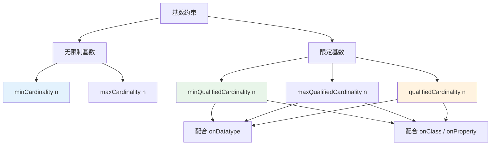

# 12.1 基数约束

> **本节要点**：掌握 OWL 2 基数约束的三种形式 — 无限制基数（`minCardinality`/`maxCardinality`）和限定基数（`minQualifiedCardinality`/`maxQualifiedCardinality`/`qualifiedCardinality`），理解有限量与无限量的语义差异。

---

## 1. 基数约束的基本概念

**基数约束（Cardinality Constraint）** 用于限制某个属性对于给定个体可以有或必须有值的数量。它是 OWL 2 中最重要的数据约束类型之一。

### 1.1 两种基数类型对比

| 约束类型 | OWL 属性 | 是否要求值的类型 | 使用场景 |
|----------|----------|------------------|----------|
| 无限制基数 | `minCardinality`, `maxCardinality` | ❌ 否 | 只关心"至少/最多 N 个值"，不限值类型 |
| 限定基数 | `minQualifiedCardinality`, `maxQualifiedCardinality`, `qualifiedCardinality` | ✅ 是（需配合 `onDatatype` 或 `onClass`） | 要求"至少/最多 N 个值，且这些值必须是某类型" |



### 1.2 符号定义

| DL 符号 | OWL 2 | 说明 |
|---------|-------|------|
| `(≥ n R)` | `owl:minCardinality n` | R 关系至少有 n 个值 |
| `(≤ n R)` | `owl:maxCardinality n` | R 关系至多有 n 个值 |
| `(≥ n R.C)` | `owl:minQualifiedCardinality n` | 类型为 C 的 R 值至少有 n 个 |
| `(≤ n R.C)` | `owl:maxQualifiedCardinality n` | 类型为 C 的 R 值至多有 n 个 |
| `(= n R.C)` | `owl:qualifiedCardinality n` | 类型为 C 的 R 值恰好有 n 个 |

---

## 2. 无限制基数约束

### 2.1 minCardinality — 最小基数

**语义**：给定个体通过某属性至少必须有 N 个值。

**示例**：每个人至少有一个父亲

```turtle
# 每个人至少有一个父亲
:Person owl:equivalentClass [
    a owl:Restriction ;
    owl:onProperty :hasFather ;
    owl:minCardinality 1
] .
```

**推理示例**：

```turtle
# 已知事实
:Bob a :Person .
# 注意: Bob 没有 :hasFather 断言

# 推理结果：
# 如果本体中 Bob 没有至少一个 :hasFather 个体，
# 则本体不一致（因为 Person 等价于 minCardinality 1 of hasFather）
```

### 2.2 maxCardinality — 最大基数

**语义**：给定个体通过某属性至多有 N 个值。

**示例**：每个人最多有一个生物父亲

```turtle
# 每个人最多有一个生物父亲
:Person owl:subClassOf [
    a owl:Restriction ;
    owl:onProperty :hasBiologicalFather ;
    owl:maxCardinality 1
] .
```

### 2.3 对比表格

| 特性 | minCardinality | maxCardinality |
|------|---------------|----------------|
| 方向 | 下界约束 | 上界约束 |
| 语义 | "至少有 N 个" | "至多有 N 个" |
| 推理应用 | 推断缺失断言（若不够 N 个，本体可能不一致） | 推断个体等价（若有 N+1 个不同值，本体不一致） |
| 典型场景 | 要求必须有关系（如必须有父母） | 限制唯一性约束（如只有一个 SSN） |

---

## 3. 限定基数约束

限定基数约束在数量限制的基础上，进一步要求值的类型符合条件。这是 OWL 2 相较于 OWL 1 的重要增强。

### 3.1 minQualifiedCardinality — 最小限定基数

**语义**：给定个体通过某属性至少有 N 个值，且这些值属于指定类（OWL 1 中只能指定数据类型）。

**示例**：每部电影必须至少有 1 个导演

```turtle
@prefix : <http://example.org/movie#> .
@prefix owl: <http://www.w3.org/2002/07/owl#> .
@prefix rdfs: <http://www.w3.org/2000/01/rdf-schema#> .

:Movie rdfs:subClassOf [
    a owl:Restriction ;
    owl:onProperty :directedBy ;
    owl:minQualifiedCardinality 1 ;
    owl:onClass :Director
] .
```

### 3.2 maxQualifiedCardinality — 最大限定基数

**语义**：给定个体通过某属性至多有 N 个值，且这些值属于指定类。

**示例**：每个人最多有一个生物母亲

```turtle
# 导演最多可以有一个生物母亲
:Director rdfs:subClassOf [
    a owl:Restriction ;
    owl:onProperty :hasBiologicalMother ;
    owl:maxQualifiedCardinality 1 ;
    owl:onClass :Person
] .

# 更精确的写法：人类最多有1个生物学母亲
:Person rdfs:subClassOf [
    a owl:Restriction ;
    owl:onProperty :hasBiologicalMother ;
    owl:maxQualifiedCardinality 1 ;
    owl:onClass :Person
] .
```

### 3.3 qualifiedCardinality — 精确实定基数

**语义**：给定个体通过某属性恰好有 N 个值，且这些值属于指定类。这是最小和最大限定的组合。

```turtle
# 每个人恰好有两个生物父母
:Person rdfs:subClassOf [
    a owl:Restriction ;
    owl:onProperty :hasBiologicalParent ;
    owl:qualifiedCardinality 2 ;
    owl:onClass :Person
] .
```

> **注意**：`qualifiedCardinality n` 等价于同时设置 `minQualifiedCardinality n` 和 `maxQualifiedCardinality n`。

### 3.4 有限量 vs 无限量对比

| 特性 | 无限制基数 | 限定基数 |
|------|-----------|----------|
| OWL 属性 | `minCardinality` / `maxCardinality` | `minQualifiedCardinality` / `maxQualifiedCardinality` |
| 值类型要求 | 无 | 必须属于指定类或数据类型 |
| OWL 1 支持 | ✅ | ❌ |
| OWL 2 支持 | ✅ | ✅ |
| 推理效率 | 高（简单计数） | 中（需额外类型检查） |

---

## 4. Turtle 代码模式总结

### 4.1 基础模式

```turtle
# 模式 1: 最小无限制基数
:Class rdfs:subClassOf [
    a owl:Restriction ;
    owl:onProperty :property ;
    owl:minCardinality N
] .

# 模式 2: 最大无限制基数
:Class rdfs:subClassOf [
    a owl:Restriction ;
    owl:onProperty :property ;
    owl:maxCardinality N
] .

# 模式 3: 最小限定基数（限定到类）
:Class rdfs:subClassOf [
    a owl:Restriction ;
    owl:onProperty :property ;
    owl:minQualifiedCardinality N ;
    owl:onClass :TargetClass
] .

# 模式 4: 最小限定基数（限定到数据类型）
:Class rdfs:subClassOf [
    a owl:Restriction ;
    owl:onProperty :property ;
    owl:minQualifiedCardinality N ;
    owl:onDatatype xsd:integer
] .

# 模式 5: 精确限定基数
:Class rdfs:subClassOf [
    a owl:Restriction ;
    owl:onProperty :property ;
    owl:qualifiedCardinality N ;
    owl:onClass :TargetClass
] .
```

### 4.2 RDF/XML 等效表示

```xml
<!-- 等效于上面模式 3 的 RDF/XML -->
<rdf:Description rdf:about="http://example.org/Movie">
    <rdfs:subClassOf>
        <owl:Restriction>
            <owl:onProperty rdf:resource="http://example.org/directedBy"/>
            <owl:minQualifiedCardinality rdf:datatype="&xsd;nonNegativeInteger">1</owl:minQualifiedCardinality>
            <owl:onClass rdf:resource="http://example.org/Director"/>
        </owl:Restriction>
    </rdfs:subClassOf>
</rdf:Description>
```

---

## 5. 常见陷阱

| 陷阱 | 说明 | 修正方法 |
|------|------|----------|
| 误用 `^^` 连接类和类型 | `minQualifiedCardinality 1 ^^ :Director` 语法错误 | 使用 `owl:onClass :Director` |
| 混淆 `minCardinality` 与 `minQualifiedCardinality` | 前者不限类型，后者限定类型 | 按需选择 |
| 在函数性属性上使用 `minCardinality > 1` | 与 `FunctionalProperty` 冲突，导致不一致 | 移除 `FunctionalProperty` 特性或调整基数值 |
| 对传递属性设置 `maxCardinality` | 理论上可能导致不可判定性 | Profile（OWL 2 RL）中限制使用 |

---

## 6. 练习

### 6.1 基础练习 — 人员本体

在人员本体中，实现以下约束，使用 Turtle 编写代码：

1. **每个人至少有两个生物父母**
2. **每个人都有至少一个邮箱地址**
3. **每个人的配偶数量不超过 1**（单配偶制）
4. **每个人都有恰好一个出生国家**
5. **一个人最多有 10 个孩子**

参考答案：

```turtle
@prefix : <http://example.org/person#> .
@prefix owl: <http://www.w3.org/2002/07/owl#> .
@prefix xsd: <http://www.w3.org/2001/XMLSchema#> .

# 1. 每个人至少有两个生物父母
:Person rdfs:subClassOf [
    a owl:Restriction ;
    owl:onProperty :hasBiologicalParent ;
    owl:minQualifiedCardinality 2 ;
    owl:onClass :Person
] .

# 2. 每个人都有至少一个邮箱
:Person rdfs:subClassOf [
    a owl:Restriction ;
    owl:onProperty :hasEmail ;
    owl:minCardinality 1
] .

# 3. 每个人的配偶数量不超过 1
:Person rdfs:subClassOf [
    a owl:Restriction ;
    owl:onProperty :hasSpouse ;
    owl:maxCardinality 1
] .

# 4. 每个人都有恰好一个出生国家
:Person rdfs:subClassOf [
    a owl:Restriction ;
    owl:onProperty :birthPlace ;
    owl:qualifiedCardinality 1 ;
    owl:onClass :Country
] .

# 5. 一个人最多有 10 个孩子
:Person rdfs:subClassOf [
    a owl:Restriction ;
    owl:onProperty :hasChild ;
    owl:maxQualifiedCardinality 10 ;
    owl:onClass :Person
] .
```

### 6.2 推理分析

假设以下本体片段：

```turtle
:Person rdfs:subClassOf [
    a owl:Restriction ;
    owl:onProperty :hasSSN ;
    owl:maxCardinality 1
] .

:Alice a :Person .
:Alice :hasSSN "123-45-6789" .
:Alice :hasSSN "987-65-4321" .
```

**问题**：该本体是否一致？推理机会推断什么？

**答案**：本体**不一致**，因为 Alice 有 2 个不同的 SSN 值，而最大基数约束为 1。推理机会检测到冲突并标记 Person 为 `owl:Nothing`（空类）。

---

## 7. 本节小结

| 概念 | 说明 |
|------|------|
| 无限制基数 | `min/maxCardinality`，只关心数量不限类型 |
| 限定基数 | `min/max/qualifiedCardinality`，要求值属于指定类或类型 |
| DL 对应 | `(≥ n R)` ↔ `minCardinality`，`(≤ n R)` ↔ `maxCardinality` |
| 推理效果 | 最小基数 → 一致性检查（缺失断言时） | 最大基数 → 个体等价推断 |
| 与 OWL 1 对比 | OWL 2 的限定基数是新增功能，需配合 `onDatatype` 或 `onClass` |

## 💡 在线验证

以下链接可将本节的 Turtle 代码粘贴到在线 RDF 验证器中进行语法检查：

- [Virtuoso Online SPARQL Editor](https://virtuoso.openlinksw.com/dataspace/dav/wiki/Open/VOS/WebQueryEditor/)
- [RDFg — Turtle Editor & Validator](https://rdfg.org/)
- [Turtle Validator Online](https://sem robot.net/turtle-validator/)

**使用方式**：
1. 复制上方的任意一个 Turtle 代码块
2. 粘贴到上述任意一个验证器的输入框中
3. 点击"Parse"或"Validate"按钮
4. 若解析成功则说明语法符合 W3C RDF 1.1 规范