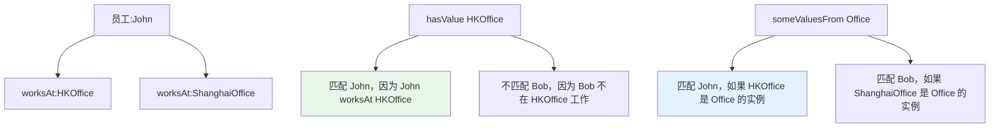
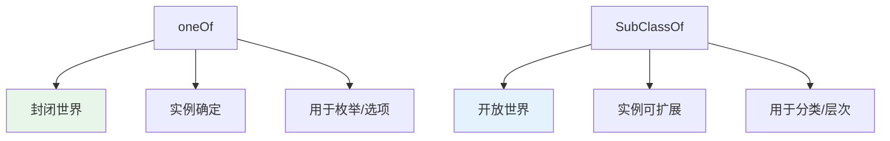

# 12.2 值约束与枚举约束

> **本节要点**：掌握 `owl:hasValue`（存在值约束）和 `owl:oneOf`（枚举约束）的语义与应用场景，理解它们在类表达式和个体值约束中的用法。

---

## 1. 值约束（hasValue）

### 1.1 基本概念

`owl:hasValue` 是一种存在性约束，用于声明给定个体通过某属性**必须具有某个特定的值**。它是 OWL 2 中 `owl:someValuesFrom` 的具体化版本。

### 1.2 语义定义

| 语法 | 语义 | 通俗理解 |
|------|------|----------|
| `[ onProperty P ; hasValue V ]` | 该个体的属性 P 必须有一个值等于 V | "必须和 V 有关系 P" |

### 1.3 使用场景

**场景 1**：标记特定类型的个体

```turtle
# 所有名为"HK"的员工都是本地员工
:HK rdfs:subClassOf [
    a owl:Restriction ;
    owl:onProperty :worksAt ;
    owl:hasValue :HongKongOffice
] .
```

**场景 2**：类定义中的存在约束

```turtle
# 定义"亚洲区本地员工"为：
# 在"亚洲某个办事处"工作的员工
:AsiaLocalEmployee owl:equivalentClass [
    owl:intersectionOf (
        :Employee
        [ owl:onProperty :worksAt ;
          owl:someValuesFrom :AsiaOffice ]
    )
] .

# 或特定办公室的本地员工：
:HongKongEmployee owl:equivalentClass [
    owl:intersectionOf (
        :Employee
        [ owl:onProperty :worksAt ;
          owl:hasValue :HongKongOffice ]
    )
] .
```

### 1.4 hasValue vs someValuesFrom 对比

| 特性 | `owl:hasValue` | `owl:someValuesFrom` |
|------|---------------|---------------------|
| 值要求 | 必须是某个**特定个体** | 必须属于**某个类**的实例 |
| 类型 | 值约束（Nominal） | 量化约束 |
| 粒度 | 具体个体级别 | 类别级别 |
| 适用场景 | 标记特殊个体 | 定义类别关系 |



---

## 2. 枚举约束（oneOf）

### 2.1 基本概念

`owl:oneOf` 创建一个包含显式列出的成员的类，这些成员是该**唯一**的实例。枚举类的外延（extension）由其列出的个体完全确定。

### 2.2 枚举类（Enum Class）

```turtle
# 定义枚举类：货币类型
:CurrencyType a owl:Class .

:USD a :CurrencyType .
:EUR a :CurrencyType .
:CNY a :CurrencyType .

:SupportedCurrencies owl:oneOf ( :USD :EUR :CNY ) .
```

> **关键理解**：一旦使用 `owl:oneOf` 定义了类的所有成员，OWL 推理机就能知道：
> - 只有列出的个体（:USD, :EUR, :CNY）属于该类
> - 任何其他个体不属于该类
> - 这是一个封闭的世界假设（Closed World Assumption）

### 2.3 枚举在类表达式中使用

```turtle
# 定义"亚洲货币"子类别
:AsianCurrencies owl:intersectionOf (
    :SupportedCurrencies
    owl:oneOf ( :CNY :JPY )
) .

# 注意：如果 :JPY 不在 :SupportedCurrencies 中，上述等价于 :SupportedCurrencies 中
# 同时出现在 oneOf 中的成员
```

### 2.4 枚举 vs 类层次对比

| 特性 | `owl:oneOf` (枚举) | 类层次（SubClassOf） |
|------|-------------------|---------------------|
| 实例确定 | 封闭（枚举外的个体不属于该类） | 开放（推理机不知晓所有实例） |
| 用途 | 离散值、选项列表 | 类别关系、术语层次 |
| 推理能力 | 实例检查是 P-complete | 分类是 EXPTIME-complete |
| 适用场景 | 货币、状态枚举、类型选项 | 动物->哺乳动物->犬科 |



---

## 3. 综合应用示例

### 3.1 员工状态系统

```turtle
@prefix : <http://example.org/company#> .
@prefix owl: <http://www.w3.org/2002/07/owl#> .

# 定义员工状态枚举
:EmployeeStatus a owl:Class .
:Active a :EmployeeStatus .
:Leave a :EmployeeStatus .
:Terminated a :EmployeeStatus .

# 员工当前状态限制
:ActiveStatusRestriction owl:oneOf ( :Active :Leave :Terminated ) .

:Person rdfs:subClassOf [
    a owl:Restriction ;
    owl:onProperty :hasStatus ;
    owl:maxQualifiedCardinality 1 ;
    owl:onClass :EmployeeStatus
] .
```

### 3.2 产品配置系统

```turtle
# 手机存储容量枚举
:StorageSize a owl:Class .
:Storage64GB a :StorageSize .
:Storage128GB a :StorageSize .
:Storage256GB a :StorageSize .
:Storage512GB a :StorageSize .
:Storage1TB a :StorageSize .

:Phone rdfs:subClassOf [
    a owl:Restriction ;
    owl:onProperty :hasStorage ;
    owl:qualifiedCardinality 1 ;
    owl:onClass :StorageSize
] .

:StorageOptions owl:oneOf (
    :Storage64GB :Storage128GB :Storage256GB :Storage512GB :Storage1TB
) .
```

---

## 4. Turtle 代码模式

### 4.1 值约束模板

```turtle
# 模板: 个体必须通过某属性有某个值
:Class rdfs:subClassOf [
    a owl:Restriction ;
    owl:onProperty :property ;
    owl:hasValue :specificIndividual
] .

# 模板: 定义等价类（满足条件 = 该类）
:SpecificClass owl:equivalentClass [
    owl:intersectionOf (
        :BaseClass
        [ owl:onProperty :property ;
          owl:hasValue :specificIndividual ]
    )
] .
```

### 4.2 枚举模板

```turtle
# 定义枚举类的所有实例
:EnumClass a owl:Class .
:Member1 a :EnumClass .
:Member2 a :EnumClass .

# 定义枚举类本身（可选，用于声明唯一实例集合）
:EnumClass owl:oneOf ( :Member1 :Member2 ) .
```

---

## 5. 限制与注意事项

### 5.1 oneOf 的封闭世界假设

`owl:oneOf` 引入封闭世界假设，这在开放式世界中可能引起问题：

```turtle
# ⚠️ 潜在问题示例
:RGBPrimary a owl:Class .
:Red a :RGBPrimary .
:Green a :RGBPrimary .
:Blue a :RGBPrimary .

# 假设本体中有另一个个体:Purple，未声明属于 RGBPrimary
# OWL 推理机可以推断:Purple NOT-INDIVIDUALOF(:RGBPrimary)
# 这可能与建模意图不符！
```

**建议**：对于开放的、可扩展的类别，使用 `rdfs:subClassOf` 而非 `owl:oneOf`。仅在真正需要封闭枚举时使用。

### 5.2 hasValue 的局限性

| 限制 | 说明 | 替代方案 |
|------|------|----------|
| 不能比较值 | 不能声明"属性 A 的值必须等于属性 B 的值" | 使用 SHACL `sh:sameAs` |
| 不能进行算术 | 不能声明"值必须 > 5" | 使用 SHACL `sh:minInclusive` |
| 值必须是已知个体 | 不能使用字面值 | 先用 `owl:NamedIndividual` 声明个体 |

---

## 6. 练习

### 6.1 值约束实践

以下是一个"大学课程管理系统"本体的部分需求，请用 Turtle 实现：

1. 定义课程状态枚举：`Scheduled`（已排课）, `Active`（进行中）, `Completed`（已完成）, `Cancelled`（已取消）

2. 每个课程必须恰好有一个状态

3. 定义"进行中课程"子类，其状态必须是 `Active`

```turtle
@prefix : <http://example.org/university#> .
@prefix owl: <http://www.w3.org/2002/07/owl#> .
@prefix rdf: <http://www.w3.org/1999/02/22-rdf-syntax-ns#> .

# 1. 定义课程状态枚举
:CourseStatus a owl:Class .

:StatusScheduled a :CourseStatus ;
    rdfs:label "Scheduled" .

:StatusActive a :CourseStatus ;
    rdfs:label "Active" .

:StatusCompleted a :CourseStatus ;
    rdfs:label "Completed" .

:StatusCancelled a :CourseStatus ;
    rdfs:label "Cancelled" .

# 状态枚举的唯一成员
:CourseStatus owl:oneOf (
    :StatusScheduled :StatusActive :StatusCompleted :StatusCancelled
) .

# 2. 每个课程必须恰好有一个状态
:Course rdfs:subClassOf [
    a owl:Restriction ;
    owl:onProperty :hasStatus ;
    owl:qualifiedCardinality 1 ;
    owl:onClass :CourseStatus
] .

# 3. 定义"进行中课程"子类的值约束
:ActiveCourse owl:equivalentClass [
    owl:intersectionOf (
        :Course
        [ owl:onProperty :hasStatus ;
          owl:hasValue :StatusActive ]
    )
] .
```

### 6.2 推理分析

给定以下本体：

```turtle
:A a :ClassA ;
    :hasValue :X .

:ClassA rdfs:subClassOf [
    owl:onProperty :hasValue ;
    owl:hasValue :X
] .
```

**问题**：

```turtle
:B a :ClassA .

# 推理机能推断出什么关于 :B 的事实？
```

**答案**：推理机可以推断 `:B :hasValue :X`。因为 `ClassA` 被约束为每个实例都必须通过 `hasValue` 属性拥有值 `:X`。由于 `:B` 属于 `:ClassA`，根据子类关系，`:B` 也必须满足此约束。

---

## 7. 本节小结

| 概念 | 说明 |
|------|------|
| `owl:hasValue` | 指定属性必须有某个特定个体作为值 |
| `owl:oneOf` | 创建包含显式成员的类（封闭世界） |
| 用途差异 | `hasValue` 是存在约束，`oneOf` 是枚举约束 |
| 封闭世界 | `oneOf` 引入封闭世界，需注意建模意图 |
| 限制 | OWL 不能做值比较和算术，需要 SHACL |