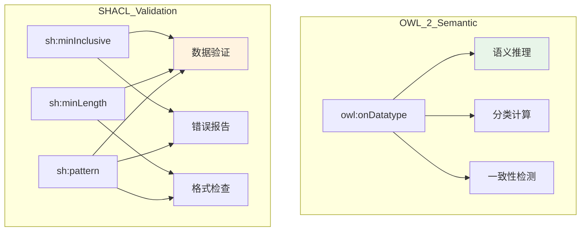

# 12.3 数据类型约束

> **本节要点**：掌握 `owl:onDatatype` 的用法及其与 SHACL 验证约束的区别，理解 OWL 2 数据类型的子类型机制以及数值范围约束的正确实现方式。

---

## 1. 数据类型约束概述

数据类型约束（Datatype Constraints）是 OWL 2 提供的重要特性之一，用于限制数据属性值的类型范围。它允许本体建模者声明某个属性的值必须属于某个特定的数据类型子集。

### 1.1 OWL 2 数据约束工具

| 机制 | 适用场景 | 示例 |
|------|----------|------|
| `rdfs:range` | 简单数据类型约束 | `:hasAge rdfs:range xsd:integer` |
| `owl:qualifiedCardinality + onDatatype` | 限制值类型和数量 | 至少 1 个 xsd:boolean 值 |
| `owl:onDatatype` | 定义数据类型子集 | 正整数、非负小数等 |
| SHACL `sh:pattern` | 正则表达式匹配 | 邮箱格式、身份证号码 |
| SHACL `sh:min/maxInclusive` | 数值范围约束 | 年龄 0-150 |
| SHACL `sh:minLength/maxLength` | 字符串长度约束 | 姓名 2-50 字符 |

> **重要提示**：SHACL 约束（`sh:pattern`、`sh:minLength` 等）用于数据验证，而 OWL 2 数据类型约束（`owl:onDatatype`）用于语义推理。两者相辅相成，各司其职。
>
> **关键区别**：`owl:withRestrictions` 仅用于约束已有 XSD 数据类型的子集，不会影响本体中该类型的实例集合（即不改变推理结果）。它主要用于语义标记和数据文档化。如需数据验证，应使用 SHACL。

### 1.2 类型约束与验证约束对比



---

## 2. owl:onDatatype

### 2.1 基本概念

`owl:onDatatype` 用于定义一个类，该类的实例值属于某个 XSD 数据类型的**子集**。这是 OWL 2 相较于 OWL 1 新增的重要功能。

### 2.2 基本语法

```turtle
:PositiveInteger owl:onDatatype xsd:integer ;
    owl:withRestrictions (
        [ xsd:minInclusive "1" ]
    ) .
```

> **注意**：`owl:withRestrictions` 与 `sh:minInclusive` 不同。前者是 OWL 2 的语义约束，后者是 SHACL 的验证约束。

### 2.3 常见数据类型子集示例

**正整数（PositiveInteger）约束**：

```turtle
# 定义正整数子集
:PositiveInteger owl:onDatatype xsd:integer ;
    owl:withRestrictions (
        [ xsd:minInclusive "1"^^xsd:integer ]
    ) .

# 使用：年龄必须是正整数
:Person rdfs:subClassOf [
    a owl:Restriction ;
    owl:onProperty :hasAge ;
    owl:qualifiedCardinality 1 ;
    owl:onDatatype :PositiveInteger
] .
```

**正十进制数（PositiveDecimal）约束**：

```turtle
# 定义正十进制数子集
:PositiveDecimal owl:onDatatype xsd:decimal ;
    owl:withRestrictions (
        [ xsd:minInclusive "0"^^xsd:decimal ]
    ) .
```

**非空字符串约束**：

```turtle
# 定义非空字符串子集
:NonEmptyString owl:onDatatype xsd:string ;
    owl:withRestrictions (
        [ xsd:minLength "1"^^xsd:nonNegativeInteger ]
    ) .
```

### 2.4 多重约束组合

```turtle
# 年龄在 0 到 150 之间的整数（语义标记）
# 注意：withRestrictions 不影响推理，仅用于文档化
:ValidAge owl:onDatatype xsd:integer ;
    owl:withRestrictions (
        [ xsd:minInclusive "0"^^xsd:integer ] ,
        [ xsd:maxInclusive "150"^^xsd:integer ]
    ) .

# 价格必须是非负小数（OWL 无法约束小数位数）
# 如需约束小数位数，应使用 SHACL sh:pattern 或 sh:maxInclusive
:ValidPrice owl:onDatatype xsd:decimal ;
    owl:withRestrictions (
        [ xsd:minInclusive "0"^^xsd:decimal ]
    ) .
```

---

## 3. SHACL 替代方案

在 OWL 2 和 SHACL 的协同设计中，大多数数据验证需求应通过 SHACL 实现，尤其是涉及字符串操作和范围检查的场景。

### 3.1 字符串正则验证

**SHACL 方案**：

```turtle
@prefix sh: <http://www.w3.org/ns/shacl#> .
@prefix xsd: <http://www.w3.org/2001/XMLSchema#> .

# 定义 SHACL Shape 验证电话号码格式
:PersonShape a sh:NodeShape ;
    sh:targetClass :Person ;
    sh:property [
        sh:path :hasPhone ;
        sh:datatype xsd:string ;
        sh:pattern "[0-9]{3}-[0-9]{4}" ;
        sh:message "电话号码格式应为 XXX-XXXX"
    ] .
```

### 3.2 数值范围验证

**SHACL 方案**：

```turtle
# 年龄验证：必须在 0-150 之间
:PersonShape a sh:NodeShape ;
    sh:targetClass :Person ;
    sh:property [
        sh:path :hasAge ;
        sh:datatype xsd:integer ;
        sh:minInclusive "0"^^xsd:integer ;
        sh:maxInclusive "150"^^xsd:integer ;
        sh:message "年龄必须在 0 到 150 之间"
    ] .

# 评分验证：必须在 0.0-5.0 之间
:ReviewShape a sh:NodeShape ;
    sh:targetClass :Review ;
    sh:property [
        sh:path :hasRating ;
        sh:datatype xsd:decimal ;
        sh:minInclusive "0.0"^^xsd:decimal ;
        sh:maxInclusive "5.0"^^xsd:decimal
    ] .
```

### 3.3 字符串长度验证

**SHACL 方案**：

```turtle
# 用户名验证：长度 3-20
:UserShape a sh:NodeShape ;
    sh:targetClass :User ;
    sh:property [
        sh:path :hasUsername ;
        sh:datatype xsd:string ;
        sh:minLength "3"^^xsd:nonNegativeInteger ;
        sh:maxLength "20"^^xsd:nonNegativeInteger ;
        sh:pattern "[a-zA-Z0-9_]+"
    ] .

# 密码验证：长度 8-128
:UserShape2 a sh:NodeShape ;
    sh:property [
        sh:path :hasPassword ;
        sh:datatype xsd:string ;
        sh:minLength "8"^^xsd:nonNegativeInteger ;
        sh:maxLength "128"^^xsd:nonNegativeInteger
    ] .
```

### 3.4 OWL vs SHACL 约束对照表

| 需求 | OWL 2 方案 | SHACL 方案 | 推荐 |
|------|-----------|-----------|------|
| 值必须是非负整数 | `onDatatype + minInclusive` | `sh:minInclusive` | **SHACL** |
| 字符串长度 >= 3 | `onDatatype xsd:string` + 无内置 | `sh:minLength` | **SHACL** |
| 邮箱格式验证 | **不支持** | `sh:pattern` | **SHACL**（唯一选择） |
| 值的枚举集合 | `owl:oneOf` | `sh:in` | 取决于推理 vs 验证 |
| 类推理（classification） | ✅ | ❌ | **OWL** |
| 错误消息输出 | ❌ | ✅ `sh:message` | **SHACL** |

---

## 4. 综合应用示例

### 4.1 电商平台数据约束

```turtle
@prefix : <http://example.org/shop#> .
@prefix owl: <http://www.w3.org/2002/07/owl#> .
@prefix xsd: <http://www.w3.org/2001/XMLSchema#> .
@prefix sh: <http://www.w3.org/ns/shacl#> .

# ===== OWL 2 数据属性定义 =====
:ProductPrice a owl:DatatypeProperty ;
    rdfs:domain :Product ;
    rdfs:range xsd:decimal .

:ProductStock a owl:DatatypeProperty ;
    rdfs:domain :Product ;
    rdfs:range xsd:integer .

:ProductSKU a owl:DatatypeProperty ;
    rdfs:domain :Product ;
    rdfs:range xsd:string .

# 价格必须为正数（OWL 2 onDatatype）
:PositivePrice owl:onDatatype xsd:decimal ;
    owl:withRestrictions (
        [ xsd:minInclusive "0.01"^^xsd:decimal ]
    ) .

# ===== SHACL 验证 Shape =====
:ProductShape a sh:NodeShape ;
    sh:targetClass :Product ;
    sh:property [
        sh:path :ProductPrice ;
        sh:datatype xsd:decimal ;
        sh:minInclusive "0.01"^^xsd:decimal ;
        sh:message "商品售价必须大于零"
    ] ;
    sh:property [
        sh:path :ProductStock ;
        sh:datatype xsd:integer ;
        sh:minInclusive "0"^^xsd:integer ;
        sh:maxInclusive "999999"^^xsd:integer ;
        sh:message "库存必须在 0 到 999,999 之间"
    ] ;
    sh:property [
        sh:path :ProductSKU ;
        sh:datatype xsd:string ;
        sh:minLength "5"^^xsd:nonNegativeInteger ;
        sh:maxLength "20"^^xsd:nonNegativeInteger ;
        sh:pattern "^[A-Z]{2,4}-[0-9]{4,8}$" ;
        sh:message "SKU 格式应为 2-4 个大写字母后跟短横线再加 4-8 个数字（如 US-12345）"
    ] .
```

### 4.2 人员信息验证

```turtle
@prefix : <http://example.org/people#> .
@prefix xsd: <http://www.w3.org/2001/XMLSchema#> .
@prefix sh: <http://www.w3.org/ns/shacl#> .

# 邮箱格式验证
:PersonShape a sh:NodeShape ;
    sh:targetClass :Person ;
    sh:property [
        sh:path :hasEmail ;
        sh:datatype xsd:string ;
        sh:pattern "^[\\w.%+\\-]+@[\\w.\\-]+\\.[a-zA-Z]{2,}$" ;
        sh:message "邮箱格式不正确，应为 username@domain.tld"
    ] ;
    sh:property [
        sh:path :hasPhoneNumber ;
        sh:datatype xsd:string ;
        sh:minLength "5"^^xsd:nonNegativeInteger ;
        sh:maxLength "20"^^xsd:nonNegativeInteger ;
        sh:pattern "^[\\+]?[0-9\\ \\(\\)\\-]{5,20}$"
    ] .

# 年龄验证
:PersonShape2 a sh:NodeShape ;
    sh:targetClass :Person ;
    sh:property [
        sh:path :hasAge ;
        sh:datatype xsd:integer ;
        sh:minInclusive "0"^^xsd:integer ;
        sh:maxInclusive "150"^^xsd:integer
    ] .

# 注意：SHACL 1.0 规范不支持 sh:maxInclusive 结合 now() 表达式
# 此验证需要使用 SHACL-SPARQL 实现动态比较
# 以下是替代说明（使用 SPARQL CONSTRUCT 模式）

@prefix sh: <http://www.w3.org/ns/shacl#> .
@prefix : <http://example.org/people#> .

# SHACL-SPARQL 方式：检查出生日期不在未来
:PersonBirthDateShape a sh:NodeShape ;
    sh:targetClass :Person ;
    sh:rule [
        a sh:SPARQLRule ;
        sh:rule """
            # 需通过 SHACL-SPARQL CONSTRAINT 实现
            # 示例: sh:spdx [ sh:select 其中 BIRTH_DATE > CURRENT_DATE ]
        """
    ] .
```

---

## 5. 限制与注意事项

### 5.1 OWL 2 的 `owl:withRestrictions` 限制

| 限制 | 说明 | 解决方案 |
|------|------|----------|
| `withRestrictions` 不影响实例兼容性 | 声明 `xsd:minInclusive "1"` 后，值 "0" 仍可作为实例 | 使用 SHACL 验证 |
| 正则表达式支持有限 | 只能在 `withRestrictions` 中使用 | 使用 SHACL `sh:pattern` |
| 不能进行值比较 | 如不能声明 A = B | 使用 SHACL |
| 推理机处理差异 | HermiT、Pellet 等处理不同 | 检查推理机文档 |

### 5.2 数据类型选择最佳实践

```turtle
# ✅ 使用 xsd:integer 用于精确计数
:Movie :hasSequelCount "4"^^xsd:integer .

# ✅ 使用 xsd:decimal 用于评分等可能需要小数值的场景
:Review :hasRating "8.5"^^xsd:decimal .

# ✅ 使用 xsd:double 用于科学计算
:Experiment :hasResult "3.141592653e-8"^^xsd:double .

# ✅ 使用 xsd:date 用于日期（不含时间部分）
:Person :hasBirthDate "1990-01-15"^^xsd:date .

# ✅ 使用 xsd:dateTime 用于精确时间戳
:Event :hasTimestamp "2024-01-15T14:30:00Z"^^xsd:dateTime .

# ✅ 使用 xsd:string 用于文本，格式验证交给 SHACL
:Person :hasName "John Doe"^^xsd:string .
```

---

## 6. 练习

### 6.1 数据属性定义

为"图书管理系统"本体编写以下定义：

1. 定义数据属性 `:ISBN` 连接到 `xsd:string`，范围为图书类
2. 定义数据属性 `:pageCount` 连接到 `xsd:integer`，范围为图书类
3. 定义数据属性 `:price` 连接到 `xsd:decimal`，范围为图书类

```turtle
@prefix : <http://example.org/library#> .
@prefix owl: <http://www.w3.org/2002/07/owl#> .
@prefix xsd: <http://www.w3.org/2001/XMLSchema#> .

# ISBN
:ISBN a owl:DatatypeProperty ;
    rdfs:domain :Book ;
    rdfs:range xsd:string ;
    rdfs:label "ISBN" ;
    rdfs:comment "国际标准书号" .

# 页数
:pageCount a owl:DatatypeProperty ;
    rdfs:domain :Book ;
    rdfs:range xsd:integer ;
    rdfs:label "页数" .

# 价格
:price a owl:DatatypeProperty ;
    rdfs:domain :Book ;
    rdfs:range xsd:decimal ;
    rdfs:label "价格" .
```

### 6.2 SHACL Shape 编写

为图书管理系统创建 SHACL Shape，包含以下验证规则：

1. ISBN 必须是 10 或 13 位数字（可选格式：`ISBN-10` 或 `ISBN-13`）
2. 页数必须大于 0
3. 价格必须 >= 0

```turtle
@prefix : <http://example.org/library#> .
@prefix sh: <http://www.w3.org/ns/shacl#> .
@prefix xsd: <http://www.w3.org/2001/XMLSchema#> .

:BookShape a sh:NodeShape ;
    sh:targetClass :Book ;
    sh:property [
        sh:path :ISBN ;
        sh:datatype xsd:string ;
        sh:pattern "^((ISBN[- :]?)?[0-9Xx]{10}|(ISBN[- :]?)?[0-9]{13})$" ;
        sh:message "ISBN 必须是 10 或 13 位数字"
    ] ;
    sh:property [
        sh:path :pageCount ;
        sh:datatype xsd:integer ;
        sh:minInclusive "1"^^xsd:integer ;
        sh:message "页数必须大于 0"
    ] ;
    sh:property [
        sh:path :price ;
        sh:datatype xsd:decimal ;
        sh:minInclusive "0"^^xsd:decimal ;
        sh:message "价格不能为负数"
    ] .
```

### 6.3 OWL vs SHACL 选择

对于以下需求，判断应该使用 OWL 2 还是 SHACL 来实现，并说明理由：

1. **每个学生必须恰好选一门专业** → **OWL 2**（qualifiedCardinality 语义推理）
2. **电话号码必须符合中国大陆格式（11 位）** → **SHACL**（正则表达式验证）
3. **价格不能为负数** → **SHACL**（范围验证）
4. **定义课程状态的枚举集** → **OWL 2**（owl:oneOf 枚举类，用于分类推理）
5. **姓名字符串长度为 2-50** → **SHACL**（长度验证）
6. **每个研究人员必须至少发表过一篇论文** → **OWL 2**（基数约束，用于分类）

---

## 7. 与 Ch14 SHACL 章节的衔接

本章介绍了 OWL 2 和 SHACL 数据约束的区别。在第 14 章中，我们将深入学习 SHACL 的完整语法和应用：

| 本章内容 | 第 14 章进阶内容 |
|----------|-----------------|
| `sh:datatype` 基础 | 复杂验证（`sh:and`, `sh:or`, `sh:not`） |
| `sh:min/maxInclusive` | 联合 Shape（`sh:targetSubjectsOf`） |
| `sh:pattern` 正则表达式 | 闭包验证和递归 Shape |
| OWL 2 vs SHACL 对照 | SHACL 错误报告与生成 |

---

## 8. 本节小结

| 概念 | 说明 |
|------|------|
| `owl:onDatatype` | 定义数据类型子集，用于语义推理 |
| `owl:withRestrictions` | 为数据类型指定约束值（minInclusive、pattern 等） |
| SHACL 验证 | `sh:pattern`, `sh:minInclusive`, `sh:minLength` 用于数据质量检查 |
| OWL 推理 vs SHACL 验证 | OWL 做分类/一致性，SHACL 做格式/范围验证 |
| 数据类型选择 | 整数、小数、日期、时间戳等 XSD 类型的最佳选择 |