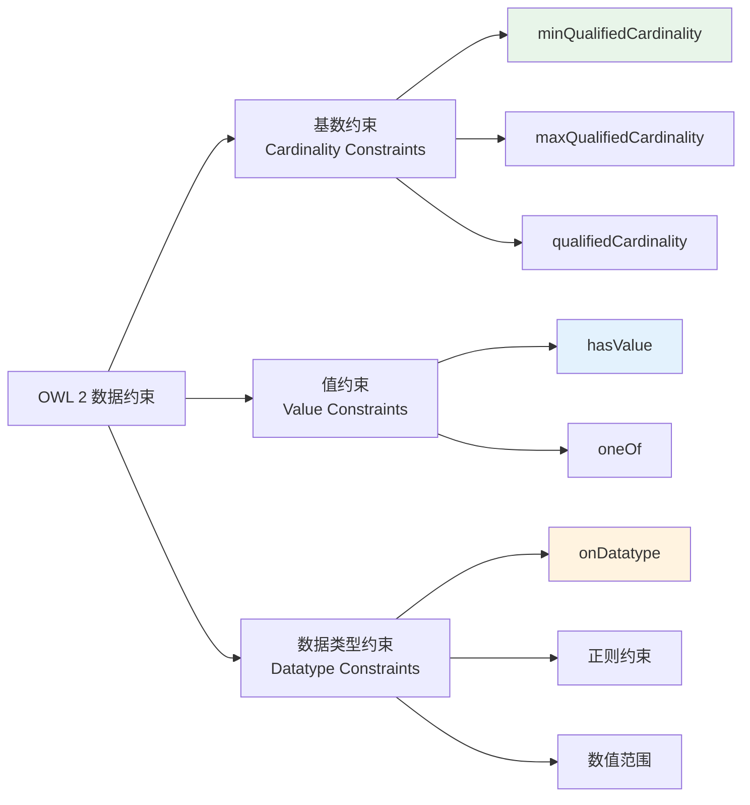

# 第 12 章 OWL 2 数据约束概述

> **本章要点**：掌握 OWL 2 数据约束的三大核心类别 —— 基数约束、值约束和 datatype 约束，理解它们在数据验证中的应用边界与 SHACL 的互补关系。

---

## 1. 本章概述

在第 11 章中，我们学习了 OWL 2 的属性公理（对象属性和数据属性的定义与约束）。OWL 2 在本章介绍的层面引入了强大的 **数据约束（Data Constraints）** 能力，使本体能够精确描述个体与其数据值之间的关系。

### 1.1 OWL 1 vs OWL 2 数据约束对比

| 能力 | OWL 1 | OWL 2 |
|------|-------|-------|
| 基数约束 | 有限（仅无限制基数 `minCardinality`/`maxCardinality`） | 增强（限定基数 `minQualifiedCardinality`/`maxQualifiedCardinality`/`qualifiedCardinality`） |
| 值约束 | 无原生支持 | 支持 `owl:hasValue` |
| Datatype 约束 | 有限 | 支持 `owl:onDatatype` 配合范围约束 |
| 枚举约束 | 无 | 支持 `owl:oneOf` |
| 与 SHACL 关系 | 不明确 | OWL 2 负责语义，SHACL 负责验证 |

### 1.2 数据约束的分类

### 1.3 OWL 2 与 SHACL 的定位

理解 OWL 2 数据约束的边界非常重要。OWL 2 擅长**语义推理**（classification, consistency checking），而 SHACL 擅长**数据验证**（validation against shapes）。

| 需求 | 推荐工具 | 原因 |
|------|----------|------|
| "每个人至少有 1 个名称" | OWL 2 `minQualifiedCardinality` | 语义推理 |
| "邮箱必须符合 RFC 5322 格式" | SHACL `sh:pattern` | 正则验证，OWL 2 不支持 |
| "姓名长度必须在 2-100 之间" | SHACL `sh:minLength/sh:maxLength` | 范围验证，OWL 2 不支持 |
| "年龄必须在 0-150 之间" | SHACL `sh:minInclusive/sh:maxInclusive` | 范围验证，OWL 2 不支持 |

> **关键理解**：OWLS 2 不原生支持字符串正则表达式、最小/最大长度等验证。这些功能应通过 SHACL 实现。OWL 2 专注于知识表示和逻辑推理。

---

## 2. 章节导航

| 节 | 内容 | 链接 |
|----|------|------|
| 12.1 | 基数约束 — `min/max/qualifiedCardinality` | [`01-cardinality-constraints.md`](01-cardinality-constraints.md) |
| 12.2 | 值约束与枚举约束 — `hasValue`, `oneOf` | [`02-value-constraints.md`](02-value-constraints.md) |
| 12.3 | 数据类型约束 — `onDatatype`、正则、数值范围 | [`03-datatype-constraints.md`](03-datatype-constraints.md) |
| 12.4 | 综合练习 — 电影本体的数据约束 | [`04-comprehensive-exercise.md`](04-comprehensive-exercise.md) |

---

## 3. 前置知识

本章内容依赖以下先修知识：

- [第 8 章：OWL 2 概述](../ch08-owl2-overview/index.md) — 基本概念、RDF 基础
- [第 11 章：OWL 2 属性公理](../ch11-owl2-property-axioms/index.md) — 对象属性与数据属性的定义

---

### ▶️ 继续阅读

学习完本章后，可继续探索：

- [第 13 章：SPARQL 查询语言](../ch13-sparql-query/index.md) — 如何使用 SPARQL 查询本体数据
- [第 14 章：SHACL 数据验证](../ch14-shacl-validation/index.md) — 如何使用 SHACL 验证 RDF 数据
- [第 16 章：开发生命周期](../ch16-development-lifecycle/index.md) — 本体的工程化开发流程

## 4. 本章小结

| 概念 | 说明 |
|------|------|
| 基数约束 | 约束属性的值数量上限和下限，支持限定类/数据类型 |
| 值约束 | 指定属性值必须等于某个特定个体（`owl:hasValue`） |
| Datatype 约束 | 指定值的类型范围（`owl:onDatatype`） |
| 枚举约束 | 指定值的可选集合（`owl:oneOf`） |
| OWL vs SHACL | OWL 2 侧重推理，SHACL 侧重验证 |