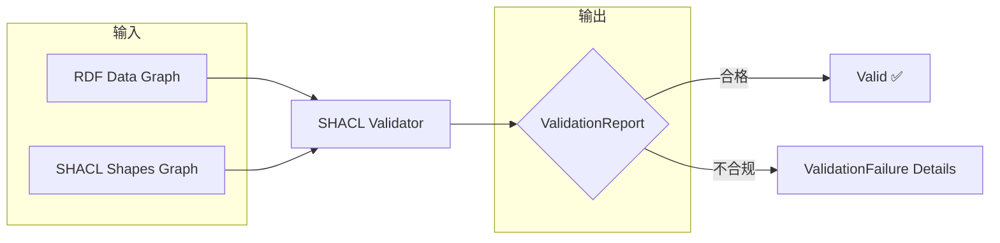

# 14.1 SHACL 简介

> **本节要点**：理解 SHACL 语言的定义与标准化历程，掌握 Shape（形状）、Target（目标）、Constraint（约束）三大核心概念，了解 SHACL 与 JSON Schema 和 XML Schema 的差异与应用场景。

---

### 🔗 前置知识

在继续学习本章之前，建议先阅读以下内容：

- [第 4 章：RDF 数据模型](../ch04-rdf-data-model/01-rdf-introduction.md) — RDF 三元组结构
- [第 6 章：RDFS 核心](../ch06-rdfs-core/01-rdf-vocabulary.md) — 定义域与值域
- [第 8 章：OWL 2 概述](../ch08-owl2-overview/01-why-owl2.md) — OWL 2 基础
- [第 11 章：OWL 2 属性公理](../ch11-owl2-property-axioms/01-object-data-properties.md) — 属性类型与特征
- [第 12 章：OWL 2 数据约束](../ch12-owl2-data-constraints/01-cardinality-constraints.md) — 基数、值与数据类型约束

### ▶️ 继续阅读

学习完本章后，可继续探索：

- [第 14.2 节：形状定义](./02-shape-definition.md) — 定义形状、目标与约束
- [第 16 章：开发生命周期](../ch16-development-lifecycle/01-lifecycle-phases.md) — 本体的工程化开发流程

## 1. SHACL 的定义与标准化历程

**SHACL**（Shapes Constraint Language，形状约束语言）是 W3C 推荐的 **RDF 数据验证标准语言**，用于描述 RDF 图（RDF Graph）的结构约束，并报告验证结果。

### 1.1 标准化时间线

| 里程碑 | 日期 | 描述 |
|--------|------|------|
| SHACL Core | 2017 年 9 月 | W3C Recommendation（REC）正式发布，定义核心约束组件集合 |
| SHACL SPARQL | 2017 年 9 月 | W3C Recommendation（REC），基于 SPARQL 查询的自定义约束 |
| SHACL-Eclipse | 2024 年 | W3C Community Group 提案，支持等价约束推导场景 |
| Shape Expressions (ShEx) | 2019 年 7 月 | W3C Recommendation（REC），SHACL 的竞争对手/互补标准 |

### 1.2 核心标准文档

| 标准 | URL |
|------|-----|
| SHACL Core | <https://www.w3.org/TR/shacl/> |
| SHACL SPARQL | <https://www.w3.org/TR/shacl-spar/> |
| SHACL EF（语义补充） | <https://www.w3.org/TR/shacl-ef-rs/> |

---

## 2. SHACL 与 RDF Shapes Graph Schema (RDFS) 的关系

SHACL 与 **RDFS**（RDF Schema）均用于描述 RDF 数据的结构，但两者在设计目标和表达能力上有本质区别。

### 2.1 定位差异

| 方面 | RDFS | SHACL |
|------|------|-------|
| **主要用途** | 本体定义（词汇集扩展） | 数据验证（约束检查） |
| **推理能力** | 支持子类等价的描述逻辑推理 | 专注于验证，不做语义推理 |
| **约束丰富度** | `rdfs:domain` / `rdfs:range`（简单） | `minCount`, `maxCount`, `pattern`, `datatype` 等（丰富） |
| **结果报告** | 无内置报告机制 | 内置 `sh:Validate` 验证报告（`rdf:ValidationResult`） |
| **开放式假设** | ✅ 开放世界假设 | ✅ 开放世界假设（SHACL Core 在验证时） |

### 2.2 互补关系

```turtle
# RDFS 定义本体结构
ex:Person rdfs:subClassOf rdfs:Resource .
ex:hasAge   rdfs:domain  ex:Person ;
            rdfs:range   xsd:integer .

# SHACL 施加详细约束
ex:PersonShape
    a sh:NodeShape ;
    sh:targetClass ex:Person ;
    sh:property [
        sh:path ex:hasAge ;
        sh:minCount 0 ;
        sh:maxCount 1 ;
        sh:datatype xsd:integer
    ] .
```

> **关键原则**：**RDFS 描述"数据是什么类型"，SHACL 约束"数据必须满足什么规则"**。两者配合使用，RDFS 负责构建本体层次，SHACL 负责数据质量检查。

---

## 3. 三大核心概念

SHACL 模型建立在 **Shape（形状）**、**Target（目标）**、**Constraint（约束）** 三个核心抽象之上。

### 3.1 Shape（形状）

**Shape（形状）** 是一组约束的集合，用于定义某个（些）RDF 资源应具备的结构特征。可以将其理解为数据库表的"列定义 + 约束"的组合。

```turtle
ex:PersonShape
    a sh:NodeShape ;
    sh:property [
        sh:path ex:hasName ;
        sh:minCount 1
    ] ;
    sh:property [
        sh:path ex:hasAge ;
        sh:minCount 0 ;
        sh:maxCount 1 ;
        sh:datatype xsd:integer
    ] .
```

**Shape 的类型**：

| 类型 | IRI | 用途 |
|------|-----|------|
| NodeShape | `sh:NodeShape` | 约束独立节点的属性集合（任何节点可被验证） |
| PropertyShape | `sh:PropertyShape` | 作为嵌套约束应用于另一 Shape 的目标节点（必须依附于 Target） |

### 3.2 Target（目标）

**Target（目标）** 定义了 Shape 应用在哪些 RDF 节点上。SHACL 提供多种目标指定方式：

```turtle
# 方式 1：按类目标定
ex:PersonShape sh:targetClass ex:Person .

# 方式 2：按特定节点目标定
ex:ActiveUserShape sh:targetNode ex:Alice, ex:Bob .

# 方式 3：按关系目标定（作为主体的节点）
ex:EmailShape sh:targetSubjectsOf ex:hasEmail .

# 方式 4：按 SPARQL 查询结果目标定
ex:SeniorPersonShape
    sh:targetSubjectsOf ex:hasManager ;
    sh:class ex:Person .
```

**Target 类型速查表**：

| 约束组件 | 目标类型 | 描述 |
|----------|---------|------|
| `sh:targetClass` | 类成员 | 目标为指定类的所有实例 |
| `sh:targetNode` | 指定节点 | 目标为明确列出的 IRI/字面量 |
| `sh:targetSubjectsOf` | 关系主体 | 目标为具有指定谓词的 RDF 主体节点 |
| `sh:targetObjectsOf` | 关系客体 | 目标为具有指定谓词的 RDF 客体节点 |
| `sh:theme` | 主题 | 用于组织形状，不在验证时生效 |

### 3.3 Constraint（约束）

**Constraint（约束）** 是施加于目标节点上的具体条件检查。约束可以分为 **值约束（Value Constraint）** 和 **结构约束（Structural Constraint）**。

```turtle
ex:PersonShape
    a sh:NodeShape ;
    sh:targetClass ex:Person ;
    # 约束 1: 必须有至少一个名字
    sh:property [
        sh:path ex:hasName ;
        sh:minCount 1 ;
        sh:maxCount 10
    ] ;
    # 约束 2: 年龄必须是整数且在 0-150 范围内
    sh:property [
        sh:path ex:hasAge ;
        sh:datatype xsd:integer ;
        sh:minInclusive 0 ;
        sh:maxInclusive 150
    ] ;
    # 约束 3: 邮箱必须符合正则
    sh:property [
        sh:path ex:hasEmail ;
        sh:pattern "[a-z0-9._%+-]+@[a-z0-9.-]+\\.[a-z]{2,}" ;
        sh:flags "i"
    ] .
```

**常用约束组件**：

| 约束组件 | 适用类型 | 描述 |
|----------|---------|------|
| `sh:class` | 值 | 要求值的类型（类）匹配 |
| `sh:datatype` | 值 | 要求值的 datatype 匹配 |
| `sh:in` | 值 | 要求值在允许的枚举集合中 |
| `sh:minCount` / `sh:maxCount` | 属性路径 | 限制属性值的数量 |
| `sh:minLength` / `sh:maxLength` | 字符串 | 字符串长度限制 |
| `sh:minInclusive` / `sh:maxInclusive` | 数值/日期 | 数值或日期范围下限/上限 |
| `sh:pattern` | 字符串 | 正则表达式匹配 |
| `sh:hasValue` | 值 | 要求值包含指定常量 |
| `sh:and` / `sh:or` / `sh:nor` | 复合约束 | 约束的与/或/非组合 |
| `sh:closed` | 封闭形状 | 不允许出现形状中未定义的属性 |

---

## 4. SHACL vs JSON Schema vs XML Schema

三种数据验证/描述标准各有侧重，适用于不同的数据格式和应用场景。

### 4.1 对比总览

| 维度 | SHACL | JSON Schema | XML Schema (XSD) |
|------|-------|-------------|-----------------|
| **数据模型** | RDF 图（三元组） | JSON 文档 | XML 文档 |
| **主要用途** | 语义网数据验证、本体数据质量检查 | API 请求/响应验证、前端表单校验 | 企业系统集成、SOAP 服务 |
| **语义推理** | ❌（验证不推理）| ❌ | ❌ |
| **开放式世界** | ✅ 天然适应开放式图谱 | ❌ 假设封闭 JSON 结构 | ❌ 基于固定文档类型 |
| **链接数据** | ✅ RDF IRI 原生支持 | ❌ 需额外机制 | 需要 XML ID/IDREF |
| **约束丰富度** | ⭐⭐⭐（路径、嵌套、规则） | ⭐⭐（嵌套对象、格式校验） | ⭐⭐⭐（类型、序列、约束） |
| **标准化组织** | W3C | JSON Schema 社区 + IETF | W3C + W3C/JSON 映射 |
| **验证结果** | `ValidationReport` / `ValidationFailure` | `true` / `false` 或 `errors` | `true` / `false` |

### 4.2 场景选择矩阵

| 场景 | 推荐标准 | 原因 |
|------|---------|------|
| 验证 RDF 图谱数据 | SHACL | 原生支持 RDF、路径、图遍历 |
| 验证 REST API JSON 请求 | JSON Schema | JSON 生态最广、工具链成熟 |
| 验证 XML 配置文件 | XML Schema (XSD) | XML 生态标准 |
| 数据交换（企业集成） | XML Schema | XSD 类型系统丰富、支持文档/元素级定义 |
| 语义网 / 知识图谱 | SHACL | 支持图模式约束、Shape 组合 |

### 4.3 等效示例对比

以下"必须有名字且名字为字符串"的约束在不同标准中的写法：

**SHACL 示例**：

```turtle
PREFIX sh: <http://www.w3.org/ns/shacl#>
PREFIX ex: <http://example.org/ontology#>

ex:PersonShape
    a sh:NodeShape ;
    sh:targetClass ex:Person ;
    sh:property [
        sh:path ex:hasName ;
        sh:minCount 1 ;
        sh:datatype xsd:string
    ] .
```

**JSON Schema 示例**：

```json
{
  "$schema": "https://json-schema.org/draft/2020-12/schema",
  "type": "object",
  "required": ["name"],
  "properties": {
    "name": {
      "type": "string",
      "minLength": 1
    }
  }
}
```

**XML Schema (XSD) 示例**：

```xml
<xs:element name="person">
  <xs:complexType>
    <xs:sequence>
      <xs:element name="name" type="xs:string" minOccurs="1" maxOccurs="1"/>
    </xs:sequence>
  </xs:complexType>
</xs:element>
```

> **核心差异总结**：SHACL 的核心优势在于**适应 RDF 图结构的灵活验证**，支持路径（`sh:path`）、嵌套属性、图模式的遍历验证，而 JSON Schema 和 XML Schema 适用于**有固定结构的文档数据**。

---

## 5. SHACL 验证工作流程



**验证步骤**：

1. **加载 RDF 数据图** — 待验证的源数据
2. **加载 SHACL Shapes 图** — 定义验证规则的 Shape 集合
3. **遍历 Target 节点** — 对每个 Shape 的 Target 节点逐一评估约束
4. **生成验证报告** — 输出 `ValidationReport`（含 `violation` 信息）

**验证报告结构**：

```turtle
[
    a sh:ValidationReport ;
    sh:conforms false ;
    sh:result [
        a sh:ValidationResult ;
        sh:focusNode <http://example.org/person/001> ;
        sh:sourceShape ex:PersonShape ;
        sh:resultSeverity sh:Violation ;
        sh:resultMessage "必须至少有一个名字." ;
        sh:focusNode <http://example.org/person/001> ;
        sh:resultPath ex:hasName
    ] .
]
```

---

## 6. 总结

| 概念 | 关键要点 |
|------|----------|
| SHACL | W3C REC（2017），用于 RDF 数据验证的形状约束语言 |
| 与 RDFS 关系 | RDFS 描述语义，SHACL 施加约束，两者互补 |
| Shape | 约束的集合，分 NodeShape 和 PropertyShape 两种 |
| Target | 决定 Shape 作用于哪些节点，`sh:targetClass` 最常用 |
| Constraint | 具体的条件检查，如 `minCount`, `datatype`, `pattern` 等 |
| vs JSON Schema | SHACL 面向开放式 RDF 图，JSON Schema 面向结构化 JSON |