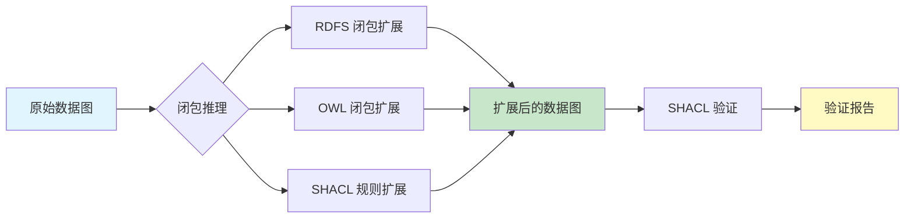

# 14.3 复杂规则与闭包推理

> **本节要点**：理解 SHACL 规则（`sh:Rule`）的自动生成数据能力，掌握 `sh:closure` 闭包推理的用法，了解变量路径与嵌入 SPARQL 约束在复杂模式匹配中的应用。

---

## 1. SHACL 规则概述

**SHACL 规则（SHACL Rules）** 是 SHACL Extensions 规范定义的扩展功能，允许 Shape 定义**数据自动生成逻辑**——即验证时不仅做"检查"，还能"推理/生成"新数据。

### 1.1 规则 vs 验证：本质区别

| 维度 | SHACL 验证 | SHACL 规则 |
|------|-----------|-----------|
| **目的** | 检查数据是否合规 | 从已有数据推导出新数据 |
| **输出** | `ValidationReport` | **扩展后的 RDF 图**（新增三元组） |
| **数据影响** | 不修改数据源 | 向图中注入新三元组 |
| **应用场景** | 数据质量保证 | 本体重置/数据补全/自动推断 |

> ⚠️ **重要**：SHACL 规则**不属于** SHACL Core（W3C REC），而是 SHACL Extensions 规范。验证引擎需显式支持 `sh:Rule` 才能生效。

### 1.2 sh:rule 基础语法

```turtle
PREFIX sh:   <http://www.w3.org/ns/shacl#>
PREFIX ex:   <http://example.org/ontology#>

# 规则定义在 Shape 内，通过 sh:rule 引用
ex:PersonShape
    a sh:NodeShape ;
    sh:targetClass ex:Person ;
    sh:rule [
        a sh:Rule ;
        sh:condition [
            sh:path ( ex:hasFather ex:hasFather ) ;
            sh:class ex:Person
        ] ;
        sh:consequence [
            a sh:NodeShape ;
            sh:property [
                sh:path ex:hasGrandfather ;
                sh:hasValue ?father
            ]
        ]
    ] .
```

**规则结构的三个组成部分**：

| 组件 | 位置 | 含义 |
|------|------|------|
| `sh:rule` | Shape 上 | 附加到 Shape 的规则列表 |
| `sh:condition` | 规则内部 | 条件部分（WHERE 子句的匹配模式） |
| `sh:consequence` | 规则内部 | 后果部分（CONSTRUCT 模式的输出） |

**工作原理**：
1. 条件部分（`sh:condition`）在数据图中匹配满足模式的所有节点和变量绑定
2. 对于每次匹配，后果部分（`sh:consequence`）用绑定变量构造新三元组并加入数据图

---

## 2. 自动生成数据的经典示例

### 2.1 推断祖父母关系

```turtle
PREFIX sh: <http://www.w3.org/ns/shacl#>
PREFIX ex: <http://example.org/ontology#>
PREFIX rdf: <http://www.w3.org/1999/02/22-rdf-syntax-ns#>

# 如果 A 的父亲是 B，B 的父亲是 C
# 则推断 A 的祖父母是 C
[
    a sh:Rule ;
    sh:condition [
        a sh:PropertyShape ;
        sh:path ( ex:hasFather ex:hasFather )
    ] ;
    sh:consequence [
        a sh:NodeShape ;
        sh:property [
            sh:path ex:hasGrandparent ;
            sh:predicate ?x1 ;
            sh:object ?x2
        ] ;
        sh:property [
            sh:predicate rdf:type ;
            sh:object ex:Person
        ]
    ] .
```

**规则语义解释（对应 SPARQL 等式）**：

| SHACL 规则等价 SPARQL CONSTRUCT |
|--------------------------------|
| ```sparql<br>CONSTRUCT {<br>    ?s ex:hasGrandparent ?o .<br>}<br>WHERE {<br>    ?s ex:hasFather ?o .<br>    ?o ex:hasFather ?g .<br>}<br>``` |

### 2.2 自动设置数据类型

```turtle
# 当名字以大写首字母开头时，自动推断年龄类型为整数
[
    a sh:Rule ;
    sh:condition [
        sh:path ex:hasName ;
        sh:pattern "^[A-Z][a-z]+"
    ] ;
    sh:consequence [
        a sh:NodeShape ;
        sh:property [
            sh:path ex:hasAge ;
            sh:datatype xsd:integer
        ]
    ] .
```

### 2.3 多级推断：朋友的朋友

```turtle
# 如果 A 是 B 的朋友，B 是 C 的朋友
# 则推断 A 是 C 的"熟人"
[
    a sh:Rule ;
    sh:condition [
        a sh:PropertyShape ;
        sh:path ( ex:isFriendOf ex:isFriendOf )
    ] ;
    sh:consequence [
        a sh:NodeShape ;
        sh:property [
            sh:path ex:isAcquaintanceOf ;
            sh:predicate ?x1 ;
            sh:object ?x2
        ]
    ] .
```

---

## 3. 闭包推理（sh:closure）

**SHACL 闭包推理（`sh:closure`）** 是一种增强验证的方式——在验证前，引擎首先使用闭包规则扩展数据图，然后再在扩展后的图上执行验证。

### 3.1 sh:closed — 封闭形状

**`sh:closed`** 是一个"封闭性"约束，控制 Shape 目标上允许出现的属性。

```turtle
ex:StrictPersonShape
    a sh:NodeShape ;
    sh:targetClass ex:Person ;
    
    # 启用封闭模式
    sh:closed true ;
    
    # 定义允许的"白名单"属性
    sh:ignoredProperties (
        rdf:type
        sh:node
        sh:or
        sh:and
        sh:nor
    ) ;
    
    # 所有允许的属性
    sh:property [ sh:path ex:hasName ] ;
    sh:property [ sh:path ex:hasAge ] ;
    sh:property [ sh:path ex:hasEmail ] .
```

**封闭形状约束效果**：在封闭形状下，目标节点上**不能出现 Shape 未明确列出的属性**。

| `sh:closed` 值 | 效果 |
|----------------|------|
| `true` | 完全封闭 — 只能有白名单中列出的属性（`ignoredProperties` 除外） |

### 3.2 sh:closure 闭包扩展

`sh:closure` 用于指定**推导引擎应使用哪些规则或本体**来闭包扩展数据：

```turtle
PREFIX sh: <http://www.w3.org/ns/shacl#>
PREFIX rdfs: <http://www.w3.org/2000/01/rdf-schema#>
PREFIX ex: <http://example.org/ontology#>

# 定义一个包含规则的形状
ex:EnrichedPersonShape
    a sh:NodeShape ;
    sh:targetClass ex:Person ;
    
    # 指定闭包使用的推理引擎和资源
    sh:closure rdf:rdfs ;
    sh:closure rdfs: ;
    sh:closure ex:ReasoningRules .
```

**常见闭包资源**：

| 闭包资源 | 值 | 作用 |
|----------|-----|------|
| 无闭包 | `""` 或省略 | 仅做验证，不做推理 |
| RDFS 闭包 | `rdf:rdfs` | 利用 RDFS `rdfs:subClassOf`, `rdfs:subPropertyOf` 推理 |
| OWL 闭包 | `owl:` | 利用 OWL 2 推理（需要 OWL 推理引擎） |
| 自定义规则 | `ex:ReasoningRules` | 使用自定义 SHACL 规则生成数据 |
| SHACL 闭包组合 | `rdf:rdfs` + 自定义 | 组合多个闭包源 |

### 3.3 闭包推理的工作流程



**各阶段详细说明**：

| 阶段 | 输入 | 输出 | 引擎 |
|------|------|------|------|
| 1. 初始数据图 | RDF 数据 | 原始三元组 | 解析器 |
| 2. RDFS 闭包 | 数据 + RDFS 公理 | 推理后数据图（包含 `rdfs:subClassOf`/`subPropertyOf` 传递闭合） | RDFS 推理机 |
| 3. OWL 闭包 | RDFS 数据 + OWL 公理 | 推理后数据图（包含 `owl:equivalentClass`/`inverseOf`/`transitiveProperty` 闭合） | OWL 推理机 |
| 4. SHACL 规则闭包 | OWS + SHACL 规则 | 推理后数据图（新增推演出的三元组） | SHACL 推理机 |
| 5. SHACL 验证 | 闭包后的数据 | `ValidationReport` | SHACL 验证器 |

---

## 4. 变量路径（Variable Path）

变量路径（SHACL Path）允许 Shape 通过**路径表达式**（Path Expression）遍历 RDF 图的图结构。

### 4.1 基本路径类型

| 路径 | 语法 | 说明 |
|------|------|------|
| 属性路径 | `ex:someProp` | 单步属性跳转 |
| 反选路径 | `^ex:someProp` | 以目标节点为起点的入向跳转 |
| 路径序列 | `(p1 p2)` | 按顺序执行路径组合 |
| 或路径 | `sh:or (p1 p2 p3)` | 对每个路径都施加约束 |
| 自反闭包 | `!*` | 零或多次自反传递跳转 |
| 传递闭包 | `!+` | 一次或多次传递跳转 |

### 4.2 复杂路径示例

```turtle
PREFIX sh:   <http://www.w3.org/ns/shacl#>
PREFIX ex:   <http://example.org/ontology#>

# 路径 1: 反选路径 - 所有被谁"推荐"过
[
    a sh:NodeShape ;
    sh:path ^ex:recommendedBy ;
    sh:minCount 1
] .

# 路径 2: 传递闭包 - 所有"上下级"关系的传递
[
    a sh:NodeShape ;
    sh:path !+ ex:reportsTo ;
    sh:maxCount 5
] .

# 路径 3: 序列路径 - 公司 -> 部门 -> 办公室
[
    a sh:NodeShape ;
    sh:path ( ex:locatedIn ex:hasDepartment ex:hasOffice ) ;
    sh:datatype xsd:string
] .
```

---

## 5. 嵌入式 SPARQL 约束（sh:sparql）

**SHACL SPARQL** 扩展（W3C REC 2017）允许通过 `sh:sparql` 组件在 Shape 内部使用**嵌入的 SPARQL 查询**进行复杂约束检查。

### 5.1 sh:SelectConstraint — 选择约束

```turtle
ex:SeniorEmployeeShape
    a sh:NodeShape ;
    sh:targetClass ex:Employee ;
    
    sh:select """
        PREFIX ex: <http://example.org/ontology#>
        PREFIX rdf: <http://www.w3.org/1999/02/22-rdf-syntax-ns#>
        SELECT ?person WHERE {
            ?person a ex:Employee .
            ?person ex:yearsOfService ?years .
            FILTER(?years >= 10)
        }
    """ ;
    
    sh:description "此查询检查员工是否有 10 年以上服务年限."
```

**语义**：返回查询结果中 `?person` 绑定的节点集合作为验证通过结果。

### 5.2 sh:AskConstraint — 断言约束

```turtle
ex:HasManagerShape
    a sh:NodeShape ;
    sh:targetClass ex:Employee ;
    
    sh:ask """
        PREFIX ex: <http://example.org/ontology#>
        ASK {
            ?this ex:hasManager ?m .
        }
    """ .
```

> **关键字**：`?this` 在 `sh:ask` 和 `sh:select` 查询中是特殊变量，表示当前验证的焦点节点（`focusNode`）。

### 5.3 sh:DescribeConstraint — 描述约束

```turtle
ex:ManagerShape
    a sh:NodeShape ;
    sh:targetClass ex:Manager ;
    
    sh:describe [
        a sh:NodeShape ;
        sh:property [
            sh:path ex:hasDirectReport ;
            sh:minCount 1
        ]
    ] .
```

### 5.4 sh:SPARQLConstraint — 条件性约束

`sh:SPARQLConstraint` 允许结合 SPARQL 查询结果来判定某个约束是否适用。

```turtle
ex:CategorizedEmployeeShape
    a sh:NodeShape ;
    sh:targetClass ex:Employee ;
    
    sh:property [
        sh:path ex:departmentName ;
        sh:datatype xsd:string ;
        sh:SPARQLConstraint [
            a sh:SPARQLConstraint ;
            sh:message "部门名称不能为空字符串." ;
            sh:select """
                PREFIX ex: <http://example.org/ontology#>
                PREFIX xsd: <http://www.w3.org/2001/XMLSchema#>
                SELECT ?person ?value WHERE {
                    ?person ex:departmentName ?value .
                    FILTER(?value = "" || REGEX(?value, "^\\s*$"))
                }
            """ ;
            sh:condition [
                sh:path ex:departmentName ;
                sh:datatype xsd:string
            ]
        ]
    ] .
```

### 5.5 sh:declare — 前缀声明（SPARQL 上下文）

当使用嵌入 SPARQL 时，可以通过 `sh:declare` 提供前缀声明，使 SPARQL 查询无需重复定义 `PREFIX`：

```turtle
ex:ValidatedWithDeclare
    a sh:NodeShape ;
    sh:targetClass ex:Person ;
    
    sh:declare [
        sh:prefix "ex" ;
        sh:namespace "http://example.org/ontology#" ;
        sh:prefix "exData" ;
        sh:namespace "http://example.org/data#" ;
        sh:prefix "xsd" ;
        sh:namespace "http://www.w3.org/2001/XMLSchema#"
    ] .
```

> **注意**：当有 `sh:declare` 后，嵌入的 SPARQL 查询可以直接使用 `ex:`, `xsd:` 前缀，无需重复定义。

---

## 6. 综合示例：完整验证+规则工作流

### 6.1 电影领域完整示例

```turtle
PREFIX sh:   <http://www.w3.org/ns/shacl#>
PREFIX ex:   <http://example.org/ontology#>
PREFIX rdf:  <http://www.w3.org/1999/02/22-rdf-syntax-ns#>
PREFIX xsd:  <http://www.w3.org/2001/XMLSchema#>
PREFIX rdfs: <http://www.w3.org/2000/01/rdf-schema#>

# ═══════════════════════════════════════════
# Shape 1: Movie 类的基本验证
# ═══════════════════════════════════════════

ex:MovieShape
    a sh:NodeShape ;
    sh:targetClass ex:Movie ;
    
    sh:property [
        sh:path ex:title ;
        sh:minCount 1 ;
        sh:datatype xsd:string
    ] ;
    
    sh:property [
        sh:path ex:releaseYear ;
        sh:minInclusive 1888 ;
        sh:maxInclusive 2099 ;
        sh:datatype xsd:integer
    ] .

# ═══════════════════════════════════════════
# Shape 2: 导演约束
# ═══════════════════════════════════════════

ex:DirectorShape
    a sh:NodeShape ;
    sh:targetClass ex:Director ;
    
    sh:property [
        sh:path ex:name ;
        sh:minCount 1
    ] .

# ═══════════════════════════════════════════
# Shape 3: 规则 - 推断导演与电影的关系
# ═══════════════════════════════════════════

ex:DirectorshipRule
    a sh:Rule ;
    sh:condition [
        a sh:PropertyShape ;
        sh:path ( ex:directedBy ex:hasName )
    ] ;
    sh:consequence [
        a sh:NodeShape ;
        sh:property [
            sh:predicate ex:hasDirected ;
            sh:object ?x2 ;
            sh:path ex:hasName
        ]
    ] .

# ═══════════════════════════════════════════
# Shape 4: 使用 sh:declare + sh:select 进行 SPARQL 复杂验证
# ═══════════════════════════════════════════

ex:ActorShape
    a sh:NodeShape ;
    sh:targetClass ex:Actor ;
    
    sh:declare [
        sh:prefix "ex" ;
        sh:namespace "http://example.org/ontology#"
    ] ;
    
    sh:select """
        PREFIX ex: <http://example.org/ontology#>
        SELECT ?this WHERE {
            ?this a ex:Actor .
            OPTIONAL { ?this ex:name ?n } .
            FILTER (!BOUND(?n))
        }
    """ ;
    
    sh:message "演员必须有名字 (ex:name)." .
```

---

## 7. SHACL 规则推理与 OWL 推理对比

| 特性 | SHACL 规则 | OWL 2 推理 |
|------|-----------|-----------|
| **推理类型** | 规则（Productions Rules） | 描述逻辑（Description Logic） |
| **方向** | 正向链接（数据生成） | 子类判断、一致性检查 |
| **表达能力** | 可表达正则/路径 | 受限于 DL 语言 |
| **决策性** | 非判定（某些规则集不可判定） | 可判定（OWL 2 RL / EL / QL / CT Profile） |
| **典型引擎** | Jena SHACL Rules, GraphDB Inference Rules | HermiT, Pellet, Elk, Jena OWL Reasoner |
| **典型用途** | 数据补全、推导新属性值 | 分类层次推理、一致性检查 |

---

## 8. 总结

| 概念 | 关键要点 |
|------|----------|
| sh:Rule | 规则引擎在验证时自动生成新三元组，需 Engine 显式支持 |
| sh:condition + consequence | 规则的"WHERE + CONSTRUCT" 模板配对 |
| sh:closed (封闭形状) | 限制目标节点只能出现白名单内的属性 |
| sh:closure | 指定闭包资源（RDFS, OWL, 自定义规则）在验证前先扩展数据图 |
| 变量路径 | `^`反选, `!`/`!*`/`!+`闭包, 序列 `(p1 p2)` |
| sh:select / sh:ask | 基于 SPARQL 的嵌入式约束验证，`?this` 为焦点节点 |
| sh:declare | 为嵌入 SPARQL 提供前缀声明上下文 |