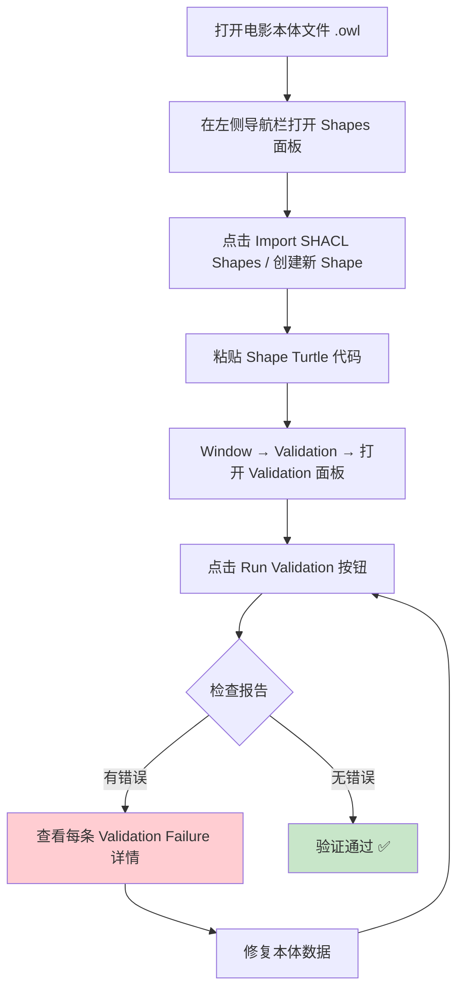

# 14.4 练习：Protégé / Jena 验证实操

> **本节要点**：学会在 Protégé 中配置和使用 Jena SHAcl Validator 执行 SHACL 验证；掌握在电影本体（Movie Ontology）上编写 SHACL Shape；熟练解读验证结果报告。

---

## 1. 准备工作：工具与环境

### 1.1 所需软件

| 工具 | 版本要求 | 用途 |
|------|---------|------|
| Protégé | 5.x 以上（5.6+ 支持 SHACL 插件） | 本体编辑与验证管理 |
| Apache Jena | 3.x / 4.x | SHACL 验证引擎 |
| SHACL for Jena | 最新兼容版本 | SHACL 验证库 |

### 1.2 安装 Jena SHACL 库

**Maven 依赖**：

```xml
<dependency>
    <groupId>org.apache.jena</groupId>
    <artifactId>jena-shacl</artifactId>
    <version>4.10.0</version>
</dependency>
```

**Gradle 依赖**：

```groovy
implementation 'org.apache.jena:jena-shacl:4.10.0'
```

### 1.3 Protégé 内置 SHACL 验证

从 Protégé 5.6 开始，内置了对 SHACL 验证的支持。通过 **Window → Validation** 面板或运行 **Run SHACL Validation** 命令即可执行验证。

---

## 2. 项目场景：电影本体

在本练习中，我们将构建一个**电影本体（Movie Ontology）**并对其进行 SHACL 验证。

### 2.1 电影本体定义

```turtle
PREFIX ex: <http://example.org/movie#>
PREFIX rdfs: <http://www.w3.org/2000/01/rdf-schema#>
PREFIX xsd: <http://www.w3.org/2001/XMLSchema#>

# ═══════════════════════════════
# 类（Classes）
# ═══════════════════════════════

ex:Movie       a rdfs:Class .
ex:Director    a rdfs:Class .
ex:Actor       a rdfs:Class .
ex:Genre       a rdfs:Class .

# ═══════════════════════════════
# 对象属性（Object Properties）
# ═══════════════════════════════

ex:directedBy      a rdfs:Property ; rdfs:domain ex:Movie ; rdfs:range ex:Director .
ex:starring        a rdfs:Property ; rdfs:domain ex:Movie ; rdfs:range ex:Actor .
ex:hasGenre        a rdfs:Property ; rdfs:domain ex:Movie ; rdfs:range ex:Genre .
ex:knownFor        a rdfs:Property ; rdfs:domain ex:Director ; rdfs:range ex:Movie .

# ═══════════════════════════════
# 数据属性（Data Properties）
# ═══════════════════════════════

ex:title         a rdfs:Property ; rdfs:domain ex:Movie ; rdfs:range xsd:string .
ex:releaseYear   a rdfs:Property ; rdfs:domain ex:Movie ; rdfs:range xsd:integer .
ex:name          a rdfs:Property ; rdfs:domain ex:Director, ex:Actor ; rdfs:range xsd:string .
```

### 2.2 示例数据

```turtle
PREFIX ex: <http://example.org/movie#>
PREFIX xsd: <http://www.w3.org/2001/XMLSchema#>

# ✅ 合规数据：《肖申克的救赎》
ex:ShawshankRedemption
    a ex:Movie ;
    ex:title "The Shawshank Redemption" ;
    ex:releaseYear 1994 ;
    ex:directedBy ex:FrankDarabont ;
    ex:starring ex:Tim Robbins, ex:MorganFreeman .

# ❌ 不合规数据：年份异常 + 缺少名字
ex:BadMovie
    a ex:Movie ;
    ex:title "Broken Movie" ;
    ex:releaseYear 3000 ;
    ex:directedBy ex:UnknownDirector .

ex:UnknownDirector
    a ex:Director .
    # 缺少 ex:name 属性
```

---

## 3. 编写电影本体的 SHACL Shape

### 3.1 Movie Shape 验证规则

```turtle
PREFIX sh:   <http://www.w3.org/ns/shacl#>
PREFIX ex:   <http://example.org/movie#>
PREFIX rdf:  <http://www.w3.org/1999/02/22-rdf-syntax-ns#>
PREFIX xsd:  <http://www.w3.org/2001/XMLSchema#>

# ═══════════════════════════════════════════
# Shape 1: 验证 Movie 类
# ═══════════════════════════════════════════

ex:MovieShape
    a sh:NodeShape ;
    sh:targetClass ex:Movie ;
    
    # 电影必须有且仅有 1 个标题
    sh:property [
        sh:path ex:title ;
        sh:minCount 1 ;
        sh:maxCount 1 ;
        sh:datatype xsd:string
    ] ;
    
    # 上映年份必须在 [1888, 2099] 范围内
    sh:property [
        sh:path ex:releaseYear ;
        sh:minCount 0 ;
        sh:maxCount 1 ;
        sh:datatype xsd:integer ;
        sh:minInclusive 1888 ;
        sh:maxInclusive 2099
    ] ;
    
    # 必须至少有一位导演
    sh:property [
        sh:path ex:directedBy ;
        sh:minCount 1
    ] .

# ═══════════════════════════════════════════
# Shape 2: 验证 Director 类
# ═══════════════════════════════════════════

ex:DirectorShape
    a sh:NodeShape ;
    sh:targetClass ex:Director ;
    
    # 导演必须有名字
    sh:property [
        sh:path ex:name ;
        sh:minCount 1 ;
        sh:maxCount 1 ;
        sh:datatype xsd:string
    ] .

# ═══════════════════════════════════════════
# Shape 3: 验证 Actor 类
# ═══════════════════════════════════════════

ex:ActorShape
    a sh:NodeShape ;
    sh:targetClass ex:Actor ;
    
    # 演员必须有名字
    sh:property [
        sh:path ex:name ;
        sh:minCount 1 ;
        sh:maxCount 1 ;
        sh:datatype xsd:string
    ] .

# ═══════════════════════════════════════════
# Shape 4: 验证 Genre 类
# ═══════════════════════════════════════════

ex:GenreShape
    a sh:NodeShape ;
    sh:targetClass ex:Genre ;
    
    # 流派必须具有标签
    sh:property [
        sh:path rdfs:label ;
        sh:minCount 1
    ] .
```

---

## 4. 在 Protégé 中运行 SHACL 验证

### 4.1 步骤概览



### 4.2 详细操作步骤（Protégé 5.6+）

1. **打开本体**
   - 启动 Protégé → **File → Open** → 选择电影本体文件

2. **添加 Shapes 数据**
   - 切换到 **Shapes** 面板（在 Outline/Annotation/Facts 面板旁边）
   - 点击绿色 **"+"** 按钮添加 Shape 数据
   - 或直接编辑 **Facts** 选项卡粘贴 Turtle 代码

3. **执行验证**
   - **Window → Validation**（快捷键：`Ctrl+Shift+V` 或 `Cmd+Shift+V`）
   - 在 Validation 面板点击 **Run** 按钮

4. **查看结果**
   - 面板会显示通过/失败的摘要
   - 展开每个失败项查看详细原因

---

## 5. 使用 Jena 命令行验证

也可以不依赖 Protégé，直接使用 Jena SHACL 命令行工具运行验证。

### 5.1 命令行用法

```bash
# 基本验证命令
java -jar jena-shacl.jar \
    --shapes shapes.ttl \
    --data movie-data.ttl \
    --shacl
```

### 5.2 Java 编程方式

```java
import org.apache.jena.shacl.SHAACLGraph ;
import org.apache.jena.shacl.Shacl . ;
import org.apache.jena.shacl.Shapes ;
import org.apache.jena.shacl.validation.ValidationReport ;
import org.apache.jena.ontology.OntModel ;
import org.apache.jena.ontology.OntModelSpec ;
import org.apache.jena.vocabulary.RDFVocabulary ;

// 加载本体数据和 Shape 数据
OntModel dataModel = OntModelFactory . createOntModel ( OntModelSpec . RDFS_MEM ) ;
dataModel . read ( "file:movies.ttl" , "Turtle" ) ;

Shapes shapes = Shapes . createShapes ( Shape . read ( new FileInputStream ( "file:movies-shapes.ttl" ) , "Turtle" ) ;

// 执行 SHACL 验证
ValidationReport report = Shape . validate ( dataModel , shapes ) ;

// 输出结果
if ( report . isValid ( ) ) {
    System.out.println ( "Validation PASSED." ) ;
} else {
    System.out.println ( "Validation FAILED." ) ;
    report . log ( System.out ) ;
}
```

---

## 6. 验证结果报告解读

### 6.1 针对我们的电影本体的预期验证结果

当对上面的示例数据（含 `ex:BadMovie` 和缺少 `ex:name` 的 `ex:UnknownDirector`）运行验证时，会得到如下报告：

```turtle
PREFIX sh: <http://www.w3.org/ns/shacl#>

[
    a sh:ValidationReport ;
    sh:conforms false ;
    
    # 错误 1: BadMovie 的上映年份超出范围
    sh:result [
        a sh:ValidationResult ;
        sh:focusNode ex:BadMovie ;
        sh:resultSeverity sh:Violation ;
        sh:resultMessage "值 3000 超过允许最大值 2099" ;
        sh:resultPath ex:releaseYear ;
        sh:sourceShape ex:MovieShape ;
        sh:sourceConstraint [ sh:maxInclusive 2099 ] .
    ] ;
    
    # 错误 2: 缺少标题
    sh:result [
        a sh:ValidationResult ;
        sh:focusNode ex:MissingTitleMovie ;
        sh:resultSeverity sh:Violation ;
        sh:resultMessage "值数量少于最小允许值 1" ;
        sh:resultPath ex:title ;
        sh:sourceShape ex:MovieShape .
    ] ;
    
    # 错误 3: UnknownDirector 缺少名字
    sh:result [
        a sh:ValidationResult ;
        sh:focusNode ex:UnknownDirector ;
        sh:resultSeverity sh:Violation ;
        sh:resultMessage "值数量少于最小允许值 1" ;
        sh:resultPath ex:name ;
        sh:sourceShape ex:DirectorShape .
    ]
] .
```

### 6.2 报告字段说明

| 报告字段 | 值示例 | 含义 |
|----------|--------|------|
| `sh:conforms` | `false` | 验证未通过，存在违规 |
| `sh:result` | 列表 | 所有验证失败的条目 |
| `sh:focusNode` | `ex:BadMovie` | 出错的节点 IRI |
| `sh:resultSeverity` | `sh:Violation` / `sh:Info` | 严重程度 |
| `sh:resultMessage` | "值超出范围" | 人类可读的错误描述 |
| `sh:resultPath` | `ex:releaseYear` | 触发约束的属性路径 |
| `sh:sourceShape` | `ex:MovieShape` | 触发验证的 Shape |
| `sh:sourceConstraint` | `[sh:maxInclusive 2099]` | 未满足的具体约束 |

### 6.3 错误修复后验证

修复数据后的状态：

```turtle
# 修复：纠正年份 + 补充缺失的名字
ex:BadMovieFixed
    a ex:Movie ;
    ex:title "Fixed Movie" ;
    ex:releaseYear 2024 ;          # 修复：有效范围
    ex:directedBy ex:DirectFixed .

ex:DirectFixed
    a ex:Director ;
    ex:name "Valid Director Name" .   # 修复：补充名字
```

修复后运行验证，结果为：

```turtle
[
    a sh:ValidationReport ;
    sh:conforms true .              # 全部通过 ✅
] .
```

---

## 7. 实战挑战练习

### 7.1 练习任务

请完成以下 SHACL Shape 编写任务，对电影本体进行更深层次的验证：

**任务 1：验证导演年龄**

要求：每个导演的 `ex:birthYear` 必须在 [1900, 当前年份] 范围内。

```turtle
ex:DirectorBirthYearShape
    a sh:NodeShape ;
    sh:targetClass ex:Director ;
    
    sh:property [
        sh:path ex:birthYear ;
        sh:minInclusive 1900 ;
        sh:maxInclusive 2025 ;
        sh:datatype xsd:integer
    ] .
```

**任务 2：验证电影时长**

要求：每部电影 `ex:durationMinutes` 在 [1, 500] 分钟范围内，且最多一个。

```turtle
# 请在下方添加你的 Shape 实现
________
```

**任务 3：演员与电影的关系约束**

要求：演员必须至少出现在一部电影中（被 `ex:starring` 引用）。

```turtle
# 请在下方使用 sh:targetSubjectsOf 实现
________
```

### 7.2 预期解答

**任务 2 解答**：

```turtle
ex:MovieDurationShape
    a sh:NodeShape ;
    sh:targetClass ex:Movie ;
    
    sh:property [
        sh:path ex:durationMinutes ;
        sh:minCount 0 ;
        sh:maxCount 1 ;
        sh:datatype xsd:integer ;
        sh:minInclusive 1 ;
        sh:maxInclusive 500
    ] .
```

**任务 3 解答**：

```turtle
ex:MovieParticipantShape
    a sh:NodeShape ;
    sh:targetSubjectsOf ex:starring ;
    
    sh:class ex:Movie .
```

---

## 8. 常见错误与排查

### 8.1 验证器未报告任何结果

| 问题 | 排查方法 |
|------|---------|
| Shape 图未正确加载 | 检查 Shapes 数据是否在正确的 RDF Graph 中 |
| 前缀冲突 | 确保本体 URI 与 Shape URI 前缀一致 |
| 验证面板空白 | 检查是否有 `sh:targetClass` 匹配到任何实例 |

### 8.2 误报（False Positive）

| 问题 | 排查方法 |
|------|---------|
| `sh:targetClass` 未生效 | 确认数据中有 `rdf:type ex:YourClass` |
| 验证通过了不该失败的 | 检查约束条件是否正确（如 `minCount` 值） |

### 8.3 漏报（False Negative）

| 问题 | 排查方法 |
|------|---------|
| 某些节点没被验证 | 确认节点确实是 `sh:targetClass` 定义类的实例 |
| Shape 没有应用到预期节点 | 尝试用 `sh:targetNode` 调试 |

---

## 9. 总结

| 主题 | 关键要点 |
|------|----------|
| Protégé 验证流程 | 打开本体 → 添加 Shapes → 运行 → 解读报告 |
| 电影本体建模 | 包含 Movie, Director, Actor, Genre 及其关系 |
| Shape 编写 | 用 `sh:targetClass` 绑定目标，用约束组件定义规则 |
| 验证报告 | `ValidationReport` 包含 `conforms` + `result` 列表 |
| Jena SHACL | `SHACL.validate(dataGraph, shapes)` 实现独立验证 |