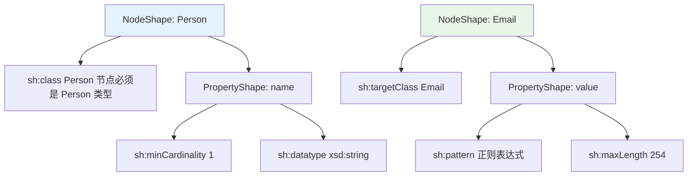

# 第 14 章 SHACL 数据验证概述

> **本章要点**：掌握 SHACL（Shapes Constraint Language）的核心概念——Shape、PropertyShape、NodeShape 和 Constraint，理解它作为 RDF 数据验证语言的定位以及与 OWL 2 推理的互补关系。

---

## 🔗 前置知识

在继续学习本章之前，建议读者至少了解：

- [第 4 章：RDF 数据模型](../ch04-rdf-data-model/index.md) — RDF 三元组、资源和节点
- [第 6 章：RDFS 核心](../ch06-rdfs-core/index.md) 与 [第 7 章：SKOS 词汇表](../ch07-skos-vocabulary/index.md) — RDFS 和 SKOS 词汇定义

---

## 1. 本章概述

SHACL（Shapes Constraint Language）是 W3C 推荐用于**验证 RDF 图数据**是否符合特定约束规范的标准语言，类似于关系数据库中的约束定义，但针对图数据进行了专门优化。

### 1.1 什么是 SHACL

SHACL 提供了一套完整的机制来描述 RDF 数据的**形状（Shape）**和这些形状应满足的**约束（Constraint）**：

| 核心概念 | 说明 | OWL 对应 |
|----------|------|---------|
| **Shape** | 形状定义：描述资源应满足的属性和值约束条件 | 类（owl:Class）的约束 |
| **NodeShape** | 节点形状：针对 RDF 图的任意节点进行整体验证 | owl:Class + 组合约束 |
| **PropertyShape** | 属性形状：针对特定属性的所有值进行验证 | 属性限制（owl:someValuesFrom 等） |
| **Target** | 目标声明：指定形状应用于哪些节点 | 类型关联（rdf:type） |
| **Constraint** | 约束条件：具体的值范围、类型、数量等条件声明 | owl:Restriction 的具体化 |

### 1.2 为什么需要 SHACL

OWL 2 擅长**语义推理**（classification、consistency checking），但在**数据验证**方面有诸多限制。SHACL 正好填补这些空白：

| 验证需求 | OWL 2 支持 | SHACL 支持 |
|----------|-----------|-----------|
| 邮箱格式符合 RFC 5322 | 不支持 | ✅ `sh:pattern` 正则表达式 |
| 姓名字段长度 2-100 | 不支持 | ✅ `sh:minLength/sh:maxLength` |
| 年龄范围 0-150 | 不支持 | ✅ `sh:minInclusive/sh:maxInclusive` |
| 禁止特定组合属性 | 支持有限 | ✅ `sh:and/sh:or/sh:not` |
| 跨节点验证 | 不可行 | ✅ `sh:hasValue` + 路径组合 |
| 自定义验证消息 | 不可行 | ✅ `sh:message` |

> **关键理解**：OWL 2 和 SHACL 是互补的。OWL 2 关注**语义和推理**，SHACL 关注**数据验证**。

### 1.3 核心概念速览

---

## 2. 章节导航

| 节 | 内容 | 链接 |
|----|------|------|
| 14.1 | SHACL 简介 | [`01-shacl-introduction.md`](01-shacl-introduction.md) |
| 14.2 | 形状定义详解 | [`02-shape-definition.md`](02-shape-definition.md) |
| 14.3 | 复杂约束规则 | [`03-complex-rules.md`](03-complex-rules.md) |
| 14.4 | Protégé + Jena 验证练习 | [`04-protoge-jena-exercise.md`](04-protoge-jena-exercise.md) |

---

## 3. 继续阅读

学习完本章后，可继续探索：

- [第 15 章：推理一致性检查](../ch15-reasoning-consistency/index.md) — 理解 OWL 推理器的使用场景
- [第 16 章：开发生命周期](../ch16-development-lifecycle/index.md) — 掌握本体的工程化开发流程

---

## 4. 本章小结

| 概念 | 说明 |
|------|------|
| SHACL | W3C 推荐的 RDF 图形状约束验证语言 |
| Shape | 定义资源应满足的约束条件的声明单元 |
| NodeShape | 针对特定节点的完整形状验证 |
| PropertyShape | 针对特定属性的值进行验证 |
| Constraint | 具体的验证条件（基数、类型、范围、模式等） |
| OWL vs SHACL | OWL 负责语义推理，SHACL 负责数据验证 |