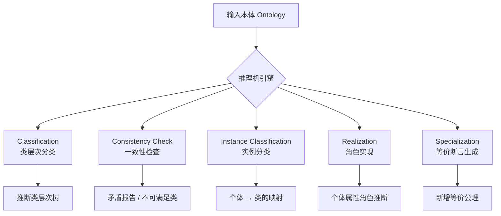
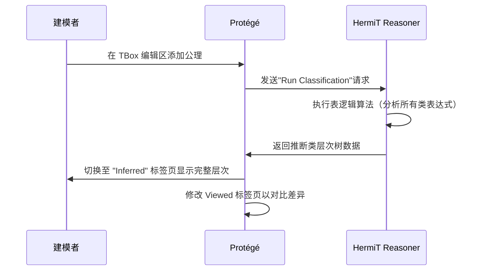
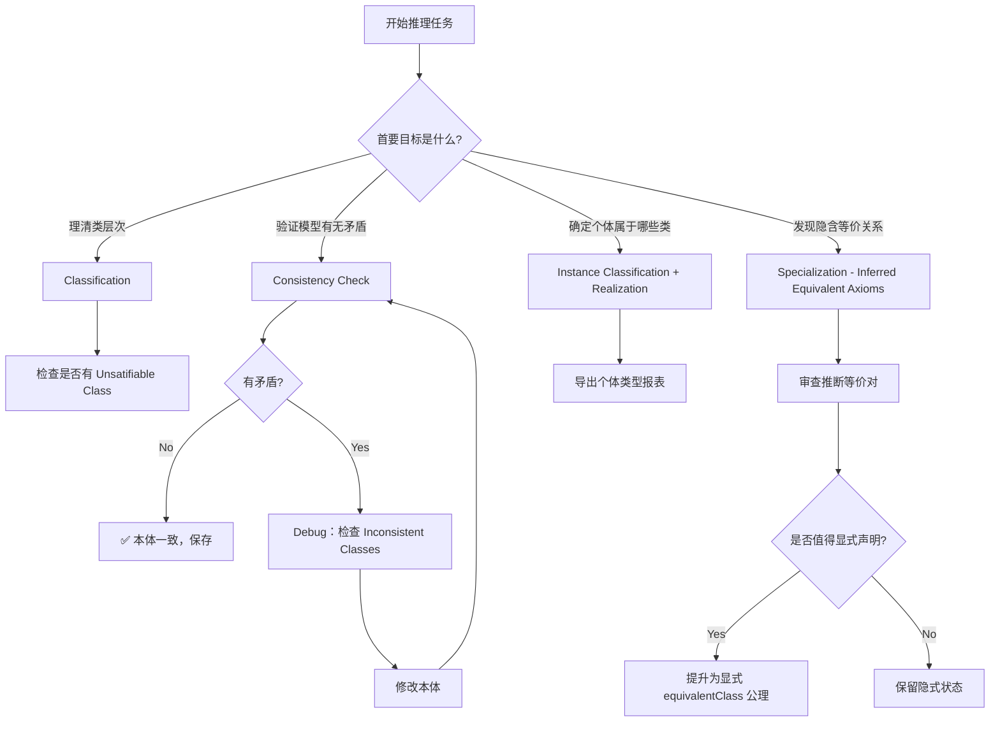

# 15.3 推理任务详解

> **本节要点**：全面掌握五大核心推理任务（Classification、Instance Classification、Consistency Checking、Realization、Specialization）的原理、操作流程、Protégé 中的实现方法与输出结果解读。

---

## 1. 推理任务总览

推理机在执行时会进行一系列结构化的推理操作。每一项任务针对本体的不同层面提供分析。下图展示了推理任务的逻辑关系：



---

## 2. Classification（类分类）

**Classification（类分类）** 是推理机最核心的任务，指基于本体 TBox 中的所有公理（子类、等价类、不相交等），自动推导出完整的**类层次结构树（Class Hierarchy Tree）**。

### 2.1 工作原理

```
输入 TBox → 推理机（表逻辑算法 / CRep） → 输出 Inferred Class Hierarchy
```

推理机执行 classification 的核心逻辑：

```
for each class C in ontology:
    superClasses = empty
    for each class D in ontology (D ≠ C):
        if (ontology ⊧ C subClassOf D):
            superClasses.add(D)
    
    if (subClassOf_axioms + other_constraints ⊧ ⊥):
        mark C as Unsatisfiable
    else:
        mark C as Satisfiable
```

### 2.2 输入输出示例

**输入（仅部分显式声明的子类关系）**：

```turtle
@prefix : <http://example.org/animal-ontology#> .
@prefix owl: <http://www.w3.org/2002/07/owl#> .
@prefix rdfs: <http://www.w3.org/2000/01/rdf-schema#> .

:Animal a owl:Class .
:Mammal a owl:Class .
:Bird a owl:Class .
:Carnivore a owl:Class .
:Feline owl:equivalentClass ( :Carnivore [ owl:onProperty :hasPaws ; owl:someValuesFrom owl:Thing ] ) .
:Carnivore rdfs:subClassOf :Mammal .
:Mammal rdfs:subClassOf :Animal .
:Bird rdfs:subClassOf :Animal .
:Mammal owl:disjointWith :Bird .
```

**Classification 后的推断结果（Inferred Class Hierarchy）**：

```
☑ :Animal
 ├── ☑ :Mammal
 │    ├── ☑ :Carnivore
 │    │    └── ☑ :Feline  ← 推导出的子类和父类关系！
 │    │
 │    └── ? :Lion  (实例分类)
 │
 └── ☑ :Bird
      └── ? :Eagle  (实例分类)
```

> **关键洞察**：`Feline` 的定义中使用了 `owl:equivalentClass`，推理机会发现满足 `:Carnivore AND (hasPaws some Thing)` 的个体一定属于 `Feline` 类。因此 `Feline` 自动成为 `Carnivore` 的子类、`Mammal` 的孙子类、`Animal` 的曾孙类。这些关系不需要建模者手动添加。

### 2.3 Protégé 中的 Classification 流程



---

## 3. Instance Classification（实例分类）

**Instance Classification（实例分类）** 是 Classification 在 ABox（断言盒子）层面的延伸：推理机根据个体的属性断言和 TBox 定义，判断每个个体隐式属于哪些类——包括建模者未显式声明的类。

### 3.1 原理

```
输入（TBox + ABox 断言） → 推理机 → 输出：{个体 → 类型映射}
```

对于每个个体 $i$ 和每个类 $C$，如果 $ontology \models i : C$，则返回该映射。

### 3.2 经典示例

```turtle
# === TBox：定义 "AdultEmployee" 的等价概念 ===
:Employee a owl:Class .
:Person a owl:Class .
:Adult owl:equivalentClass ( :Person [ owl:onProperty :hasAge ; owl:minQualifiedCardinality 18 owl:qualifiedCardinality xsd:integer ] ) .
:AdultEmployee owl:equivalentClass ( :Employee owl:intersectionOf ( :Adult ) ) .

# === ABox：个体事实断言 ===
:alice a :Person ;
    :hasAge 30^^xsd:integer .

:bob a :Employee .
:charlie a :Employee , :Person ;
    :hasAge 17^^xsd:integer .
```

**推理结果表**：

| 个体 | 显式类型（Viewed） | 隐式推断类型（Inferred） | 推理路径 |
|------|-------------------|------------------------|---------|
| `:alice` | `:Person` | `:Person`, `:Adult` | `:alice` → `:hasAge 30` → 30 ≥ 18 → 属于 `:Adult` |
| `:bob` | `:Employee` | `:Employee` | 没有 `hasAge` 断言 → 无法推断为 `:Adult` |
| `:charlie` | `:Employee`, `:Person` | `:Employee`, `:Person`, `:NotAdult` | `hasAge 17` < 18 → 不满足 `:Adult` |

### 3.3 Protégé 中的应用

在 Protégé 的 `Individuals` 面板中，选择 `Viewed` / `Inferred` 标签页对比：

```
# Viewed 标签页
:charlie 的类型: :Employee, :Person

# ═══════════════════════════════════════════
# Inferred 标签页（多出了隐式类型！）
# ═══════════════════════════════════════════
:charlie 的类型: :Employee, :Person, :AdultEmployee?（NO! Age 17）
                    :NotAdultEmployee ← 推导出的否定类型（不相交）
```

---

## 4. Consistency Checking（一致性检查）

**Consistency Checking（一致性检查）** 验证本体在给定 TBox 和 ABox 约束下是否存在**逻辑矛盾**（Logical Contradiction）。这是本体建模中最重要的质量检查工具。

### 4.1 矛盾来源

| 矛盾类型 | OWL 断言 | 示例 |
|----------|----------|------|
| 不相交类矛盾 | `owl:disjointWith` | 同一人同时是 `:Male` 和 `:Female` |
| 枚举不相等 | `owl:different` | `owl:sameAs` 与 `owl:different` 冲突 |
| 基数约束违反 | `minCardinality` / `maxCardinality` | 声明 maxCount:1 但有两个值 |
| 类等价冲突 | `owl:equivalentClass` + `owl:complementOf` | 类同时是自补类（Self-complementary） |
| 属性特征冲突 | `owl:TransitiveProperty` 与事实 | 传递性导致自反矛盾 |

### 4.2 矛盾检测流程

```turtle
# 一个含矛盾的movie 本体片段

:Actor owl:equivalentClass ( :Person [ owl:onProperty :hasAward ; owl:someValuesFrom :Award ] ) .
:Person owl:disjointWith :Film .

# ABox
:marlonBrando a :Actor , :Film ;    ← ← 矛盾！:Actor 隐式为 :Person
    :hasAward :Oscar .
```

分析：
1. 从 `:marlonBrando a :Actor` 和等价定义 → 推理得到 `:marlonBrando a :Person`
2. `:Person owl:disjointWith :Film` → `:Person` 与 `:Film` 无交集
3. `:marlonBrando a :Film` → 矛盾！同一个人不能既是 `:Person` 又是 `:Film`

**推理机输出**：

| 项目 | 值 |
|------|-----|
| 本体一致性 | **INCONSISTENT** ❌ |
| 不可满足类 | `owl:Thing`（若本体完全矛盾则 `owl:Thing` 不可满足，意味着所有类为空） |
| 矛盾个体 | `:marlonBrando` |
| 矛盾原因 | `:Person` 与 `:Film` 的不相交约束被打破 |

### 4.3 Protégé 中的 Consistency Check 流程

```mermaid
flowchart LR
    A[修改 ABox 数据<br/>导入/添加个体断言] --> B[Reasoner Panel<br/>确保 Reasoner 已启动]
    B --> C[点击 "Check Consistency"]
    C --> D{Is Consistent?}
    D --> |"Yes ✅"| E[输出: "Ontology is consistent"]
    D --> |"No ❌"| F[显示矛盾详情面板<br/>列出矛盾个体和路径]
    F --> G[查看 "Inconsistent Classes" Tab]
    G --> H[修复 ABox 或 TBox 公理]
```

### 4.4 修复矛盾的调试策略

当推理机报告矛盾时，按以下策略逐一排除：

| 步骤 | 操作 | 目标 |
|------|------|------|
| ① | 运行 `Get Inconsistent Classes` | 找出被标记为不可满足的类 |
| ② | 对每个不可满足类执行 `Get Individuals`（分显式和推断两类） | 查看是哪条事实引发矛盾 |
| ③ | 检查 `owl:sameAs` 与 `owl:different` 的组合 | 确认个体标识是否正确 |
| ④ | 审查 `owl:equivalentClass` + `disjointWith` 组合断言 | 确认建模意图是否准确 |
| ⑤ | 逐段移除可疑 TBox 公理，重新推理 | 通过二分法（Binary Search）定位元凶公理 |
| ⑥ | 修复后保存并重新运行 `Check Consistency` | 确认矛盾已消除 |

---

## 5. Realization（角色实现）

**Realization（角色实现）** 判断每个个体（Individual）在类型维度上属于哪些类（包括隐式类）。在 OWL 推理语境中，"角色实现" 指确定个体扮演的 **类型角色（Type Roles）**。

它和 Instance Classification 的区别在于：
- **Instance Classification** 关注"个体属于哪些**正类**"
- **Realization** 同时关注正类 **和** 负类（`owl:complementOf`）

### 5.1 工作流程

```
输入（ABox 事实 + TBox 类型定义） → 推理机 → {个体 → {正类集合, 负类集合}}
```

**示例**：

```turtle
:FullTimeEmployee owl:equivalentClass (
    :Employee owl:intersectionOf (
        [ owl:onProperty :hasWeeklyHours ; owl:someValuesFrom xsd:integer ; owl:onDataRange xsd:integer ]
        [ owl:onProperty :hasWeeklyHours ; owl:onDataRange xsd:integer ; owl:hasValue 40 ]
    )
) .
:PartTimeEmployee owl:equivalentClass ( :Employee owl:complementOf :FullTimeEmployee ) .
```

ABox：
```turtle
:alice a :Employee ;
    :hasWeeklyHours 40^^xsd:integer .

:bob a :Employee ;
    :hasWeeklyHours 20^^xsd:integer .
```

**Realization 输出**：

| 个体 | 正类类型（Positive Realization） | 负类类型（Negative Realization） |
|------|--------------------------------|--------------------------------|
| `:alice` | `:Employee`, `:FullTimeEmployee` | `:PartTimeEmployee` |
| `:bob` | `:Employee`, `:PartTimeEmployee` | `:FullTimeEmployee` |

### 5.2 应用场景

Realization 在以下场景特别有用：
- **医疗诊断**：患者实例的 `:Symptom` 和 `:Condition` 推断
- **产品配置**：产品个体满足哪些规格配置组合
- **智能分类**：自动给 ABox 个体打上正确的业务类别标签

---

## 6. Specialization（特化 / 等价断言）

**Specialization** 是一个较少被提及但极其实用的推理任务，指的是：推理机基于类表达式的逻辑等价变换，生成或识别类之间的**隐含等价断言**。

### 6.1 原理

当 ABox 中某类的所有个体都被发现具有完全相同的属性特征和类归属时，推理机可以判定这两个类等价，进而可以**提议**建模者添加 `owl:equivalentClass` 公理，以显式化隐式知识。

```
输入:
:C1 a owl:Class .
:C2 a owl:Class .
:C2 rdfs:subClassOf :C1 .
:C3 owl:equivalentClass (:C1 owl:intersectionOf (:C2 :C4)) .

ABox facts：
x a :C3 .
→ 推理：x :C1 且 x :C2 且 x :C4
```

### 6.2 Protégé 中的等价发现

在 Protégé 的 `Inferred Axioms` 面板中，切换到 `Class Axioms`：

```
[+] Equivalent Classes (inferred by reasoner)
   1. :Mammal EquivalentTo :Animal AND hasWarmBlooded some True
   2. :Feline EquivalentTo :Carnivore AND hasPaws some Owl:Thing
```

### 6.3 输出表示

Specialization 的输出通常被整合到 Protégé 的 **Inferred Tab** 和 `Equivalent to` 面板中。建模者可以选择性地将推断等价关系提升为显式 TBox 公理：

```turtle
# 由 Specialization 推导后的建议——建模者可手动确认添加
:Carnivore owl:equivalentClass (
    :Mammal owl:intersectionOf (
        [ owl:onProperty :hasDiet ; owl:someValuesFrom :MeatEater ]
    )
) .
```

---

## 7. 五大推理任务对照总表

| 任务名 | 操作范围 | 输入 | 输出 | Protégé 面板位置 |
|--------|---------|------|------|----------------|
| **Classification** | TBox 层面 | TBox 公理 | 推断类层次树 | Inferred → Classes |
| **Instance Classification** | ABox 层面 | TBox + ABox | 个体 → 正类映射 | Inferred → Individuals |
| **Consistency Checking** | 全本体 | TBox + ABox | 矛盾报告 + 不可满足类 | Inconsistent Classes, Reasoner Log |
| **Realization** | ABox 层面 | TBox + ABox | 个体 → {正类, 负类} | Inferred Individuals → Classes (positive & negative) |
| **Specialization** | TBox/ABox | TBox + ABox | 隐含等价断言 | Inferred Axioms → Equivalent Classes |

---

## 8. 推理任务决策流程图

当需要执行推理时，建议按以下流程选择任务：



---

## 9. 本章小结

本节详细介绍了 OWL 2 推理机的五大核心推理任务：

1. **Classification**：推导出完整类层次树，是其他所有推理任务的基础前提
2. **Instance Classification**：判断个体属于哪些类，连接 TBox 定义和 ABox 事实
3. **Consistency Checking**：检测逻辑矛盾，保障本体的语义正确性
4. **Realization**：在实例分类基础之上，同时输出正类和负类类型
5. **Specialization**：生成隐含的等价断言，支持模型的显式化和优化

下节将进入**动手实践环节**，使用电影本体（Movie Ontology）在 Protégé 中运行 HermiT 和 Pellet 推理机，完成完整推理链路、Debug 矛盾场景，以及对比 ELK vs HermiT 性能差异。