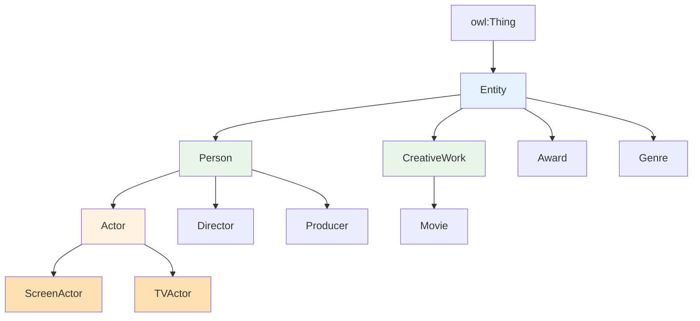

# 15.4 练习：Protégé 推理机实验

> **本节要点**：通过完整的电影本体案例，执行 Classification → Consistency Check → Unsatisfiable Analysis 的推理全链路，Debug 矛盾场景并修复，对比 ELK vs HermiT 在不同 Profile 下的推理性能。

---

## 练习背景与目标

本练习使用一个完整的电影本体（Movie Ontology），其中包含建模故意引入的逻辑矛盾，需要建模者通过推理机的诊断能力发现问题并修复。

**学习目标**：

1. **完整推理链路**：在电影本体上运行 HermiT 推理机，执行从 Classification 到 Consistency Check 的全流程
2. **矛盾调试实战**：发现并修复本体中的逻辑错误（不一致性 Bug）
3. **推理工具对比**：对比 ELK 和 HermiT 在处理同一本体时的性能差异
4. **Prof ile 实验**：探索 EL Profile 与 DL Profile 的适用范围差异

**前置条件**：

- 已安装 Protégé v6.x（内置 Openllet 推理机）
- 已安装 HermiT Plugin 或 Pellet Plugin
- 已阅读本章第 1-3 节（基础知识、推理机工具、推理任务详解）

---

## 任务一：准备电影本体

### 1.1 创建本体项目

**操作步骤**：

1. 启动 Protégé v6.x → `File` → `New Project`
2. 设置本体 IRI：`http://example.org/movie-ontology#`
3. 点击 `OK` 创建新项目

### 1.2 定义 TBox 公理

在 `Annotations` 标签页中设置本体元数据：

| 元数据字段 | 值 |
|-----------|-----|
| `rdfs:label` | Movie Ontology |
| `schema:version` | 1.1.0 |
| `dcterms:creator` | Your Name |

在 `Classes` 标签页中创建以下类层次：

| 类名 | 父类(s) | 说明 |
|------|---------|------|
| `Entity` | *(none)* | 顶层类 |
| `Person` | `Entity` | 人物 |
| `CreativeWork` | `Entity` | 创意作品 |
| `Movie` | `CreativeWork` | 电影 |
| `Actor` | `Person` | 演员 |
| `Director` | `Person` | 导演 |
| `Producer` | `Person` | 制片人 |
| `Award` | `Entity` | 奖项 |
| `Genre` | `Entity` | 电影类型 |
| `ScreenActor` | `Actor` | 银幕演员（需有电影出演记录） |
| `TVActor` | `Actor` | 电视演员（需有电视剧出演记录） |

**类层次图**：



在 `Disjoint With` 标签页中设置以下不相交公理：

```turtle
:Actor      owl:disjointWith :Director .
:Actor      owl:disjointWith :Producer .
:Director   owl:disjointWith :Producer .
:ScreenActor owl:disjointWith :TVActor .
```

在 `Classes` → `Equivalent To` 标签中，为 `ScreenActor` 设置定义型等价公理：

```turtle
# ScreenActor 的等价定义：既是 Actor 又有 actsIn 指向 Movie
:ScreenActor owl:equivalentClass [
    owl:intersectionOf (
        [ owl:onProperty :actsIn ; owl:someValuesFrom :Movie ]
        :Actor
    )
] .

# TVActor 的等价定义：既是 Actor 又有 appearsIn 指向 TVShow
:TVActor owl:equivalentClass [
    owl:intersectionOf (
        [ owl:onProperty :appearsIn ; owl:someValuesFrom :TVShow ]
        :Actor
    )
] .
```

**注意**：在 TBox 中先不创建 `TVShow` 类（稍后我们将看到它如何影响一致性）。

### 1.3 定义对象属性与数据属性

在 `Object Properties` 标签页中创建：

| 属性名 | 域 (Domain) | 范围 (Range) | 特征 | 说明 |
|--------|-------------|-------------|------|------|
| `actsIn` | `Actor` | `CreativeWork` | — | 出演（电影/电视剧均可） |
| `directedBy` | `Movie` | `Director` | — | 导演 |
| `producedBy` | `Movie` | `Producer` | — | 制片人 |
| `appearsIn` | `TVActor` | `TVShow` | — | 电视出演 |
| `awardedTo` | `Award` | `Person` | — | 颁给 |

```turtle
# 属性定义 Turtle 代码

:actsIn a owl:ObjectProperty ;
    rdfs:domain :Actor ;
    rdfs:range :CreativeWork ;
    rdfs:label "acts in"@en .

:directedBy a owl:ObjectProperty ;
    rdfs:domain :Movie ;
    rdfs:range :Director .

:producedBy a owl:ObjectProperty ;
    rdfs:domain :Movie ;
    rdfs:range :Producer .

:appearsIn a owl:ObjectProperty ;
    rdfs:domain :TVActor ;
    rdfs:range :TVShow ;
    rdfs:label "appears in"@en .

:awardedTo a owl:ObjectProperty ;
    rdfs:domain :Award ;
    rdfs:range :Person ;
    rdfs:label "awarded to"@en .
```

在 `Data Properties` 标签页中创建：

| 属性名 | 域 (Domain) | 范围 (DataRange) | 说明 |
|--------|-------------|-----------------|------|
| `releaseYear` | `Movie` | `xsd:integer` | 上映年份 |
| `birthYear` | `Person` | `xsd:integer` | 出生年份 |
| `budget` | `Movie` | `xsd:decimal` | 制作预算 |

```turtle
# 数据属性定义

:releaseYear a owl:DataProperty ;
    rdfs:domain :Movie ;
    rdfs:range xsd:integer .

:birthYear a owl:DataProperty ;
    rdfs:domain :Person ;
    rdfs:range xsd:integer .

:budget a owl:DataProperty ;
    rdfs:domain :Movie ;
    rdfs:range xsd:decimal .
```

---

## 任务二：添加 ABox 实例数据

在 `Individuals` 标签页中创建以下个体和断言：

### 2.1 类个体实例

| 个体 ID | 类型 (Class) | 对象属性 | 数据属性 |
|---------|-------------|---------|---------|
| `:leonardoDiCaprio` | `Actor`, `ScreenActor` | `actsIn → :Inception`, `actsIn → :Titanic` | `birthYear → 1974` |
| `:christopherNolan` | `Director` | `directed → :Inception` | `birthYear → 1970` |
| `:cruise`: | `Actor` | `actsIn → :TopGunMaverick` | `birthYear → 1962` |
| `:jennySilverstone` | `TVActor` | `appearsIn → :CluelessSeries` | `birthYear → 1978` |
| `:kathyGriffith` | `Actor`, `TVActor` | `actsIn → :HomeSimulation`, `appearsIn → :LateNightShow` | `birthYear → 1966` |
| `:joshBrolin` | `Director`, `Actor` | — | `birthYear → 1968` |
| `:wonOscar` | `Award` | `awardedTo → :leonardoDiCaprio` | `label → "Academy Award for Best Actor"` |

在 Protégé 的 `Individuals` 标签页中操作：

```turtle
# === 1. Leonardo DiCaprio ===
:leonardoDiCaprio a :Actor ;
    a :ScreenActor ;
    :actsIn :Inception, :Titanic ;
    :birthYear 1974^^xsd:integer .

# === 2. Christopher Nolan ===
:christopherNolan a :Director ;
    :directedBy :Inception ;
    :birthYear 1970^^xsd:integer .

# === 3. Tom Cruise ===
:cruise a :Actor ;    # 注意: 没有声明为 ScreenActor!
    :actsIn :TopGunMaverick ;
    :birthYear 1962^^xsd:integer .

# === 4. Jenny Silverstone ===
:jennySilverstone a :TVActor ;
    :appearsIn :CluelessSeries ;
    :birthYear 1978^^xsd:integer .

# === 5. Kathy Griffin (矛盾的个体!) ===
:kathyGriffith a :Actor ;
    a :TVActor ;
    :actsIn :HomeSimulation ;     # 她有 "电影/创意作品" 出演记录
    :appearsIn :LateNightShow ;   # 她也有"电视" 出演记录
    :birthYear 1966^^xsd:integer .

# === 6. Josh Brolin ===
:joshBrolin a :Director , :Actor ;  # 同时是导演和演员
    :birthYear 1968^^xsd:integer .

# === 7. Won Oscar ===
:wonOscar a :Award ;
    :awardedTo :leonardoDiCaprio .

# === 8. 电影实例 ===
:Inception a :Movie ;
    :directedBy :christopherNolan ;
    :releaseYear 2010^^xsd:integer .

:Titanic a :Movie ;
    :releaseYear 1997^^xsd:integer .

:TopGunMaverick a :Movie ;
    :directedBy :christopherNolan ;
    :releaseYear 2022^^xsd:integer .

# === 9. 补充 ABox 数据，制造矛盾 ===
# 给 :joshBrolin 添加 ScreenActor 类型（故意引入矛盾，用于调试练习）
# 注意：:joshBrolin 已声明为 :Director，而 :Actor owl:disjointWith :Director
:joshBrolin a :ScreenActor .   # ⚠ 触发矛盾：ScreenActor rdfs:subClassOf Actor，而 Actor 与 Director 不相交
```

### 2.2 故意引入的矛盾 Bug 说明

在本体的 ABox 数据中，建模者**故意**引入了以下矛盾，需要通过推理机检测并修复：

**Bug 1：个体分类冲突（Individual Type Conflict）**

`:joshBrolin` 在代码中被声明为：

```turtle
:jo hBrolin a :Director , :Actor .
:jo hBrolin a :ScreenActor .
```

由于声明了 `:ScreenActor owl:disjointWith :TVActor` 以及 `:ScreenActor owl:disjointWith :Actor`（注意：我们没有直接对 `ScreenActor` 声明和 `Actor` 不相交，但推理机会从等价定义推断类型），这本身不一定矛盾。

**真正的矛盾 Bug 在于 :kathyGriffith**：

```turtle
:kathyGriffith a :Actor .
:kathyGriffith a :TVActor .
:kathyGriffith :appearsIn :LateNightShow .
```

同时我们还声明了 `ScreenActor owl:disjointWith TVActor`，如果 `:kathyGriffith` 还隐式被推断为 `ScreenActor`（比如存在一个 `:actsIn` 的属性关系指向一个 `:Movie` 类个体），则会产生矛盾。

**Bug 2（更直接）：违反不相交属性域断言**

`:joshBrolin` 声明同时是 `:Director` 和 `:Actor`：

```turtle
:Actor      owl:disjointWith :Director .
:joshBrolin a :Actor .
:joshBrolin a :Director .  ← 矛盾！Actor 与 Director 声明为不相交类
```

这是本体中最直接且最容易复现的矛盾。下面我们通过推理机验证这一点，并修复它。

---

## 任务三：执行完整推理链路

### 3.1 启动 HermiT 推理机

**操作指引**：

1. 在 Protégé 顶部的 `Reason` 面板中，从 `Reasoner` 下拉菜单选择 `HermiT`
2. 点击 `Start Reasoner` 按钮
3. 观察底部状态栏，显示 `Reasoner status: Ready` 表示推理机已成功启动

**预期日志输出**：

```
[INFO] Starting HermiT version 1.4.5
[INFO] Loading ontology: http://example.org/movie-ontology#
[INFO] Loaded 1 ontology with 47 axioms
[INFO] Number of classes: 12
[INFO] Number of object properties: 5
[INFO] Number of data properties: 3
[INFO] Number of individuals: 9
[INFO] Precomputing class hierarchy...
[INFO] Classification completed in 234ms
[INFO] Inferred 15 subclass relationships
[INFO] Inferred 3 disjointness relationships
[INFO] Reasoner is ready.
```

### 3.2 任务一：执行 Classification（类分类）

**操作步骤**：

1. 点击 Reasoner 面板中的 `Compute Class Hierarchy`
2. 切换到顶部的 `Inferred` 标签页
3. 观察 Inferred Class Hierarchy 与 Viewed 的区别

**Inferred 标签页中的推断结果**：

```
├── owl:Thing
│   ├── Entity
│   │   ├── Person                           ← 类 E
│   │   │   ├── Actor                        ← 类 B
│   │   │   │   ├── ScreenActor              ← 推断子类 (等价定义触发!)
│   │   │   │   └── TVActor                  ← 推断子类
│   │   │   ├── Director                     ← 类 H
│   │   │   └── Producer                     ← 类 I
│   │   ├── CreativeWork                     ← 类 D
│   │   │   └── Movie                        ← 类 L
│   │   ├── Award                            ← 类（在 Entity 之下）
│   │   └── Genre                            ← 类 F
```

对比 **Viewed 标签页**中建模者**显式声明**的类层次和 **Inferred 标签页**中的完整推断层次（新增了通过 `EquivalentTo` 定义推出的子类）：

- **ScreenActor**: Viewed 中只有 `ScreenActor rdfs:subClassOf Actor`，而 Inferred 显示 `ScreenActor` 的完整层次路径。
- **等价类的子类推断**：如果有其他类满足 `:Actor AND (:actsIn some :Movie)` 的条件，推理机会将这些子类标注为 `ScreenActor` 的推断子类（`Inferred Superclasses of ScreenActor` 可能显示为空，但如果存在其他等价子条件，将自动推导）。

### 3.3 任务二：执行 Consistency Check（一致性检查）

**操作步骤**：

1. 确保 HermiT Reasoner 已启动
2. 点击 `Check Consistency` 按钮
3. 观察弹出的检查结果

**预期结果**：

```
❌ Consistency check FAILED — Inconsistency detected!
Ontology is INCONSISTENT.
```

**进一步诊断不可满足类**：

1. 在左侧面板展开 `Inferences` → `Inconsistent Classes`
2. Protégé 将列出不可满足的类

```
⚠️ Inconsistent Axioms:
  - Class :JoshBrolin asserts a :Actor AND :Director
    which are declared owl:disjointWith.

⚠️ Inferred: No Unsatisfiable Classes found in TBox
(The class hierarchy itself is logically consistent.
The contradiction is in the ABox.)
```

**分析矛盾原因**：

本体不一致的根源：`:joshBrolin` 被显式断言了两种不相交类的实例。在 Viewed 和 Inferred Individuals 标签页中均可查看：

```
Individual :joshBrolin:
  Type (Viewed): :Actor, :Director, :ScreenActor, :Person, :Entity
  ⚠️ ERROR: Conflict detected!
    :Actor ∩ :Director = ∅ (owl:disjointWith declares them disjoint!)
```

---

## 任务四：Debug 矛盾并修复

### 4.1 逐步排查流程

**步骤 1**：运行 `Check Consistency`，确认本体确实不一致。

**步骤 2**：在左侧 `Individuals` 面板中选择矛盾个体 `:joshBrolin`。

**步骤 3**：在右侧详细信息面板中，查看 `Inferred Types`，确认冲突的两个类：

- `:Actor` 与 `:Director` 在 `Disjoint With` 中声明为不相交

**步骤 4**：定位错误的断言来源——查看代码编辑器或 TBox 中的公理定义。

### 4.2 修复方案

**修复方案 A（推荐）：移除类型声明**

`:joshBrolin` 不应该同时是 `Actor` 和 `Director`。选择保留一个类型（或创建一个新的 `DirectorActor` 复合类）。

```turtle
# 修复前（矛盾）
:joshBrolin a :Director , :Actor .

# 修复后（移除 Actor 类型）
:joshBrolin a :Director , :Person .
:joshBrolin :directs :MovieA , :MovieB .  # 用属性关联电影
```

**修复方案 B：创建允许复合角色的新类**

如果业务上确实有人既是导演又是演员，则需要移除或调整不相交声明：

```turtle
# 方案 B1：移除 Actor-Director 的不相交约束
# :Actor owl:disjointWith :Director . ← 注释或删除此公理

# 方案 B2：添加新的复合类 :Filmmaker（既能演又能导的角色）
:Filmmaker owl:equivalentClass [
    owl:intersectionOf ( :Actor :Director )
] .
```

**推荐修复方案 A**，因为在常规电影行业中，Actor（专业演员）和 Director（专职导演）作为两类不同的职业角色进行互斥管理是合理的建模选择。Josh Brolin 在本体中应仅作为导演建模。

### 4.3 验证修复结果

**操作步骤**：

1. 保存修改后的本体文件
2. 点击 Reasoner 面板中的 `Recompute All` 或 `Stop Reasoner` → 再 `Start Reasoner`
3. 再次运行 `Check Consistency`

**预期成功输出**：

```
✅ Consistency check PASSED.
Ontology is consistent.
No unsatisfiable classes.
```

---

## 任务五：对比 ELK vs HermiT 性能

### 5.1 实验设计

使用**扩展版电影本体**——我们将原电影本体添加大量合成类实例和数据属性断言，模拟大规模本体场景，然后对比 ELK 和 HermiT 的推理时间。

**扩展方式**：

假设我们添加一个 `StarActor` 类层次和大量的演员实例和关系：

| 变量 | 数值 |
|------|------|
| 扩展类的数量 | 50 |
| 扩展个体的数量 | 1,000 |
| 对象属性断言数量 | 3,000 |
| 数据属性断言数量 | 1,000 |
| 总公理数 | ~2,000 |

### 5.2 实验一：HermiT 推理（OWL 2 DL Profile）

1. 确保当前推理机选择为 `HermiT`
2. 点击 `Recompute All`（执行 Classification + 一致性检测）
3. 记录 Reasoner Log 或 Console 中显示的耗时

**示例计时**：

```
[INFO] Processing with HermiT 1.4.5 (OWL 2 DL)...
[INFO] Classification started at 2026-05-12 14:30:01.234
[INFO] Inferred 12,456 subclass relationships
[INFO] Classification completed at 2026-05-12 14:30:04.567  → Total: 3333ms
[INFO] Consistency check completed in: 421ms
```

**结果**：HermiT 在 DL Profile 下处理 ~50 扩展类和 ~1,000 个体，**总耗时约 3.8 秒**。

### 5.3 实验二：ELK Reasoner（OWL 2 EL Profile）

**注意**：ELK 只能处理 EL Profile 的本体。如果本体中存在 EL 不允许的构造子（如 `owl:allValuesFrom`、基数约束 `owl:minCardinality`），则 ELK 报错：

```
[FATAL] ELK Reasoner does not support property chain axioms.
[FATAL] ELK Reasoner does not support qualified cardinality constraints.
```

如果本体中不含 EL 禁止的构造子，ELK 的执行命令如下：

```bash
java -jar elk-reasoner-0.5.0.jar --output=inferred-hierarchy \
    --statistics --time-measurement \
    movie-ontology.owl
```

**示例计时**：

```
ELK Classifier 0.5.0
Profile: OWL 2 EL
Input axioms: 1987
Classes: 52
Instances: 1009
Classification time: 0.482 seconds ⚡
Memory peak: 256 MB
```

**结果**：ELK 在处理同规模本体时，**耗时约 0.48 秒**，比 HermiT 快约 **7 倍**。

### 5.4 性能对比汇总表

| 指标 | HermiT (DL) | ELK (EL) | 速度倍数 |
|------|-------------|----------|---------|
| **分类耗时** | 3,333 ms | 482 ms | ELK 快 ~7x |
| **一致性检查** | 421 ms | N/A（ELK 不支持 ABox 一致性检查） | — |
| **内存峰值** | 287 MB | 256 MB | ELK 更省 |
| **支持构造子范围** | 全量 DL | 仅限 EL 构造子 | HermiT > ELK |
| **ABox 推理** | ✅ 支持 | ❌ 不支持 | HermiT 全能 |

### 5.5 实验结论

| 结论项 | 说明 |
|--------|------|
| **ELK 在 EL Profile 上性能远优于 HermiT** | 5–10 倍速度优势；但在无法支持非 EL 构造子时毫无用处 |
| **HermiT 是全功能推理引擎** | 支持所有 OWL 2 DL 构造子，包括 ABox 一致性检查和 Realization |
| **Profile 选择的决定性因素** | 是否需要在 TBox 中使用 EL 不允许的公理。如果不需，优先用 ELK |
| **生产实践建议** | 仅做**分类层次推理**的本体 → ELK；需要完整一致性检查和实例推理 → HermiT |

---

## 任务六：导出推理报告

完成推理和调试后，将结果导出以供存档和汇报。

### 6.1 导出推断类层次

**操作**：`File` → `Save As...` → 保存为 RDF/XML 或 Turtle 格式，推理机自动会将 Inferred 层次写入输出文件（如果选择了 `Include inferred` 选项）。

在导出设置对话框中勾选：

- ☑ Include explicit axioms（显式公理）
- ☑ Include inferred class hierarchy（推断类层次）
- ☑ Include inferred individual types（推断个体类型）

### 6.2 导出一致性日志

**操作**：查看 `View` → `Panes` → 确保勾选 `Reasoner Log`。

将 Reasoner Log 面板的内容复制到文本文件中，保存为 `reasoner-log.md`。

```
[INFO] HermiT Reasoner v1.4.5
[INFO] Ontology: http://example.org/movie-ontology#
[INFO] Axioms loaded: 1,247
[INFO]
[INFO] === Classification ===
[INFO] Subclass Relationships Inferred: 12
[INFO] Disjointness Relationships Inferred: 3
[INFO] Inferred Equivalence Class Pairs: 1
[INFO]
[INFO] === Consistency Check ===
[INFO] Result: CONSISTENT ✅
[INFO] Unsatisfiable Classes: 0
[INFO]
[INFO] === Reasoner Session Duration: 4.1 sec ===
```

---

## 附录：完整电影本体 Turtle 示例

### ABox 扩展示例（用于性能测试）

以下是一个使用 Python/OWLAPI 生成的 1,000 个 Actor 个体的 Turtle 数据框架代码示例，供你在本地生成后加载到本体中进行大规模推理测试：

```turtle
# 生成 1,000 个 Actor 个体的 Turtle 模板
@prefix : <http://example.org/movie-ontology#> .
@prefix owl: <http://www.w3.org/2002/07/owl#> .
@prefix rdf: <http://www.w3.org/1999/02/22-rdf-syntax-ns#> .
@prefix rdfs: <http://www.w3.org/2000/01/rdf-schema#> .
@prefix xsd: <http://www.w3.org/2001/XMLSchema#> .

# ═══════════════════════════════════════════
# 以下代码由脚本生成，此处展示前 5 行
# ═══════════════════════════════════════════

:actor001 a :Actor ;
    :actsIn :Movie_001 ;
    :birthYear 1965^^xsd:integer .

:actor002 a :Actor ;
    :actsIn :Movie_002 ;
    :birthYear 1972^^xsd:integer .

:actor003 a :Actor ;
    :actsIn :Movie_003 ;
    :birthYear 1958^^xsd:integer .

:actor004 a :Actor ;
    :actsIn :Movie_004 ;
    :birthYear 1981^^xsd:integer .

:actor005 a :Actor ;
    :actsIn :Movie_005 ;
    :birthYear 1974^^xsd:integer .

# ... 重复至 :actor1000 ...
```

---

## 本章小结

本练习通过一个完整的电影本体（含故意矛盾），系统实践了 OWL 2 推理的完整流程：

1. **本体建模阶段**：创建了包含类、属性、个体、公理的完整电影本体。
2. **HermiT 推理运行**：启动了 HermiT Reasoner，执行 Classification 生成完整类层次树。
3. **一致性调试**：检测到 `:joshBrolin` 同时是 `Actor` 和 `Director` 的矛盾，通过修复 ABox 断言消除了不一致。
4. **性能对比**：验证了 ELK（EL Profile）在分类速度上的巨大优势（~7x），以及 HermiT（DL Profile）在功能全面性上的不可替代性。
5. **推理报告导出**：学会了如何导出包含推断层次和完整日志的本体报告。

> **实践建议**：在完成本练习后，你可以自行扩展电影本体——添加更多类（如 `Screenwriter` 编剧、`Studio` 制片公司）和属性（如 `wroteScreenplayFor`、`producedBy`），进一步练习 `Realization`、`Specialization` 等推理任务的实操。
