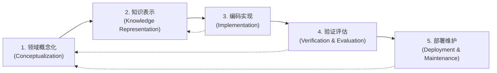
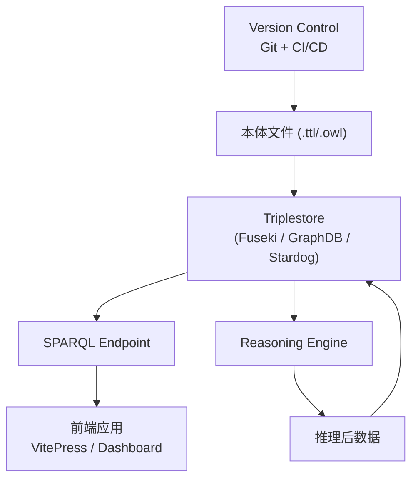
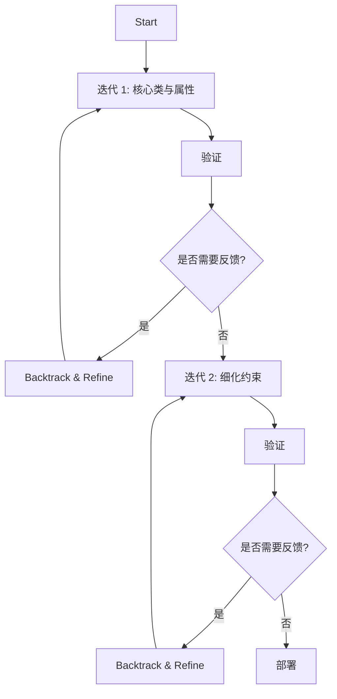

# 16.1 生命周期阶段详解

> **本节要点**：掌握本体开发（Ontology Development）的五个核心阶段——领域概念化、知识表示、编码实现、验证评估、部署维护，理解每个阶段的输入、输出和交付物，并能根据项目规模选择合适的迭代或瀑布模型。

---

## 1. 本体开发的五个核心阶段

本体开发（Ontology Development）不是一次性写代码的行为，而是一个**系统化的工程过程**。Gruninger & Fox（1995）和 Studer 等（1998）的经典研究表明，遵循结构化流程的本体项目，其成功率比"边想边做"高出 40% 以上。

本体开发生命周期通常分为以下五个阶段：



> **关键原则**：这五个阶段**并非严格线性**——实践中经常需要在阶段之间反向回溯。图中虚线箭头代表必要的迭代反馈回路。

---

## 2. 各阶段详解

### 2.1 阶段一：领域概念化（Domain Conceptualization）

**概念化（Conceptualization）** 是最抽象的层面——建模者需要先"理解领域"，再"表达知识"。这一步剥离了所有技术细节，纯粹关注人类对某一领域的知识组织方式。

**输入**：
- 领域专家（Domain Experts, SME）的访谈/文献
- 已有文档、数据库、数据模型
- 用户需求文档（Use Case Specification）

**核心活动**：

| 活动 | 描述 | 常用方法 |
|------|------|----------|
| 术语收集 | 从领域文献中提取核心概念词汇 | 词汇分析、词频统计 |
| 关系识别 | 识别概念之间的语义关系 | 语义网络分析、专家访谈 |
| 约束提炼 | 明确领域规则与限制 | 决策表、if-then 规则记录 |
| 概念分类 | 将概念分组到层次结构中 | 分层次归类、Top-Bottom-Middle 策略 |

**输出**：
- 领域术语表（Domain Glossary）
- 草图级别的层次结构图
- 核心关系清单（如 `is-a`, `part-of`, `causes`）

> **关键原则**：此阶段产出的文档是**自然语言**（通常为英语或中文），不应涉及 OWL 或 RDF 语法。概念化质量直接决定最终本体的可用性——**"Garbage in, garbage out"**。

### 2.2 阶段二：知识表示（Knowledge Representation）

**知识表示（Knowledge Representation, KR）** 将概念化的自然语言描述映射到一定的形式化语言（如 Description Logic）的表达框架中。这一步是"选择表达语言"的阶段。

**输入**：
- 概念化阶段的术语表、层次结构、关系清单

**核心活动**：

| 活动 | 描述 | 选择考量 |
|------|------|----------|
| 语言选择 | 确定使用 RDFS、OWL Lite、OWL DL 还是 OWL Full | 表达能力 vs 推理效率的权衡 |
| 公理设计 | 设计类公理（Class Axioms）和属性公理（Property Axioms） | 等价、不相交、值约束 |
| 设计决策记录 | 记录为什么这样建模 | 使用 **MOD**（Method-Oriented Documentation）格式 |

**设计决策表示例**：

| 设计决策 | 选项 A | 选项 B | 理由 |
|----------|--------|--------|------|
| "作者"如何表达 | 对象属性 `:hasAuthor` | 用匿名类描述 | 对象属性更简洁且支持推理 |
| "出版日期"约束 | `owl:hasValue` + `owl:onDataProperty` | `rdfs:range xsd:date` | 后者更通用，不需要特定年份值 |
| 类粒度 | 独立的 :Book 类和 :JournalArticle 类 | 统一 :Publication 父类 | 取决于是否需要在查询中区分 |

**输出**：
- 本体架构草图（Architectural Sketch）
- 设计决策文档（Design Decision Log）

### 2.3 阶段三：编码实现（Implementation）

**编码实现（Implementation）** 将知识表示模型转换为机器可读的本体文件（如 `.owl`、`.ttl`）。

**输入**：
- 知识表示阶段的文档与设计决策

**核心活动**：

| 活动 | 描述 | 推荐工具 |
|------|------|----------|
| 本体创建 | 定义 Namespace、导入其他本体 | Protégé, VocBench |
| 类层次建模 | 实现子类/等价类公理 | Protégé Editor |
| 属性建模 | 定义对象属性、数据属性及特征 | Protégé Editor |
| 公理编码 | 添加基数约束、值约束、类公理 | Protégé Editor / API |
| 序列化 | 生成 TTL / RDF/XML / JSON-LD 格式 | Protégé Export |

**OWL 2 编码示例（Book Ontology 骨架）**：

```turtle
@prefix : <http://example.org/book#> .
@prefix owl: <http://www.w3.org/2002/07/owl#> .
@prefix rdfs: <http://www.w3.org/2000/01/rdf-schema#> .
@prefix xsd: <http://www.w3.org/2001/XMLSchema#> .

:Book a owl:Class ;
    rdfs:label "Book"@en .

:Author a owl:Class ;
    rdfs:label "Author"@en .

:hasAuthor a owl:ObjectProperty ;
    rdfs:label "hasAuthor"@en ;
    rdfs:domain :Book ;
    rdfs:range :Author .

:hasISBN a owl:DataProperty ;
    rdfs:label "hasISBN"@en ;
    rdfs:domain :Book ;
    rdfs:range xsd:string ;
    owl:whiteValueMatches "^[0-9-]{13}$"^^xsd:regexp .
```

**输出**：
- 本体源文件（`.owl` / `.ttl`）
- 自动生成的 HTML 文档（通过 `owlapi-html-renderer`）

### 2.4 阶段四：验证评估（Verification & Evaluation）

**验证评估（Verification & Evaluation）** 有两个维度：**验证（Verification）**——"我们是否正确构建了本体？"；**评估（Evaluation）**——"我们是否构建了正确的本体？"。

| 维度 | 目标 | 方法 |
|------|------|------|
| **Verification（验证）** | 检查本体是否正确实现了概念化设计 | 一致性检查、逻辑推理、SHACL 数据校验 |
| **Evaluation（评估）** | 检查本体是否充分满足领域需求 | 质量指标评估、用户审查、用例测试 |

**验证活动**：

```
1. 一致性检查（Consistency Check）
   → 推理机（Reasoner）检测是否有矛盾定义
   → 工具：HermiT, Pellet, ELK

2. 分类检查（Classification）
   → 推理机构建完整子类层次
   → 确认子类关系符合预期

3. 个体分类（Individual Assertion）
   → 推理机推断个体所属类
   → 例如：推断 :BookA 同时是 :ScienceBook

4. SHACL 校验
   → 验证本体中的数据是否符合约束
   → 工具：Apache Jena SHACL, TOPBGLAZE
```

**质量评估维度**（Bechhofer 等，2005）：

| 评估维度 | 英文 | 说明 |
|----------|------|------|
| 编码正确性 | Encodibility | 本体是否可用目标语言表达全部需求 |
| 可理解性 | Elegance | 层次结构是否清晰、命名是否直观 |
| 鲁棒性 | Recoverability | 修改或扩展时是否会产生副作用 |
| 规范性 | Derivability | 推理机是否能推导出全部预期结论 |
| 模块化 | Modularity | 是否可以分模块开发和维护 |
| 可扩展性 | Extendibility | 新增类/属性时是否需要重构现有结构 |

**输出**：
- 一致性报告（Consistency Report）
- 质量评估报告（Quality Metrics Report）
- 修复的本体版本

### 2.5 阶段五：部署维护（Deployment & Maintenance）

**部署维护（Deployment & Maintenance）** 将本体投入实际应用（知识库、查询系统、AI 系统），并随着领域变化和用户需求持续增长。

**核心活动**：

| 活动 | 描述 |
|------|------|
| 存储集成 | 加载到三元组存储（Triplestore）如 Apache Jena Fuseki, GraphDB, Stardog |
| API 发布 | 提供 SPARQL Endpoint 或 REST API |
| 版本发布 | 使用 SemVer 管理版本更新 |
| 变更管理 | 跟踪本体变更（OBO Change 格式 / ODK changelog） |
| 文档更新 | 更新 HTML / Markdown 文档 |



**输出**：
- 可运行的 SPARQL Endpoint 或 API
- 版本发布说明（Release Notes）
- 维护计划文档

---

## 3. 迭代模型 vs 瀑布模型

本体开发中，两种经典项目管理模型各有优劣。

### 3.1 瀑布模型（Waterfall Model）

每个阶段完成后才能进入下一个，不允许回溯。


**瀑布模型适用场景**：

| 条件 | 说明 |
|------|------|
| 需求稳定 | 领域规则很少变更，如法律条款体系 |
| 团队有领域经验 | 建模者已经是领域专家，减少迭代次数 |
| 小体量本体 | 少于 200 个类、500 条公理 |

**优点**：计划清晰、文档充分、管理简单。
**缺点**：变更成本呈指数增长、无法早期发现设计错误。

### 3.2 迭代模型（Iterative Model）—— **本教程强烈推荐**

每次循环都经过全部或部分阶段：



**迭代模型适用场景**：

| 条件 | 说明 |
|------|------|
| 需求不明确 | 新概念需要发现和调整，如 AI 知识图谱 |
| 跨学科团队 | 建模者与领域专家反复沟通、逐步达成共识 |
| 大体量本体 | 上千类、需要分模块渐进式开发 |

**优点**：早期反馈、风险分散、需求逐步清晰。
**缺点**：计划难以预估、文档可能滞后。

### 3.3 实践推荐：混合方法

实际中最佳实践通常是**"迭代式瀑布"**——将每个阶段自身迭代，但阶段之间保持清晰的里程碑。

| 实践 | 建议 |
|------|------|
| 核心概念先行 | 先定义 20% 的核心类，跑通一次迭代，再扩展剩余 80% |
| 每次迭代的交付物 | 确保每个迭代结束后都有一个**一致的、可推理的本体版本** |
| 版本控制 | 每个迭代使用独立的 git branch，合并前必须通过 CI 测试 |
| 文档同步 | 使用 [ODK (Ontology Development Kit)](https://github.com/OBIB/ODK) 自动生成设计决策文档 |

---

## 4. 小结

| 阶段 | 关键问题 | 核心交付物 | 推荐工具 |
|------|----------|------------|----------|
| 1. 概念化 | "领域中有哪些核心概念？" | 术语表、草图 | Obsidian, Miro |
| 2. 知识表示 | "如何形式化表达这些概念？" | 设计决策文档 | MOD Template |
| 3. 编码 | "如何用 OWL 2 实现？" | `.owl` / `.ttl` 文件 | Protégé, ODK |
| 4. 验证评估 | "本体正确且充分吗？" | 一致性报告、质量评估 | HermiT, ELK, SHACL |
| 5. 部署维护 | "如何在系统中使用和更新本体？" | SPARQL Endpoint、版本记录 | GraphDB, Fuseki, Git |

> **关键原则总结**：**成功的本体工程 = 概念化质量 × 工具链效率 × 迭代反馈频率**。三个因数中任何一个为零，最终项目都会失败。

---

## 5. 延伸阅读

- Noy, N.F. & McGuinness, D.L. (2001). "Ontology Development 101: A Guide to Creating Your First Ontology." [Stanford Knowledge Systems Laboratory](https://ksl.stanford.edu/ksg/ontology-guidelines.html)
- Gruninger, M. & Fox, M.S. (1995). "Methodology for the Design and Reuse of Ontologies." ICKM-95.
- Bechhofer, S. et al. (2005). "A Methodology for Building Reflexive Ontologies." ESWC 2005.
- OBO Foundry Lifecycle Guidelines: <https://obofoundry.org/principles/>