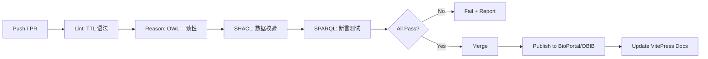

# 16.2 工具链与交付物

> **本节要点**：了解本体项目中的关键文档——技术设计蓝图（TBD）、工件清单管理，掌握版本控制策略（Git + SemVer）在 OBO Foundry / BioPortal 中的最佳实践，以及持续集成（CI/CD）在确保本体质量中的核心应用。

---

## 1. 本体技术设计蓝图（Technology Development Blueprint）

**本体技术设计蓝图**，简称 **Technology Development Blueprint（TBD）**，是本体重型项目中不可缺少的核心文档。它不是本体自身的一部分，而是一套元数据文档，描述本体"为什么这样建模"而非"本体是什么"。

> **类比**：如果本体 `.owl` 文件是源代码，那么 TBD 就是代码背后的架构设计文档（ADR Architecture Decision Record）。

### 1.1 TBD 核心要素

| 元素 | 描述 | 示例 |
|------|------|------|
| Scope（范围） | 本体的应用领域和覆盖边界 | "涵盖计算机科学学术会议中的出版物类型与角色" |
| Assumptions（假设） | 建模时做出的前提设定 | "假定所有作者都可以通过 ORCID 唯一标识" |
| Banner Terms（横幅术语） | 顶层核心类 | `Publication`, `Author`, `Conference`, `Review` |
| Encode（编码计划） | 打算如何表示的术语及理由 | `:Review` 类而非数据属性 |
| Instances（实例规划） | 是否有硬编码实例数据 | "不硬编码会议名称，留给 SPARQL 动态查询" |
| Sources（信息来源） | 领域文献、已有本体来源 | "ACM Computing Classification System, OOPSE" |

```markdown
## TBD 模板片段

### 5. Scope Statement
本书体关注学术会议领域的出版物建模，包括期刊论文、会议论文、海报、专题报告等类型。
本体的核心用户是数字图书馆系统（如 DBLP、ACM DL）和学术搜索引擎。

### 6. Assumptions
- 每个作者恰好有一个 ORCID 标识符
- 会议论文的状态仅有：submitted, under-review, accepted, rejected, retracted
- 不处理会议的组织结构（分会、委员会成员等）

### 7. Core Classes
| 概念 | OWL 类 | 理由 |
|------|--------|------|
| 出版物 | :Publication | owl:Class 是最自然的方式 |
| 作者 | :Person | 复用 FOAF 命名空间 |
| 会议 | :Conference | owl:Class，而非数据属性 |
```

### 1.2 MOD（Method-Oriented Documentation）

对于更细粒度的元数据，**MOD** 提供基于 Excel 的工具化文档方法——由 OBO Foundry 社区推广。

| MOD 字段 | 说明 | 示例值 |
|----------|------|--------|
| Concept ID | 概念的唯一标识符 | `BOOK-001` |
| Label | 概念的英文标签 | `Peer Review` |
| Definition | 用一句话定义 | `Academic publication evaluation by domain experts` |
| Exact Synonym | 精确同义词 | `Double-blind review` |
| Related Ontology | 相关本体 | `pubont:Publication` |

> **关键原则**：**TBD 文档质量 = 本体可维护性上限**。没有 TBD 的本体，在超过 6 个月后再修改，几乎必然引入逻辑矛盾。

---

## 2. 本体工件清单（Artifact Inventory）

**本体工件**（Ontological Artifacts）指本体工程项目中的所有产出文件。一份完整的清单不仅是文件列表，更是理解本项目架构的索引。

### 2.1 标准工件清单

| 工件类型 | 文件示例 | 用途 | 自动生成 |
|----------|----------|------|----------|
| 本体源文件 | `ontology.owl`, `ontology.ttl` | OWL 2 DL / EL 正式内容 | 建模者 |
| 序列化文件 | `ontology.jsonld`, `ontology.rdf` | 不同 RDF 序列化格式 | Protégé / RDFLib |
| HTML 文档 | `docs/index.html` | 人类可读的类浏览器浏览 | Protégé HTML Renderer |
| JSON API | `api/classes.json` | 机器可读的本体元数据 | Ontology API |
| 设计文档 | `docs/TBD.md`, `docs/design-decisions.xlsx` | 架构设计决策记录 | 人工 / ODK |
| 变更日志 | `CHANGELOG.md` | SemVer 版本变更记录 | git-chglog |
| SHACL 校验 | `shacl/book-shapes.ttl` | 数据验证的形状定义 | 建模者 |
| SPARQL 查询 | `queries/reasons.sparql` | 常用查询脚本 | 建模者 |

### 2.2 项目文件组织结构

```
my-book-ontology/
├── src/
│   ├── ontology.owl              # OWL/XML 格式本体（主文件）
│   ├── ontology.ttl              # Turtle 序列化
│   ├── imports/                  # 导入的本体
│   │   ├── foaf.ttl
│   │   └── dcterms.ttl
│   └── shacl/
│       └── validation-shapes.ttl # SHACL 校验形状定义
├── queries/
│   ├── find-books.sparql         # 查询脚本
│   └── author-statistics.sparql
├── docs/
│   ├── TBD.md                    # 技术设计蓝图
│   ├── design-decisions.md       # 设计决策日志
│   └── changelog.md              # 变更记录
├── tests/
│   ├── test-consistency.sparql   # 一致性测试
│   └── test-queries/             # 查询断言测试
├── scripts/
│   ├── validate.sh               # SHACL 校验脚本
│   └── export.sh                 # 序列化导出脚本
├── .github/
│   └── workflows/ci.yml          # GitHub Actions CI
├── .vljspignore
├── .gitignore
├── LICENSE
└── README.md
```

---

## 3. 版本控制策略（Version Control Strategy）

本体工程中的版本控制不仅是 `.owl` 文件的 `git commit`——它需要在语义层面管理本体的**演进（Evolution）**和**兼容性（Compatibility）**。

### 3.1 本体语义中的版本变更类型

本体语义变更不仅仅是"代码改动"，它们在**语义层面**有不同强度：

| 变更类型 | 强度 | 兼容性 | 说明 | 示例 |
|----------|------|--------|------|------|
| 添加新类 | 低 | ✅ 向前兼容 | 不影响现有查询结果 | 添加 `:OpenAccessBook` 子类 |
| 添加新属性 | 低 | ✅ 向前兼容 | 不影响现有 SPARQL 查询 | 添加 `:hasDOI` 数据属性 |
| 添加公理 | 中 | ⚠️ 可能影响推理 | 推理机可能导出更多类关系 | 添加 `:eBook rdfs:subClassOf :Book` |
| 修改定义 | 高 | ❌ 需重新索引 | 下游系统需要重新适配 | 修改 `:Author` 的 `rdfs:subClassOf` |
| 拆分类 | 高 | ❌ 破坏性 | 现有个体数据可能需要迁移 | `:Book` 拆为 `:PrintBook` + `:eBook` |
| 重命名 | 中 | ⚠️ 有别名支持 | 可通过 `owl:sameAs` / `rdfs:seeAlso` 过渡 | `:BookItem` → `:Book` |

### 3.2 SemVer（语义化版本）在本体中的实践

**语义化版本（SemVer, Semantic Versioning）**的 `MAJOR.MINOR.PATCH` 规则需做本体适配：

```
V  X.Y.Z
    ││ ╰── PATCH: 数据添加、文档变更、bug 修复（不修改公理）
    │╰──── MINOR: 添加新类/属性、添加兼容公理（向前兼容）
    ╰───── MAJOR: 修改现有概念定义、拆分类、破坏性变更
```

**实际应用规则**：

```yaml
# CHANGELOG.md 格式

## [2.0.0] - 2024-12-01 [MAJOR]
### Breaking Changes
- Renamed `:BookItem` to `:Book` (use `rdfs:seeAlso` for compatibility for 1 year)
- Removed deprecated `:hasPublisherName` property (use `:hasPublisher`)

### New Features
- Added `:OpenAccessBook` subclass with `:accessType` property
- Added SHACL shapes for validation

## [1.1.0] - 2024-09-15 [MINOR]
### Added
- `:isbn` data property to `:Book`
- `:hasAbstract` data property to `:Publication`
- Imported `dcterms.ttl` for metadata vocabulary

## [1.0.0] - 2024-06-01 [MINOR]
### Initial Release
- Core classes: Book, Author, Publisher, Publication
- Properties: hasAuthor, hasPublisher, hasISBN
```

### 3.3 OBO Foundry / BioPortal 中的版本实践

**OBO Foundry**（Open Biological and Biomedical Ontologies Foundry）定义了本体版本管理的顶级标准：

| OBO 标准 | 描述 | 要求 |
|----------|------|------|
| `oboInOwl:id` | 每个类/属性的固定标识符 | 一旦分配永不删除 |
| `oboInOwl:hasExactSynonym` | 精确同义词，便于迁移过渡 | 旧名称作为 synonym 保留 |
| `dcterms:replaces` / `dcterms:isReplacedBy` | 跟踪类级别的替代关系 | 替换旧概念时使用 |
| `terms:modified` | 每个概念最后修改时间 | 由 CI 自动生成 |
| `owl:versionInfo` | 本体版本信息 | 跟随 SemVer |

**BioPortal**（美国国立卫生研究院的本体库平台）要求：

- 本体上传时必须提供完整元数据标签
- 版本号遵循 SemVer
- 支持本体差异对比（Diff View）功能
- 历史版本永久可归档下载

---

## 4. 持续集成在本体工程中的应用（CI in Ontology Engineering）

将本体工程纳入 **CI/CD Pipeline** 是保证质量的关键实践，尤其当多个建模者协作时。GitHub Actions 是推荐的平台。

### 4.1 典型的 OWL 本体 CI 管线

```yaml
# .github/workflows/ontology-ci.yml
name: Ontology CI

on:
  push:
    branches: [ main, develop ]
  pull_request:
    branches: [ main ]

jobs:
  validate:
    runs-on: ubuntu-latest
    steps:
      - name: Checkout
        uses: actions/checkout@v4

      - name: Set up Python
        uses: actions/setup-python@v5
        with:
          python-version: '3.11'

      - name: Install RDLib
        run: pip install rdflib python-owlrl shacl-lite

      # Step 1: Turtle 语法校验
      - name: Validate Turtle Syntax
        run: |
          python -c "
          import rdflib
          g = rdflib.Graph()
          g.parse('src/ontology.ttl', format='turtle')
          print('Syntax valid ✅')
          "

      # Step 2: OWL DL 一致性检查
      - name: OWL Consistency Check
        run: |
          python -c "
          import owlready2
          onto = owlready2.get_onto('src/ontology')
          onto.sync_to_reasoner()
          print('Consistency check passed ✅')
          "

      # Step 3: SHACL 数据校验
      - name: SHACL Validation
        run: |
          python -c "
          import rdflib
          import shacl_lite
          g = rdflib.Graph()
          g.parse('src/ontology.ttl', format='turtle')
          validator = shacl_lite.SHAOLValidator(g)
          results = validator.validate()
          print(f'SHACL validation results: {len(results)} violations found')
          "

      # Step 4: SPARQL 断言测试
      - name: SPARQL Assertion Tests
        run: |
          python -c "
          # Example: Verify that class count > 0
          import rdflib
          g = rdflib.Graph()
          g.parse('src/ontology.ttl', format='turtle')
          q = '''
              PREFIX owl: <http://www.w3.org/2002/07/owl#>
              SELECT (COUNT(?c) AS ?classCount)
              WHERE { ?c a owl:Class . }
          '''
          result = g.query(q)
          for row in result:
              print(f'Class count: {int(row[0])}')
              assert int(row[0]) > 0, 'Ontology must have at least one class'
          "
```

### 4.2 CI/CD 流水线阶段



### 4.3 推荐的 CI 测试集

| 测试编号 | 测试名称 | 类型 | 预期结果 |
|----------|----------|------|----------|
| T01 | Turtle 语法合法性 | 语法校验 | `rdflib` 无报错 |
| T02 | 本体一致性 | 推理 | 推理机未发现矛盾 |
| T03 | 顶层类检测 | SPARQL | `owl:nothing` 不被归类 |
| T04 | 类数量 ≥ 1 | SPARQL | classCount > 0 |
| T05 | 属性定义域检查 | SHACL | 所有数据属性均有 rdfs:domain |
| T06 | 文档属性完整性 | SPARQL | 每个 owl:Class 有 rdfs:label |
| T07 | 版本戳一致性 | 规则 | `owl:versionInfo` 符合 SemVer |

> **关键原则**：**每次 PR/Merge 之前，CI 管线必须是绿色的**。这是保障大型协作本体项目的底线。OBO Foundry 的 13 项原则之一就是这个。

---

## 5. 小结

| 工件类型 | 工具/格式 | 关键目的 |
|----------|-----------|----------|
| TBD | Markdown / Template | 记录"为什么这样建模"的设计理由 |
| MOD | Excel Spreadsheet | 细粒度概念元数据管理 |
| 本体文件 | OWL/RDF, TTL, JSON-LD | 机器可读、可推理、可查询的正式知识 |
| 版本管理 | Git + SemVer | 跟踪本体语义演进，管理兼容性 |
| 文档生成 | Protégé HTML Renderer | 人类可读的 HTML 浏览体验 |
| CI/CD | GitHub Actions + RDLib/OwlReady2 | 自动化语法/推理/校验/断言测试 |

---

## 6. 延伸阅读

- Smith, B. et al. (2007). "The OBO Foundry: Coordinated Ontology Integration for General Biology." Bioinformatics.
- OBO Foundry Principles: <https://obofoundry.org/principles/>
- W3C SHACL Recommendation: <https://www.w3.org/TR/shacl/>
- Semantic Versioning 2.0.0: <https://semver.org/>
- Semantic Web Starships Ontology Engineering Template (SETO): <https://sws-lmu.github.io/seto/>